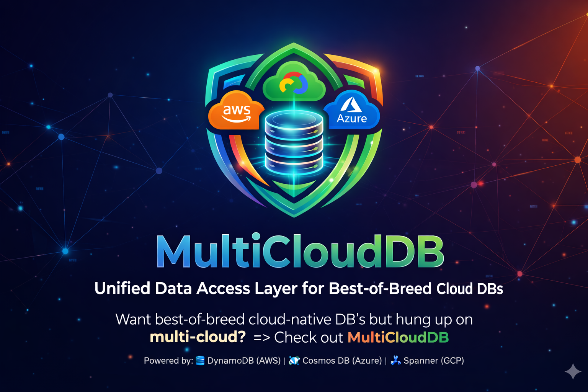

# Multicloud DB SDK for Java



> **⚠️ Public Preview Notice**
> This repository is currently available as a **public preview** and is **not yet fully ready for production use**.
> Expect breaking changes, incomplete features, and limited support during this phase.

A **portable database SDK** that lets you write CRUD and query logic once and run it
against **Azure Cosmos DB**, **Amazon DynamoDB**, or **Google Cloud Spanner** -
switch providers by changing a single properties file, with zero code changes.

```
┌───────────────────────────────────────────────────┐
│                 Your Application                  │
│          (code against Multicloud DB API)         │
└────────────────────────┬──────────────────────────┘
                         │
            ┌────────────▼─────────────┐
            │    MulticloudDbClient    │   Portable contract
            │     (multiclouddb-api)   │   CRUD · Query · Capabilities
            └────────────┬─────────────┘
                         │  ServiceLoader
            ┌────────────┼───────────────┐
            ▼            ▼               ▼
       ┌─────────┐ ┌──────────┐ ┌───────────┐
       │ Cosmos  │ │ DynamoDB │ │  Spanner  │
       │ Provider│ │ Provider │ │  Provider │
       └─────────┘ └──────────┘ └───────────┘
```

---

## Table of Contents

- [Why Multicloud DB?](#why-clouddb)
- [Quick Start](#quick-start)
- [Portable Query DSL](#portable-query-dsl)
- [Architecture](#architecture)
  - [Modules](#modules)
  - [API Surface](#api-surface)
  - [SPI (Provider Interface)](#spi-provider-interface)
  - [Provider Discovery](#provider-discovery)
- [Design Decisions](#design-decisions)
  - [Why Key Is an Explicit Parameter](#why-key-is-an-explicit-parameter)
  - [Strict LCD Portability](#strict-lcd-portability)
- [Supported Providers](#supported-providers)
- [Configuration](#configuration)
- [Capabilities & Portability](#capabilities--portability)
- [Result Set Control](#result-set-control)
- [Document Size Enforcement](#document-size-enforcement)
- [Provider Diagnostics](#provider-diagnostics)
- [Sample Applications](#sample-applications)
- [Building from Source](#building-from-source)
- [Testing](#testing)
- [Project Structure](#project-structure)
- [Prerequisites](#prerequisites)
- [Documentation](#documentation)
- [License](#license)

---

## Why Multicloud DB?

| Problem | Multicloud DB Solution |
|---------|------------------|
| Vendor lock-in - each cloud DB has its own SDK, data model, and query language | Single `MulticloudDbClient` interface with portable CRUD + query |
| Each provider has a different query language (Cosmos SQL, PartiQL, GoogleSQL) | **Portable query DSL** - write `status = @status AND priority > @min`, auto-translated per provider |
| Migrating between providers requires rewriting data-access code | Change **one property** (`multiclouddb.provider=dynamo` → `cosmos`) |
| Understanding which features are portable vs. provider-specific | Strict LCD portability — every API in `multiclouddb-api` is supported by all three providers |
| Testing across providers | Conformance test suite runs identical tests against every provider |

---

## Quick Start

### 1. Build

```bash
# Requires JDK 17+
mvn clean install -DskipTests
```

### 2. Add dependencies

```xml
<!-- Portable API (compile scope) -->
<dependency>
    <groupId>com.microsoft.multiclouddb</groupId>
    <artifactId>multiclouddb-api</artifactId>
    <version>0.1.0-SNAPSHOT</version>
</dependency>

<!-- Pick one or more providers (runtime scope - swap without recompiling) -->
<dependency>
    <groupId>com.microsoft.multiclouddb</groupId>
    <artifactId>multiclouddb-provider-cosmos</artifactId>
    <version>0.1.0-SNAPSHOT</version>
    <scope>runtime</scope>
</dependency>

<!-- Additional providers can be included in the same project.
     Each is discovered via ServiceLoader and selected by ProviderId at runtime.
     Include as many as your application needs: -->
<!--
<dependency>
    <groupId>com.microsoft.multiclouddb</groupId>
    <artifactId>multiclouddb-provider-dynamo</artifactId>
    <version>0.1.0-SNAPSHOT</version>
    <scope>runtime</scope>
</dependency>
<dependency>
    <groupId>com.microsoft.multiclouddb</groupId>
    <artifactId>multiclouddb-provider-spanner</artifactId>
    <version>0.1.0-SNAPSHOT</version>
    <scope>runtime</scope>
</dependency>
-->
```

### 3. Write portable code

```java
import com.multiclouddb.api.*;
import com.fasterxml.jackson.databind.JsonNode;
import com.fasterxml.jackson.databind.ObjectMapper;
import com.fasterxml.jackson.databind.node.ObjectNode;

// Configure - provider selected entirely by config, not code
Properties props = new Properties();
props.load(getClass().getResourceAsStream("/todo-app-cosmos.properties"));

String providerName = props.getProperty("multiclouddb.provider");   // "cosmos", "dynamo", etc.
ProviderId provider = ProviderId.fromId(providerName);

MulticloudDbClientConfig config = MulticloudDbClientConfig.builder()
        .provider(provider)
        .connection("endpoint", props.getProperty("multiclouddb.connection.endpoint"))
        .connection("key", props.getProperty("multiclouddb.connection.key"))
        .build();

// Create client via ServiceLoader discovery
MulticloudDbClient client = MulticloudDbClientFactory.create(config);

// CRUD - same code for every provider
ObjectMapper mapper = new ObjectMapper();
ObjectNode doc = mapper.createObjectNode();
doc.put("title", "Buy groceries");
doc.put("completed", false);

ResourceAddress todos = new ResourceAddress("mydb", "todos");
MulticloudDbKey key = MulticloudDbKey.of("todo-1", "todo-1");   // partitionKey + sortKey

client.upsert(todos, key, doc);                  // Create or replace (upsert)
DocumentResult result = client.read(todos, key); // Point read → returns DocumentResult
ObjectNode document = result.document();         // The document payload
client.delete(todos, key);                       // Delete

// Query with portable expressions - automatically translated per provider
QueryRequest query = QueryRequest.builder()
        .partitionKey("shopping")            // every query is partition-scoped
        .expression("status = @status")
        .parameter("status", "active")
        .maxPageSize(25)
        .build();
QueryPage page = client.query(todos, query);
for (JsonNode item : page.items()) {
    System.out.println(item);
}
// Cosmos → SELECT * FROM c WHERE (c.status = @status)
// DynamoDB → SELECT * FROM "todos" WHERE (status = ?)
// Spanner → SELECT * FROM `todos` WHERE (status = @status)
```

### 4. Switch providers

Change **only** the properties file - no code changes:

```properties
# Cosmos DB
multiclouddb.provider=cosmos
multiclouddb.connection.endpoint=https://localhost:8081
multiclouddb.connection.key=...

# --- OR ---

# DynamoDB
multiclouddb.provider=dynamo
multiclouddb.connection.endpoint=http://localhost:8000
multiclouddb.connection.region=us-east-1
multiclouddb.auth.accessKeyId=fakeMyKeyId
multiclouddb.auth.secretAccessKey=fakeSecretAccessKey

# --- OR ---

# Google Cloud Spanner
multiclouddb.provider=spanner
multiclouddb.connection.projectId=my-gcp-project
multiclouddb.connection.instanceId=my-instance
multiclouddb.connection.databaseId=my-database
# multiclouddb.connection.emulatorHost=localhost:9010   # Optional - for emulator
```

---

## Portable Query DSL

Multicloud DB includes a **portable query expression language** that lets you write WHERE-clause filters once and have them automatically translated to each provider's native query language.

### Expression Syntax

```
<field> <op> @<param>              Comparison (=, !=, <, <=, >, >=)
<expr> AND <expr>                  Logical AND
<expr> OR <expr>                   Logical OR
NOT <expr>                         Logical NOT
<field> BETWEEN @low AND @high     Range check
<field> IN (@a, @b, @c)            Set membership
starts_with(<field>, @param)       String prefix
contains(<field>, @param)          Substring search
field_exists(<field>)              Field existence check
string_length(<field>) > @n        String length
collection_size(<field>) > @n      Array/collection size
```

Parameters use `@name` syntax and are passed as a `Map<String, Object>`. Expressions support arbitrary nesting with parentheses.

### Translation Examples

| Portable Expression | Cosmos DB SQL | DynamoDB PartiQL | Spanner GoogleSQL |
|---|---|---|---|
| `status = @status` | `c.status = @status` | `status = ?` | `status = @status` |
| `starts_with(title, @prefix)` | `STARTSWITH(c.title, @prefix)` | `begins_with(title, ?)` | `STARTS_WITH(title, @prefix)` |
| `priority > @min AND category = @cat` | `(c.priority > @min AND c.category = @cat)` | `(priority > ? AND category = ?)` | `(priority > @min AND category = @cat)` |
| `field BETWEEN @lo AND @hi` | `c.field BETWEEN @lo AND @hi` | `field BETWEEN ? AND ?` | `field BETWEEN @lo AND @hi` |
| `tag IN (@a, @b, @c)` | `c.tag IN (@a, @b, @c)` | `tag IN (?, ?, ?)` | `tag IN (@a, @b, @c)` |

### Pipeline

When you call `client.query()` with a portable expression:

1. **Parse** - `ExpressionParser` converts the string to a typed AST
2. **Validate** - `ExpressionValidator` checks parameter bindings and function signatures
3. **Translate** - Provider-specific `ExpressionTranslator` generates native query syntax
4. **Execute** - Provider runs the translated query against the database

This is fully transparent - you never see the translated SQL. There is no
provider-native escape hatch; the portable DSL is the single supported entry
point for queries.

---

## Architecture

### Modules

| Module | Artifact | Description |
|--------|----------|-------------|
| **multiclouddb-api** | `com.microsoft.multiclouddb:multiclouddb-api` | Portable client interface, types, error model, factory, and SPI contracts. The only compile-time dependency your app needs. |
| **multiclouddb-provider-cosmos** | `com.microsoft.multiclouddb:multiclouddb-provider-cosmos` | Azure Cosmos DB adapter (Java SDK v4) |
| **multiclouddb-provider-dynamo** | `com.microsoft.multiclouddb:multiclouddb-provider-dynamo` | Amazon DynamoDB adapter (AWS SDK v2) |
| **multiclouddb-provider-spanner** | `com.microsoft.multiclouddb:multiclouddb-provider-spanner` | Google Cloud Spanner adapter (Google Cloud Spanner 6.62.0) |
| **multiclouddb-conformance** | `com.microsoft.multiclouddb:multiclouddb-conformance` | Cross-provider integration tests |

Samples: see the [separate samples repo](https://github.com/microsoft/multiclouddb-sdk-for-java-samples).
### API Surface

All application code depends on `multiclouddb-api`. The core types are:

| Type | Purpose |
|------|---------|
| `MulticloudDbClient` | Portable interface: `create`, `read`, `update`, `delete`, `upsert`, `query`, `provisionSchema`, `capabilities` |
| `MulticloudDbClientFactory` | Creates a `MulticloudDbClient` by discovering providers via `ServiceLoader` |
| `MulticloudDbClientConfig` | Builder-pattern config: provider selection, connection, auth, feature flags |
| `ResourceAddress` | `(database, collection)` pair targeting a container/table |
| `MulticloudDbKey` | `(partitionKey, sortKey)` pair - every document needs both |
| `QueryRequest` | Portable expression + parameters, page-size hint, continuation token, **required `partitionKey`**, optional `maxResults` cap, optional `orderBy("sortKey", ASC\|DESC)` |
| `QueryPage` | Result page: items + optional continuation token + optional `OperationDiagnostics` |
| `SortDirection` | `ASC` or `DESC` (only `sortKey` is portable as the order-by field) |
| `DocumentResult` | Result of `read()`: document `ObjectNode` payload |
| `CapabilitySet` | Runtime introspection of provider capabilities |
| `Capability` | Named capability with `supported` flag and notes |
| `MulticloudDbException` | Structured error with `MulticloudDbError` (category, provider, native code) |
| `OperationOptions` | Per-call timeout (hard deadline) |
| `OperationDiagnostics` | Latency, request units/charge, request ID, ETag, item count |
| `Expression` | AST node interface for parsed query expressions |
| `ExpressionParser` | Parses portable expression strings into an AST |
| `ExpressionValidator` | Validates parameter bindings and function usage |
| `ExpressionTranslator` | SPI - translates AST to provider-native query syntax |
| `TranslatedQuery` | Result of translation: query string + bound parameters |

### SPI (Provider Interface)

Provider modules implement two SPI contracts without importing each other:

| SPI Interface | Responsibility |
|---------------|---------------|
| `MulticloudDbProviderAdapter` | Factory - creates a `MulticloudDbProviderClient` from config; registered via `META-INF/services` |
| `MulticloudDbProviderClient` | CRUD + query + provisioning + capabilities - called by `DefaultMulticloudDbClient` |

### Provider Discovery

Providers are discovered at runtime via Java's `ServiceLoader`:

1. Your app calls `MulticloudDbClientFactory.create(config)`
2. The factory scans `META-INF/services/com.multiclouddb.spi.MulticloudDbProviderAdapter`
3. The matching adapter's `createClient()` builds a native SDK client
4. A `DefaultMulticloudDbClient` wraps it with error mapping, diagnostics, and the portable contract

**No provider imports in application code.** Just drop the provider JAR on the classpath (or add it as a `<scope>runtime</scope>` Maven dependency).

---

## Design Decisions

### Why Key Is an Explicit Parameter

You may notice that every CRUD operation requires an explicit `Key` parameter,
even on writes where the key material could theoretically be extracted from the
document:

```java
// Key is always explicit - never extracted from the document
client.upsert(addr, Key.of("tenant-1", "pos-42"), doc);
```

Some database SDKs (notably the Azure Cosmos DB SDK) extract the partition key
and ID from the document body automatically. Multicloud DB deliberately does **not**
do this, for several reasons:

1. **Each provider maps Key fields differently.** Cosmos DB stores `Key.sortKey()` as the built-in `id` field, while DynamoDB and Spanner store it as a `sortKey` attribute/column. A convention-based extractor would need provider-specific logic, undermining portability.

2. **`read()` and `delete()` have no document.** These operations require a Key with nothing to extract from. Making writes work differently would create an inconsistent API.

3. **The Key is always authoritative.** Providers overwrite any `id`/`partitionKey` fields in the document with the Key values (see [Document Field Injection](docs/guide.md#document-field-injection) in the developer guide). This prevents accidental mismatches.

4. **Compile-time safety.** A missing Key is a compiler error. A missing field in a JSON document is a runtime error deep in the provider layer.

See the [developer guide](docs/guide.md#why-key-is-an-explicit-parameter) for the full rationale and per-provider field mapping details.

### Strict LCD Portability

Every API exposed by `multiclouddb-api` is supported on **all three** providers.
There is no `nativeExpression()` query escape hatch and no `nativeClient()`
accessor — the SDK does not provide a way to drop into provider-specific
behaviour. If a feature is not portable across Cosmos, DynamoDB, and Spanner,
it is not in the portable API.

This is a deliberate trade-off:

- **Pro:** code written against the SDK is guaranteed switchable between
  providers by changing a properties file. No runtime capability checks are
  needed for the portable surface.
- **Con:** features that exist on one or two providers (e.g., Cosmos `LIKE`,
  Spanner regex, DynamoDB GSI projection, server-side `TOP N`, row-level TTL)
  are not exposed. Workloads that require them must call the native SDK
  directly, outside the portable contract.

See [Provider Compatibility](docs/compatibility.md) for the full list of
portable capabilities and the [`multiclouddb-api` CHANGELOG](multiclouddb-api/CHANGELOG.md)
for the strict-LCD migration guide.

---

## Supported Providers

| Provider | Module | Status | Native SDK |
|----------|--------|--------|------------|
| **Azure Cosmos DB** | `multiclouddb-provider-cosmos` | Full | Azure Cosmos Java SDK 4.60.0 |
| **Amazon DynamoDB** | `multiclouddb-provider-dynamo` | Full | AWS SDK for Java 2.25.16 |
| **Google Cloud Spanner** | `multiclouddb-provider-spanner` | Full | Google Cloud Spanner 6.62.0 |

---

## Configuration

All configuration flows through `MulticloudDbClientConfig` or a `.properties` file:

| Property | Description | Example |
|----------|-------------|---------|
| `multiclouddb.provider` | Provider ID | `cosmos`, `dynamo`, `spanner` |
| `multiclouddb.connection.*` | Connection properties | `endpoint`, `key`, `region`, `connectionMode` |
| `multiclouddb.auth.*` | Authentication properties | `accessKeyId`, `secretAccessKey` |
| `multiclouddb.feature.*` | Feature flags | Provider-specific opt-ins |

### Cosmos DB connection properties

| Key | Value |
|-----|-------|
| `multiclouddb.connection.endpoint` | `https://localhost:8081` (emulator) or your Cosmos account URI |
| `multiclouddb.connection.key` | Master key or Cosmos emulator well-known key |
| `multiclouddb.connection.connectionMode` | `gateway` or `direct` |

### DynamoDB connection properties

| Key | Value |
|-----|-------|
| `multiclouddb.connection.endpoint` | `http://localhost:8000` (DynamoDB Local) or omit for AWS |
| `multiclouddb.connection.region` | AWS region, e.g. `us-east-1` |
| `multiclouddb.auth.accessKeyId` | AWS access key (or any string for DynamoDB Local) |
| `multiclouddb.auth.secretAccessKey` | AWS secret key (or any string for DynamoDB Local) |

### Spanner connection properties

| Key | Value |
|-----|-------|
| `multiclouddb.connection.projectId` | GCP project ID |
| `multiclouddb.connection.instanceId` | Spanner instance ID |
| `multiclouddb.connection.databaseId` | Spanner database ID |
| `multiclouddb.connection.emulatorHost` | `localhost:9010` (Spanner Emulator) or omit for GCP |

---

## Resource Provisioning

The SDK provides a single method to provision an entire schema of databases and
containers/tables. Parallelism is handled internally - the SDK creates all
databases concurrently, waits for completion, then creates all containers
concurrently. Application code does not need to manage threading.

```java
// Define your schema: database name → list of collection/table names
Map<String, List<String>> schema = Map.of(
    "admin-db",    List.of("tenants"),
    "acme-risk-db", List.of("portfolios", "positions", "risk_metrics")
);

// Single call - SDK handles parallel creation internally
client.provisionSchema(schema);
```

| Provider | Database Phase | Container/Table Phase |
|----------|---------------|----------------------|
| **Cosmos DB** | Creates databases in parallel (management SDK for cloud, data-plane for emulator) | Creates containers in parallel via data-plane SDK |
| **DynamoDB** | No-op (DynamoDB has no native database concept) | Creates tables in parallel, waits for ACTIVE status |
| **Spanner** | No-op (database set at client construction time) | Creates tables in parallel |

You can also call `ensureDatabase()` and `ensureContainer()` individually if
you need fine-grained control, but `provisionSchema()` is the recommended
approach for provisioning multiple resources.

---

## Capabilities & Portability

The SDK enforces strict Lowest-Common-Denominator (LCD) portability: every
capability exposed below is fully supported on **all three** providers. There
are no asymmetric capabilities and no provider-specific escape hatches in the
portable API. `client.capabilities()` is provided for introspection at runtime,
but for code targeting only the portable API, capability checks are not needed.

```java
CapabilitySet caps = client.capabilities();

if (caps.supports(Capability.TRANSACTIONS)) {
    // safe to use transactions (always true on every provider)
}

for (Capability cap : caps.all()) {
    System.out.printf("%-30s %s %s%n",
        cap.name(),
        cap.supported() ? "✓" : "✗",
        cap.notes() != null ? cap.notes() : "");
}
```

| Capability | Cosmos DB | DynamoDB | Spanner |
|------------|:---------:|:--------:|:-------:|
| Portable query DSL | ✓ | ✓ | ✓ |
| Continuation token paging | ✓ | ✓ | ✓ |
| Transactions | ✓ | ✓ | ✓ |
| Batch operations | ✓ | ✓ | ✓ |
| Strong consistency | ✓ | ✓ | ✓ |
| Change feed | ✓ | ✓ | ✓ |
| ORDER BY (`sortKey` only, ASC / DESC) | ✓ | ✓ | ✓ |

Features that exist on some providers but not all — e.g., Cosmos `LIKE` and
cross-partition query, DynamoDB row-level TTL, Spanner regex — are **not** in
the portable API. To use them, call the native provider SDK directly outside of
`MulticloudDbClient`.

---

## Result Set Control

Every query is partition-scoped (`partitionKey` is required) and returns items
sorted by `sortKey`. Use `maxResults` to cap the total items returned and
`orderBy` to reverse the default sort direction:

```java
QueryRequest q = QueryRequest.builder()
        .partitionKey("tenant-42")                     // required
        .expression("status = @s")
        .parameter("s", "active")
        .maxResults(25)                                // total cap
        .orderBy("sortKey", SortDirection.DESC)        // newest first
        .build();

QueryPage page = client.query(address, q);
```

The portable `orderBy` field is restricted to `sortKey`; any other field name
is rejected at builder time.

---

## Document Size Enforcement

All write operations are validated against a **399 KB** limit before any network
call is made. Documents that exceed the limit are rejected with
`MulticloudDbErrorCategory.INVALID_REQUEST`:

```java
try {
    client.create(address, key, largeDoc);
} catch (MulticloudDbException e) {
    if (e.error().category() == MulticloudDbErrorCategory.INVALID_REQUEST) {
        System.out.println("Document exceeds 399 KB limit");
    }
}
```

The limit is 399 KB (not 400 KB) because providers inject additional fields
before writing — see [Developer Guide](docs/guide.md#document-size-enforcement)
for details.

---

## Provider Diagnostics

`QueryPage` carries `OperationDiagnostics` with latency, request charge, and
provider correlation IDs:

```java
QueryPage page = client.query(address, q);
OperationDiagnostics diag = page.diagnostics();
if (diag != null) {
    System.out.printf("%s %s latency=%dms ruCharge=%.2f%n",
        diag.provider().id(), diag.operation(),
        diag.duration().toMillis(), diag.requestCharge());
}
```

---

## Sample Applications

Sample applications are maintained in a **separate repository**:

**[microsoft/multiclouddb-sdk-for-java-samples](https://github.com/microsoft/multiclouddb-sdk-for-java-samples)**

| Sample | Description | Port | Guide |
|--------|-------------|------|-------|
| **Portable CRUD + Query** | Minimal end-to-end CRUD and query sample | — | [README](https://github.com/microsoft/multiclouddb-sdk-for-java-samples#portable-crud--query-sample) |
| **TODO App** | Simple CRUD web app with browser UI | `8080` | [README-todo-app.md](https://github.com/microsoft/multiclouddb-sdk-for-java-samples/blob/main/README-todo-app.md) |
| **Risk Analysis Platform** | Multi-tenant portfolio risk analytics with executive dashboard | `8090` | [README-risk-platform.md](https://github.com/microsoft/multiclouddb-sdk-for-java-samples/blob/main/README-risk-platform.md) |

### Quick Start

```bash
git clone https://github.com/microsoft/multiclouddb-sdk-for-java-samples.git
cd multiclouddb-sdk-for-java-samples
mvn clean install -DskipTests
```

### TODO App

```
┌─────────────────────────────────┐
│  Browser UI (localhost:8080)    │
│  Create · Read · Update · Delete│
└──────────────┬──────────────────┘
               │ REST API
┌──────────────▼──────────────────┐
│  Embedded Java HttpServer       │
│  TodoApp.java                   │
└──────────────┬──────────────────┘
               │ MulticloudDbClient
     ┌─────────┼──────────┐
     ▼         ▼          ▼
 Cosmos DB  DynamoDB   Spanner
 Emulator    Local     Emulator
```

```powershell
# Cosmos DB
mvn exec:java `
  "-Dexec.mainClass=com.multiclouddb.samples.todo.TodoApp" `
  "-Dtodo.config=todo-app-cosmos.properties" `
  "-Djavax.net.ssl.trustStore=$PWD/.tools/cacerts-local" `
  "-Djavax.net.ssl.trustStorePassword=changeit"

# DynamoDB
mvn exec:java `
  "-Dexec.mainClass=com.multiclouddb.samples.todo.TodoApp" `
  "-Dtodo.config=todo-app-dynamo.properties"
```

Then open **http://localhost:8080** in your browser.

### Risk Analysis Platform

A multi-tenant SaaS application with database-per-tenant isolation,
portfolio risk analytics, and an executive dashboard. Demonstrates:

- **Database-per-tenant isolation** via `ResourceAddress` routing
- **Partition-scoped queries** via `QueryRequest.partitionKey()` for efficient
  within-partition reads (e.g., positions within a portfolio)
- **Auto-provisioning** of databases/containers/tables on startup via `provisionSchema()`
- **Provider portability** - switch between Cosmos DB and DynamoDB with zero
  code changes

```powershell
# Cosmos DB (port 8090)
mvn exec:java `
  "-Dexec.mainClass=com.multiclouddb.samples.riskplatform.RiskPlatformApp" `
  "-Drisk.config=risk-platform-cosmos.properties" `
  "-Djavax.net.ssl.trustStore=$PWD/.tools/cacerts-local" `
  "-Djavax.net.ssl.trustStorePassword=changeit"

# DynamoDB (port 8090)
mvn exec:java `
  "-Dexec.mainClass=com.multiclouddb.samples.riskplatform.RiskPlatformApp" `
  "-Drisk.config=risk-platform-dynamo.properties"
```

Then open **http://localhost:8090** in your browser.

For full setup instructions, see the [Risk Platform guide](https://github.com/microsoft/multiclouddb-sdk-for-java-samples/blob/main/README-risk-platform.md).

For full emulator setup instructions, see the [samples README](https://github.com/microsoft/multiclouddb-sdk-for-java-samples/blob/main/README.md).

---

## Building from Source

```bash
# Full build (compile + test + package)
mvn clean verify

# Skip tests for faster iteration
mvn clean install -DskipTests

# Build a single module
mvn -pl multiclouddb-provider-dynamo clean install
```

> **Note**: JDK 17+ is required. Set `JAVA_HOME` accordingly:
> ```powershell
> $env:JAVA_HOME = 'C:\Program Files\Eclipse Adoptium\jdk-17.0.10.7-hotspot'
> $env:PATH = "$env:JAVA_HOME\bin;$env:PATH"
> ```

---

## Testing

### Unit tests

```bash
mvn test
```

Runs 396+ unit tests across the API, provider, and conformance modules,
including the portable query expression parser/validator/translator and
partition-scoped query routing for every provider.

### Integration / conformance tests

```bash
# Requires Cosmos DB emulator on localhost:8081, DynamoDB Local on localhost:8000,
# and Spanner Emulator on localhost:9010
mvn -pl multiclouddb-conformance verify
```

The conformance suite runs identical CRUD + portable query tests against each
provider emulator, verifying portable behavior with real data.

> **Note**: The CRUD conformance suites validate the `QueryRequest.partitionKey()`
> API across all providers. Since `partitionKey` is required on every
> `QueryRequest`, the suite also verifies that a missing partition key is
> rejected at builder time on every provider.

---

## Project Structure

```
multiclouddb-sdk-java/
├── pom.xml                          # Parent POM (aggregator)
├── multiclouddb-api/                    # Portable API + SPI contracts
│   └── src/main/java/com/multiclouddb/
│       ├── api/                     # Public types (MulticloudDbClient, Key, etc.)
│       │   ├── internal/            # DefaultMulticloudDbClient
│       │   └── query/               # Portable expression AST, parser, validator, translator SPI
│       └── spi/                     # Provider SPI interfaces
├── multiclouddb-provider-cosmos/        # Azure Cosmos DB adapter
│   └── src/main/
│       ├── java/.../cosmos/         # CosmosProviderClient, error mapper, capabilities
│       └── resources/META-INF/services/  # ServiceLoader registration
├── multiclouddb-provider-dynamo/        # Amazon DynamoDB adapter
│   └── src/main/
│       ├── java/.../dynamo/         # DynamoProviderClient, item mapper, error mapper
│       └── resources/META-INF/services/
├── multiclouddb-provider-spanner/       # Google Cloud Spanner adapter
├── multiclouddb-conformance/            # Cross-provider integration test suite
└── specs/                               # Design documents

# Sample applications are in a separate repo:
# https://github.com/microsoft/multiclouddb-sdk-for-java-samples
```

---

## Prerequisites

| Tool | Version | Required For |
|------|---------|-------------|
| JDK | 17+ | Build and run |
| Maven | 3.9+ | Build |
| Azure Cosmos DB Emulator | Latest | Cosmos integration tests |
| DynamoDB Local | Latest | DynamoDB integration tests |
| Docker | 20+ | Spanner Emulator (`gcr.io/cloud-spanner-emulator/emulator`) |
| Node.js + npm | 18+ | `dynamodb-admin` GUI (optional) |

---

## Documentation

| Document | Description |
|----------|-------------|
| [Developer Guide](docs/guide.md) | Comprehensive reference - partition keys, CRUD semantics, query DSL, multi-tenant patterns |
| [Provider Compatibility](docs/compatibility.md) | Capability matrix, error mapping, native escape hatch, async guidance |

---

## Contributing

We welcome contributions! Please read [CONTRIBUTING.md](CONTRIBUTING.md) for
guidelines on reporting issues, requesting features, setting up a development
environment, and submitting pull requests.

---

## Code of Conduct

This project has adopted the
[Microsoft Open Source Code of Conduct](https://opensource.microsoft.com/codeofconduct/).
See [CODE_OF_CONDUCT.md](CODE_OF_CONDUCT.md) for details.

---

## CLA

Contributions require a signed
[Microsoft Contributor License Agreement](https://cla.opensource.microsoft.com).
The CLA bot will guide you through the process when you open a pull request.
See [CLA.md](CLA.md) for more information.

---

## Security

Please see [SECURITY.md](SECURITY.md) for reporting security vulnerabilities.

---

## License

This project is licensed under the **MIT License** — see the [LICENSE](LICENSE)
file for details.

Copyright © Microsoft Corporation. All rights reserved.
