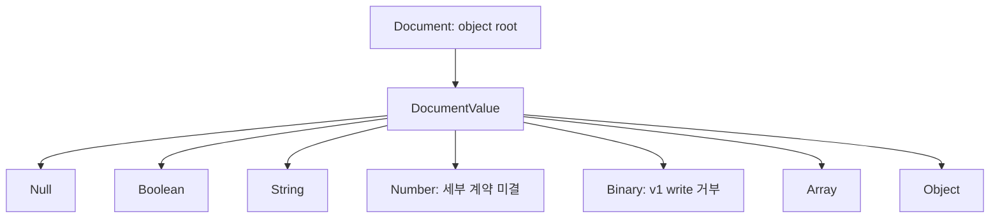
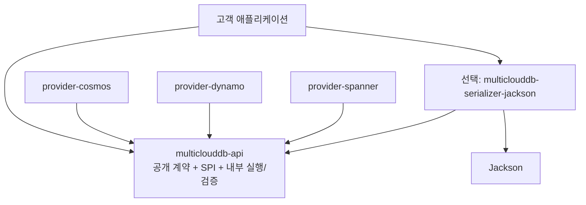
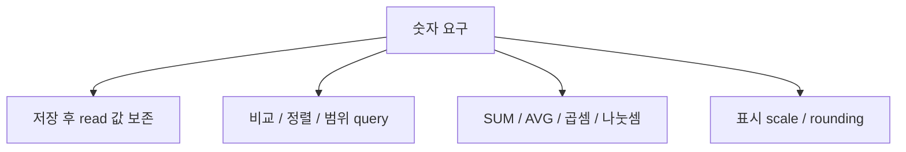
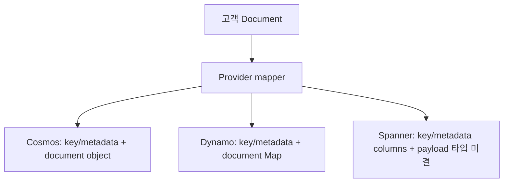
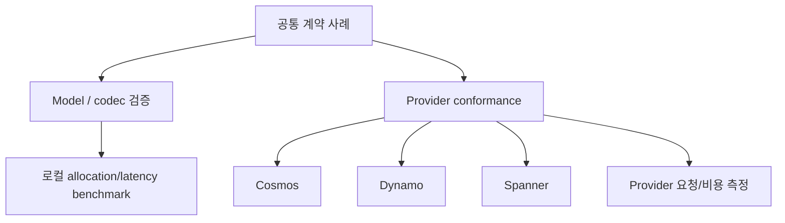
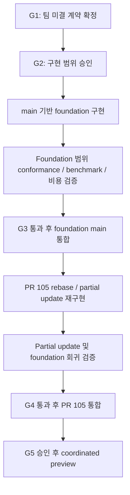

# Issue #116: 문서 직렬화와 portable API 분리

**상태: 한국어 설계 검토 초안. 구현 및 출시 승인 문서가 아님.**

- 작성일: 2026-09-22; r3 갱신일: 2026-09-23
- 대상: `microsoft/multiclouddb-sdk-for-java` issue #116
- 관련 후속 작업: PR #105의 partial update 재구현
- 작성 근거: 설계 스레드의 사용자 Q&A와 직접 확인한 코드
- 게시 형태: 임시 브랜치의 한국어 검토용 문서. 저장소의 정식 ADR/spec에는 아직 반영하지 않음
- 고객 식별정보, 실제 고객 schema, 실제 데이터는 포함하지 않음
- 문서 revision: `r3` (2026-09-23). 팀 discussion/review용 초안. E7은 팀 결정 대기, CF1/Q1의 구분 방향은 합의, 세부 정책은 미결

## 0. 팀 discussion/review 요약

### 0.1 회의 목표와 승인 경계

**회의 목표는 미결 정책을 선택하거나, 필요한 근거와 담당자를 정하는 것이다. 이 초안이 기본값을 대신 선택하지 않는다.**

**사용자가 정한 실행 순서:** 팀이 미결 정책을 승인한 뒤 전체 구현을 진행한다. 현재는 한국어 설계와 영문 팀 공유본 및 게시 준비 단계이며, reviewer 합의나 문서 완성으로 팀 승인을 대체하지 않는다.

- 합의한 기반: 불변 neutral 문서, 고객 앱 소유 codec, 선택적 Jackson adapter, API의 Jackson 제거, v1 binary write 거부, 단계별 오류와 coordinated API 전환.
- 추가 합의: change feed는 **Full / Partial / None**, query는 **Document / Projection / Value**를 구분한다. 구체 provider mapping과 시그니처까지 승인한 것은 아니다.
- 이번 문서 보완: legacy read/rewrite matrix, codec 생성·변환 실패 범위, 양방향 변환과 결과 구성 비용, G2 diagram, limit 설정 질문, 조건부 provider Jackson 직접 의존성을 명시했다.
- 여전히 미결: 숫자·Cassandra 기준, physical envelope, E7 key/metadata 가시성, limit/default/budget, legacy read와 migration, provider별 결과 계약, TypeRef/오류/버전/cursor/비용 기준.

| 구분 | 개수 | 해석 |
|---|---:|---|
| 상위 설계 체크리스트 | 16 | 3절: 방향 합의 12, 부분 합의 2, 팀 결정 대기 2 |
| 팀 회의 하위 결정 항목 | 24 | 아래 ID별 질문. 상위 항목의 세부 사항이며 16개와 더해 별도 40개로 집계하지 않음 |
| 하위 항목 그룹 | 4 / 9 / 5 / 6 | 숫자 4, 저장·결과 9, limits·legacy·rollout 5, codec·query·비용 6 |

CF1/Q1은 **결과 구분 방향을 다시 투표하는 항목이 아니라 provider 상세를 정하는 항목**이다. E7은 사용자가 팀 결정으로 명시 보류했다. 다른 합의도 아래 선택지 때문에 자동 재개방하지 않는다.


**문서 초안이 G0 review를 통과할 수 있다는 판정은 G1 계약, G2 구현, G5 출시 승인이 아니다.** 합의된 방향이 있어도 G1 산출물이 비어 있으면 미결이다. r3는 팀 회의용으로 준비한 문서이며 r3 자체의 후속 검토 결과를 이미 받았다고 주장하지 않는다.

### 0.2 중복 없는 팀 의사결정 표

다음 **24개 ID가 팀 질문의 정본**이다. 본문 뒤의 설명·예시·matrix는 이 질문의 근거이며 별도 질문으로 중복 집계하지 않는다. 모든 권장안은 **제안**이고 정책 승인이 아니다. 영향 칸은 API/저장/비용/호환성의 검토 범위이며 실측 결과가 아니다.

#### A. 숫자 및 고객 기준: 4개

| ID | 정확한 결정 질문 | 선택지와 장단점 | 권장안 — 제안 | 필요한 고객/실험 근거 | 영향 | 선행 결정 / 승인 gate |
|---|---|---|---|---|---|---|
| N1 | "Cassandra 이상"은 실제 고객 type·precision·scale·range corpus인가, `decimal`/`varint` 이론적 전체 범위인가? | 실제 corpus: 검증 가능하나 전체 type 보장은 아님. 이론적 범위: 폭넓지만 공통 native 구현을 가정할 수 없음 | 보장 대상을 먼저 명시하고 고객 승인된 corpus로 증명. 더 넓은 요구를 임의 축소하지 않음 | 실제 column types, 비식별 경계값, 저장/read/query 요구 | API: 숫자 보장; 저장: 표현 범위; 비용: encoding/index; 호환: 기존 값 | N4 근거 확보 -> G1 |
| N2 | portable exact 범위와 equality/정규화/scale/rounding, 범위 밖 입력의 처리 계약은 무엇인가? | 범위 제한+거부: 손실 방지, 지원 축소. 명시적 rounding: 사용성, 값 변경. capability: 확장성, provider 차이 | 무손실 우선. 암묵 rounding을 피하고 허용 범위·mode는 고객 요구로 결정 | N1 corpus, provider 경로별 round trip/비교/산술, non-finite·signed-zero 사례 | API: number 타입/equality; 저장: 정확성; 비용: query; 호환: 재쓰기 | N1 -> G1 |
| N3 | native 범위 밖 exact 값에 canonical string/binary 등 내부 encoding을 제공할 것인가, numeric query 제약은 무엇인가? | native만: query 단순, 범위 제한. tagged encoding: 값 보존, index/query 번역 비용. 기능 gate: 지원 차이 명확 | 숫자 보존과 비교/정렬/산술 지원을 별도 선언하고 비용을 측정한 뒤 선택 | numeric/query corpus, encoding 충돌·버전·index 실험 | API: 기능 profile; 저장: wire format; 비용: 확장/index; 호환: migration | N1/N2, E1/E2와 공동 확정 -> G1 |
| N4 | 계약 확정 전에 실제 schema/type/range 및 DB-side 연산 요구를 필수 입력으로 받을 것인가? | 입력 필수: 근거 기반, 일정 의존. 가정으로 시작: 빠르지만 미확인 보장 위험 | 승인된 경로로 schema/연산 정보를 확보하고 합성 fixture로 검증 | `DESCRIBE TABLE`, 사용 type, 최대 precision/scale/range, 필요한 연산; 문서에는 실제 자료 미수록 | API: scope; 저장: schema; 비용: workload; 호환: 기준 corpus | 선행 없음 -> G1 근거 gate |

숫자의 내부 binary encoding 후보는 고객 `BinaryValue`를 v1 write에 허용하자는 뜻이 아니다. v1 binary 입력 거부 합의를 재개방하지 않는다.

#### B. 저장 구조와 공개 결과: 9개

| ID | 정확한 결정 질문 | 선택지와 장단점 | 권장안 — 제안 | 필요한 고객/실험 근거 | 영향 | 선행 결정 / 승인 gate |
|---|---|---|---|---|---|---|
| E1 | 고객 payload와 시스템 metadata를 분리하는 새 physical envelope를 채택할 것인가? | 새 envelope: 충돌 감소, query/migration 변경. 기존 구조: 전환 적음, field/schema 결합 유지 | 사용자 선호인 분리안을 평가하되 성능·numeric·호환 근거 전에는 고정하지 않음 | 세 provider 저장/read/query/update spike, 고객 전환 조건 | API: mapping; 저장: 형식; 비용: payload/index; 호환: migration | N1~N3/E2 연계 -> G1 |
| E2 | Spanner payload는 어떤 native 타입/column 구조로 저장하고 exact 값을 어떻게 표현할 것인가? | JSON: 문서 구조, 숫자 경로 확인 필요. typed columns: native query, schema 결합. encoded payload+index: 표현력, 운영 복잡도 | 실제 numeric·query 요구를 만족하는 구조를 선택하며 특정 타입을 미리 지정하지 않음 | mutation/read/query/change-stream별 fidelity, null/absence, index 계획 | API: 지원값; 저장: schema; 비용: extraction/index; 호환: 기존 표식 | N2/N3/E1 공동 결정 -> G1 |
| E3 | query/index 및 materialized field를 어떤 schema 계약으로 관리할 것인가? | 명시 schema/index: 예측 가능, 설정 부담. 자동 투영: 편리, write/동기화 비용. scan: 단순, 비싼 경로 가능 | 필요한 index와 변경 비용을 명시하고 숨은 scan이나 비원자적 투영을 피함 | query plan, partition scope, projection과 atomic 갱신 실험 | API: 설정; 저장: index/투영; 비용: read/write; 호환: 경로 변경 | E1/E2, Q1 연계 -> G1; 증거 G3 |
| E4 | 기존 데이터는 새 리소스 전용 전환, 일회 migration, 한시적 legacy read 중 어디까지 지원할 것인가? | 새 리소스: 단순, 이관 부담. 일회 migration: 명확, 운영 중단/재개 고려. 한시 read: 점진적, 조합 증가 | 지원 기간과 13.2.2절 read/rewrite 범위를 먼저 명시. 자동 변환 금지 | 기존 형식 합성 corpus, rollback/중단/재개 요구 | API: legacy read; 저장: 이관; 비용: migration; 호환: 구버전 | E1/E2/C1 -> G1; ROLL1 연계 |
| E5 | 전체 reserved 이름·case/prefix scope·provenance를 어떻게 확정하고 envelope 채택 시 어떻게 조정할 것인가? | 현 union: 일관적, 업무 이름 제한. 분리 후 완화: 유연, 새 mapping 필요 | 현 합의와 E1 결론을 맞추고 이름만 보고 legacy 업무 필드를 삭제하지 않음 | 실제 코드의 내부 이름 목록, 합성 collision/Unicode 사례 | API: 허용 이름; 저장: 위치; 비용: mapping; 호환: 충돌 데이터 | E1/E7 연계 -> G1 |
| E6 | shallow partial update의 provider별 원자성·resulting-size 오류·지원 capability를 어떻게 보장할 것인가? | native atomic: 직접적, native 제한. transaction: 제어 가능, 비용. unsupported: 명확, 기능 제약 | native atomic 경로를 우선 평가하고 보장 불가 시 명시적 지원 범위를 선택 | sibling/동시 update, missing item, resulting-size, 요청 횟수 | API: capability; 저장: update 경로; 비용: 호출/transaction; 호환: #105 | E1/E2/L1 -> G1; 증거 G4 |
| E7 | read/query/change feed 및 native/portable query에서 key/system metadata를 어디에 노출할 것인가? | typed 분리: 충돌 감소, wrapper. Document 포함: 단일 객체, 이름/codec 결합 | typed 분리와 자동 추가 read 없는 경로를 평가. 사용자 명시로 팀 보류 | 응답 가시성 matrix, allocation, key projection/index, metadata 추가 I/O | API: result shape; 저장: 경로; 비용: 복사/요청; 호환: payload 변경 | CF1/Q1/E1과 정합 -> G1; P1 근거 |
| CF1 | 합의한 Full/Partial/None을 provider capture 설정과 image에 어떻게 매핑할 것인가? | native evidence 판별: 정확, 설정별 mapping. 지원 설정 제한: 단순, 기능 제약. capability: 보장 명시, 운영 확인 필요 | 근거 있는 완전성만 Full로 분류하고 partial 미캡처는 absence로 추론하지 않음 | capture 설정, before/after/delete/none 사례, null/미캡처 mapping | API: image 상세; 저장: capture; 비용: 이벤트 변환; 호환: 소비자 | E7/C1과 정합 -> G1 |
| Q1 | 합의한 Document/Projection/Value의 native/portable 지원 shape·종류 판별·page/error 규칙은 무엇인가? | 요청 kind 선언: 명확, caller 부담. query mapping으로 판별: 편리, 번역 복잡. native 범위 제한: 검증 용이, 지원 축소 | 요청/번역 정보로 계약을 명시하고 JSON shape만으로 full document를 추정하지 않음 | full-row/alias/system/scalar/array/null-row/empty-page 사례 | API: wrapper/page; 저장: query 경로; 비용: projection/index; 호환: native query | E7/C2/N2 -> G1; 증거 G3 |

#### C. Limits, legacy, rollout: 5개

| ID | 정확한 결정 질문 | 선택지와 장단점 | 권장안 — 제안 | 필요한 고객/실험 근거 | 영향 | 선행 결정 / 승인 gate |
|---|---|---|---|---|---|---|
| L1 | serialized/structural hard maxima·계산식과 미설정 default, 범위 밖 설정 처리 규칙은 무엇인가? | hard와 같은 default: 단순, 자원 여유 적음. 낮은 default: 방어적, 사용 제약. 설정 오류 거부: 명시적. 보정: 편의, 숨은 변경 위험 | boundary 근거로 값과 default를 별도 승인하고 잘못된 설정은 fail-fast하는 방향을 평가 | key/envelope overhead, base 399 KiB/후보 390 KiB, 경계 및 잘못된 설정 사례 | API: config/error; 저장: 수용 범위; 비용: 제한; 호환: 재쓰기 | N2/E1/E2 -> G1 |
| L2 | depth·field-name·node/token 상한의 정확한 counting과 수치는 무엇인가? | provider 공통 상한: 예측 가능, 보수적. 추가 낮은 구조 제한: 자원 방어, 입력 축소 | root/Unicode/UTF-8/반복 subtree의 계산 단위를 명시하고 경계 실험으로 선택 | 깊은/넓은/빈 container, Unicode/escaping, parser/native 제한 | API: 허용 구조; 저장: 호환; 비용: CPU/할당; 호환: 이전 입력 | L1/N2/E5 연계 -> G1 |
| L3 | app-owned codec/Document 구성·write·read budget, 설정 누락/오류/불일치는 어떻게 연결하는가? | 공통 budget 전달: 일관, API 추가. 단계별 budget: 독립, 불일치 관리 필요 | 단계별 역할과 전달 경계를 먼저 명세하고 미설정 default를 hard maximum으로 가정하지 않음 | oversized 생성 전 거부, client 낮은 제한, 큰 legacy read, config 실패 시점 | API: codec/config; 저장: read 수용; 비용: 메모리; 호환: 읽기 가능성 | L1/L2/C1/C3 -> G1 |
| C1 | legacy native 형식별 neutral kind와 재쓰기 허용/거부를 어떤 profile로 정할 것인가? | 넓은 read+제한 write: 데이터 접근, 재쓰기 실패 가능. 엄격한 read: 단순, 기존 값 차단. 명시 migration: 추적 가능, 비용 | 13.2.2절 각 행에 read와 rewrite를 분리해 승인. binary/string 및 숫자 손실을 숨기지 않음 | S4/S6/S7 기반 합성 legacy corpus, native B/BYTES와 기존 string | API: kind/error; 저장: 보존; 비용: 변환; 호환: 가장 직접 영향 | N2/N3/E5/L1/E1 -> G1 |
| ROLL1 | old/new reader·writer·format 조합, 새 write 시작 조건과 rollback은 무엇인가? | coordinated cutover: 단순, 전환 창 필요. 한시 혼합: 점진적, fencing/변환 복잡 | 지원표와 format 판별을 채우고 새 write 활성화 및 복구 조건을 명시 | 구writer 덮어쓰기, unknown version, migration 중 변경/부분 실패 | API: 지원 버전; 저장: format; 비용: 이관; 호환: rollback | E4/C1/C4 -> G1; 증거 G3; 실행 승인 G5 |

#### D. Codec, query 입력, 오류, 비용: 6개

| ID | 정확한 결정 질문 | 선택지와 장단점 | 권장안 — 제안 | 필요한 고객/실험 근거 | 영향 | 선행 결정 / 승인 gate |
|---|---|---|---|---|---|---|
| C2 | Map utility와 query parameter의 Java/neutral 허용 타입·literal/AST binding·실패 규칙은 무엇인가? | 닫힌 scalar 집합: 단순, 제약. 구조값 확장: 표현력, provider 번역 부담 | 명시적 허용표로 정하고 unknown Java 값을 hidden mapper/toString으로 통과시키지 않음 | parameter/literal/native binding 사례, null/number/array/object 요구 | API: 입력 타입; 저장: query binding; 비용: 변환; 호환: 기존 호출 | N2/Q1/L1 -> G1 |
| C3 | 어떤 mapper/subclass·module·Jackson version을 지원하고 copy 생성 실패를 어떻게 노출할 것인가? | 검증된 mapper 범위: 안정, 제한. 확장 범위: 유연, 검증 조합 증가 | 설정 snapshot 합의를 유지하고 실패 시 원본/default mapper로 fallback하지 않음 | copy 실패/사용자 subclass·component, thread safety, Maven/JPMS/BOM | API: factory 지원; 저장: mapping; 비용: copy/cold start; 호환: 버전 | C5/C6와 공동 명세 -> G1 |
| C4 | API 내부 cursor serializer를 어떻게 교체하고 기존 token/version/error 호환을 유지할 것인가? | 기존 wire 유지: 전환 적음, 구현 검토 필요. 승인된 version 전환: 발전성, rollout 부담 | 필요한 기존 fixture를 기준으로 호환 경로를 선택. 구현 수단은 미선정 | 현재 token/binding/expiry/reason fixture와 실제 사용 version | API: token/error; 저장: checkpoint; 비용: codec; 호환: resume | ROLL1과 정합 -> G1 |
| C5 | codec 생성/encode/decode 및 provider 오류의 checked 여부·상속·category/reason·sanitization 계약은 무엇인가? | 독립 codec 예외: 경계 명확, 처리 분기. 공통 계층 연결: 일관, coupling. checked/unchecked: 강제 처리와 편의 trade-off | 합의한 단계별 구분을 유지하고 factory 실패와 raw cause까지 안전하게 명세 | 5.3.1/12.1절 실패 사례, caller 처리 코드, 민감 메시지/log fixture | API: 예외 서명; 저장: 직접 변화 없음; 비용: 실패 처리; 호환: catch 코드 | C3/C6/C1/Q1 연계 -> G1 |
| C6 | TypeRef의 concrete/generic/type-variable/wildcard/raw/array 및 runtime 불일치를 어디까지 지원하는가? | 완전 구체화 subset: 명확, 제한. wildcard/raw 등 확대: 유연, adapter별 모호성 | 지원표와 실패 시점/reason을 먼저 고정하며 별도 reflect.Type overload는 자동 추가하지 않음 | 5.5절 encode/decode 양방향 type matrix | API: generic 계약; 저장: mapping; 비용: type 처리; 호환: DTO | C3/C5와 공동 명세 -> G1 |
| P1 | 어느 payload·호출 경로에서 latency/allocation/provider 비용을 측정하고 어떤 회귀를 허용할 것인가? | 경로별 기준: 원인 파악, 측정 부담. end-to-end만: 현실적, local 회귀 은폐 가능 | 14.2절 encode/decode/native read/page/CF1/Q1/E7 비용을 분리 측정하고 수치 기준은 팀 결정 | 통제된 baseline, payload/구조/profile, 실제 요청·index 비용 | API: 직접 변화 없음; 저장: envelope 비교; 비용: release 기준; 호환: 성능 회귀 | 각 지원 profile -> G1 기준; G3/G4 증거; G5 승인 |

### 0.3 회의 진행 및 기록

먼저 N4의 근거 확보 계획과 N1의 보장 범위를 정하고, N2/N3와 E1/E2를 함께 검토한다. 그 결과로 query/index/update 및 legacy/limit/rollout을 연결한다. E7은 physical envelope와 별개의 공개 결과 선택이며 CF1/Q1과 정합성을 맞춘다. C3/C5/C6처럼 상호 연관된 항목은 공동 결정으로 기록해 순환 대기하지 않는다.

각 ID는 **선택/거부한 대안, 근거, 승인자, 잔여 작업, 적용 version 및 gate**를 17절 형식으로 기록한다. 근거가 없으면 담당자와 필요한 실험만 정하고 미결을 유지한다. 조사 spike도 현재 문서 작성 승인에 포함되지 않는다.

## 1. 문서 해석과 승인 범위

이 문서는 **합의된 방향을 구체화하는 초안**이다. 공개 Java 시그니처, 저장 형식, 숫자 표현, limit 수치를 모두 승인한 최종 계약은 아니다.

| 표시 | 의미 |
|---|---|
| **방향 합의** | 사용자가 설계 방향을 명시적으로 선택함. 세부 명세와 구현 승인은 별도 |
| **부분 합의** | 구조나 원칙은 합의했지만 중요한 하위 결정이 남음 |
| **팀 결정 대기** | 사용자 선호안 또는 조사 질문이 있으며 팀 승인이 필요함 |
| **검토 제안** | 합의 구현을 위한 구체화 후보. 선택된 공개 계약으로 해석하지 않음 |
| **코드 관찰** | 지정된 revision에서 확인한 현재 동작. 서비스 전체의 보장이나 목표 계약이 아님 |

이해 확인 질문의 답변은 설계 승인으로 집계하지 않았다. `BigDecimal`, fixed-point, tagged decimal, 새 envelope의 물리 형식, 구체적인 validation 수치는 승인된 것으로 간주하지 않는다.

**이 설계 스레드의 현재 작업 범위는 문서 작성·수정 및 영문 팀 공유본 준비다.** 후속 구현 범위와 publication은 오케스트레이터가 별도 확인하며 G1/G2 등 승인 gate를 따른다. 이 문서 자체가 코드 수정, commit/push/PR, 외부 게시, 데이터 migration 또는 출시를 승인하지 않는다.

## 2. 문제, 목표, non-goals

### 2.1 현재 문제

**코드 관찰:** 공개 계약과 내부 실행 경로에 여러 문서 표현이 공존한다.

| 표면 | 확인한 현재 표현 | 문제 |
|---|---|---|
| `DocumentResult.document()` | Jackson `ObjectNode` | 고객 코드가 serializer 구현 타입에 결합 |
| `QueryPage.items()` | `List<Map<String, Object>>` | read와 query의 값 모델 및 접근 방식이 다름 |
| `ChangeEvent.data()` | Jackson `JsonNode` | change feed도 별도 결과 타입 사용 |
| write API와 provider SPI | `Map<String, Object>` | 허용 Java 값과 변환 책임이 불명확 |
| `QueryRequest.parameters()` 및 query AST 일부 | 임의 `Object` | document를 바꾸어도 별도 숨은 변환 경로가 남을 수 있음 |
| API module | Jackson dependency와 transitive JPMS requirement | neutral API만 사용해도 Jackson에 결합 |
| size validation | Jackson tree/serialized bytes 생성 | 검증용 중간 객체와 provider 변환 중복 |

현재 Spanner는 필드별 column과 `FIELD_DATA`, `JSON_VALUE_MARKER`를 이용한다. Dynamo mapper도 Jackson tree를 거친다. 이러한 구현은 serializer만 교체해서는 해결되지 않는 저장 의미와 호환성 문제를 포함한다. 근거는 마지막 절의 S1-S9에 정리했다.

PR #105의 확인한 로컬 snapshot에는 다음 정규화 경로가 있다.

```text
caller graph snapshot
  -> graph 검사
  -> 내부 Jackson serialization
  -> JsonNode parsing
  -> serialized-root 검사
  -> Map 변환
  -> provider별 변환
```

이 경로를 먼저 출시한 뒤 다시 공개 계약을 바꾸는 대신, #116의 foundation을 선행한다.

### 2.2 목표

- 공개 문서 계약에서 Jackson 및 provider-native 타입을 제거한다.
- 고객 객체 매핑과 provider 저장 매핑을 분리한다.
- 공식 Jackson adapter와 고객 설정을 지원하되, SDK validation을 우회하지 못하게 한다.
- write, read, query, change feed, 후속 partial update에서 같은 neutral 값 모델을 사용한다.
- 의미 없는 serialize/parse/Map 재변환을 제거한다.
- null, 숫자, binary, duplicate, limit, 오류의 책임 경계를 명시한다.
- portable 의미뿐 아니라 요청 횟수와 provider 비용도 확인한다.
- preview 전에 의도적인 API 변경과 migration 안내를 함께 제공한다.

### 2.3 Non-goals

- 모든 provider SDK 내부에서 Jackson을 제거하는 것
- 추상화를 도입하면 Jackson 보안 업데이트 의무가 사라진다고 주장하는 것
- 모든 provider에 동일한 물리 JSON 문자열을 저장하는 것
- 고객 serializer가 생성한 값을 검증 없이 저장하는 것
- 이번 변경에서 별도 `multiclouddb-core`를 반드시 만드는 것
- streaming reader/writer를 지금 공개 API로 고정하는 것
- 금융 집계나 임의 정밀도 산술을 요구 확인 없이 새 기능으로 추가하는 것
- 새 envelope 채택 또는 기존 데이터 자동 변환을 이 문서만으로 승인하는 것

## 3. 최종 16개 상위 체크리스트

**방향 합의 12개 / 부분 합의 2개 / 팀 결정 대기 2개.**

아래 번호는 상위 체크리스트 번호다. 대화 중 세부 합의 번호 및 이해 확인 질문 수와는 다르다.

| # | 항목 | 상태 | 결정 또는 남은 범위 |
|---|---|---|---|
| 1 | 문서 모델 | 방향 합의 | 불변 object-root `Document`와 닫힌 `DocumentValue` |
| 2 | 부재와 null | 방향 합의 | 부재는 key 없음, 명시적 null은 `NullValue`; `MissingValue` 없음 |
| 3 | 숫자 계약 | 팀 결정 대기 | 정밀도, 범위, rounding, encoding, query 및 산술 의미 |
| 4 | Binary | 방향 합의 | `BinaryValue` 예약, v1 portable write 거부; legacy read는 별도 미결 |
| 5 | Jackson packaging | 방향 합의 | 선택적 별도 adapter artifact; API에서 Jackson 제거 |
| 6 | Codec 경계 | 방향 합의 | 고객 앱이 명시 호출·소유; core client는 `Document`만 수용 |
| 7 | Codec lifecycle | 방향 합의 | mapper 생성 시 copy; thread-safe, client와 독립, non-closeable |
| 8 | Generic type | 방향 합의 | neutral `TypeRef<T>` 및 `Class<T>`; 별도 `reflect.Type` overload 미승인 |
| 9 | Validation limits | 부분 합의 | hard maxima와 lower-only 설정은 합의; 정확한 수치·계산법은 팀 결정 |
| 10 | Duplicate 및 reserved names | 부분 합의 | duplicate 거부, 현 reserved union 방향 합의; 전체 목록·prefix scope·envelope 관계 미결 |
| 11 | Public API migration | 방향 합의 | coordinated breaking change와 명시적 utility/docs |
| 12 | Module graph | 방향 합의 | core 분리 보류; 기존 API 내부 실행·검증을 Jackson 없이 정리 |
| 13 | Provider 저장/매핑 | 팀 결정 대기 | 새 envelope가 사용자 선호안; 물리 형식, query/index, migration 미승인 |
| 14 | 오류 계약 | 방향 합의 | 단계별 오류와 안정 reason code, 안전한 진단 정보 |
| 15 | Conformance 및 비용 | 방향 합의 | 공통 conformance, 로컬 benchmark, provider 비용을 출시 조건에 포함 |
| 16 | Delivery | 방향 합의 | foundation 통합 -> #105 재구현 -> 함께 검증 -> coordinated preview |

방향 합의 항목에도 메서드명, 지원 버전, 세부 reason code 같은 명세 작업은 남아 있다. 이를 모두 새 상위 결정으로 중복 집계하지 않는다.

12/2/2 집계는 기존 Q&A의 상위 방향 선택 기록이지 구현 준비도 점수가 아니다. 추가 Q&A에서 CF1은 Full/Partial/None, Q1은 Document/Projection/Value 구분으로 방향을 합의했다. 결과 metadata(`E7`)는 사용자 요청으로 팀 결정에 남겼다. 이 하위 선택들을 별도 상위 항목으로 중복 집계하지 않으며, 방향 선택이 구체 시그니처·provider 매핑의 G1 승인을 대신하지 않는다.

## 4. 공개 문서 모델

### 4.1 닫힌 값 집합

**방향 합의:** `Document`의 root는 object다. scalar 또는 array root는 database document가 아니다.



- 임의 POJO나 provider 객체가 `DocumentValue`에 그대로 들어갈 수 없다.
- 전체 값 그래프는 불변이며, 고객 입력 collection이나 mutable buffer를 통한 사후 변경이 없어야 한다.
- `BinaryValue`를 타입 계층에 포함해 향후 타입 추가에 따른 호환성 부담을 줄인다. 지원 여부와 타입 존재 여부는 별개다.
- 숫자의 내부 Java 표현 및 equality/canonicalization은 숫자 결정과 함께 확정한다.

**검토 제안:** object의 field 순서는 의미적 equality와 분리하고 array 순서는 보존한다. insertion order, accessor 형태, builder의 수정 API, `equals/hashCode`, 숫자 scale 비교 규칙은 최종 API 명세에서 확인한다. provider 왕복 후 field 순서나 JSON byte sequence가 같다는 보장은 하지 않는다.

### 4.2 부재와 명시적 null

**방향 합의:**

```text
{}                      -> nickname 필드 부재
{"nickname": null}      -> nickname 존재, 명시적 null
{"items": [null]}       -> 배열의 실제 null 원소
```

`MissingValue`를 저장 가능한 값으로 만들지 않는다. field lookup이 부재를 어떤 Java 반환 형태로 노출할지는 accessor 시그니처 검토 대상이다.

#105의 shallow partial update에서는 다음 의미를 사용한다.

```text
기존:   {"nickname":"Ari","age":30}
update: {"nickname":null}
결과:   {"nickname":null,"age":30}
```

root document 부재와 field null은 구분한다. 현재 `read()`의 not-found `null`, change event의 image 부재를 새로운 document `NullValue`로 혼합하지 않는다. 이 결과 accessor들의 최종 Java 형태는 migration 명세에 명시한다.

### 4.3 바꾸어야 할 공개 표면

| 표면 | 목표 방향 | 세부 확인 |
|---|---|---|
| create/update/upsert | `Document` 또는 후속 patch 계약 | 임의 POJO overload를 core client에 추가하지 않음 |
| `DocumentResult.document()` | `Document` | 현재 metadata accessor는 별도지만 향후 key/system 공개 범위는 E7에서 확정 |
| `QueryPage.items()` | Document / Projection / Value를 구분하는 neutral 결과 | 기존 `List<Document>`만의 방향은 Q1 합의로 대체; key/metadata는 E7, 구체 item wrapper/page 시그니처는 G1 미결 |
| `ChangeEvent.data()` | neutral 값을 사용하는 Full/Partial/None image 결과 | CF1 방향 합의; 구체 wrapper, provider 판별 및 delete/capture 상세는 미결 |
| `QueryRequest.parameters()` | neutral 값 사용 | scalar만 허용할지, array/object도 허용할지 미결 |
| query literal/translated parameters | neutral 타입과 정렬 | 숨은 `Object.toString()`/mapper fallback 제거 범위 확인 |
| provider SPI | neutral 문서/값 | customer codec이나 provider-native 타입을 받지 않음 |
| #105 partial update | neutral replacement values | 범위, capability, 원자성은 후속 단계에서 연결 |

표의 타입 방향은 Q&A의 migration 범위다. 개별 constructor, overload, query AST 시그니처가 이미 승인되었다는 의미는 아니다. Query와 change feed는 중립 **값 모델**을 재사용하지만 결과 종류·image 완전성까지 하나의 `Document`로 평탄화하지 않는다.

### 4.4 CF1: 불완전 change-feed image

**방향 합의:** 추가 Q&A에서 사용자는 **Full / Partial / None을 명시적으로 구분하는 결과 모델**을 채택했다. 구체 Java 타입, provider별 완전성 판별과 capture 설정은 G1에서 확정한다.

완전한 image의 `{"status":"CLOSED"}`와 provider가 변경된 필드만 캡처해 반환한 `{"status":"CLOSED"}`는 같은 지식을 제공하지 않는다.

```text
완전한 image: owner key 없음 -> owner는 문서에 없음
불완전한 image: owner 미캡처 -> owner가 존재하는지 이 이벤트만으로 알 수 없음
```

후자를 아무 표시 없는 완전한 `Document`로 반환하면 4.2절의 absence 의미를 잘못 적용하게 된다. `MissingValue`를 저장 모델에 추가하기로 한 것은 아니며, **이미지가 가진 정보의 완전성**을 결과 계약에서 다루어야 한다.

| 대안 | 보장/장점 | 고려할 점 | 상태 |
|---|---|---|---|
| 완전한 image만 노출 | `Document`의 absence 의미가 단순 | full image를 공급할 수 없는 stream/config에서 거부 또는 별도 no-image 정책 필요 | 채택하지 않음 |
| 명시적 Full/Partial/None image 결과 | 불완전 정보도 숨기지 않고 전달 | 새 wrapper/API와 partial의 미캡처·삭제·null 의미 필요 | **방향 채택** |
| 완전한 image 기능을 capability로 분리 | provider/resource별 보장 확인 가능 | partial를 허용한다면 여전히 별도 표현 계약 필요 | 선택한 모델의 보완 여부는 미결 |

합의한 구분의 의미:

- **Full:** 해당 이벤트 image가 완전하므로 object에 key가 없으면 그 image에서 field가 부재한다.
- **Partial:** provider가 제공한 일부 정보다. 빠진 key를 실제 field 부재나 삭제로 해석하지 않는다.
- **None:** image 정보가 제공되지 않았다. 빈 Document 또는 명시적 document null로 대체하지 않는다.

저장 값 모델에 `MissingValue`를 추가하지 않는다. Partial 내용은 중립 값을 사용하되, 완전한 document로의 암묵 변환 또는 누락 field의 삭제 추론을 하지 않는 결과 API가 필요하다. API type/accessor 이름은 아직 고정하지 않는다.

완전성 판별 근거, provider/resource 설정, update/delete에서 before/after image 선택, 누락 필드의 unknown 의미, field 삭제 표시, no-image와의 차이를 승인해야 한다. 변경 이후의 point read를 조용히 추가해 "해당 이벤트 시점의 완전한 image"라고 부르지 않는다. 이후 변경이 반영되거나 이미 삭제되었을 수 있으며 비용도 달라진다.

### 4.5 Q1: Document query와 projection/scalar 결과

**방향 합의:** 추가 Q&A에서 사용자는 **Document / Projection / Value를 명시적으로 구분하는 결과 모델**을 채택했다. 아래 역할 구분은 합의 방향이고 구체 public type/accessor 및 provider별 지원 shape는 G1에서 확정한다.

`Document`의 object-root 합의가 임의 query 결과도 항상 완전한 document라는 뜻은 아니다.

| 결과 종류 | 합의한 역할 | 남은 상세 |
|---|---|---|
| Document result | 선택된 record의 완전한 document 결과 | key/metadata 위치는 `E7`, 완전한 결과 판별은 provider/query 계약 필요 |
| Projection result | 선택한 field/표현식의 결과; 빠진 field는 원본에서 없다는 뜻이 아님 | alias, key 포함 여부, native projection 정규화 |
| Value result | 숫자·문자열·배열 등 중립 값 결과; 저장 document로 위장하지 않음 | query가 지원하는 값 종류와 계산 결과의 숫자 계약 |

v1을 무조건 document-only query로 제한하는 대안은 채택하지 않았다. 그러나 이 결과 모델 선택은 새로운 집계 기능이나 모든 provider의 동일한 scalar/projection query 지원을 추가하겠다는 결정도 아니다. provider/진입점별 지원하지 않는 query shape는 명시적으로 정의해야 한다.

저장 `Document`의 object-root 계약은 유지한다. `Value`는 승인된 `DocumentValue`를 사용하는 query 결과 방향이며, 아직 미결인 숫자/binary read 정책을 우회하지 않는다. object를 반환하는 계산식이 full document인지 projection/value인지 JSON shape만으로 추측하지 않는다.

native-expression 경로도 범위에 포함한다. `SELECT *`에 해당하는 native full-row 결과, payload projection, system/key projection, scalar 결과를 어떤 API로 반환하거나 거부할지 명시해야 한다. scalar를 임의의 `{"value": ...}` document로 감싸거나 object projection을 full document로 간주하지 않는다.

지원하지 않는 결과 shape를 입력 단계에서 확인할 수 있는 경우와 실행 후에야 확인되는 경우를 구분한다. 모든 shape 오류가 provider I/O 전에 검출된다고 보장하지 않으며, 오류 분류·실패 page의 반환 여부·continuation 처리는 `Q1`/`C5`에서 함께 결정한다.

요청에서 결과 종류를 명시할지, prepared query 정보로 판별할지, native result mapping을 어떻게 지정할지는 구현 전에 결정한다. 한 page의 서로 다른 결과 종류 허용 여부, continuation 이후 종류 안정성, empty page와 실제 null-valued row 구분도 G1 명세에 포함한다.

## 5. Codec 경계와 고객 사용 흐름

### 5.1 책임 분리


**방향 합의:** app-owned는 SDK가 아니라 **SDK를 사용하는 고객 애플리케이션**이 instance를 소유한다는 뜻이다.

- SDK 프로젝트가 공식 `JacksonDocumentCodec` adapter를 제공한다.
- 고객 앱은 공식 default factory 또는 caller-configured mapper 경로를 선택한다.
- codec은 POJO/generic Java 객체와 neutral document 사이만 담당한다.
- core client는 codec을 보관하거나 자동 발견하지 않는다.
- 여러 codec이 있다면 고객 코드가 해당 호출에서 하나를 명시적으로 선택한다.
- client-wide/per-operation codec precedence나 classpath 우선순위는 필요하지 않다.
- custom codec도 SDK validation을 우회하지 못한다.

### 5.2 개념 API 예시

**검토 제안:** 아래는 합의 방향을 설명하는 API sketch다. 아직 구현되거나 컴파일 검증된 시그니처가 아니다.

```java
record Order(String code, String status) {}
record OrderBatch<T>(List<T> items) {}

DocumentCodec codec = JacksonDocumentCodec.createDefault();
TypeRef<OrderBatch<Order>> type = new TypeRef<>() {};

OrderBatch<Order> batch = new OrderBatch<>(
        List.of(new Order("example-order", "OPEN")));

Document document = codec.encode(batch, type);
client.upsert(address, key, document);

DocumentResult result = client.read(address, key);
if (result != null) {
    OrderBatch<Order> restored = codec.decode(result.document(), type);
}
```

root는 `OrderBatch` object이고, 그 내부 `items`가 array다. generic 예시는 root `List<Order>`가 아니다.

**방향 합의:** `Class<T>` 편의 overload와 SDK-neutral `TypeRef<T>`를 제공한다. Jackson `TypeReference` 또는 `JavaType`을 portable API에 노출하지 않는다. 별도 `java.lang.reflect.Type` overload는 미승인 검토 항목이다.

명시적 Map utility도 migration 후보지만 허용 Java type 목록은 아직 확정하지 않았다. 임의 `Number`, `Instant`, enum, POJO 등을 hidden mapper나 `toString()`으로 통과시키는 fallback은 목표 경계와 맞지 않는다.

### 5.3 Lifecycle와 thread safety

**방향 합의:**

```java
ObjectMapper mapper = new ObjectMapper();
// 고객이 필요한 module과 mapping 설정을 여기서 구성
DocumentCodec codec = JacksonDocumentCodec.from(mapper);
```

- 생성 시 mapper를 copy/snapshot하고 codec이 내부 copy를 소유한다.
- 원본 mapper의 이후 설정 변경을 기존 codec에 반영하지 않는다.
- codec은 동시 사용 가능한 thread-safe 계약이며 `AutoCloseable`이 아니다.
- `MulticloudDbClient.close()`가 codec이나 고객 mapper를 종료하지 않는다.
- 설정을 바꾸려면 새 codec을 만든다.

**중요한 제한:** `ObjectMapper.copy()`는 custom serializer/deserializer 또는 모든 collaborator의 deep clone을 뜻하지 않는다. 공유 custom 객체의 내부 mutable state는 남을 수 있다. 해당 component의 thread safety와 생성 후 변경 제한은 고객 책임 및 지원 계약에 명시해야 한다.

### 5.3.1 Codec 생성 실패와 snapshot 계약

mapper copy/snapshot은 항상 성공한다고 가정하지 않는다. 지원하지 않는 mapper subclass, custom copy 동작, 내부 설정 문제 등으로 **codec instance 생성 자체가 실패할 수 있다.** 이 단계에서는 아직 encode/decode나 provider I/O를 수행하지 않았다.

- snapshot 생성이 실패하면 **원본 mutable mapper를 재사용하는 fallback을 하지 않는다.**
- 다른 default mapper로 조용히 교체하지 않는다. 고객이 선택한 mapping 설정이 바뀌기 때문이다.
- 실패한 생성이 성공한 codec처럼 반환되어서는 안 된다.
- 지원 mapper/subclass/version 범위는 C3, 생성 실패의 예외 타입·checked 여부·상속·category/reason은 C5에서 결정한다.

이 원칙은 copy가 custom collaborator까지 deep clone한다는 보장이 아니다. 구성 요소의 thread safety와 copy 지원은 서로 다른 검토 항목이다.

### 5.4 Jackson adapter 구현 후보

**검토 제안, 구체 구현 미승인:**

- Jackson token을 neutral builder에 전달하고, decode에는 neutral 값의 token view를 제공한다.
- JSON byte array를 만들고 재파싱하는 것을 기본 변환 경로로 삼지 않는다.
- 이름 정책, module, custom serializer는 객체 매핑에 사용한다.
- output이 object-root인지, 중복이 있는지, 자원 제한을 넘는지 검사한다.
- binary write token은 binary로 인식하며 무조건 base64 string으로 숨기지 않는다.
- safe default는 위험한 자동 polymorphic 설정이나 임의 classpath module discovery를 기본으로 활성화하지 않는 방향으로 검토한다.

caller 설정을 존중하는 범위와 portable 안전 정책의 우선순위는 adapter spec에서 열거해야 한다. 이 초안은 특정 Jackson feature 목록을 확정하지 않는다. custom serializer가 의도적으로 생성한 string의 원래 Java 의미까지 SDK가 역추론할 수 있다고 보장하지 않는다.

### 5.5 C6: TypeRef 지원 범위와 실패 계약

**방향 합의는 `TypeRef<T>`와 `Class<T>` 제공까지다. 아래 지원 matrix는 팀 승인 전 미결이며 G1 필수 입력이다.**

| Type 형태/상황 | 결정할 내용 |
|---|---|
| 구체적인 object `Class` | 추상 type, interface, subtype 설정을 어떤 조건에서 허용하는가 |
| 완전히 구체화된 generic object | `OrderBatch<Order>`와 중첩 generic을 어떤 adapter에서 보장하는가 |
| 미해결 type variable | 미해결 `T`를 거부하는 시점과 reason은 무엇인가 |
| wildcard | `OrderBatch<? extends Order>` 같은 형태의 encode/decode 지원이 같은가 |
| generic array field | object 내부 `T[]`의 구체화와 미해결 타입을 어떻게 처리하는가 |
| raw generic object | element 타입이 없는 `OrderBatch`를 허용하는가 |
| runtime value와 선언 type 불일치 | encode/decode의 coercion, subtype 및 실패 정책은 무엇인가 |
| type capture 누락/잘못된 token | token 생성 또는 codec 호출 중 어느 단계에서 오류를 내는가 |

타입이 구체화되었다는 사실과 object-root 조건을 만족한다는 사실은 별개다. 지원하지 않는 형태를 조용히 `Object`로 낮추거나 caller mapper에 따라 임의 해석하지 않는 방향으로 검토한다.

실패 시점, 예외 타입, 안정적인 reason, 문서 값이 없는 진단을 타입별로 명세해야 한다. 별도 `java.lang.reflect.Type` overload를 이 matrix 때문에 승인한 것으로 간주하지 않는다.

## 6. 모듈 의존성과 JPMS

**방향 합의:** 이번에는 `multiclouddb-core`를 추출하지 않는다. 기존 API module의 내부 factory/실행/validation을 Jackson 없이 정리한다.



화살표는 dependency다. provider discovery용 기존 `ServiceLoader`와 **codec 자동 discovery를 하지 않는 결정**은 별개다.

| 영역 | 방향 |
|---|---|
| Maven API dependency | Jackson 제거 |
| JPMS API requirement | `requires transitive com.fasterxml.jackson.databind` 제거 |
| Jackson adapter | API와 Jackson에 의존; 고객이 원하는 경우 명시적으로 추가 |
| Provider modules | neutral API에 의존; native SDK 내부 serializer 사용은 허용 |
| 미래 core 분리 | 별도 결정. API factory -> core -> API 순환을 만들지 않음 |

adapter가 공개 `ObjectMapper`를 받는 경로의 JPMS readability 및 `requires transitive` 세부 설정은 실제 module-path 소비자 예제로 확인한다. API의 Jackson 제거와 adapter의 Jackson 사용을 혼동하지 않는다.

**조건부 실행 항목:** provider의 자체 구현이 Jackson 클래스를 계속 직접 사용하는 경우, API에서 빠지는 transitive dependency에 기대지 않도록 해당 provider의 Maven 직접 dependency와 JPMS `requires`를 함께 정리한다. 실제 사용하는 Jackson artifact/module만 선언하고 C3의 version/BOM 지원 범위와 맞춘다. 해당 provider가 직접 Jackson 사용을 제거하면 이 항목을 적용하지 않는다. 모든 provider에 Jackson 유지를 강제하거나 API의 Jackson 제거 범위를 다시 열자는 뜻이 아니다.

API 내부 `CursorTokenCodec`도 현재 Jackson을 사용하므로 변경 범위에 포함된다. Jackson-free 구현 수단은 아직 선택하지 않았다. 기존 token 버전, resource/provider binding, retention, 오류 의미를 보존하는 fixture가 필요하다. 이 요구가 직접 JSON parser를 새로 작성하라는 승인은 아니다.

Jackson adapter 및 provider 내부 Jackson의 보안 업데이트, 지원 버전 범위, BOM 충돌 대응은 계속 관리한다. API만 분리했다고 최종 애플리케이션 전체가 Jackson-free가 되는 것은 아니다.

## 7. Validation과 limits

### 7.1 두 단계의 책임

**방향 합의:** client는 codec output도 검증한다.

**검토 제안:** 자원 방어는 client validation만으로 충분하지 않으므로 변환/구성 중에도 bounded 작업이 필요하다.

```text
codec / Map utility / Document builder
  -> 구성 중 root/type/duplicate/resource 검증
  -> 불변 Document
  -> client의 operation별 portable validation
  -> capability 및 native mapping
  -> provider I/O
```

- client의 lower limit는 app-owned codec으로 자동 전달되지 않는다. 두 budget의 전달 API는 미결이다.
- custom codec 자체가 무한 계산하거나 이미 과도한 객체를 할당하는 것을 SDK가 sandbox처럼 막을 수는 없다.
- 불변 모델이 mutable 입력 snapshot 문제를 줄이지만, 입력 collection 변환 중 cycle·변경·과도한 확장 처리는 명세해야 한다.
- 검증 전에 거대한 byte array나 거대한 문자열을 생성한 뒤 size를 확인하는 구현은 목적에 맞지 않는다.
- 요청 오류의 검사 순서, `CLIENT_CLOSED` 우선순위, capability gate 순서는 최종 명세에서 고정한다. app이 client 호출 전 직접 실행한 codec까지 client lifecycle로 통제하지는 않는다.

**팀 결정 대기:** write의 lower limit를 기존 데이터 read에 자동 적용하지 않는다. provider 응답 parsing의 자원 상한은 필요하지만, write portability 검증과 동일한 acceptance profile인지 별도로 정해야 한다.

### 7.2 Limit 구조

**부분 합의:** 고객은 portable hard maximum을 낮출 수 있지만 높일 수 없다.

```text
유효한 명시적 lower limit가 있으면: effectiveLimit = customerLowerLimit
설정이 없으면: effectiveLimit = 팀이 승인한 default 정책의 결과
모든 경우: effectiveLimit <= portableHardMaximum
```

미설정 default가 hard maximum과 같다는 결정은 하지 않았다. 위 식은 잘못된 설정을 자동 clamp하거나 무시하는 알고리즘이 아니다.

| 항목 | Provisional baseline | 최종 상태 |
|---|---:|---|
| serialized input 크기 | 390 KiB | 팀 승인 및 provider 경계 검증 필요 |
| structural footprint | 390 KiB | 계산식과 metadata/native overhead 검증 필요 |
| container depth | root 아래 31 containers | 정확한 counting convention과 경계 검증 필요 |
| #105 partial update | 최상위 10 fields | 후속 update 계약 및 native 비용 검증 필요 |
| field-name 길이 | 미확정 | top-level/nested, Unicode/UTF-8, schema 제약 확인 |
| node/token 개수 | 미확정 | counting convention과 resource budget 확인 |

**현재 main 관찰과 구분:** 확인한 base revision의 `DocumentSizeValidator.MAX_BYTES`는 399 KiB다. 390 KiB와 위 후보들은 확인한 PR #105 snapshot 및 Q&A의 provisional baseline이다. 현재 main의 확정 동작이라고 기록하지 않는다.

PR snapshot에는 field-name에 128 characters/50,000 UTF-8 bytes 등의 수치도 있으나, 이 Q&A에서 새 공개 계약으로 채택하지 않았다.

**L1/L3의 G1 필수 질문:** 항목별 미설정 default, 명시적 누락/null 처리, 음수·0·hard maximum 초과·서로 모순되는 설정의 의미 및 실패 시점을 정한다. 설정 거부와 명시적 normalization 중 어느 것을 지원할지도 팀 결정이며, 임의의 `0=unlimited`, `unset=hardMaximum`, silent clamp를 구현 기본값으로 만들지 않는다. read/codec/write의 default와 budget 전달 규칙도 별도로 명세한다.

### 7.3 계산 방식과 오류

**검토 제안:**

- serialized size는 안정적인 escaping/number 표기 규칙을 정한 뒤 streaming byte counter로 계산한다.
- structural footprint는 빈 object/array와 attribute 이름 등 JSON byte 수와 다른 native 비용을 별도로 고려한다.
- counting만 수행해도 traversal CPU 비용은 발생한다. "serialization 비용이 0"이라고 표현하지 않는다.
- 저장 envelope, key, TTL, format metadata의 실제 비용을 포함해 경계값을 검증한다.
- partial update의 작은 입력이 큰 resulting document를 만들 수 있으므로 입력 limit만으로 결과 크기를 보장하지 않는다.
- 결과 크기를 알기 위한 불필요한 선행 read를 자동 도입하지 않는다. native atomic rejection과 오류 mapping을 포함한 정책은 팀이 승인한다.

canonical number 표기가 미결이면 serialized-size의 완전한 정의도 미완성이다. 고정된 390 KiB 여유만으로 모든 native item이 반드시 수용된다고 보장하지 않는다.

## 8. 숫자 계약: 팀 결정 대기

### 8.1 먼저 확인할 고객 요구

고객 기준은 "Cassandra 이상"이라는 방향으로 제시되었지만 실제 column type/schema와 요구 연산은 확보되지 않았다. 금융 query 필요성도 고객 맥락상 가능성이며, 확인된 지원 계약으로 확대하지 않는다.

0.2절의 **N1~N4가 하나의 상위 숫자 결정에 속하는 네 하위 질문**이다. 해당 표에 정확한 질문, 선택지, 권장 제안, 근거와 gate를 모았으며 여기에서 별도 질문으로 재등록하지 않는다.

실제 고객 자료는 접근 승인된 경로로 취급하며 이 초안이나 공개 issue에 붙이지 않는다. 검토용 fixture는 비식별 synthetic 값으로 만든다.

### 8.2 서로 다른 보장



`decimalPlaces(5)`만 지정한다고 위 모든 보장이 생기지는 않는다. 표시를 다섯 자리로 만드는 것과 원래 값을 정확하게 저장하고 query하는 것은 다르다.

### 8.3 검토한 대안

**아래 대안은 모두 숫자 계약으로 미채택이다.**

| 후보 | 장점 | 위험 또는 필요한 결정 |
|---|---|---|
| exact neutral number + 제한된 portable native write | 모델과 저장 가능 범위를 분리 | 기존 값을 읽어도 재쓰기 거부 가능; 제한이 고객 요구 충족하는지 확인 |
| fixed-scale integer | 정해진 scale과 범위에서 값/순서 보존 후보 | scale별 범위 축소, field 정책과 parameter 변환 필요 |
| tagged/canonical decimal string | 큰 수의 텍스트 표현 보존 후보 | native numeric 정렬/범위/산술 보장과는 별개 |
| provider-native 범위 + capability | provider 기능 활용 | 공통 exact 범위는 좁아질 수 있고 지원 차이를 공개해야 함 |
| opt-in rounding 정책 | 실제 요구에 맞춘 정밀도 제한 가능 | 업무 값 변경; 허용 여부·mode·시점·오류 정책 승인 필요 |

조건부 수학 예시: 모든 경로가 정수를 `2^53 - 1`까지 정확히 처리한다는 전제가 성립하면 scale 5의 최대 양수는 `(2^53 - 1) / 10^5`다. 이것은 **후보의 trade-off 예시**일 뿐 실제 provider 저장/query 보장을 검증한 결론이 아니다.

개별 fixed-point 값이 정확해도 합계와 중간 곱셈이 범위를 넘거나 나눗셈이 추가 소수를 만들 수 있다. 임의 금융 산술 정확성으로 확대하지 않는다.

다음도 미결이다: number 내부 Java 타입, precision/scale 보존, `1`/`1.0` equality, signed zero, exponent 정규화, non-finite 입력 처리, legacy 숫자 read/write 차이. 설명 과정에서 나온 `BigDecimal` 또는 implicit rounding 금지 권장 방향을 최종 숫자 계약 승인으로 바꾸지 않는다.

## 9. Binary 정책과 legacy read

**방향 합의:**

- `BinaryValue`는 공개 값 계층에 포함한다.
- 확인된 고객 요구가 없으므로 v1 portable write는 `INVALID_REQUEST`로 거부한다.
- provider별 자동 base64 string 또는 숫자 배열 변환으로 우회하지 않는다.
- 향후 binary 기능은 고객 workload, 비용, query 요구를 확인한 후 별도로 설계한다.

base64 길이는 보통 원본보다 약 1/3 증가한다. 정확한 encoded 길이는 `4 * ceil(byteLength / 3)`이며 tag/field/envelope 비용은 별도다. 이 수식만으로 portable binary 용량 한도를 결정하지 않는다.

**팀 결정 대기:** 기존 Dynamo native binary, Spanner `BYTES`, 기존 base64 문자열을 새 read 모델에서 어떻게 구분할 것인가. 현재 Spanner mapper는 `BYTES`를 base64 string으로 반환한다(S7). v1 write 거부 결정은 기존 데이터를 읽을 때 거부/보존/변환 중 무엇을 선택할지까지 승인한 것이 아니다.

## 10. Duplicate와 reserved fields

### 10.1 Duplicate

**방향 합의:** 같은 object key가 중복된 입력을 최초로 관찰할 수 있는 ingress에서 거부한다. first-wins/last-wins로 의미를 정규화하지 않는다.

```json
{"status": "OPEN", "status": "CLOSED"}
```

token stream이나 entry sequence에서는 관찰할 수 있지만, 이미 parser/provider가 하나를 버린 Map/tree에서는 사라진 정보를 복구할 수 없다. 공식 adapter가 중복을 놓치지 않는 경로를 선택하고 custom codec 계약에도 이 제한을 명시한다.

reserved name의 case-insensitive 판정과 일반 object-key equality는 별개다. 일반 key들을 모두 case-insensitive로 합치기로 합의하지 않았다. builder의 신규 추가와 명시적 교체 API 구분은 시그니처 검토 대상이다.

### 10.2 Reserved names

**현 방향 합의:** provider 내부 이름의 union을 고객 document의 top-level에서 공통 예약하고 SDK prefix를 예약한다. nested의 같은 일반 이름은 허용하는 방향이다.

논의된 예시는 `id`, `partitionKey`, `sortKey`, `ttl`, `ttlExpiry`, `data` 및 Cosmos system names다. **이것은 완전한 확정 목록이 아니다.** `__multiclouddb_` prefix의 적용 depth, 전체 이름 목록, 판정 규칙의 세부 사항은 미결이다.

**조건부 재검토:** 팀이 새 envelope를 채택하면 고객 payload와 시스템 영역이 분리되므로 이 union 제약을 대부분 제거할 가능성이 있다. 새 정책을 아직 승인하지 않았으며 현 정책이 자동 폐기된 것도 아니다.

read에서는 예약 이름 union만 보고 실제 고객 필드를 삭제하면 안 된다. 예를 들어 기존 Dynamo의 업무 필드 `data`와 기존 Spanner의 내부 `data` metadata는 provenance가 다르다.

## 11. Provider mapping 및 envelope 선택

### 11.1 현재 경로와 변경 대상

아래 현재 경로는 코드 관찰이고, 목표 물리 형식은 미승인이다.

| Provider | 확인한 현재 경로 | neutral mapping에서 다룰 것 |
|---|---|---|
| Cosmos | Map -> ObjectNode; native key 주입; read/query에 Jackson 사용 | customer mapper와 분리된 native JSON mapping, system field provenance |
| Dynamo | Map -> JsonNode -> AttributeValue; read도 JsonNode/Map 경유 | neutral 값과 `AttributeValue` 직접 변환, Number/unsupported native type 처리 |
| Spanner | 사용자 필드별 typed column; `FIELD_DATA`; nested JSON marker | payload 타입과 schema 전략, null/absence, 기존 표식 정책 |

read, query, change feed는 가능한 한 같은 **값 변환**을 재사용한다. 다만 key/metadata 가시성(`E7`), 결과의 완전성(`CF1`), document/projection/value 구분(`Q1`)을 잃는 동일 wrapper로 합치지는 않는다. CF1과 Q1은 각각 명시적 결과 구분 방향을 선택했지만 provider 매핑과 상세 계약은 G1 승인 전이며, E7은 방향 선택 자체를 팀에 보류했다.

### 11.2 대안과 사용자 선호

| 대안 | 이점 | 부담 | 상태 |
|---|---|---|---|
| 기존 저장 형식 유지, mapper만 교체 | 기존 데이터 재작성 최소화 | Spanner 표식과 field-column 결합 유지 | 최종 채택하지 않음 |
| 고객 payload/SDK metadata 분리 | 이름 충돌과 내부 metadata 누출 감소 | query/index/format/migration 재설계 | **사용자 선호안, 팀 승인 대기** |
| 두 저장 형식 장기 병행 | 점진적 운영 전환 | 판별·쓰기 정책·test 조합 증가 | 채택하지 않음 |

사용자는 source/binary breaking change 회피보다 장기 구조를 우선하겠다고 밝혔다. 이것은 데이터 삭제, 무조건적 legacy read 포기, 자동 migration 승인이 아니다.

### 11.3 새 envelope 후보

**팀 결정 대기:** 논리적으로 고객 문서와 시스템 영역을 분리한다. 모든 provider의 physical bytes를 같게 만들지는 않는다.



Cosmos를 설명하는 개념 예시이며, 최종 field name이나 format version은 아니다.

```json
{
  "id": "sdk-key",
  "partitionKey": "example-partition",
  "document": {
    "id": "business-key",
    "data": {"status": "OPEN"}
  }
}
```

이 후보는 고객 payload와 시스템 영역의 충돌을 줄인다. **공개 `Document`에는 안쪽 payload만 넣고 key/metadata는 별도 결과에 둘지까지 확정한 것은 아니다.** 모든 결과 경로의 가시성은 `E7`에서 결정하며, 물리 envelope가 채택되었다고 key/system metadata API가 자동 결정되지는 않는다.

**아직 보장하지 않는 것:**

- Spanner payload가 반드시 JSON이라는 결정
- JSON storage가 요구한 exact decimal 범위를 만족한다는 주장
- 임의 필드 query가 기존보다 같은 비용이라는 주장
- 모든 provider에 같은 binary/tagged decimal 형식을 사용한다는 결정
- 모든 신규 데이터가 기존 reader에서도 읽힌다는 약속

### 11.3.1 E7: Key/system metadata 가시성과 결과 정규화

**팀 결정 대기.** 사용자는 latency/비용 영향을 확인한 뒤 이 항목을 팀 결정으로 남기도록 명시했다. typed 결과 분리안 또는 Document 내 포함안 중 어느 것도 최종 채택하지 않았다.

다음은 payload 변환만으로는 정해지지 않는다.

| 경로 | 승인해야 하는 의미 |
|---|---|
| point read | 요청 key와 반환 key의 관계, Document payload 범위, optional metadata |
| portable document query | Q1의 Document 결과에 row key와 metadata를 어디에 배치하는지, metadata 옵션 |
| change feed | 기존 event key, image에 key를 중복 포함할지, before/after image와 event metadata 분리 |
| native full-row query | physical envelope/key/system fields가 나왔을 때 반환/정규화/거부 정책 |
| native projection | 고객 alias와 system 이름 충돌, payload projection과 metadata projection 구분 |
| portable query 경로 | 업무 field와 key/system field를 어떤 문법 또는 전용 옵션으로 참조하는지 |

검토 대안은 (a) 고객 payload만 `Document`에 두고 key/metadata는 typed result로 분리, (b) 승인된 key/system field를 Document에 포함, (c) 결과 종류/진입점을 명확히 분리해 다른 가시성을 제공하는 것이다. 아직 어떤 대안도 선택하지 않았다.

**검토 권장안:** typed 결과 분리를 검토하되, 이미 받은 response의 key/metadata를 분류하는 로컬 비용과 metadata를 채우기 위한 추가 provider I/O를 구분한다. wrapper 자체는 추가 DB 요청을 요구하지 않지만 allocation/latency가 0이라는 보장도 아니다.

- 이미 받은 불변 `Document`를 불필요하게 deep copy하지 않는 경로를 측정한다.
- key가 빠진 projection에 key를 추가할 때 응답 크기/index 활용 영향을 확인한다.
- metadata를 채우기 위한 자동 per-item read를 하지 않는 조건을 검토한다.
- response에 없는 metadata의 공개 여부/부재/unsupported 의미를 명시한다.

위 조건도 팀 검토 제안이며, 사용자 답변을 "추가 read 금지 정책 채택"으로 확대하지 않는다. E7은 physical storage envelope 선택과 별개의 공개 결과 결정이며 `P1` 비용 근거와 함께 G1에서 승인해야 한다.

어느 대안이든 모든 경로에 동일한 공개 규칙을 정의해야 하며, field 이름만 보고 strip하거나 원본 native 결과를 뜻 없이 passthrough하지 않는다. `DocumentResult`, `QueryPage`, `ChangeEvent`, native/portable query의 실제 signature 및 결과 예제를 승인 산출물로 요구한다. `E7` 결론에 따라 Q1에서 선택한 결과 종류에 key/metadata를 배치하고 4.3절과 13.1절의 세부 시그니처를 확정한다.

### 11.4 Query와 index 영향

**검토 제안/검증 과제:**

- portable `status` 경로를 physical payload 경로로 번역한다.
- field name escaping과 path segment 처리를 string concatenation과 분리한다.
- Cosmos indexing path, Dynamo의 index key projection 가능 범위, Spanner generated column/index 후보를 확인한다.
- materialized field를 추가하면 payload와 같은 transaction/write에서 일관되게 갱신하는 전략이 필요하다.
- `FIELD_EXISTS`에서 explicit null과 부재를 구분한다. 단순 SQL `IS NOT NULL`로 동일 의미가 된다고 가정하지 않는다.
- 기존 native-expression escape hatch의 경로 변경은 별도 migration 문서에 드러낸다.
- 전체 document를 opaque string으로 저장하는 안은 numeric/query 요구와 함께 평가한다. 정확한 text 왕복만으로 query 요구를 충족했다고 하지 않는다.

### 11.5 Upsert와 partial update의 데이터 보존

후속 #105 계약에서 `upsert`는 create-or-replace, partial `update`는 고객이 지정한 최상위 필드의 shallow set/replace다.

```text
기존 고객 document: {"status":"OPEN","owner":"Ana"}

update({"status":"CLOSED"})
  -> {"status":"CLOSED","owner":"Ana"}

upsert({"status":"CLOSED"})
  -> {"status":"CLOSED"}
```

envelope 후보의 mapping:

```text
의도한 partial update:  document.status만 변경
잘못된 대체:           document 전체를 {"status":"CLOSED"}로 교체
```

**검토 제안이자 팀 검증 조건:**

- envelope root와 고객 document root를 혼동하지 않는다.
- 가능한 provider에서는 native atomic field operation을 사용한다.
- 조건 없는 read -> upsert를 partial update로 대체하지 않는다.
- nested object를 하나의 replacement value로 보내면 그 object 전체가 바뀐다. 자동 recursive merge 계약이 아니다.
- Spanner의 atomic 구현 가능성·비용은 별도 확인한다. 보장 불가 시 capability를 명시하고 지원한다고 광고하지 않는다.
- 고객 reserved-field 정책을 바꾸더라도 물리 envelope/system 영역을 고객 patch path로 직접 수정할 수 없게 한다.

## 12. 오류와 진단

**방향 합의:**

| 단계/상황 | 오류 방향 | Retry |
|---|---|---|
| 고객 객체 encode/decode 실패 | `DocumentCodecException`이라는 portable codec 오류 경계 방향 | 자동 DB retry 대상 아님; 구체 상속·checked/category/reason은 C5 |
| mapper copy 등 codec 생성 실패 | 생성 실패를 명시; 구체 예외 계약은 C3/C5 미결 | 원본/default mapper fallback 없음 |
| portable 입력/type/limit 정책 위반 | `INVALID_REQUEST` | 변경 없이 retry하지 않음 |
| 필요한 provider 기능 미지원 | `UNSUPPORTED_CAPABILITY` | 다른 capability/요청 필요 |
| 손상되거나 잘못된 provider encoding | `PROVIDER_ERROR` + 안정 reason | 비재시도 데이터 오류 |
| 실제 provider 인증/네트워크/throttling | 기존 portable category 유지 | 기존 category별 정책 |

legacy의 단순한 "새 write profile 밖 값"을 손상된 데이터라고 일괄 분류하지 않는다. legacy read 정책은 별도 팀 결정이다.

**진단 원칙:**

- 안정적인 reason code를 제공한다.
- 필요한 경우 capped/escaped path, operation, limit 종류 및 안전한 수치 정보를 제공한다.
- document 값, 원본 JSON 조각, 원본 serializer 메시지를 기본 오류/로그에 노출하지 않는다.
- field name도 민감할 수 있으므로 기본 로그는 reason 중심으로 한다.
- raw cause chain이나 stack trace에도 값이 들어갈 수 있다. 메시지 한 줄만 바꾸어 안전하다고 주장하지 않는다.
- SDK 자체 bug를 모두 고객 입력 오류로 바꾸는 broad catch를 만들지 않는다.

reason 목록, path 표기 및 최대 길이, constructor/build 오류와 operation 오류 연결, raw cause의 취급 방식은 세부 명세가 필요하다.

### 12.1 Codec 실패 사례와 남은 예외 계약

아래는 구분해야 하는 사례다. **현재 모든 오류가 하나의 예외로 통일되어 있다는 관찰이나, 생성 실패까지 이미 `DocumentCodecException`의 특정 subclass로 확정했다는 뜻이 아니다.**

| 단계 | 실패 또는 결과 사례 | 구분해야 할 책임 |
|---|---|---|
| codec 생성 | mapper copy가 실패하거나 지원하지 않는 subclass/config | 아직 codec이 없음. 실패를 노출하고 원본 재사용/default 교체는 하지 않음 |
| encode | custom serializer 예외, 승인된 지원 범위 밖 type, 잘못된 root/token output | 고객 객체 매핑 실패. 실패 원인을 값 노출 없이 portable codec 경계에 정규화하는 범위 명세 |
| encode 이후 write | codec은 `BinaryValue`를 생성했으나 v1 write 정책에서 거부 | codec 성공과 write 수용은 별개. 이 사례를 encode 실패로 재분류하지 않음 |
| decode | 유효한 Document가 요청한 DTO/type의 shape와 맞지 않거나 custom deserializer 실패 | 저장/read 실패가 아니라 고객 객체 복원 실패 |
| native 응답 -> neutral | native type/legacy profile 또는 손상된 encoding 처리 실패 | customer codec과 별도 provider mapping 경계. C1/C5의 승인된 정책에 따름 |

C3/C5의 승인 산출물은 생성/encode/decode별 공개 예외 타입, checked/unchecked 여부, 상속 관계, `MulticloudDbException` 계층과의 관계, category/reason 존재 여부와 값, 실패 시점, 원본 cause 보존/정제 규칙이다. SDK bug를 모두 입력 오류로 바꾸거나 원본 예외를 무조건 노출하는 포괄 정책은 채택하지 않는다.

## 13. Compatibility와 migration

### 13.1 Source/binary API

**방향 합의:** preview 전에 coordinated breaking change와 명시적 migration utility/docs를 제공한다. 장기 parallel legacy client나 `v2` package는 선택하지 않았다.

| 기존 사용 | 전환 방향 |
|---|---|
| Map write | 명시적 utility 또는 codec으로 `Document` 생성 |
| `ObjectNode`/`JsonNode` 접근 | neutral document 접근 또는 adapter의 명시적 변환 |
| query `List<Map<...>>` | Document/Projection/Value를 구분하는 neutral 결과로 전환; 구체 wrapper와 key/metadata는 G1/E7에서 확정 |
| POJO의 암묵 serializer 처리 | 공식/customer codec을 명시적으로 선택 |
| arbitrary query parameter | 승인된 neutral parameter 집합으로 변환 |
| provider SPI 구현 | neutral 입력/출력으로 같이 전환 |

Java는 return type만 다른 overload를 제공하지 못한다. `DocumentResult.document()` 변경은 source/binary break로 명시한다.

### 13.2 Persisted data와 cursor

**팀 결정 대기:** 새 collection/table부터 적용할지, legacy reader를 제공할지, 별도 migration tool을 제공할지 정해야 한다.

확인할 기존 형식:

- Spanner typed column과 `FIELD_DATA` 유무/내용
- `JSON_VALUE_MARKER` 및 일반 문자열의 escape 규칙
- JSON처럼 보이지만 실제 string인 값
- provider-owned field와 기존 업무 field의 이름 충돌
- 큰 정수/decimal, 외부 binary, native set/기타 type
- change-feed full image, partial image, delete image의 차이

반환 타입 변경을 이유로 read 중 데이터를 자동 재작성하지 않는다. 어떤 legacy 값을 preserve/reject/migrate할지는 fixture와 팀 선택에 따라 명세한다.

cursor는 API 내부 Jackson 제거의 별도 호환 표면이다. 기존 token fixture로 decoding, version, expiry, resource/provider binding, reason category를 확인한다. token을 변경해야 한다면 별도 version/rollout 승인 없이 암묵 변경하지 않는다.

### 13.2.1 ROLL1: Mixed-version rollout과 rollback

**팀 결정 대기.** API breaking change 허용은 mixed reader/writer 또는 저장 형식의 호환성 승인이 아니다.

G1에서 최소한 아래 지원 matrix와 실패 동작을 채워야 한다.

| Reader / writer | 기존 형식 데이터 | 새 형식 데이터 |
|---|---|---|
| 기존 release reader | 현재 지원 범위 확인 | 지원/명시적 차단/동시 운영 금지 중 결정 |
| 새 release reader | legacy read 범위 결정 | 승인된 신규 형식 처리 |
| 기존 release writer | 허용 기간 및 차단 방법 결정 | 신규 데이터 덮어쓰기/metadata 유실 방지 조건 결정 |
| 새 release writer | 기존 record update가 형식을 바꾸는지 결정 | 새 형식 write 시작 조건 결정 |

추가 필수 결정:

- format/version 판별 근거: explicit marker, collection/table 설정 등 어떤 방법을 사용할지와 충돌 방지
- 알 수 없는 format/version의 실패 category와 reason
- 새 write를 시작해도 되는 reader/writer version 조합 및 활성화 조건
- 구버전 writer가 새 형식 record를 수정하지 못하게 하는 운영/기술 조건
- migration 중 변경을 놓치지 않는 방법과 부분 실패 재개 정책
- 신규 형식 write 이후 rollback: 이전 binary로 돌아가기만 해도 되는지, 변환/복구가 필요한지
- 이미 저장된 값이나 cursor가 downgrade로 손실되는 경우의 중단·복구 절차

본문은 dual-write, format marker 이름, migration tool, feature flag를 선택하지 않는다. 새로운 payload field가 존재한다는 이유만으로 기존 업무 데이터를 새 format으로 추측 판별하는 것도 승인하지 않는다.

계약/지원 범위는 **G1 이전**, 구현에 대한 mixed-version 및 rollback fixture 증거는 **G3 이전**, 실제 배포 대상 조합과 write 활성화/복구 실행 계획 승인은 **G5 이전**에 필요하다.

### 13.2.2 Legacy native 형태 -> neutral kind -> 재쓰기 matrix

**문서화된 것은 결정해야 할 대응 관계다. 아직 legacy read/rewrite 정책을 선택하지 않았다.** "read 성공"과 "같은 값을 새 write 계약으로 다시 저장할 수 있음"은 별개의 조건이다.

- **확인**은 18절 base revision의 코드 관찰이며 최신 cloud 서비스 전체의 보장이 아니다.
- **후보/조건부** neutral kind와 재쓰기 판단은 N1~N4, C1, E1/E2/E5, L1~L3, E7, ROLL1 결정에 따라 확정한다.
- 새 encoder가 read에서 이미 손실된 원래 숫자 precision이나 native type 정보를 복원할 수 있다고 가정하지 않는다.
- 재쓰기는 선택한 operation의 key/schema, reserved 이름, numeric/binary 정책, size/structure 제한을 모두 만족해야 한다. Partial image나 projection을 자동으로 완전한 문서 재쓰기로 승격하지 않는다.

| Legacy native 형태 | 확인한 base 동작 또는 근거 한계 | 새 neutral kind 후보/조건 | 재쓰기 허용·거부 판정 — 아직 정책 미결 |
|---|---|---|---|
| 일반 JSON string, Dynamo `S`, 표식 없는 Spanner `STRING` | 일반 string은 문자열로 취급. Spanner에서 JSON처럼 보이는 일반 text를 marker 없이 파싱하지 않음(S5~S7) | `String`. base64처럼 보이는 문자열도 원래 string이라는 정보를 존중 | 승인된 string/field/size profile 안이면 허용 후보. 모양만 보고 binary나 JSON으로 자동 변환하지 않음 |
| Cosmos JSON number, Dynamo `N`, Spanner `INT64`/`FLOAT64` | Dynamo base mapper는 점 포함 숫자를 `DoubleNode`, 일부 정수를 Int/Long으로 변환. Spanner는 native long/double을 읽음(S6/S7). 전체 숫자 범위 보장 아님 | `Number`의 정확한 내부 표현·정규화·legacy read 범위는 N2/C1 미결 | 새 numeric profile 안인 경우에만 재쓰기 후보. 범위 밖 거부 또는 승인된 encoding은 N2/N3 결정. 승인되지 않은 rounding/stringification으로 우회하지 않음 |
| 명시적 null 또는 부재 | Dynamo NULL과 field 없음은 다름. Spanner는 `FIELD_DATA`가 명시적 null 구분에 관여하며 metadata 없는 row는 null column도 노출(S6/S7) | 명시적 null은 `NullValue`, 실제 부재는 key 없음. 불완전 legacy provenance의 처리 규칙은 C1 | 의도한 null/부재를 확인한 뒤 operation 의미에 맞춰 판단. schema null을 임의의 업무 field 부재로 바꾸지 않음 |
| native object/array, Dynamo `M`/`L`, 유효한 Spanner marker JSON | Dynamo는 map/list를 재귀 변환. Spanner는 marker 뒤 JSON을 해석하고 escape를 처리(S6/S7) | `Object`/`Array` 후보. marker/escape의 형식 판별은 C1/ROLL1로 확정 | 승인된 nested numeric/binary/name/depth/node/size 조건을 모두 적용. JSON text로 저장해 제한을 자동 우회하지 않음 |
| 잘못된 Spanner marker payload 또는 JSON parse 실패 경로 | base mapper에는 파싱 실패 후 raw string 반환 코드가 존재(S7). 실제 데이터 존재를 확인한 것은 아님 | legacy string 보존 또는 명시적 read 거부 등의 정책은 C1/C5 미결 | 실패한 구조를 새 string으로 조용히 확정해 재쓰기하지 않음. profile·오류 및 migration 승인 필요 |
| Dynamo native `B` | base `attributeValueToJsonNode`에는 `B` 보존 분기가 없고 미처리 type fallback은 `NullNode`(S6). 이는 새 계약의 목표가 아님 | `BinaryValue`로 읽을지, 명시적 legacy read 미지원 등으로 할지 C1 미결. 실제 native 원본이 필요 | **v1 `BinaryValue` write 거부는 합의됨.** 새 read 정책이나 승인된 migration 없이 string/list/null로 우회 재쓰기하지 않음 |
| Spanner native `BYTES` | base mapper가 `toBase64()` 문자열을 반환(S7) | `BinaryValue` 또는 명시적 legacy 문자열 호환 profile 등은 C1 미결 | `BinaryValue`라면 v1 write 거부. 문자열로 읽혔다는 사실만으로 원래 BYTES schema/type에 동일하게 재쓰기 가능하다고 보장하지 않음 |
| 기존 업무 string에 저장된 base64 text | native `B`/`BYTES`와 다른 입력 형태. 원본 bytes라는 별도 provenance가 없으면 일반 string | `String`; 내용만으로 `BinaryValue`로 승격하지 않음 | string 정책을 평가. 실제 binary로 migration하려면 별도 명시적 변환 승인이 필요 |
| Dynamo native sets 등 현재 neutral kind와 일대일이 아닌 형태 | base mapper는 `SS`/`NS`를 array로 만들며 `NS`에는 double 변환이 있음(S6). 다른 native 형태의 지원은 별도 확인 | Array 등으로 노출할지, native 의미 보존 profile 또는 read 거부를 둘지 C1 미결 | array를 다시 쓰면 native list가 될 수 있으므로 읽기 성공을 native set round trip 보장으로 해석하지 않음 |
| 고객 field 이름이 새 reserved union/prefix와 충돌 | provider-owned 이름 처리와 기존 업무 field의 provenance가 provider별로 다름(S5/S7) | 고객 값과 system metadata 분류는 E5/E7/C1 미결 | E5 확정 후 허용/거부 또는 승인 migration. 이름만 보고 strip/rename하여 validation을 자동 통과시키지 않음 |
| 읽을 수 있지만 새 limit 후보보다 큰 문서/깊은 구조 | 확인한 base write-size 검사는 **399 KiB**. PR/Q&A의 **390 KiB는 잠정 후보**이며 둘 다 모든 native write 성공 보장은 아님(S4/S10) | 값 kind는 바뀌지 않음. read budget과 새 write budget 관계는 L1/L3/C1 미결 | 새 limit가 승인된 뒤 그 범위 밖이면 정책에 따라 재쓰기 거부 가능. 390 KiB를 이미 확정된 거부선으로 사용하거나 자동 truncation/압축/분할하지 않음 |

각 행의 최종 산출물은 `native form -> read profile/neutral kind -> operation별 rewrite 수용 조건 또는 reason -> migration 방법`이다. 모든 입력을 억지로 성공시키는 변환 표가 아니라, 지원 범위와 실패를 숨기지 않는 계약 표로 사용한다.

### 13.3 문서 및 release 자료

구현 PR에는 `docs`의 guide, configuration, architecture, compatibility, changelog, 각 변경 module의 CHANGELOG, API reference, 예제/E2E 안내 및 해당 spec을 맞춘다. sample repository의 변경은 별도 scope/승인이 필요하다.

독립 version을 쓰는 API/provider/adapter의 호환 조합을 명시한다. API만 업데이트한 혼합 조합을 지원한다고 가정하지 않는다. 실제 version 번호는 이 초안에서 지정하지 않는다.

## 14. Conformance, benchmark, provider 비용

**방향 합의:** 세 층을 preview 출시 조건에 포함한다.



### 14.1 공통 사례와 wiring

| 영역 | 포함할 검증 |
|---|---|
| 모델 | object-root, deep immutability, array 순서, null/absence |
| Codec | default/custom mapper, C6의 지원/미지원 TypeRef/Class matrix, 실패 시점/reason, duplicate 관찰 경로, caller config snapshot |
| Boundary | API module이 Jackson 없이 소비 가능; adapter는 명시 dependency |
| Write rejection | 승인된 limit, v1 binary, reserved policy 위반 시 provider I/O 없음 |
| Round trip | 값뿐 아니라 타입과 field 존재 여부 일치 |
| Result paths | E7의 key/system 가시성; 같은 JSON field 집합을 Full/Partial로 받았을 때 absence/unknown이 달라짐; None은 빈 문서가 아님 |
| Query | Q1 Document/Projection/Value 구분; object shape로 full을 추정하지 않음; null-valued row와 empty page, native/portable mapping, parameter/numeric/null/exists/path/index |
| Partial update | omitted sibling 보존, nested replacement, 동시 변경, missing item, 원자성 |
| Capability | 성공 경로 또는 명시적 unsupported 오류; 미지원 사례를 무조건 skip만 하지 않음 |
| Legacy | 팀이 승인한 read/migration profile과 ROLL1 mixed-version/format/rollback synthetic fixture |
| Error safety | document 값/raw parser fragment/민감 path가 기본 로그에 나오지 않음 |
| Cursor | 기존 token과 error/expiry/binding 계약 |

abstract conformance base만 추가하지 않고 세 provider의 실제 subclass/profile에 연결한다. 공유 assertions에서 provider 이름별로 다른 기대값을 주어 차이를 숨기지 않는다.

Codec TCK는 공식 adapter와 custom adapter가 같은 계약을 확인하는 수단이다. 아직 별도 배포 artifact나 test framework를 새로 선택한 것은 아니다.

중복이 이미 소실된 Map을 보고 원래 JSON duplicate를 검출하는 테스트는 요구하지 않는다. 대신 최초 token 경계에서 거부되는지 검증한다.

### 14.2 Benchmark 계획

**측정 범위 보완:** write-side encode만으로 성능을 대표하지 않는다. 동일한 logical payload 및 operation 의미를 유지하면서 아래 단계를 분리하고 end-to-end와 연결한다. 도구 선택과 P1의 허용 수치는 아직 팀 결정이다.

| 측정 경로 | 분리해 볼 비용 |
|---|---|
| codec 생성 | mapper copy/config와 cold-start 비용. 매 operation encode 비용과 혼합하지 않음 |
| `Document` 직접 구성 / 명시적 Map utility | snapshot, defensive copy, 구조·size validation |
| POJO/generic -> neutral encode | serializer/type 처리, token 생성, neutral allocation |
| neutral -> POJO/generic decode | deserializer/type 처리, object allocation, 실패 경로 |
| provider native 응답 -> neutral | Cosmos JSON, Dynamo attributes, Spanner payload/schema mapping 및 legacy profile |
| query page 구성 | page/list/item wrapper, diagnostics/continuation, neutral 값 재사용 및 복사 |
| CF1 결과 구성 | Full/Partial/None 분류와 wrapper/field 구성, image copy 비용 |
| Q1 결과 구성 | Document/Projection/Value mapping 및 wrapper/page copy 비용 |
| E7 후보 비교 | key/metadata 분류, 추가 projection 비용, 불필요한 deep copy, 추가 provider I/O 유무 |

현재 base/main 및 확인한 PR #105 snapshot은 비교 기준이다. 새로운 결과 kind와 과거 결과가 다른 의미를 가지면 그 차이를 명시하고, 의미가 다른 두 경로의 latency만 비교해 개선이라고 주장하지 않는다.

입력 matrix 후보는 small/medium/large payload, limit 바로 아래/위, shallow/deep 구조, wide objects, dense empty containers, string escaping, generic POJO 및 거부 입력이다. 정확한 byte 크기와 depth는 승인된 limit에 맞춘다.

측정치는 allocation/op, 단계별 및 end-to-end latency/throughput, GC 영향, 복사량, 거부 시 필요한 작업량이다. JVM/SDK 버전, warm-up, 반복 횟수, 측정 환경을 기록한다. 네트워크 latency로 local allocation 회귀를 가리지 않고 local benchmark만으로 provider 비용이 같다고 주장하지 않는다.

11.3.1절 **E7의 latency/metadata 우려는 이 측정 matrix와 14.3절 provider 비용 결과를 입력으로 결정**한다. 결과 wrapper를 둔다는 이유로 추가 read를 숨기거나 allocation이 0이라고 가정하지 않는다.

no serialize/reparse라는 구조 목표를 assertion 및 profile로 확인하되, 근거 없는 배수 개선이나 "zero allocation"을 약속하지 않는다. 성능 허용 기준은 팀이 결정한다.

### 14.3 Provider 비용

| 작업 | Cosmos 확인 항목 | Dynamo 확인 항목 | Spanner 확인 항목 |
|---|---|---|---|
| point write/read | payload/index 크기, request charge | item/attribute/envelope 크기, consumed capacity | mutation/read 비용과 실제 schema |
| partial update | 원자적 요청 수, resulting item 한계 | UpdateItem 경로, 조건 및 resulting item 한계 | 원자적 변경 구현과 transaction 비용 |
| query | payload path/index 변경, partition scope | Query/Scan 경로, index projection | JSON/path extraction, generated column/index |
| change feed | image 변환 및 payload 비용 | image/type 변환 | payload capture와 기존 schema 차이 |

functional parity를 위해 추가 read나 full scan을 넣는 경우 비용을 드러내고 별도 승인한다. severe/unbounded 비용 차이를 단순 serializer 구현 세부 사항으로 숨기지 않는다.

## 15. 대안 선택 이유와 주요 위험

| 주제 | 선택/선호 이유 | 제외 또는 보류한 대안 |
|---|---|---|
| Neutral model | 타입과 validation 경계를 명시 | 임의 `Object` Map만 유지, streaming-only public API |
| App-owned codec | 설정과 선택이 명시적이고 lifecycle 단순 | core client POJO 처리, 자동 discovery |
| Mapper copy | 후속 원본 설정 변경 격리 | shared mapper를 기본으로 사용 |
| 별도 adapter | API를 Jackson에서 분리 | API transitive Jackson, starter 강제 |
| Core 분리 보류 | factory 순환/배포 변경을 늘리지 않음 | 이번 변경에서 core와 bootstrap SPI까지 추출 |
| 새 envelope 선호 | 이름 충돌/Spanner metadata 결합 감소 | legacy 구조 영구 유지; 단, 팀 승인 전 미채택 |
| Coordinated break | 두 문서 모델의 장기 병존 방지 | parallel legacy client/v2 package |

주요 release risk:

- 숫자 요구를 확인하지 않고 JSON/native number를 고정하면 데이터 정확성을 잃을 수 있다.
- envelope를 단순 wrapper로만 보면 query/index 및 update 경로가 누락될 수 있다.
- reserved-name union을 legacy read에 일괄 적용하면 고객 필드가 유실될 수 있다.
- `ObjectMapper.copy()`를 deep clone으로 오해하면 custom component race가 남는다.
- validation을 client 호출 직전에만 두면 codec 구성 중 과도한 할당을 막지 못한다.
- API에서 Jackson import만 지우고 cursor, query parameter, change-feed 경로를 빠뜨리면 분리가 미완성이다.
- 일부 module만 출시하면 독립 version 조합에서 runtime linkage 실패가 생길 수 있다.

## 16. Delivery와 승인 gate

**방향 합의:**



| Gate | 통과 조건 | 승인 의미 |
|---|---|---|
| G0: 문서 검토 | reviewer가 이 초안의 누락/모순/미승인 확정을 검토 | 문서 수정만 가능 |
| G1: 계약 확정 | 16.1절의 전체 필수 계약 matrix에 지원/거부/명시적 scope 제외 및 근거·승인 기록. E7/CF1/Q1/C6/ROLL1과 legacy/binary read/reserved/query/cursor/sanitization 포함 | 공개 spec 작성 기준 확정; open decision을 구현 기본값으로 바꾸지 않음; 구현 착수 별도 승인 |
| G2: 구현 승인 | 범위, branch/PR 단위, 호환성 요구, 측정 계획 승인 | 승인된 범위의 코드 작업 |
| G3: foundation 통합 | **main 통합 전** model/codec/adapter/API/provider 연결, foundation 범위 conformance·benchmark·provider 비용 및 승인된 compatibility/rollout 증거, 문서 충족 | 검증 완료 후 승인 절차에 따른 main 통합; #105 후속 검증으로 대체 불가 |
| G4: #105 통합 | **#105 통합 전** neutral 기반 partial update의 sibling/동시성/원자성/result-size/오류·비용 검증과 foundation 회귀 확인 | 검증 완료 후 #105 통합; 기존 serializer pipeline 선출시 금지 |
| G5: preview 출시 | 전체 결과, 성능/비용 기준, 호환 version set, migration/rollback 안내 승인 | 팀 release 절차에 따른 배포 |

리뷰 가능한 작은 변경 단위와 release 단위는 다르다. 중간 PR을 나누더라도 호환되지 않는 API/provider 조합을 preview로 배포하지 않는다.

foundation은 canonical main 기반 prerequisite이며 #105 위에 쌓지 않는다. **Foundation 자체의 검증과 G3 승인을 마친 후** main에 통합하고, 그 다음 #105를 rebase한다. #105 후속 검증은 G4 이전에 수행한다. 최종 문서 위치, feature/spec 번호, release version 및 publication 작업은 아직 정하지 않았다.

### 16.1 G1 필수 계약 matrix

아래 항목은 구현 전에 결정 기록이 필요한 계약 범위다. 숫자/envelope/limit만 정하는 것으로 G1이 충족되지는 않는다.

| 계약 범위 | 선행 결정 ID | G1에 필요한 산출물 |
|---|---|---|
| neutral 값 및 숫자 | N1-N4, 4절 | type/accessor/equality 계약, exact 범위·rounding·허용/거부 |
| 저장 형식 및 key/system 공개 의미 | E1-E3, E7 | physical format과 공개 결과를 분리한 mapping/visibility 표 |
| change-feed image | CF1 | full/partial/none, unknown vs absence, delete/before/after, capability/오류 |
| query 결과 및 parameter | Q1, C2 | document/projection/scalar와 native/portable 경로, parameter/type binding, shape 오류 |
| validation/자원 제한 | L1-L3 | 수치·counting·envelope overhead, 미설정 default/잘못된 설정 처리, codec/write/read budget 및 실패 순서 |
| duplicate 및 reserved 이름 | E5, 10절 | 관찰 경계, 이름 동등성, 전체 reserved 목록/prefix scope, provenance |
| 기존 데이터와 binary read | E4, C1, ROLL1 | 13.2.2절 native -> neutral -> rewrite matrix, format 판별, mixed-version 지원, rollback 의미 |
| codec/type 지원 | C3, C6 | TypeRef 형태·encode/decode 지원표, 지원 mapper/subclass·copy 실패, 설정/버전/lifecycle |
| cursor | C4 | format/version/binding/expiry/error 호환 계약 및 변경 전략 |
| 안전한 오류/diagnostics | C3, C5 | codec 생성/encode/decode의 checked 여부·예외 상속·category/reason, path/raw cause/log sanitization 정책 |
| capability와 비용 조건 | E6, P1 | 지원 선언, unsupported/error 경로, 검증/비용 승인 기준 |

지원하지 않기로 정하는 경우에도 승인된 scope 제외와 거부 동작을 명시해야 한다. "팀에서 나중에 논의"라는 상태만으로 G1을 통과하지 않는다. 순수 조사 spike가 필요하면 production 계약 확정이나 release 승인과 구분해 별도 승인을 받는다.

## 17. 팀 승인 기록과 근거 관리

질문의 정본은 0.2절의 **24개 고유 ID**다. 이 절에서는 질문을 반복하거나 개수를 늘리지 않고 회의 결과의 기록 형식만 정의한다.

| 기록 필드 | 필요한 내용 |
|---|---|
| 결정 ID와 상태 | 선택한 ID, 방향 합의/최종 승인/명시적 scope 제외/근거 대기 구분 |
| 선택 및 제외 대안 | 채택한 규칙과 의도적으로 지원하지 않는 범위 |
| 근거 | 비식별 고객 corpus, 공식 자료의 version, 실제 SDK 경로 실험, 코드 revision |
| 공개 계약 | 시그니처, 값/오류/설정 default 및 실패 동작, 예제 |
| 저장·비용·호환 영향 | format/index/요청 수, legacy read/rewrite, rollout/rollback |
| 승인자와 담당자 | 팀에서 지정. 이 문서가 임의 인물을 배정하지 않음 |
| 선행 결정과 적용 범위 | 연계 ID, 적용 profile/module/version, 필요한 G1~G5 gate |
| 잔여 작업 | 검증 fixture·수치·구현·문서 중 미완료 항목과 완료 조건 |

빈 승인 칸을 문서 작성자가 채택으로 해석하지 않는다. 서비스의 일반 type 지원 문서만으로 결론 내리지 않고 선택한 SDK version과 **실제 저장/read/query/change-feed 경로**를 함께 확인한다. 실제 고객 자료는 이 문서에 넣지 않는다.

## 18. 확인한 근거와 한계

### 18.1 Revision

- 작업 tree의 확인한 base: `9cc6eb04aa613a319942b9905683071b756ba783`
- PR #105 관련 확인한 로컬 ref snapshot: `origin/002-partial-update` = `f8694c973fe8892d12ad2677e8415082f0beefec`
- 두 번째 ref는 이 초안 작성 시 확인한 **로컬 snapshot**이다. GitHub PR의 최신 head와 일치한다고 보장하지 않는다.
- Issue #116 및 PR #105 body를 대화에서 조회했다. 본문 요구와 코드를 구분해 사용했다.

### 18.2 코드 근거

경로는 저장소 root 기준이며 아래 prefix를 확장해 읽는다. S1-S9는 base revision, S10은 PR snapshot 기준이다. 줄 번호보다는 revision과 type/method를 기준으로 식별한다.

```text
API_SRC     = multiclouddb-api\src\main\java\com\multiclouddb
COSMOS_SRC  = multiclouddb-provider-cosmos\src\main\java\com\multiclouddb\provider\cosmos
DYNAMO_SRC  = multiclouddb-provider-dynamo\src\main\java\com\multiclouddb\provider\dynamo
SPANNER_SRC = multiclouddb-provider-spanner\src\main\java\com\multiclouddb\provider\spanner
```

| ID | 경로/심볼 | 직접 확인한 내용 |
|---|---|---|
| S1 | `API_SRC\api\DocumentResult.java`; `API_SRC\api\QueryPage.java`; `API_SRC\api\changefeed\ChangeEvent.java` | ObjectNode, List<Map>, JsonNode 결과 표면 |
| S2 | `API_SRC\api\MulticloudDbClient.java`; `API_SRC\api\QueryRequest.java`; `API_SRC\spi\MulticloudDbProviderClient.java` | Map write/SPI/parameter 표면 |
| S3 | `multiclouddb-api\pom.xml`; `multiclouddb-api\src\main\java\module-info.java` | Jackson dependency와 transitive requirement |
| S4 | `API_SRC\api\internal\DocumentSizeValidator.java`; `API_SRC\api\internal\DefaultMulticloudDbClient.java` | 399 KiB validator, Jackson size 변환, write 검증 위치 |
| S5 | `COSMOS_SRC\CosmosProviderClient.java`; `COSMOS_SRC\CosmosConstants.java` | ObjectNode 변환, key 주입, read system-field 제거, query 변환 |
| S6 | `DYNAMO_SRC\DynamoItemMapper.java` | JsonNode 중간 변환, number read 및 fallback 경로 |
| S7 | `SPANNER_SRC\SpannerRowMapper.java`; `SPANNER_SRC\SpannerProviderClient.java` | FIELD_DATA, marker/escape, typed fields, BYTES base64, fallback |
| S8 | `API_SRC\api\changefeed\internal\CursorTokenCodec.java` | Base64URL JSON token, Jackson, version/expiry/binding/error 계약 |
| S9 | `multiclouddb-conformance\src\test\java\com\multiclouddb\conformance\SpannerTestSchema.java`; `docs\architecture.md`; root `pom.xml` | 현재 schema 가정, factory/module 구조, Java 17 및 독립 module version |
| S10 | PR snapshot의 `API_SRC\api\internal\PartialUpdateStructureValidator.java`; `API_SRC\api\internal\WriteLimits.java` | snapshot/serialize/parse/convert 경로, 390 KiB/depth/field 후보 |

관련 요구:

- [Issue #116](https://github.com/microsoft/multiclouddb-sdk-for-java/issues/116)
- [PR #105](https://github.com/microsoft/multiclouddb-sdk-for-java/pull/105)
- 저장소의 `.github\instructions\portability.instructions.md`와 `.github\skills\portability-review\references\portability-checklist.md`

### 18.3 근거의 한계

이 초안 작성에서 각 cloud의 최신 공식 numeric 문서나 고객 실제 schema를 독립 검증하지 않았다. 따라서 특정 서비스의 일반 `NUMERIC` 지원, numeric query rounding, Cassandra 전체 범위 동등성을 확정 근거로 인용하지 않는다.

provider round trip, 성능 개선, 원자성, 비용 수치는 아직 실행 결과가 아니다. 본문은 검증해야 할 설계 및 release 조건을 기록한다. 문서 검토 후에도 미결 항목은 팀 승인 없이 구현 상수나 wire format으로 굳히지 않는다.
