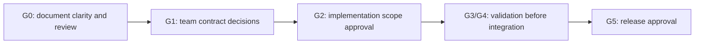
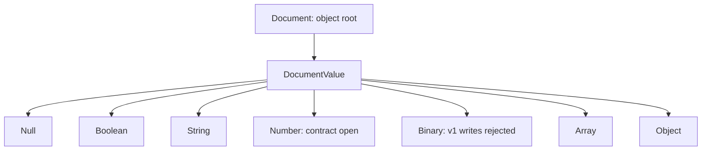
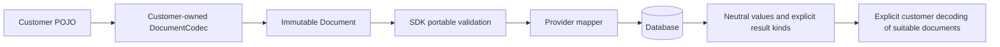
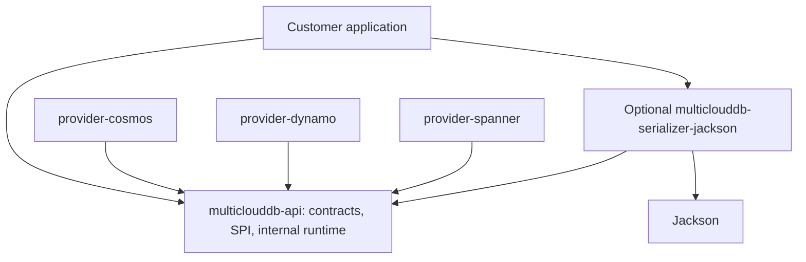
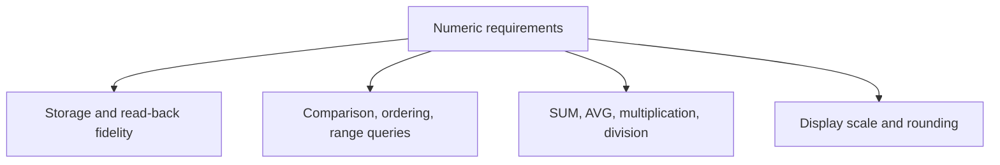
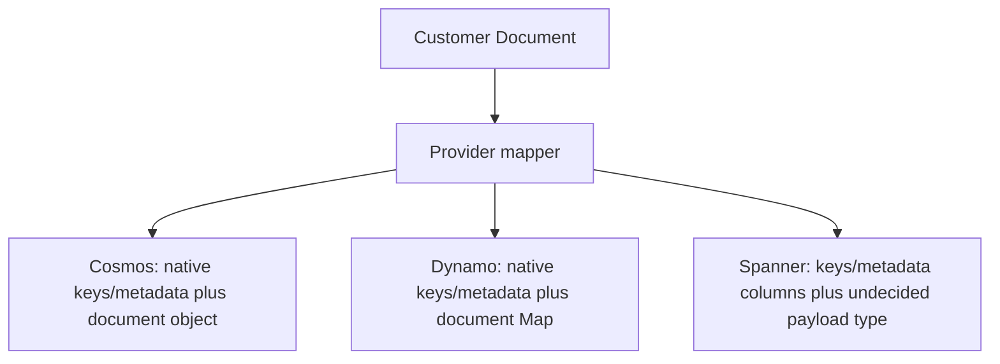
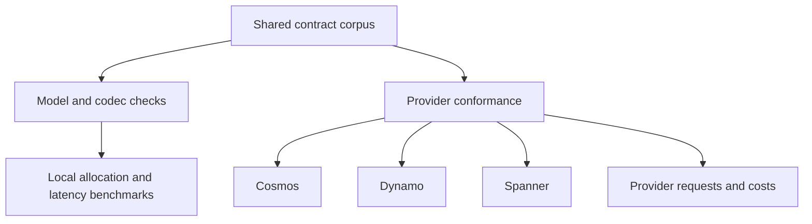
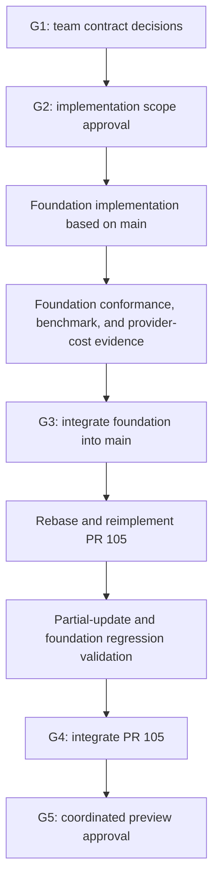

# Issue #116: Decouple Document Serialization from the Portable API

**Status: team discussion and design-review draft. Not an implementation or release approval.**

- Revision: `r3`, 2026-09-23
- Scope: `microsoft/multiclouddb-sdk-for-java` issue #116
- Follow-on work: reimplement PR #105 partial updates on the new foundation
- Basis: recorded design directions and the code observations identified in Section 18
- This document contains no customer identities, production schemas, or production data.

## 0. Team Discussion Summary

### 0.1 Purpose and approval boundaries

**The meeting should select open policies or identify the evidence and owners needed to decide them. This draft does not choose defaults on the team's behalf.**

**Complete implementation proceeds after the team approves the outstanding policies.** Current scope is publication of this design draft only. Reviewer agreement or a completed document cannot substitute for team approval.

- Agreed foundation: an immutable neutral document model; customer-application-owned codecs; an optional Jackson adapter; removal of Jackson from the API artifact; rejection of portable binary writes in v1; phase-specific errors; and a coordinated public API transition.
- Additional agreed directions: change feeds distinguish **Full / Partial / None** images; queries distinguish **Document / Projection / Value** results. Concrete provider mappings and signatures still require approval.
- This revision clarifies legacy read/rewrite behavior, codec construction and conversion failures, bidirectional conversion and result-construction costs, the implementation approval gate, limit configuration questions, and conditional direct Jackson dependencies in providers.
- Still open: numeric fidelity and the Cassandra comparison baseline; physical storage envelopes; E7 key/metadata visibility; limits, defaults, and budgets; legacy reads and migration; provider result contracts; supported types, errors, versions, cursor implementation, and cost thresholds.

| Level | Count | Meaning |
|---|---:|---|
| Top-level design checklist | 16 | Section 3: 12 agreed directions, 2 partially agreed, 2 awaiting team decision |
| Detailed team decision items | 24 | Unique IDs below, subordinate to the top-level checklist; these are not 40 independent approvals |
| Detailed agenda groups | 4 / 9 / 5 / 6 | Numeric requirements; storage/results; limits/legacy/rollout; codec/query inputs/cost |

CF1 and Q1 concern the details of already-selected result distinctions, not reopening those distinctions. E7 remains deferred to the team. Alternatives below do not automatically reopen other agreed directions.



**A draft can pass G0 document review without satisfying G1, G2, or G5.** An agreed direction with missing contract deliverables remains incomplete. This revision is ready for team discussion; it does not claim that a subsequent review of r3 has already passed.

### 0.2 Canonical, deduplicated decision agenda

The following **24 unique IDs are the canonical team questions**. Later explanations and matrices support these items rather than adding duplicate questions. Every recommendation is a **proposal**, not an approved policy. The impact column describes areas to evaluate, not measured outcomes.

#### A. Numeric requirements and the customer baseline: 4 items

| ID | Exact decision question | Options and trade-offs | Recommendation - proposal | Required customer or experimental evidence | Impact | Dependencies and gate |
|---|---|---|---|---|---|---|
| N1 | Does "at least Cassandra precision" mean the customer's actual type/precision/scale/range corpus, or the theoretical full range of `decimal`/`varint`? | Actual corpus: testable, but not a whole-type guarantee. Theoretical range: broader, but a common native implementation cannot be assumed. | Define the promised domain first and prove it with a customer-approved corpus; do not silently narrow a broader requirement. | Actual column types, anonymized boundary values, and storage/read/query requirements. | API: numeric guarantee; storage: range; cost: encoding/indexes; compatibility: existing values. | N4 evidence -> G1. |
| N2 | What are the portable exact range, equality/normalization/scale/rounding rules, and treatment of out-of-range inputs? | Bounded range plus rejection: prevents loss but limits support. Explicit rounding: convenient but changes values. Capabilities: broader use with provider differences. | Prefer lossless behavior; avoid implicit rounding and decide permitted ranges/modes from customer requirements. | N1 corpus; provider-path round trips, comparisons, arithmetic, non-finite and signed-zero cases. | API: number type/equality; storage: fidelity; cost: queries; compatibility: rewrites. | N1 -> G1. |
| N3 | Will exact values outside native numeric ranges use internal canonical string/binary encodings, and what numeric-query restrictions will apply? | Native-only: simpler queries, smaller domain. Tagged encoding: preserves values, complicates indexes/translation. Capability gating: makes differences explicit. | Declare value preservation separately from comparison, ordering, and arithmetic support; select only after evaluating costs. | Numeric/query corpus; encoding collisions, versioning, and index experiments. | API: profiles; storage: wire format; cost: expansion/indexes; compatibility: migration. | N1/N2, coordinated with E1/E2 -> G1. |
| N4 | Must actual schema, type, range, and database-side operation requirements be obtained before finalizing the contract? | Required evidence: defensible decisions, schedule dependency. Starting with assumptions: faster, but risks unsupported promises. | Obtain schema and operation requirements through an approved channel and use synthetic fixtures for validation. | `DESCRIBE TABLE`, types, maximum precision/scale/range, required operations; do not embed actual material here. | API: scope; storage: schema; cost: workload; compatibility: baseline corpus. | No predecessor -> G1 evidence gate. |

Considering binary as an internal numeric encoding does not authorize customer `BinaryValue` writes in v1. That agreed input restriction is not being reopened.

#### B. Storage and public results: 9 items

| ID | Exact decision question | Options and trade-offs | Recommendation - proposal | Required customer or experimental evidence | Impact | Dependencies and gate |
|---|---|---|---|---|---|---|
| E1 | Should physical storage adopt a new envelope separating customer payload from system metadata? | New envelope: fewer collisions, query/migration changes. Existing layout: less transition work, continued field/schema coupling. | Evaluate the preferred separation, but do not fix the format before numeric, performance, and compatibility evidence. | Three-provider storage/read/query/update spikes and customer transition constraints. | API: mapping; storage: format; cost: payload/indexes; compatibility: migration. | N1-N3/E2 coordination -> G1. |
| E2 | Which native payload type or column layout should Spanner use, and how should it represent exact values? | JSON: document structure, numeric path needs proof. Typed columns: native queries, schema coupling. Encoded payload plus indexes: expressive, operationally complex. | Select a representation that meets actual numeric/query requirements; do not preselect a type. | Fidelity across mutation/read/query/change-stream paths, null/absence, index plan. | API: supported values; storage: schema; cost: extraction/indexes; compatibility: legacy markers. | Joint N2/N3/E1 decision -> G1. |
| E3 | How should schema, indexes, and materialized query fields be managed? | Explicit schema/indexes: predictable, more setup. Automatic projections: convenient, write/synchronization cost. Scans: simple, potentially expensive. | Make indexes and their update costs explicit; avoid hidden scans and non-atomic materialized projections. | Query plans, partition scope, projection and atomic-update experiments. | API: configuration; storage: indexes/projections; cost: reads/writes; compatibility: paths. | E1/E2, coordinated with Q1 -> G1; evidence at G3. |
| E4 | Will existing data be supported through new-resource-only adoption, one-time migration, or time-bounded legacy reads? | New resources: simpler, migration burden. One-time migration: clear cutover, interruption/restart concerns. Transitional reads: gradual, more combinations. | Define the supported period and Section 13.2.2 read/rewrite profiles first; do not transform automatically. | Synthetic legacy corpus and rollback/interruption/resumption requirements. | API: legacy reads; storage: conversion; cost: migration; compatibility: old versions. | E1/E2/C1 -> G1; coordinate with ROLL1. |
| E5 | What are the complete reserved-name, case, prefix-scope, and provenance rules, and how would an envelope change them? | Current union: consistent, restricts business names. Relaxation after separation: flexible, new mapping required. | Reconcile the existing agreement with E1; never discard legacy business fields solely by name. | Internal names from code, synthetic collision and Unicode cases. | API: field names; storage: placement; cost: mapping; compatibility: collisions. | E1/E7 coordination -> G1. |
| E6 | How will providers guarantee shallow partial-update atomicity, resulting-size errors, and capability declarations? | Native atomic operation: direct, native limits. Transaction: control, additional cost. Unsupported: explicit, narrower functionality. | Evaluate native atomic paths first; explicitly limit support where guarantees cannot be met. | Sibling/concurrent updates, missing items, resulting size, request counts. | API: capabilities; storage: update paths; cost: calls/transactions; compatibility: #105. | E1/E2/L1 -> G1; evidence at G4. |
| E7 | Where will keys and system metadata appear in read/query/change-feed results and native/portable query paths? | Typed separation: fewer collisions, wrappers. Inclusion in Document: one object, naming/codec coupling. | Evaluate typed separation without automatic extra reads. This decision remains explicitly deferred to the team. | Response-visibility matrix, allocation, key projection/index effects, metadata I/O. | API: result shape; storage: paths; cost: copies/requests; compatibility: payload. | Align with CF1/Q1/E1 -> G1; P1 evidence. |
| CF1 | How will the agreed Full/Partial/None model map to provider capture settings and images? | Native evidence: accurate, configuration-specific mapping. Restricted settings: simpler, fewer supported cases. Capabilities: explicit guarantees, operational checks. | Classify an image as Full only on adequate evidence; never interpret uncaptured partial fields as absent. | Capture settings, before/after/delete/none cases, null versus uncaptured mappings. | API: image details; storage: capture; cost: event conversion; compatibility: consumers. | Align with E7/C1 -> G1. |
| Q1 | What are the supported native/portable shapes, kind-identification rules, and page/error semantics for Document/Projection/Value? | Requested kind: explicit, caller responsibility. Query mapping: convenient, translation complexity. Restricted native scope: easier to validate, less coverage. | Use request/translation information rather than guessing full documents from JSON shape. | Full-row, alias, system-field, scalar, array, null-row, and empty-page cases. | API: wrappers/pages; storage: query paths; cost: projection/indexes; compatibility: native queries. | E7/C2/N2 -> G1; evidence at G3. |

#### C. Limits, legacy data, and rollout: 5 items

| ID | Exact decision question | Options and trade-offs | Recommendation - proposal | Required customer or experimental evidence | Impact | Dependencies and gate |
|---|---|---|---|---|---|---|
| L1 | What are serialized/structural hard maxima and accounting rules, unset defaults, and invalid-configuration behavior? | Default equal to maximum: simple, less headroom. Lower default: defensive, restrictive. Reject invalid configuration: explicit. Normalize it: convenient, risks hidden changes. | Approve values and defaults separately using boundary evidence; evaluate fail-fast configuration errors. | Key/envelope overhead, base 399 KiB versus candidate 390 KiB, boundary and invalid-setting cases. | API: config/errors; storage: accepted domain; cost: bounds; compatibility: rewrites. | N2/E1/E2 -> G1. |
| L2 | What precisely is counted for depth, field-name, and node/token limits, and what are the limits? | Common provider bounds: predictable, conservative. Additional lower structural bounds: resource defense, narrower inputs. | Specify root, Unicode/UTF-8, and repeated-subtree accounting; choose values through boundary experiments. | Deep/wide/empty structures, Unicode/escaping, parser and native limits. | API: structures; storage: compatibility; cost: CPU/allocation; compatibility: old inputs. | Coordinate with L1/N2/E5 -> G1. |
| L3 | How are codec/construction, write, and read budgets connected, including unset, invalid, and conflicting settings? | Shared budget: consistent, additional API. Separate budgets: independent, mismatch handling required. | Define responsibilities and propagation explicitly; do not assume an unset value means the hard maximum. | Rejection before excessive allocation, lower client limits, large legacy reads, failure timing. | API: codec/config; storage: readable domain; cost: memory; compatibility: readability. | L1/L2/C1/C3 -> G1. |
| C1 | What neutral kinds and rewrite acceptance/rejection profiles apply to each legacy native form? | Broad reads with bounded writes: access retained, rewrites may fail. Strict reads: simpler, blocks existing values. Explicit migration: traceable, operational cost. | Approve read and rewrite independently for every Section 13.2.2 row; do not hide binary/string or numeric loss. | Synthetic legacy corpus based on S4/S6/S7; native B/BYTES versus existing strings. | API: kinds/errors; storage: fidelity; cost: conversion; compatibility: direct data impact. | N2/N3/E5/L1/E1 -> G1. |
| ROLL1 | Which old/new reader, writer, and format combinations are allowed, and what enables new writes or rollback? | Coordinated cutover: simpler, transition window. Temporary mixed operation: gradual, fencing/conversion complexity. | Complete the support and format-detection matrices and explicitly approve activation and recovery conditions. | Old-writer overwrites, unknown versions, concurrent migration changes and partial failures. | API: versions; storage: formats; cost: migration; compatibility: rollback. | E4/C1/C4 -> G1; evidence G3; execution approval G5. |

#### D. Codecs, query inputs, errors, and cost: 6 items

| ID | Exact decision question | Options and trade-offs | Recommendation - proposal | Required customer or experimental evidence | Impact | Dependencies and gate |
|---|---|---|---|---|---|---|
| C2 | What Java/neutral types, literal/AST bindings, and failure rules are allowed for Map utilities and query parameters? | Closed scalar set: simpler, restrictive. Structured values: expressive, more provider translation. | Specify an allowlist; do not route unknown Java values through a hidden mapper or `toString()`. | Parameter/literal/native-binding cases; null, numeric, array, and object requirements. | API: inputs; storage: bindings; cost: conversion; compatibility: existing calls. | N2/Q1/L1 -> G1. |
| C3 | Which mapper/subclass/module/Jackson versions are supported, and how is copy-construction failure exposed? | Validated mapper scope: stable, limited. Broader support: flexible, more combinations. | Preserve snapshot semantics; never fall back to the original or a default mapper after snapshot failure. | Copy failures, subclasses/components, thread safety, Maven/JPMS/BOM examples. | API: factories; storage: mapping; cost: copy/cold start; compatibility: versions. | Joint specification with C5/C6 -> G1. |
| C4 | How will the API's internal cursor serializer be replaced while preserving token/version/error compatibility? | Existing wire format: fewer transition changes, implementation work. Approved version transition: flexibility, rollout burden. | Choose against required existing fixtures; implementation technology remains unselected. | Existing token/binding/expiry/reason fixtures and versions actually used. | API: tokens/errors; storage: checkpoints; cost: codec; compatibility: resume. | Align with ROLL1 -> G1. |
| C5 | What are the checked status, inheritance, category/reason, and sanitization contracts for codec construction/encode/decode and provider failures? | Separate codec exception: clear boundary, handling branches. Common hierarchy: unified handling, coupling. Checked versus unchecked: enforced handling versus convenience. | Preserve phase distinctions; explicitly specify factory failures and safe handling of raw causes. | Sections 5.3.1/12.1 failure cases, caller handling, sensitive message/log fixtures. | API: exception signatures; storage: no direct change; cost: failure handling; compatibility: catch clauses. | Coordinate with C3/C6/C1/Q1 -> G1. |
| C6 | Which concrete/generic/type-variable/wildcard/raw/array types and runtime mismatches does TypeRef support? | Fully resolved subset: clear, limited. Wider support: flexible, adapter ambiguity. | Specify support and failure timing/reasons first; do not implicitly add a separate `reflect.Type` overload. | Bidirectional encode/decode type matrix in Section 5.5. | API: generics; storage: mapping; cost: type handling; compatibility: DTOs. | Joint specification with C3/C5 -> G1. |
| P1 | Which payloads and paths are measured for latency/allocation/provider cost, and what regressions are acceptable? | Per-path thresholds: attributable, more measurement. End-to-end only: realistic, can hide local regressions. | Separate Section 14.2 encode/decode/native-read/page/CF1/Q1/E7 costs; the team chooses thresholds. | Controlled baselines, payloads/structures/profiles, actual request and index costs. | API: no direct change; storage: envelope comparison; cost: release criteria; compatibility: performance. | Supported profiles -> G1 criteria; G3/G4 evidence; G5 approval. |

### 0.3 Meeting order and records

Start with N4 evidence acquisition and the N1 promise. Consider N2/N3 together with E1/E2, then connect query/index/update choices to legacy data, limits, and rollout. E7 is a public-result decision separate from physical storage; align it with CF1/Q1. Record coupled decisions such as C3/C5/C6 together rather than creating circular waits.

For every ID, record the selected and rejected alternatives, evidence, approver, remaining work, applicable versions, and gates using Section 17. If evidence is missing, assign evidence-gathering work and leave the policy open. Investigation spikes are not authorized by the current document-publication scope.

## 1. Reading This Draft and Its Authority

This is a concrete draft of **agreed directions**, not approval of every public signature, storage format, numeric representation, or limit.

| Label | Meaning |
|---|---|
| **Agreed direction** | Explicitly selected design direction; detailed contracts and implementation approval remain separate. |
| **Partially agreed** | A structure or principle is agreed, but important decisions remain. |
| **Awaiting team decision** | A preferred option or investigation question exists, but team approval is required. |
| **Proposal** | A possible elaboration, not an approved public contract. |
| **Code observation** | Behavior inspected at the stated revision, not a service-wide guarantee or target policy. |

`BigDecimal`, fixed-point or tagged-decimal encodings, physical envelope choices, and specific validation constants are not approved.

Publication of this draft does not authorize implementation, implementation PRs, data migration, or releases. G1 team contract decisions and G2 implementation scope approval remain required.

## 2. Problem, Goals, and Non-Goals

### 2.1 Current problem

**Code observations:** multiple document representations coexist.

| Surface | Inspected representation | Problem |
|---|---|---|
| `DocumentResult.document()` | Jackson `ObjectNode` | Customer code depends on a serializer implementation type. |
| `QueryPage.items()` | `List<Map<String, Object>>` | Reads and queries use different value models. |
| `ChangeEvent.data()` | Jackson `JsonNode` | Change feeds expose another representation. |
| Write API and provider SPI | `Map<String, Object>` | Allowed Java values and conversion ownership are unclear. |
| `QueryRequest.parameters()` and parts of the query AST | Arbitrary `Object` | Hidden conversion paths could survive a document-only refactor. |
| API module | Jackson dependency and transitive JPMS requirement | Neutral API consumers inherit Jackson coupling. |
| Size validation | Jackson tree and serialized bytes | Validation creates intermediates also recreated by provider mapping. |

Spanner currently uses field-specific columns, `FIELD_DATA`, and `JSON_VALUE_MARKER`. Dynamo mapping also goes through Jackson trees. These involve storage semantics and compatibility, not merely serializer selection. See S1-S9.

The inspected local snapshot associated with PR #105 contains this normalization path:

```text
caller graph snapshot
  -> graph inspection
  -> internal Jackson serialization
  -> JsonNode parsing
  -> serialized-root inspection
  -> Map conversion
  -> provider conversion
```

Issue #116 should provide the foundation before this pipeline is released as the new contract.

### 2.2 Goals

- Remove Jackson and provider-native types from portable document contracts.
- Separate customer object mapping from provider storage mapping.
- Support an official Jackson adapter and customer configuration without bypassing SDK validation.
- Share a neutral value model across writes, reads, queries, change feeds, and subsequent partial updates.
- Remove unnecessary serialize/parse/Map conversion cycles.
- Specify responsibility for nulls, numbers, binary, duplicates, limits, and errors.
- Evaluate request counts and provider costs as well as functional portability.
- Deliver intentional pre-preview API changes with explicit migration guidance.

### 2.3 Non-goals

- Removing every internal use of Jackson in providers or their native SDKs.
- Claiming abstraction eliminates Jackson security-maintenance obligations.
- Storing identical physical JSON strings across all providers.
- Accepting serializer output without portable validation.
- Requiring a new `multiclouddb-core` module in this change.
- Freezing public streaming reader/writer interfaces now.
- Adding financial aggregates or arbitrary-precision arithmetic without confirmed requirements.
- Treating this draft as approval of an envelope or automatic data migration.

## 3. The 16 Top-Level Decisions

**12 agreed directions / 2 partially agreed / 2 awaiting team decision.**

These top-level checklist numbers are separate from the subordinate decision IDs in Section 0.2.

| # | Topic | Status | Direction or remaining scope |
|---|---|---|---|
| 1 | Document model | Agreed direction | Immutable object-root `Document` and closed `DocumentValue` algebra. |
| 2 | Absence and null | Agreed direction | Absence is a missing key; explicit null is `NullValue`; no `MissingValue`. |
| 3 | Numeric contract | Awaiting team decision | Precision, range, rounding, encoding, queries, and arithmetic. |
| 4 | Binary | Agreed direction | Reserve `BinaryValue`; reject v1 portable writes; legacy reads remain open. |
| 5 | Jackson packaging | Agreed direction | Optional separate adapter; remove Jackson from API. |
| 6 | Codec boundary | Agreed direction | Customer-owned explicit calls; core client takes `Document`. |
| 7 | Codec lifecycle | Agreed direction | Copy mapper configuration at construction; thread-safe, client-independent, non-closeable. |
| 8 | Generic types | Agreed direction | Neutral `TypeRef<T>` and `Class<T>`; separate `reflect.Type` overload unapproved. |
| 9 | Validation limits | Partially agreed | Hard maxima and lower-only overrides; values and accounting need approval. |
| 10 | Duplicates and reserved names | Partially agreed | Reject duplicates; current union direction agreed; full list, prefix scope, and envelope interaction open. |
| 11 | Public API migration | Agreed direction | Coordinated breaking change with explicit utilities and documentation. |
| 12 | Module graph | Agreed direction | Defer core extraction; make current API internals Jackson-free. |
| 13 | Provider storage/mapping | Awaiting team decision | Envelope is preferred, not approved; format/query/index/migration remain open. |
| 14 | Errors | Agreed direction | Phase-specific failures, stable reasons, safe diagnostics. |
| 15 | Conformance and cost | Agreed direction | Shared conformance, local benchmarks, and provider-cost release gates. |
| 16 | Delivery | Agreed direction | Foundation integration -> #105 reimplementation -> combined validation -> coordinated preview. |

The 12/2/2 count records direction choices, not implementation readiness. CF1 now selects Full/Partial/None and Q1 selects Document/Projection/Value. E7 remains explicitly deferred. These subordinate decisions do not increase the top-level count or replace G1 approval of signatures and provider mappings.

## 4. Public Document Model

### 4.1 Closed value algebra

**Agreed direction:** stored documents have an object root. A scalar or array root is not a database `Document`.



- Arbitrary POJOs and provider objects cannot pass through as unmodeled values.
- The entire value graph is immutable, including protection from subsequent collection or buffer mutation.
- Including `BinaryValue` now reduces the compatibility burden of adding a public variant later. Type existence is not write support.
- Numeric representation and equality/canonicalization belong to the numeric decision.

**Proposal:** separate object field order from semantic equality and preserve array order. Insertion order, accessors, builder replacement methods, `equals/hashCode`, and numeric scale equality require a final specification. Do not promise identical field order or JSON bytes after provider round trips.

### 4.2 Absence and explicit null

**Agreed direction:**

```text
{}                     -> nickname is absent
{"nickname": null}     -> nickname exists with explicit null
{"items": [null]}      -> the array contains an actual null element
```

Do not add a persistable `MissingValue`. The Java shape of a missing-field lookup remains a signature decision.

For #105 shallow updates:

```text
Before: {"nickname":"Ari","age":30}
Update: {"nickname":null}
After:  {"nickname":null,"age":30}
```

Distinguish a missing root record or absent event image from a document-field null. The current not-found `read()` result and change-feed no-image representation must not be silently conflated with `NullValue`; specify their final Java forms during migration.

### 4.3 Public surfaces to change

| Surface | Direction | Details still required |
|---|---|---|
| create/update/upsert | `Document` or the subsequent patch contract | No arbitrary-POJO overload in the core client. |
| `DocumentResult.document()` | `Document` | Metadata is currently separate; future key/system visibility is E7. |
| `QueryPage.items()` | Neutral Document/Projection/Value results | Supersedes a `List<Document>`-only direction; wrappers/pages and E7 remain open. |
| `ChangeEvent.data()` | Neutral Full/Partial/None image results | Concrete wrappers, capture classification, and delete mapping remain open. |
| Query parameters | Neutral values | Scalar-only versus structured parameter support remains open. |
| Query literals/translated parameters | Align with neutral types | Remove hidden arbitrary-object conversion paths. |
| Provider SPI | Neutral documents/values | No customer codecs or native provider values at this boundary. |
| #105 partial update | Neutral replacement values | Connect limits, capability, and atomicity in the follow-on work. |

These directions do not approve individual constructors, overloads, or query AST signatures. Queries and change feeds reuse the **value model**, not a single wrapper that erases result kind or completeness.

### 4.4 CF1: Incomplete change-feed images

**Agreed direction:** explicitly distinguish **Full / Partial / None**. Concrete Java types, provider completeness classification, and capture settings require G1 approval.

The same payload can convey different information:

```text
Full image {"status":"CLOSED"}:
  owner is absent in that image.

Partial image {"status":"CLOSED"}:
  the event does not establish whether owner exists.
```

A missing captured field is not necessarily an absent document field. This is an image-knowledge distinction, not a new stored `MissingValue`.

| Alternative | Benefit | Cost or remaining issue | Status |
|---|---|---|---|
| Expose only full images | Simple absence semantics | Must define unsupported configurations or no-image behavior | Not selected |
| Explicit Full/Partial/None | Preserves incomplete information honestly | New result API and partial-field semantics | **Direction selected** |
| Capability for full-image guarantees | Explicit provider/resource guarantees | Does not itself define partial representation | Possible complement; undecided |

- **Full:** a complete image; a missing key means absence in that image.
- **Partial:** only some information was captured; omitted keys imply neither absence nor deletion.
- **None:** no image information; not an empty document or document null.

Use neutral values in partial results without implicitly converting them to complete documents. Type and accessor names are not frozen. Approve capture evidence, resource settings, before/after/delete selection, field-deletion information, and capabilities. A subsequent point read must not silently be labeled the event's full image: intervening updates or deletion can change the data, and the read adds cost.

### 4.5 Q1: Document, projection, and value query results

**Agreed direction:** explicitly distinguish **Document / Projection / Value**.

| Result kind | Role | Open details |
|---|---|---|
| Document | A complete document result for a selected record | E7 keys/metadata and evidence that the result is complete |
| Projection | Selected fields or expressions | Aliases, key inclusion, native projection normalization |
| Value | A neutral number, string, array, or other supported query value | Supported value kinds and computed numeric guarantees |

The document-only query alternative was not selected. This does not authorize new aggregate features or promise identical query-shape support on every provider.

Stored `Document` remains object-root. A Value result uses the neutral value direction without bypassing numeric or binary-read policies. JSON object shape alone cannot identify a full document, projection, or computed object value.

Specify native full-row, payload projection, system/key projection, scalar, and array-valued cases. Do not invent a `{"value": ...}` document to hide a scalar or call a projection a full document.

Some unsupported shapes can be rejected before I/O; others may only be known after execution. Define errors, partial-page handling, and continuation behavior without promising universal pre-I/O shape detection. Also decide requested versus inferred result kind, mixed-kind pages, kind stability across continuation, and a null-valued row versus an empty page.

## 5. Codec Boundary and Customer Workflow

### 5.1 Responsibility separation



**Agreed direction:** application-owned means the **customer application**, not the SDK.

- The SDK project supplies an official Jackson adapter.
- Customers choose a safe default or caller-configured mapper path.
- The codec maps customer objects to/from neutral documents, not native database storage.
- The core client neither owns nor discovers codecs.
- Customers explicitly choose among multiple codec instances.
- No client-wide/per-operation codec precedence or classpath ordering is required.
- Custom codecs cannot bypass client validation.

### 5.2 Illustrative API sketch

**Proposal:** this is explanatory pseudocode using prospective APIs, not implemented or compile-validated signatures.

```java
record Order(String code, String status) {}
record OrderBatch<T>(List<T> items) {}

DocumentCodec codec = JacksonDocumentCodec.createDefault();
TypeRef<OrderBatch<Order>> type = new TypeRef<>() {};

OrderBatch<Order> batch = new OrderBatch<>(
        List.of(new Order("example-order", "OPEN")));

Document document = codec.encode(batch, type);
client.upsert(address, key, document);

DocumentResult result = client.read(address, key);
if (result != null) {
    OrderBatch<Order> restored = codec.decode(result.document(), type);
}
```

The root is an `OrderBatch` object with an array-valued field, not a root `List<Order>`.

**Agreed direction:** offer `Class<T>` convenience overloads and neutral `TypeRef<T>`. Do not expose Jackson `TypeReference` or `JavaType`. A separate `java.lang.reflect.Type` overload is not approved.

An explicit Map utility is a migration candidate, but its accepted Java types are not finalized. Unknown `Number`, `Instant`, enum, or POJO values must not gain an implicit mapper/`toString()` bypass.

### 5.3 Lifecycle and thread safety

**Agreed direction:**

```java
ObjectMapper mapper = new ObjectMapper();
// Configure customer modules and mapping settings before constructing the codec.
DocumentCodec codec = JacksonDocumentCodec.from(mapper);
```

- Copy/snapshot mapper configuration at codec construction; the codec owns the internal copy.
- Later configuration changes to the original mapper do not update an existing codec.
- Codecs have a thread-safe contract and are not `AutoCloseable`.
- Closing the database client does not close customer codecs or mappers.
- Create a new codec to change configuration.

**Important limitation:** `ObjectMapper.copy()` is not a deep clone of every custom serializer, deserializer, or collaborator. Shared mutable components may remain. Customer component thread safety and mutation restrictions must be documented separately.

### 5.3.1 Construction failure and snapshot semantics

Do not assume copying always succeeds. An unsupported mapper subclass, custom copy behavior, or configuration problem can make **codec construction fail**, before encode/decode or provider I/O.

- Do not fall back to the original mutable mapper after snapshot failure.
- Do not silently substitute a default mapper with different customer mapping semantics.
- Do not return a success-shaped codec after failed construction.
- C3 determines supported mappers/subclasses/versions; C5 determines the public exception, checked status, hierarchy, category, and reason.

This does not expand copying into a deep-clone guarantee. Copy support and component thread safety are separate concerns.

### 5.4 Jackson implementation candidate

**Proposal, not an approved implementation:**

- Feed Jackson tokens to a neutral builder and expose a neutral token view for decoding.
- Do not use byte serialization followed by reparsing as the default conversion pipeline.
- Honor object-mapping modules, naming rules, and custom serializers.
- Validate root shape, observable duplicates, and construction resource bounds.
- Recognize binary tokens rather than automatically hiding them as base64 strings.
- Evaluate safe defaults that do not automatically enable risky polymorphic behavior or arbitrary classpath module discovery.

Enumerate which mapper behaviors are supported and which portable restrictions take precedence. No exact Jackson feature list is frozen here. The SDK cannot infer the original Java semantics of every string deliberately emitted by a custom serializer.

### 5.5 C6: Supported TypeRef forms and failures

**Only TypeRef/Class support is agreed. The following matrix must be completed for G1.**

| Type form or situation | Decision required |
|---|---|
| Concrete object class | Conditions for abstract types, interfaces, and subtype configuration |
| Fully resolved generic object | Guarantees for `OrderBatch<Order>` and nested generics |
| Unresolved type variable | Rejection timing and reason for unresolved `T` |
| Wildcard | Encode/decode support for forms such as `OrderBatch<? extends Order>` |
| Generic array field | Handling of resolved versus unresolved object fields such as `T[]` |
| Raw generic object | Whether raw `OrderBatch` is supported without its element type |
| Runtime value versus declared type | Coercion, subtype, and mismatch behavior |
| Missing or invalid type capture | Failure at token construction or codec invocation |

Resolved type information and object-root eligibility are different conditions. Evaluate explicit rejection rather than silently degrading unsupported types to `Object` or mapper-dependent inference.

Specify failure phase, exception, stable reason, and diagnostics without document contents for every supported/rejected form. This matrix does not approve a separate reflection-type overload.

## 6. Module Dependencies and JPMS

**Agreed direction:** defer `multiclouddb-core` extraction. Keep the current factory/runtime/validation internals in the API artifact and make them Jackson-free.



Arrows denote dependencies. Existing provider `ServiceLoader` discovery is separate from the decision not to discover codecs automatically.

| Area | Direction |
|---|---|
| API Maven dependency | Remove Jackson. |
| API JPMS requirement | Remove `requires transitive com.fasterxml.jackson.databind`. |
| Jackson adapter | Depends on API and Jackson; added explicitly by customers who want it. |
| Provider modules | Depend on neutral API; native SDK internal serializers may remain. |
| Future core extraction | Separate decision; do not introduce API factory -> core -> API cycles. |

Validate adapter readability and transitive requirements for a public `ObjectMapper` entry point with real module-path consumer examples.

**Conditional implementation task:** if a provider's own code still directly uses Jackson classes, declare the relevant direct Maven dependencies and JPMS `requires` together instead of relying on the API's removed transitive dependency. Declare only the artifacts/modules actually used and align versions with C3. This does not apply to a provider that eliminates direct Jackson use. It does not force all providers to retain Jackson or reopen the API-removal decision.

`CursorTokenCodec` currently uses Jackson inside the API and must be addressed. The replacement technology remains undecided. Preserve approved token version/binding/retention/error behavior through fixtures; this is not approval to write a custom JSON parser.

Maintain security updates, supported version ranges, and BOM compatibility for the adapter and any remaining provider Jackson usage. An API free of Jackson does not mean the complete customer application is Jackson-free.

## 7. Validation and Limits

### 7.1 Two layers of responsibility

**Agreed direction:** client validation applies to codec output.

**Proposal:** resource protection also needs bounded work during conversion/construction.

```text
codec / Map utility / Document builder
  -> construction-time root/type/duplicate/resource checks
  -> immutable Document
  -> operation-specific client validation
  -> capabilities and native mapping
  -> provider I/O
```

- Lower client limits are not automatically propagated to application-owned codecs; the budget API remains open.
- A custom codec is not sandboxed. The SDK cannot prevent all unbounded customer computation or allocations made before it receives the result.
- Immutable values reduce mutable-input snapshot problems; collection conversion still needs cycle, mutation, and expansion rules.
- Allocating an enormous byte array and checking its size afterward does not meet the resource-protection goal.
- Fix client validation order, `CLIENT_CLOSED` precedence, and capability-gate ordering in the specification. Client lifecycle cannot control a codec the application invokes beforehand.

**Awaiting team decision:** do not automatically reuse lower write limits as legacy read acceptance rules. Provider-response parsing needs resource bounds, but its acceptance profile must be specified separately.

### 7.2 Limit structure

**Partially agreed:** customers may lower portable hard maxima but not raise the effective ceilings.

```text
With a valid explicit lower limit:
  effectiveLimit = customerLowerLimit
With no setting:
  effectiveLimit = the result of the team-approved default policy
In every case:
  effectiveLimit <= portableHardMaximum
```

No decision makes an unset default equal to the hard maximum. This is not an algorithm for silently clamping or ignoring invalid configuration.

| Dimension | Provisional baseline | Approval still required |
|---|---:|---|
| Serialized input size | 390 KiB | Team approval and provider boundary evidence |
| Structural footprint | 390 KiB | Accounting and metadata/native overhead |
| Container depth | 31 below the root | Exact counting convention and boundaries |
| #105 partial-update fields | 10 top-level fields | Update contract and native cost evidence |
| Field-name size | Unspecified | Top-level/nested, Unicode/UTF-8, schema restrictions |
| Node/token count | Unspecified | Counting and resource budget |

**Distinguish current code from candidates:** the inspected base `DocumentSizeValidator` uses **399 KiB**. The **390 KiB** values are from the inspected #105 snapshot and the provisional discussion baseline. They are not the current base contract or an approved future constant.

The PR snapshot also contains 128-character and 50,000-UTF-8-byte field-name values. They were not adopted as the new public contract.

**Required L1/L3 decisions for G1:** unset defaults, omission/null handling, negative/zero/above-maximum/conflicting settings, and failure timing. Decide rejection versus any explicit normalization. Do not invent `0=unlimited`, `unset=hardMaximum`, or silent clamping. Define read, codec, and write defaults and propagation separately.

### 7.3 Accounting and failure behavior

**Proposals:**

- Define stable escaping and numeric rendering before computing serialized size with a streaming byte counter.
- Account separately for empty containers and native attribute/name overhead not captured by JSON byte counts.
- Counting still consumes traversal CPU; do not claim zero serialization work.
- Include keys, TTL, envelope, and format metadata in boundary evidence.
- Small partial-update input can produce a large resulting document; input bounds alone do not guarantee result size.
- Do not automatically add a pre-read just to calculate resulting size. The team must approve native rejection and error mapping policies.

Canonical size remains incomplete while numeric rendering is undecided. A fixed 390 KiB margin alone does not prove every native item will fit.

## 8. Numeric Contract: Awaiting Team Decision

### 8.1 Customer requirements first

"At least Cassandra" has been raised as the target, but actual column types, schema, and operations have not been obtained. Financial-query needs are plausible context, not a confirmed supported-operation contract.

N1-N4 in Section 0.2 are the four subordinate questions under the numeric topic. Their questions, alternatives, evidence, and gates are defined there without duplicate agenda entries.

Handle actual customer material through approved channels. Use anonymized synthetic fixtures; do not attach production schemas or data to this document or a public issue.

### 8.2 Separate guarantees



Setting `decimalPlaces(5)` does not automatically deliver all these guarantees. Display formatting is not exact storage or database arithmetic.

### 8.3 Alternatives considered

**None of these numeric policies is adopted.**

| Candidate | Benefit | Risk or decision required |
|---|---|---|
| Exact neutral number with bounded native writes | Separates model and storage domain | A readable legacy value may not be rewritable; customer requirements must justify the limit |
| Fixed-scale integer | Candidate for value/order preservation within a domain | Larger scale reduces range; requires field policies and parameter translation |
| Tagged/canonical decimal string | Candidate for preserving large values | Does not itself provide native numeric ordering, ranges, or arithmetic |
| Provider-native ranges with capabilities | Uses backend strengths | Common exact coverage may narrow; differences must be explicit |
| Opt-in rounding | Can meet bounded practical precision requirements | Changes business values; mode, phase, and errors need approval |

Conditional mathematical example: if every relevant path exactly supports integers through `2^53 - 1`, scale 5 permits a maximum positive value of `(2^53 - 1) / 10^5`. This illustrates a trade-off; it is not verified provider-path evidence.

Individually exact fixed-point values do not ensure exact sums, intermediate multiplication, or division. Do not expand storage fidelity into arbitrary financial-arithmetic guarantees.

Internal Java representation, scale preservation, equality of `1` and `1.0`, signed zero, exponent normalization, non-finite values, and legacy read/write differences remain open. Discussion of `BigDecimal` or a preference against implicit rounding was not final approval of the numeric contract.

## 9. Binary Policy and Legacy Reads

**Agreed direction:**

- Include `BinaryValue` in the closed value algebra.
- Reject v1 portable binary writes with `INVALID_REQUEST`; no confirmed customer need justifies freezing an encoding now.
- Do not silently substitute base64 strings or numeric arrays by provider.
- Design future binary support against confirmed workloads, costs, and query requirements.

Base64 length is normally `4 * ceil(byteLength / 3)`, before tag, field, and envelope overhead. This formula is not an approved portable binary size limit.

**Awaiting team decision:** distinguish existing Dynamo native binary, Spanner `BYTES`, and ordinary base64 strings on reads. The inspected Spanner mapper returns BYTES as base64 strings. Rejecting new binary writes does not decide whether legacy reads preserve, reject, or transform native binary. See C1 and Section 13.2.2.

## 10. Duplicate Keys and Reserved Fields

### 10.1 Duplicates

**Agreed direction:** reject duplicate object keys at the first ingress where they can be observed, rather than first-wins or last-wins normalization.

```json
{"status": "OPEN", "status": "CLOSED"}
```

Tokens or entry sequences can expose duplicates. A Map/tree/provider that has already discarded one cannot reconstruct the lost information. Official adapter paths and custom-codec contracts must acknowledge this boundary.

Case-insensitive reserved-name matching does not make general object keys case-insensitive. Builder insertion versus explicit replacement APIs still require specification.

### 10.2 Reserved names

**Current agreed direction:** reserve the union of provider-owned top-level names and an SDK prefix; allow ordinary nested names that merely match top-level reserved names.

Examples discussed include `id`, `partitionKey`, `sortKey`, `ttl`, `ttlExpiry`, `data`, and Cosmos system names. **This is not the complete approved list.** Prefix depth for `__multiclouddb_`, the complete set, and detailed matching rules remain open.

**Conditional reconsideration:** an approved envelope could remove much of this collision problem. That replacement policy has not been selected, and the current agreement is not automatically discarded.

Do not strip legacy fields solely because their names appear in the union. A Dynamo business field named `data` and Spanner's internal `data` metadata have different provenance.

## 11. Provider Mapping and the Envelope Decision

### 11.1 Current paths

| Provider | Inspected path | Neutral-mapping concerns |
|---|---|---|
| Cosmos | Map -> ObjectNode; inject native keys; Jackson reads/queries | Native JSON mapping separate from customer codecs; system-field provenance |
| Dynamo | Map -> JsonNode -> AttributeValue; JsonNode/Map on reads | Direct neutral/native conversion; numeric and unsupported-native-type policies |
| Spanner | Typed fields, `FIELD_DATA`, nested JSON marker | Payload/schema choice, null/absence, legacy markers |

Reuse **value conversion** where possible, not wrappers that erase E7 visibility, CF1 completeness, or Q1 result kind. CF1/Q1 directions are selected; concrete mappings remain pre-G1. E7 itself is deferred.

### 11.2 Storage alternatives

| Alternative | Benefit | Burden | Status |
|---|---|---|---|
| Keep storage, replace mappers | Less data rewriting | Retains Spanner markers and field-column coupling | Not finally adopted |
| Separate payload and system metadata | Fewer collisions and internal leaks | Query/index/format/migration redesign | **Preferred; awaiting team approval** |
| Long-lived dual formats | Gradual transition | Detection, writes, and test combinations | Not selected |

A clean long-term design is prioritized over avoiding source/binary breaks. This does not authorize data deletion, dropping legacy readability by default, or automatic migration.

### 11.3 Candidate envelope

**Awaiting team decision:** separate customer and system storage logically without requiring identical physical bytes.



Illustrative Cosmos layout, not final names or a format version:

```json
{
  "id": "sdk-key",
  "partitionKey": "example-partition",
  "document": {
    "id": "business-key",
    "data": {"status": "OPEN"}
  }
}
```

This can separate system and business identifiers. It does not decide that only the inner object is publicly visible or where public keys/metadata belong; E7 covers that.

No promise is made that:

- Spanner will use a JSON payload.
- JSON storage satisfies the required exact-decimal domain.
- Arbitrary queries retain the same cost.
- Every provider uses one binary or tagged-decimal encoding.
- Old readers can consume newly written formats.

### 11.3.1 E7: Key/system visibility and result normalization

**Awaiting team decision:** this item remains explicitly deferred to the team, including its latency and cost implications. Neither typed separation nor in-Document inclusion is selected.

| Path | Meaning to approve |
|---|---|
| Point read | Request key versus returned key, payload boundary, optional metadata |
| Portable document query | Key/metadata placement in Q1 Document results and metadata options |
| Change feed | Event key, duplication in images, image versus event metadata |
| Native full-row query | Return, normalize, or reject physical envelope/key/system fields |
| Native projection | Alias collisions and payload versus metadata projections |
| Portable query references | How business, key, and system fields are addressed |

Alternatives are typed key/metadata outside `Document`, approved fields inside it, or explicitly separated result/entry-point contracts. None is finally selected.

**Proposal:** evaluate typed separation while distinguishing local classification/allocation from extra provider reads. A wrapper does not intrinsically require another database request, but it is not guaranteed allocation-free.

- Measure reuse of immutable documents rather than unnecessary deep copies.
- Measure adding keys to projections, including payload and index effects.
- Evaluate a policy against automatic per-item reads to fill metadata.
- Specify absent/unsupported metadata instead of inventing values.

These are still proposals, including the no-extra-read condition. E7 is separate from physical envelope selection and requires P1 evidence. Do not strip by name or blindly pass through native results. Approve concrete read/query/change-feed signatures and examples, aligned with the Q1 result distinctions.

### 11.4 Query and index implications

**Proposals and evidence needed:**

- Translate logical paths to approved physical payload paths.
- Treat field-name escaping and path segments explicitly.
- Evaluate Cosmos indexing paths, Dynamo index-key projection constraints, and Spanner generated-column/index options.
- If fields are materialized, define atomic consistency with payload writes.
- Preserve explicit null versus absence in `FIELD_EXISTS`; plain SQL `IS NOT NULL` is not automatically equivalent.
- Document native-expression path changes separately.
- Evaluate opaque-string storage against numeric/query requirements; exact text round trips alone do not satisfy query semantics.

### 11.5 Upsert versus partial update

The follow-on #105 contract uses create-or-replace upsert and shallow top-level set/replace updates:

```text
Before: {"status":"OPEN","owner":"Ana"}

update({"status":"CLOSED"})
  -> {"status":"CLOSED","owner":"Ana"}

upsert({"status":"CLOSED"})
  -> {"status":"CLOSED"}
```

For the candidate envelope:

```text
Correct partial mapping: change document.status only
Incorrect replacement:  replace document with {"status":"CLOSED"}
```

**Proposed implementation conditions requiring team evidence:**

- Distinguish envelope root from customer-document root.
- Prefer native atomic field operations where supported.
- Do not substitute unconditional read-then-upsert for partial update.
- A nested object sent as a replacement replaces that object; this is not recursive merge.
- Establish Spanner atomicity and cost before advertising support; otherwise declare the limitation.
- Do not let customer paths mutate physical system/envelope fields merely because business-name restrictions change.

## 12. Errors and Diagnostics

**Agreed direction:**

| Phase or condition | Error direction | Retry implications |
|---|---|---|
| Customer encode/decode failure | Portable codec boundary named `DocumentCodecException` | Not an automatic DB retry; hierarchy/checked/category/reason details are C5 |
| Codec construction, including mapper copy | Explicit construction failure; exact C3/C5 contract open | No original/default mapper fallback |
| Portable input/type/limit violation | `INVALID_REQUEST` | Unchanged retry is not useful |
| Unsupported provider feature | `UNSUPPORTED_CAPABILITY` | Requires different capability/request |
| Malformed provider encoding | `PROVIDER_ERROR` with stable reason | Non-retryable data failure |
| Actual auth/network/throttling failure | Existing portable categories | Existing category-specific policy |

Do not call every legacy value outside the new write profile corrupted data. C1 decides read treatment.

Diagnostics should use stable reasons and, when appropriate, capped/escaped paths and safe limit numbers. Do not expose document values, raw JSON fragments, or raw serializer messages by default. Field names can also be sensitive; default logs should emphasize reasons.

Raw cause chains and stack traces can leak contents. Changing only the top-level message is insufficient. Avoid broad catches that relabel SDK bugs as customer input errors.

### 12.1 Construction, encode, and decode failure cases

This is a required distinction, **not an assertion that existing errors already share one exception or that construction failures have an approved subclass**.

| Phase | Example | Responsibility |
|---|---|---|
| Codec construction | Copy failure or unsupported mapper subclass/configuration | No codec exists yet; expose failure without reuse/substitution |
| Encode | Custom serializer throws; unsupported type; invalid root/token output | Customer mapping failure; specify normalization without contents |
| Write after successful encode | Codec produced `BinaryValue`, then v1 write rejects it | Successful encoding is not write acceptance; do not relabel it an encode failure |
| Decode | Valid document does not match requested DTO/type, or custom deserializer fails | Object reconstruction failure, not a storage/read failure |
| Native response -> neutral | Native type/profile or malformed encoding cannot be mapped | Separate provider boundary under C1/C5 |

C3/C5 deliverables include exceptions per phase, checked/unchecked status, inheritance and relationship to `MulticloudDbException`, whether category/reason exist and their values, failure timing, and raw-cause handling. Neither universal raw-exception passthrough nor universal input-error wrapping is selected.

## 13. Compatibility and Migration

### 13.1 Source and binary API

**Agreed direction:** a coordinated breaking change before preview, with explicit utilities and documentation. Long-lived parallel legacy clients or a new v2 package were not selected.

| Current usage | Migration direction |
|---|---|
| Map writes | Explicit utility or codec to construct `Document` |
| ObjectNode/JsonNode access | Neutral accessors or explicit adapter conversion |
| Query `List<Map<...>>` | Document/Projection/Value results; wrappers and key/metadata finalized under G1/E7 |
| Implicit POJO serialization | Explicit official/customer codec |
| Arbitrary query parameters | Approved neutral parameter set |
| Provider SPI implementations | Coordinated neutral input/output transition |

Java cannot overload solely by return type. Changing `DocumentResult.document()` is an explicit source/binary break.

### 13.2 Persisted data and cursors

**Awaiting team decision:** determine new-resource-only use, legacy reader support, and migration tooling.

Inspect typed Spanner columns and `FIELD_DATA`, marker/escape rules, JSON-looking strings, system/business name collisions, large numbers, binary and other native types, and full/partial/delete images.

Do not rewrite stored data during reads merely because return types changed. Approve preserve/reject/migrate behavior using fixtures.

Cursor compatibility is a separate consequence of removing internal API Jackson. Use existing token fixtures for version, expiry, binding, and reason behavior. A format change needs an approved version/rollout plan rather than an implicit change.

### 13.2.1 ROLL1: Mixed-version rollout and rollback

**Awaiting team decision:** permission for API breaks is not approval of mixed readers/writers or storage compatibility.

| Reader or writer | Existing format | New format |
|---|---|---|
| Existing reader | Verify current support | Decide support, explicit blocking, or prohibition of mixed operation |
| New reader | Decide legacy domain | Read the approved new format |
| Existing writer | Decide permitted period/fencing | Prevent overwrites and metadata loss |
| New writer | Decide whether updating old records changes format | Define activation conditions |

Required decisions include:

- Reliable format/version identification and collision prevention.
- Errors for unknown formats/versions.
- Reader/writer combinations required before enabling new writes.
- Preventing incompatible old writers from modifying new records.
- Capturing changes and resuming partial migration failures.
- Rollback after new writes: binary downgrade alone versus conversion/restoration.
- Stopping/recovering when downgrade would lose stored values or cursor compatibility.

This does not select dual writes, marker names, tooling, or feature flags. The presence of a customer field resembling an envelope is not an approved detection heuristic.

Approve compatibility semantics before G1, prove implemented mixed-version/rollback behavior before G3, and approve actual deployment/write-activation/recovery plans before G5.

### 13.2.2 Legacy native form -> neutral kind -> rewrite matrix

**This matrix documents decisions to make, not a selected legacy policy.** Read success and acceptance of the same value under a new write profile are separate.

- **Observed** means code at the Section 18 base revision, not a current service-wide guarantee.
- Proposed/conditional kinds and rewrite decisions depend on N1-N4, C1, E1/E2/E5, L1-L3, E7, and ROLL1.
- A new encoder cannot recover precision or native-type information already lost by an earlier read.
- Rewrites must satisfy the operation's key/schema, reserved-name, numeric/binary, and size/structure rules. Do not implicitly promote partial images or projections into complete-document rewrites.

| Legacy native form | Observed base behavior or evidence limitation | Candidate neutral kind/condition | Rewrite acceptance/rejection - policy still open |
|---|---|---|---|
| Ordinary JSON string, Dynamo `S`, unmarked Spanner `STRING` | Strings remain strings; Spanner does not parse JSON-looking text without its marker (S5-S7) | `String`; respect string provenance even if contents resemble base64 | Candidate for acceptance within approved string/name/size profiles; do not infer binary/JSON from appearance |
| Cosmos JSON number, Dynamo `N`, Spanner `INT64`/`FLOAT64` | Dynamo dot-containing numbers use DoubleNode; some integers use Int/Long. Spanner reads native long/double (S6/S7). No whole-domain guarantee | Exact Number representation, normalization, and legacy read domain remain N2/C1 decisions | Accept only within an approved profile; out-of-range rejection or encoding is N2/N3. No unapproved rounding/stringification bypass |
| Explicit null or absence | Dynamo NULL differs from no attribute. Spanner uses FIELD_DATA; rows without metadata may expose null columns (S6/S7) | Explicit null is NullValue, actual absence is no key; uncertain legacy provenance is C1 | Preserve intended distinction under the operation; do not infer business absence from a schema null |
| Native objects/arrays, Dynamo M/L, valid Spanner marker JSON | Recursive maps/lists and marker/escape handling exist (S6/S7) | Object/Array candidates with approved format detection | Apply all nested numeric/binary/name/depth/node/size rules; do not hide a structure as text to bypass limits |
| Invalid Spanner marker payload or JSON parse-failure path | Base mapper contains a raw-string fallback after parsing fails (S7); actual affected data was not established | Legacy string preservation or explicit read rejection is C1/C5 | Do not silently fix the new kind as String and rewrite; approve profile/errors/migration first |
| Dynamo native `B` | No B-preserving branch in base `attributeValueToJsonNode`; unhandled types fall back to NullNode (S6). Not the desired new behavior | BinaryValue reads versus explicit unsupported legacy reads remain C1; original native input is required | **V1 BinaryValue writes are rejected.** Do not bypass by silently rewriting as string/list/null |
| Spanner native `BYTES` | Base mapper returns `toBase64()` string (S7) | BinaryValue or an explicit legacy-string compatibility profile remains C1 | BinaryValue cannot be written in v1. A string read does not guarantee rewriting the original BYTES schema/type |
| Existing business string containing base64 | Different from native B/BYTES; absent separate provenance, it is a string | String; do not promote based on contents | Evaluate string policy; binary migration requires explicit conversion approval |
| Dynamo native sets or other non-one-to-one types | Base SS/NS become arrays, with double conversion for NS (S6); other forms need inspection | Array, a preservation profile, or read rejection remains C1 | Rewriting an array can create a native list; successful reading is not a native-set round-trip guarantee |
| Business names colliding with new reserved names/prefix | Provider-owned and business-field provenance differs (S5/S7) | Classify customer values and system metadata under E5/E7/C1 | Apply approved accept/reject/migration rules; do not strip/rename to bypass validation |
| Readable documents larger/deeper than new candidates | Base write-size validation is **399 KiB**; **390 KiB is provisional**. Neither proves every native write succeeds (S4/S10) | Kinds do not change; read/write budget relationship is L1/L3/C1 | Rejection may follow an approved new limit. Do not treat 390 KiB as settled or automatically truncate/compress/split |

For each row, approve `native form -> read profile/neutral kind -> operation-specific rewrite conditions or reason -> migration path`. This is not a conversion table designed to force every input to succeed.

### 13.3 Documentation and release material

Implementation PRs must align guides, configuration, architecture, compatibility, changelogs, per-module CHANGELOGs, API references, examples/E2E documentation, and the feature specification. Changes to separate sample repositories need their own scope/approval.

Publish compatible API/provider/adapter version combinations. Do not assume updating only the API is supported. No release version numbers are chosen here.

## 14. Conformance, Benchmarks, and Provider Cost

**Agreed direction:** all three layers are preview release conditions.



### 14.1 Corpus and wiring

| Area | Coverage |
|---|---|
| Model | Object root, deep immutability, array order, null/absence |
| Codec | Default/custom mapper, C6 supported/rejected forms, failure timing/reasons, observable duplicates, configuration snapshot |
| Boundary | Consume API without Jackson; adapter explicitly added |
| Write rejection | Approved limits, binary, reserved policy; no provider I/O |
| Round trips | Values, kinds, and field existence, not display strings alone |
| Results | E7 visibility; identical JSON fields with different Full/Partial meaning; None is not an empty document |
| Query | Q1 kinds; no full-document inference from shape; null-valued row versus empty page; native/portable mappings and bindings |
| Partial update | Siblings, nested replacement, concurrency, missing items, atomicity |
| Capabilities | Success or explicit unsupported errors, not only skipped cases |
| Legacy | Approved read/rewrite profiles and ROLL1 mixed-version/format/rollback fixtures |
| Error safety | No contents or sensitive raw fragments/paths in default logs |
| Cursor | Existing approved token/error/expiry/binding behavior |

Wire shared abstract tests into all three actual provider subclasses/profiles. Do not hide divergences by changing expected values based on provider names.

A codec TCK is a means for official and custom implementations to exercise the contract; a new published TCK artifact or framework has not been selected. Do not demand recovery of duplicates already discarded by a Map; test rejection at observable token boundaries.

### 14.2 Benchmark scope

Write-side encoding alone does not represent total cost. Separate these stages and connect them to end-to-end measurements using equivalent payloads and semantics. Tool selection and P1 thresholds remain open.

| Path | Costs to isolate |
|---|---|
| Codec construction | Mapper copy/configuration and cold start, separate from per-operation encoding |
| Direct Document construction / Map utility | Snapshots, defensive copies, structural/size validation |
| POJO/generic -> neutral encode | Serializer/type work, tokens, neutral allocations |
| Neutral -> POJO/generic decode | Deserializer/type work, object allocations, failures |
| Native response -> neutral | Cosmos JSON, Dynamo attributes, Spanner payload/schema, legacy profiles |
| Query page construction | Lists/items/wrappers, diagnostics/continuation, value reuse and copies |
| CF1 construction | Full/Partial/None classification, wrappers/fields, image copying |
| Q1 construction | Document/Projection/Value mappings, wrappers/pages, copying |
| E7 alternatives | Key/metadata classification, projection effects, deep copies, extra I/O |

The inspected base and #105 snapshot are comparison baselines. When old and new result paths have different semantics, identify the difference rather than declaring an improvement from incomparable timings.

Candidate workloads include small/medium/large payloads, just-under/over limits, shallow/deep/wide structures, dense empty containers, escaped strings, generic POJOs, and rejected inputs. Exact values follow approved limits.

Measure allocation/op, per-stage and end-to-end latency/throughput, GC, copied data, and rejection work. Record JVM/SDK versions, warm-up, repetitions, and environment. Network latency must not hide local regressions; local benchmarks do not prove equal provider cost.

**E7's latency/metadata decision consumes this matrix and Section 14.3 evidence.** Do not hide additional reads or assume zero wrapper allocation. Do not promise unmeasured speedup factors or zero allocations. P1 thresholds remain a team decision.

### 14.3 Provider cost

| Operation | Cosmos | Dynamo | Spanner |
|---|---|---|---|
| Point writes/reads | Payload/index size, request charge | Item/attribute/envelope size, consumed capacity | Mutation/read cost and actual schema |
| Partial update | Atomic request count, resulting-item limits | UpdateItem path, conditions, resulting-item limits | Atomic implementation and transaction cost |
| Query | Payload paths/indexes, partition scope | Query/Scan routing, index projections | Path extraction, generated columns/indexes |
| Change feed | Image conversion and payload | Image/type conversion | Payload capture and legacy schema differences |

Expose and obtain approval for extra reads or full scans introduced to achieve functional parity. Severe, unbounded cost differences are not merely serializer implementation details.

## 15. Rationale, Alternatives, and Risks

| Topic | Rationale for selected/preferred direction | Rejected or deferred alternative |
|---|---|---|
| Neutral model | Explicit types and validation boundary | Arbitrary Object Map alone; streaming-only public API |
| Customer-owned codec | Explicit configuration and lifecycle | Core-client POJO conversion; automatic discovery |
| Mapper copy | Isolates later source configuration changes | Shared original mapper by default |
| Separate adapter | Isolates API from Jackson | Transitive API Jackson; mandatory starter |
| Deferred core extraction | Avoids factory cycles and wider packaging work | New core plus bootstrap SPI now |
| Preferred envelope | Reduces name collisions and schema metadata coupling | Permanent legacy layout; envelope still unapproved |
| Coordinated API break | Avoids long-lived dual models | Parallel legacy client or v2 package |

Principal risks:

- Freezing JSON/native numeric storage before requirements can lose fidelity.
- Treating an envelope as a trivial wrapper can overlook queries, indexes, and update paths.
- Applying reserved-name stripping to legacy reads can delete business fields.
- Treating mapper copy as deep cloning leaves component races.
- Client-only validation cannot prevent excessive codec-construction allocations.
- Removing imports but missing cursors, query parameters, or feeds leaves incomplete decoupling.
- Independently publishing incompatible modules can produce runtime linkage failures.

## 16. Delivery and Approval Gates

**Agreed direction:**



| Gate | Required before passing | Meaning |
|---|---|---|
| G0: document review | Review clarity, omissions, contradictions, and accidental decisions | Document changes only |
| G1: contract decisions | Complete Section 16.1 with approved support/rejection/scope exclusions and evidence | Open decisions are not implementation defaults; implementation approval is separate |
| G2: implementation approval | Scope, work/PR units, compatibility obligations, measurement plan | Code work within the approved scope |
| G3: foundation integration | **Before main integration:** connected API/codec/adapter/providers, foundation conformance/benchmarks/provider cost, approved compatibility/rollout evidence, docs | Integrate only after validation and approval; #105 tests cannot substitute |
| G4: #105 integration | **Before #105 integration:** sibling/concurrency/atomicity/result-size/error/cost evidence and foundation regressions | Integrate validated partial updates; do not release the old pipeline first |
| G5: preview release | Combined results, thresholds, compatible versions, migration/rollback guidance | Team release approval |

Review-sized changes and release units differ. Do not release an API/provider-incompatible intermediate state.

Build the foundation from canonical main, not stacked on #105. Validate and approve G3 before integrating it; then rebase #105 and validate before G4. Specification numbering, versions, and subsequent implementation or release publication require separate approval.

### 16.1 Required G1 contract matrix

Numeric, envelope, and limit decisions alone are insufficient.

| Contract area | Decision IDs | G1 deliverable |
|---|---|---|
| Neutral values/numbers | N1-N4, Section 4 | Types/accessors/equality, exact ranges, rounding, acceptance/rejection |
| Storage and key/system visibility | E1-E3, E7 | Separate physical mapping and public visibility matrices |
| Change-feed images | CF1 | Full/Partial/None, unknown/absence, capture/delete mapping, capabilities/errors |
| Query results/parameters | Q1, C2 | Result kinds and native/portable paths, bindings, shape failures |
| Validation/resources | L1-L3 | Values/accounting/overhead, unset defaults and invalid settings, codec/write/read budgets and failure order |
| Duplicates/reserved names | E5, Section 10 | Observable ingress, equality, full list/prefix scope, provenance |
| Legacy data/binary reads | E4, C1, ROLL1 | Section 13.2.2 native -> neutral -> rewrite matrix, format detection, mixed versions, rollback |
| Codec/type support | C3, C6 | Type support, supported mapper/subclass/copy failures, configuration/versions/lifecycle |
| Cursor | C4 | Format/version/binding/expiry/error compatibility and change strategy |
| Safe errors/diagnostics | C3, C5 | Construction/encode/decode exception hierarchy and checked status, category/reason, path/cause/log sanitization |
| Capabilities/cost | E6, P1 | Support declarations, unsupported paths, acceptance criteria |

An explicit unsupported scope still needs approved rejection behavior. "Discuss later" does not pass G1. Authorize investigation spikes separately from production implementation and release.

## 17. Team Decision Records and Evidence

Section 0.2 is the canonical list of **24 unique IDs**. Do not duplicate questions here; record outcomes using this structure.

| Record field | Required content |
|---|---|
| ID and state | Direction agreement, final approval, explicit exclusion, or awaiting evidence |
| Selected/rejected alternatives | Adopted rules and deliberately unsupported scope |
| Evidence | Anonymized corpus, official source/version, actual SDK-path experiment, code revision |
| Public contract | Signatures, values/errors/defaults/failure behavior, examples |
| Storage/cost/compatibility | Formats/indexes/requests, legacy read/rewrite, rollout/rollback |
| Approver and owner | Assigned by the team, not invented by this document |
| Dependencies and scope | Related IDs, profiles/modules/versions, G1-G5 gates |
| Remaining work | Fixtures, measurements, implementation, and documentation completion criteria |

An empty approval field is not consent. General service-type documentation is insufficient without the chosen SDK version and **actual write/read/query/change-feed paths**. Keep actual customer material out of this document.

## 18. Inspected Evidence and Limitations

### 18.1 Revisions

- Inspected base: `9cc6eb04aa613a319942b9905683071b756ba783`
- Inspected local snapshot associated with PR #105: `f8694c973fe8892d12ad2677e8415082f0beefec`
- The latter was a local snapshot; this draft does not claim it is the current GitHub PR head.
- Issue #116 and PR #105 descriptions were read separately from implementation code.

### 18.2 Code evidence

All paths below are repository-relative. Expand the prefixes; there are no machine-local checkout paths. S1-S9 refer to the base; S10 refers to the PR snapshot.

```text
API_SRC     = multiclouddb-api\src\main\java\com\multiclouddb
COSMOS_SRC  = multiclouddb-provider-cosmos\src\main\java\com\multiclouddb\provider\cosmos
DYNAMO_SRC  = multiclouddb-provider-dynamo\src\main\java\com\multiclouddb\provider\dynamo
SPANNER_SRC = multiclouddb-provider-spanner\src\main\java\com\multiclouddb\provider\spanner
```

| ID | Paths/symbols | Inspected evidence |
|---|---|---|
| S1 | `API_SRC\api\DocumentResult.java`; `API_SRC\api\QueryPage.java`; `API_SRC\api\changefeed\ChangeEvent.java` | ObjectNode, List<Map>, and JsonNode result surfaces |
| S2 | `API_SRC\api\MulticloudDbClient.java`; `API_SRC\api\QueryRequest.java`; `API_SRC\spi\MulticloudDbProviderClient.java` | Map write/SPI/parameter surfaces |
| S3 | `multiclouddb-api\pom.xml`; `multiclouddb-api\src\main\java\module-info.java` | Jackson dependency and transitive requirement |
| S4 | `API_SRC\api\internal\DocumentSizeValidator.java`; `API_SRC\api\internal\DefaultMulticloudDbClient.java` | 399 KiB validator, Jackson size conversion, write checks |
| S5 | `COSMOS_SRC\CosmosProviderClient.java`; `COSMOS_SRC\CosmosConstants.java` | ObjectNode conversion, key injection, read field filtering, query conversion |
| S6 | `DYNAMO_SRC\DynamoItemMapper.java` | Intermediate trees, numeric reads, native-type fallbacks |
| S7 | `SPANNER_SRC\SpannerRowMapper.java`; `SPANNER_SRC\SpannerProviderClient.java` | FIELD_DATA, markers/escapes, typed values, BYTES base64, fallbacks |
| S8 | `API_SRC\api\changefeed\internal\CursorTokenCodec.java` | Base64URL JSON tokens, Jackson, version/expiry/binding/error behavior |
| S9 | `multiclouddb-conformance\src\test\java\com\multiclouddb\conformance\SpannerTestSchema.java`; `docs\architecture.md`; root `pom.xml` | Schema assumptions, factories/modules, Java 17, independent module versions |
| S10 | PR snapshot `API_SRC\api\internal\PartialUpdateStructureValidator.java`; `API_SRC\api\internal\WriteLimits.java` | Snapshot/serialize/parse/convert flow and provisional limits |

Requirements and repository guidance:

- [Issue #116](https://github.com/microsoft/multiclouddb-sdk-for-java/issues/116)
- [PR #105](https://github.com/microsoft/multiclouddb-sdk-for-java/pull/105)
- `.github\instructions\portability.instructions.md`
- `.github\skills\portability-review\references\portability-checklist.md`

### 18.3 Evidence limitations

This drafting work did not independently verify each service's latest official numeric documentation or the customer's actual schema. General `NUMERIC` support, numeric query rounding, and equivalence to Cassandra's entire domain are not cited as established guarantees.

Provider round trips, atomicity, performance improvements, and cost figures remain work to execute, not completed results. This document records contracts to approve and release evidence to gather. Do not freeze pending choices as constants or wire formats without team approval.
