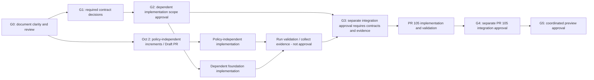
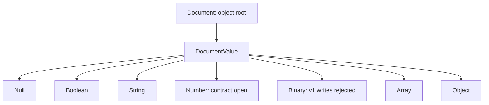
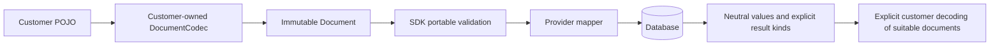
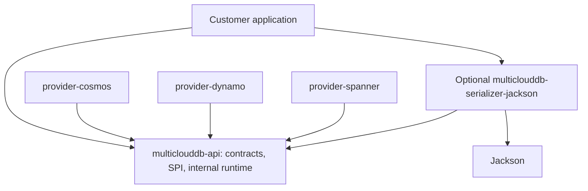
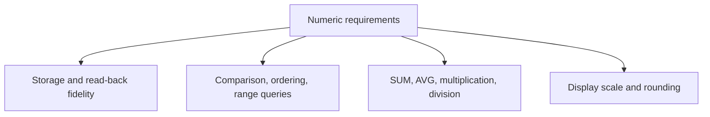
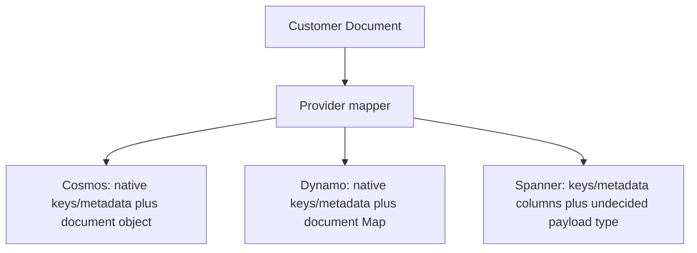
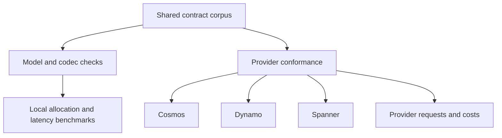
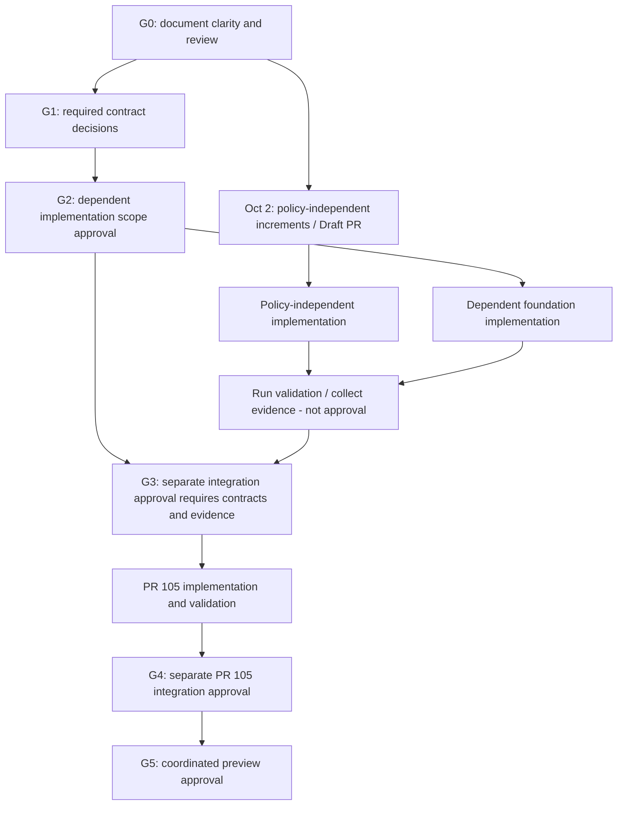

# Issue #116: Decouple Document Serialization from the Portable API

**Status: design draft with scoped incremental implementation authorized. Open contracts, integration, and release remain gated.**

- Revision: `r5`, 2026-10-02
- Local design update, 2026-09-23: error-handling direction approved; detailed C3/C5 contracts remain open (Section 12); see the later scoped implementation authorization below.
- Local scope decision, 2026-09-23: legacy query continuation-token compatibility is not required for this pre-preview transition; change-feed tokens/checkpoints are unaffected (Section 13.2).
- Requirements update, 2026-10-01: incorporate the supplied meeting summary, not a verified verbatim transcript; requirements and discussion candidates do not approve implementation (Section 0.4).
- Authorization update, 2026-10-02: begin complete, policy-independent increments and a Draft PR; this does not approve unresolved contracts, integration, release, or deployed migration (Section 16.2).
- Scoped numeric-model decision, 2026-10-02: equality/hash use mathematical value while each number retains its scale; provider fidelity and the rest of N2 remain open (Section 4.1.1).
- Scope: `microsoft/multiclouddb-sdk-for-java` issue #116
- Follow-on work: reimplement PR #105 partial updates on the new foundation
- Basis: recorded design directions and the code observations identified in Section 18
- This document contains no customer identities, production schemas, or production data.

## 0. Team Discussion Summary

### 0.1 Purpose and approval boundaries

**The meeting should select open policies or identify the evidence and owners needed to decide them. This draft does not choose defaults on the team's behalf.**

**Complete implementation still requires the outstanding contracts, but policy-independent increments and a Draft PR are now authorized.** The October 2 decision supersedes the blanket wait for every answer, not the individual open decisions. Implement only complete behavior that does not select an unresolved policy; never add a success-shaped stub or provisional public contract to bypass a gate. Reviewer agreement or a completed document cannot substitute for team approval.

- Agreed foundation: an immutable neutral document model; customer-application-owned codecs; an optional Jackson adapter; removal of Jackson from the API artifact; rejection of portable binary writes in v1; phase-specific errors; and a coordinated public API transition.
- Additional agreed directions: change feeds distinguish **Full / Partial / None** images; queries distinguish **Document / Projection / Value** results. Concrete provider mappings and signatures still require approval.
- This revision clarifies legacy read/rewrite behavior, codec construction and conversion failures, bidirectional conversion and result-construction costs, the implementation approval gate, limit configuration questions, and conditional direct Jackson dependencies in providers.
- The October 1 summary adds native-readable structured fields, customer-controlled partition semantics, full-document/projection queries, and Cassandra migration as requirements. Envelope layout, provider-set limits, field/schema serializer selection, and tooling remain candidates; date/time feasibility is conditional, not current SDK support.
- Still open: numeric fidelity and the Cassandra comparison baseline; physical storage envelopes; E7 key/metadata visibility; limits, defaults, and budgets; legacy reads and migration; provider result contracts; supported types, errors, versions, cursor implementation, and cost thresholds.

| Level | Count | Meaning |
|---|---:|---|
| Top-level design checklist | 16 | Section 3: 12 agreed directions, 2 partially agreed, 2 awaiting team decision |
| Detailed team decision items | 24 | Unique IDs below, subordinate to the top-level checklist; these are not 40 independent approvals |
| Detailed agenda groups | 4 / 9 / 5 / 6 | Numeric requirements; storage/results; limits/legacy/rollout; codec/query inputs/cost |

CF1 and Q1 concern the details of already-selected result distinctions, not reopening those distinctions. E7 remains deferred to the team. Alternatives below do not automatically reopen other agreed directions.


```mermaid
flowchart LR
    D["G0: document clarity and review"] --> C["G1: required contract decisions"]
    C --> A["G2: dependent implementation scope approval"]
    A --> F["Dependent foundation implementation"]
    D --> S["Oct 2: policy-independent increments / Draft PR"]
    S --> W["Policy-independent implementation"]
    W --> V["Run validation / collect evidence - not approval"]
    F --> V
    A --> G["G3: separate integration approval requires contracts and evidence"]
    V --> G
    G --> P["PR 105 implementation and validation"]
    P --> H["G4: separate PR 105 integration approval"]
    H --> R["G5: coordinated preview approval"]
```

**A draft can pass G0 document review without satisfying all of G1, G2, or G5.** The scoped October 2 authorization does not complete those gates. An agreed direction with missing contract deliverables remains incomplete. This revision does not claim that review has already passed.

Validation may run on an authorized increment while other contracts remain open. Arrows into G3 denote jointly required prerequisites, not permission to integrate: neither a passing test nor scoped implementation authorization grants merge approval.

### 0.2 Canonical, deduplicated decision agenda

The following **24 unique IDs are the canonical team questions**. Later explanations and matrices support these items rather than adding duplicate questions. Recommendations remain **proposals** except for explicitly recorded direction approvals; those approvals do not settle unspecified details. The impact column describes areas to evaluate, not measured outcomes.

**Scoped approval update:** the error-handling direction in Section 12 is now approved, including explicit snapshot failure without fallback. The C3/C5 recommendations below must be read with that update; their remaining detailed contracts are still open, not completed agenda items.

#### A. Numeric requirements and the customer baseline: 4 items

| ID | Exact decision question | Options and trade-offs | Recommendation - proposal | Required customer or experimental evidence | Impact | Dependencies and gate |
|---|---|---|---|---|---|---|
| N1 | Does "at least Cassandra precision" mean the customer's actual type/precision/scale/range corpus, or the theoretical full range of `decimal`/`varint`? | Actual corpus: testable, but not a whole-type guarantee. Theoretical range: broader, but a common native implementation cannot be assumed. | Define the promised domain first and prove it with a customer-approved corpus; do not silently narrow a broader requirement. | Actual column types, anonymized boundary values, and storage/read/query requirements. | API: numeric guarantee; storage: range; cost: encoding/indexes; compatibility: existing values. | N4 evidence -> G1. |
| N2 | Beyond the approved Java equality/scale direction in Section 4.1.1, what are the portable exact range, normalization/rounding rules, and treatment of out-of-range inputs? | Bounded range plus rejection: prevents loss but limits support. Explicit rounding: convenient but changes values. Capabilities: broader use with provider differences. | Preserve the scoped equality decision; prefer lossless behavior, avoid implicit rounding, and decide permitted ranges/modes from customer requirements. | N1 corpus; provider-path round trips, comparisons, arithmetic, non-finite and signed-zero cases. | API: number type/equality; storage: fidelity; cost: queries; compatibility: rewrites. | Java equality approved only; remaining domain/evidence -> G1. |
| N3 | Will exact values outside native numeric ranges use internal canonical string/binary encodings, and what numeric-query restrictions will apply? | Native-only: simpler queries, smaller domain. Tagged encoding: preserves values, complicates indexes/translation. Capability gating: makes differences explicit. | Declare value preservation separately from comparison, ordering, and arithmetic support; select only after evaluating costs. | Numeric/query corpus; encoding collisions, versioning, and index experiments. | API: profiles; storage: wire format; cost: expansion/indexes; compatibility: migration. | N1/N2, coordinated with E1/E2 -> G1. |
| N4 | Must actual schema, type, range, and database-side operation requirements be obtained before finalizing the contract? | Required evidence: defensible decisions, schedule dependency. Starting with assumptions: faster, but risks unsupported promises. | Obtain schema and operation requirements through an approved channel and use synthetic fixtures for validation. | `DESCRIBE TABLE`, types, maximum precision/scale/range, required operations; do not embed actual material here. | API: scope; storage: schema; cost: workload; compatibility: baseline corpus. | No predecessor -> G1 evidence gate. |

Considering binary as an internal numeric encoding does not authorize customer `BinaryValue` writes in v1. That agreed input restriction is not being reopened.

#### B. Storage and public results: 9 items

| ID | Exact decision question | Options and trade-offs | Recommendation - proposal | Required customer or experimental evidence | Impact | Dependencies and gate |
|---|---|---|---|---|---|---|
| E1 | Should physical storage adopt a new envelope separating customer payload from system metadata? | New envelope: fewer collisions, query/migration changes. Existing layout: less transition work, continued field/schema coupling. | Evaluate the preferred separation, but do not fix the format before numeric, performance, and compatibility evidence. | Three-provider storage/read/query/update spikes and customer transition constraints. | API: mapping; storage: format; cost: payload/indexes; compatibility: migration. | N1-N3/E2 coordination -> G1. |
| E2 | Which native payload type or column layout should Spanner use, and how should it represent exact values? | JSON: document structure, numeric path needs proof. Typed columns: native queries, schema coupling. Encoded payload plus indexes: expressive, operationally complex. | Select a representation that meets actual numeric/query requirements; do not preselect a type. | Fidelity across mutation/read/query/change-stream paths, null/absence, index plan. | API: supported values; storage: schema; cost: extraction/indexes; compatibility: legacy markers. | Joint N2/N3/E1 decision -> G1. |
| E3 | How should schema, indexes, and materialized query fields be managed? | Explicit schema/indexes: predictable, more setup. Automatic projections: convenient, write/synchronization cost. Scans: simple, potentially expensive. | Make indexes and their update costs explicit; avoid hidden scans and non-atomic materialized projections. | Query plans, partition scope, projection and atomic-update experiments. | API: configuration; storage: indexes/projections; cost: reads/writes; compatibility: paths. | E1/E2, coordinated with Q1 -> G1; evidence at G3. |
| E4 | How will required Cassandra data migration be supported, and what legacy SDK read/rewrite profiles are needed? | Migration to new resources, one-time conversion, or time-bounded legacy reads have different operational and support costs. New SDK resources alone do not remove the Cassandra import requirement. | Obtain source schema/serializer/target examples; define migration responsibilities and Section 13.2.2 profiles without automatic transformation. | Synthetic source and legacy corpora, serializer input/output, rollback/interruption/resumption requirements. | API: legacy reads; storage: conversion; cost: migration; compatibility: source data and old versions. | E1/E2/C1 -> G1; coordinate with ROLL1 and Section 13.2.3. |
| E5 | What are the complete reserved-name, case, prefix-scope, and provenance rules, and how would an envelope change them? | Current union: consistent, restricts business names. Relaxation after separation: flexible, new mapping required. | Reconcile the existing agreement with E1; never discard legacy business fields solely by name. | Internal names from code, synthetic collision and Unicode cases. | API: field names; storage: placement; cost: mapping; compatibility: collisions. | E1/E7 coordination -> G1. |
| E6 | How will providers guarantee shallow partial-update atomicity, resulting-size errors, and capability declarations? | Native atomic operation: direct, native limits. Transaction: control, additional cost. Unsupported: explicit, narrower functionality. | Evaluate native atomic paths first; explicitly limit support where guarantees cannot be met. | Sibling/concurrent updates, missing items, resulting size, request counts. | API: capabilities; storage: update paths; cost: calls/transactions; compatibility: #105. | E1/E2/L1 -> G1; evidence at G4. |
| E7 | Where will keys and system metadata appear in read/query/change-feed results and native/portable query paths? | Typed separation: fewer collisions, wrappers. Inclusion in Document: one object, naming/codec coupling. | Evaluate typed separation without automatic extra reads. This decision remains explicitly deferred to the team. | Response-visibility matrix, allocation, key projection/index effects, metadata I/O. | API: result shape; storage: paths; cost: copies/requests; compatibility: payload. | Align with CF1/Q1/E1 -> G1; P1 evidence. |
| CF1 | How will the agreed Full/Partial/None model map to provider capture settings and images? | Native evidence: accurate, configuration-specific mapping. Restricted settings: simpler, fewer supported cases. Capabilities: explicit guarantees, operational checks. | Classify an image as Full only on adequate evidence; never interpret uncaptured partial fields as absent. | Capture settings, before/after/delete/none cases, null versus uncaptured mappings. | API: image details; storage: capture; cost: event conversion; compatibility: consumers. | Align with E7/C1 -> G1. |
| Q1 | What are the supported native/portable shapes, kind-identification rules, and page/error semantics for Document/Projection/Value? | Requested kind: explicit, caller responsibility. Query mapping: convenient, translation complexity. Restricted native scope: easier to validate, less coverage. | Use request/translation information rather than guessing full documents from JSON shape. | Full-row, alias, system-field, scalar, array, null-row, and empty-page cases. | API: wrappers/pages; storage: query paths; cost: projection/indexes; compatibility: native queries. | E7/C2/N2 -> G1; evidence at G3. |

#### C. Limits, legacy data, and rollout: 5 items

| ID | Exact decision question | Options and trade-offs | Recommendation - proposal | Required customer or experimental evidence | Impact | Dependencies and gate |
|---|---|---|---|---|---|---|
| L1 | What are serialized/structural hard maxima and accounting rules, unset defaults, and invalid-configuration behavior? | Default equal to maximum: simple, less headroom. Lower default: defensive, restrictive. Reject invalid configuration: explicit. Normalize it: convenient, risks hidden changes. | Approve values and defaults separately using boundary evidence; evaluate fail-fast configuration errors. | Key/envelope overhead, base 399 KiB versus candidate 390 KiB, boundary and invalid-setting cases. | API: config/errors; storage: accepted domain; cost: bounds; compatibility: rewrites. | N2/E1/E2 -> G1. |
| L2 | What precisely is counted for depth, field-name, and node/token limits, and what are the limits? | Common provider bounds: predictable, conservative. Additional lower structural bounds: resource defense, narrower inputs. | Specify root, Unicode/UTF-8, and repeated-subtree accounting; choose values through boundary experiments. | Deep/wide/empty structures, Unicode/escaping, parser and native limits. | API: structures; storage: compatibility; cost: CPU/allocation; compatibility: old inputs. | Coordinate with L1/N2/E5 -> G1. |
| L3 | How are codec/construction, write, and read budgets connected, including unset, invalid, and conflicting settings? | Shared budget: consistent, additional API. Separate budgets: independent, mismatch handling required. | Define responsibilities and propagation explicitly; do not assume an unset value means the hard maximum. | Rejection before excessive allocation, lower client limits, large legacy reads, failure timing. | API: codec/config; storage: readable domain; cost: memory; compatibility: readability. | L1/L2/C1/C3 -> G1. |
| C1 | What neutral kinds and rewrite acceptance/rejection profiles apply to each legacy native form? | Broad reads with bounded writes: access retained, rewrites may fail. Strict reads: simpler, blocks existing values. Explicit migration: traceable, operational cost. | Approve read and rewrite independently for every Section 13.2.2 row; do not hide binary/string or numeric loss. | Synthetic legacy corpus based on S4/S6/S7; native B/BYTES versus existing strings. | API: kinds/errors; storage: fidelity; cost: conversion; compatibility: direct data impact. | N2/N3/E5/L1/E1 -> G1. |
| ROLL1 | Which old/new reader, writer, and format combinations are allowed, and what enables new writes or rollback? | Coordinated cutover: simpler, transition window. Temporary mixed operation: gradual, fencing/conversion complexity. | Complete the support and format-detection matrices and explicitly approve activation and recovery conditions. | Old-writer overwrites, unknown versions, concurrent migration changes and partial failures. | API: versions; storage: formats; cost: migration; compatibility: rollback. | E4/C1/C4 -> G1; evidence G3; execution approval G5. |

#### D. Codecs, query inputs, errors, and cost: 6 items

| ID | Exact decision question | Options and trade-offs | Recommendation - proposal | Required customer or experimental evidence | Impact | Dependencies and gate |
|---|---|---|---|---|---|---|
| C2 | What Java/neutral types, literal/AST bindings, and failure rules are allowed for Map utilities and query parameters? | Closed scalar set: simpler, restrictive. Structured values: expressive, more provider translation. | Specify an allowlist; do not route unknown Java values through a hidden mapper or `toString()`. | Parameter/literal/native-binding cases; null, numeric, array, and object requirements. | API: inputs; storage: bindings; cost: conversion; compatibility: existing calls. | N2/Q1/L1 -> G1. |
| C3 | Which mapper/subclass/module/Jackson versions are supported, and how is copy-construction failure exposed? | Validated mapper scope: stable, limited. Broader support: flexible, more combinations. | Preserve snapshot semantics; never fall back to the original or a default mapper after snapshot failure. | Copy failures, subclasses/components, thread safety, Maven/JPMS/BOM examples. | API: factories; storage: mapping; cost: copy/cold start; compatibility: versions. | Joint specification with C5/C6 -> G1. |
| C4 | How will internal cursor serialization be replaced and token validation/error contracts be specified, distinguishing query continuation from change-feed checkpoints? | Existing wire format: fewer transition changes, implementation work. Version transition: flexibility, requires an explicit contract. | Apply the approved query-only legacy exclusion in Section 13.2; preserve separately required change-feed compatibility. Implementation technology remains unselected. | New-SDK query pagination, provider/query binding, invalid and expired-token cases; separately required change-feed token/version/retention/error fixtures. | API: tokens/errors; storage: checkpoints; cost: codec; compatibility: resume with distinct query/change-feed obligations. | Query legacy exclusion does not complete C4; align remaining scope with ROLL1 -> G1. |
| C5 | What are the checked status, inheritance, category/reason, and sanitization contracts for codec construction/encode/decode and provider failures? | Separate codec exception: clear boundary, handling branches. Common hierarchy: unified handling, coupling. Checked versus unchecked: enforced handling versus convenience. | Preserve phase distinctions; explicitly specify factory failures and safe handling of raw causes. | Sections 5.3.1/12.1 failure cases, caller handling, sensitive message/log fixtures. | API: exception signatures; storage: no direct change; cost: failure handling; compatibility: catch clauses. | Coordinate with C3/C6/C1/Q1 -> G1. |
| C6 | Which concrete/generic/type-variable/wildcard/raw/array types and runtime mismatches does TypeRef support? | Fully resolved subset: clear, limited. Wider support: flexible, adapter ambiguity. | Specify support and failure timing/reasons first; do not implicitly add a separate `reflect.Type` overload. | Bidirectional encode/decode type matrix in Section 5.5. | API: generics; storage: mapping; cost: type handling; compatibility: DTOs. | Joint specification with C3/C5 -> G1. |
| P1 | Which payloads and paths are measured for latency/allocation/provider cost, and what regressions are acceptable? | Per-path thresholds: attributable, more measurement. End-to-end only: realistic, can hide local regressions. | Separate Section 14.2 encode/decode/native-read/page/CF1/Q1/E7 costs; the team chooses thresholds. | Controlled baselines, payloads/structures/profiles, actual request and index costs. | API: no direct change; storage: envelope comparison; cost: release criteria; compatibility: performance. | Supported profiles -> G1 criteria; G3/G4 evidence; G5 approval. |

### 0.3 Meeting order and records

Start with N4 evidence acquisition and the N1 promise. Consider N2/N3 together with E1/E2, then connect query/index/update choices to legacy data, limits, and rollout. E7 is a public-result decision separate from physical storage; align it with CF1/Q1. Record coupled decisions such as C3/C5/C6 together rather than creating circular waits.

For every ID, record the selected and rejected alternatives, evidence, approver, remaining work, applicable versions, and gates using Section 17. If evidence is missing, assign evidence-gathering work and leave the policy open. The October 2 authorization permits policy-independent work in Section 16.2; an investigation result does not approve a new production policy.

### 0.4 October 1 requirements and discussion update

**Provenance:** the following records the user-provided Overview/Key updates summary of the October 1 meeting, not verified verbatim statements or a completed acceptance test. No customer identities, access details, or internal tool names are included. A reported requirement constrains design evaluation; a discussed candidate is not a selected implementation. Existing scoped approvals for errors and query-token compatibility remain unchanged.

| Area | Requirement or discussion status | Consequence and remaining work |
|---|---|---|
| Native access | **Required:** read-only native tools and visualization must use meaningful, discrete structured fields, including dates, without opaque SDK-only decoding | Prove native readability, indexing, querying, and troubleshooting. A unified viewer is not a substitute (Section 11.2). |
| Envelope | **Candidate:** provider identifiers/metadata outside customer payload | No final layout approval; logical versus physical paths and nested-index restrictions need evaluation (Sections 11.3-11.6). |
| Partitioning | **Required:** customer control of strategy/cardinality and preservation of existing semantics | Validate extraction, routing, partition-key paths, and migration; do not promise zero impact (Section 11.3.2). |
| Queries | **Required:** full documents and projections. Aggregates are not a current near-term requirement; analytics are separate | Not a permanent aggregate exclusion or automatic approval of all result shapes (Section 4.5). |
| Size | **Concern:** an all-provider lowest common denominator (LCD) may constrain workloads excessively because of Dynamo | Selected-provider escape hatches and compatibility validation are **open options**, not larger approved limits or APIs. Existing hard-maxima direction stands (Section 7.4). |
| Partial updates | **Clarification:** 10 operations per request is not depth or 10 distinct/top-level fields. Nested flexibility and selected-provider compatibility must be evaluated | Cosmos native Patch has a 10-operation limit; metadata work may consume operations. No universal provider limit or new patch operation is approved (Section 11.5). |
| Cassandra migration | **Required:** existing Cassandra data must migrate; custom binary serialization and migration utilities are reported to exist | Obtain schema, serializer input/output, and representative desired targets; tooling readiness and target readability remain unproven (Section 13.2.3). |
| Serializer selection | **Open proposal:** selection by field/schema | Analyze native readability/query/index/round-trip effects; do not add a core registry or reverse application-owned codecs (Section 5.6). |
| Unified explorer/shell | **Separate tooling exploration**, not a committed deliverable | Does not replace native-access requirements or authorize implementation. |
| Numbers | **Unresolved:** domain, precision/scale, exact operations, rounding, and out-of-contract errors | Preserve the provisional preference for explicit rejection of unrepresentable inputs without approving the whole numeric contract (Section 8). |

These findings refine existing decision IDs; they do not add or close canonical agenda items or change the 16 top-level statuses. No automatic chunking, compression, dual fields, index creation, hidden reads, silent conversion, or new `TemporalValue` is approved. Cache/request-unit costs, permissions/portal/RBAC scaling, and customer-managed-key/key-vault outage behavior remain separate operational follow-ups; no key-management conclusion is established by this summary.

## 1. Reading This Draft and Its Authority

This is a concrete draft of **agreed directions**, not approval of every public signature, storage format, numeric representation, or limit.

| Label | Meaning |
|---|---|
| **Agreed direction** | Explicitly selected design direction; detailed contracts and implementation approval remain separate. |
| **Partially agreed** | A structure or principle is agreed, but important decisions remain. |
| **Awaiting team decision** | A preferred option or investigation question exists, but team approval is required. |
| **Proposal** | A possible elaboration, not an approved public contract. |
| **Code observation** | Behavior inspected at the stated revision, not a service-wide guarantee or target policy. |

`BigDecimal`, fixed-point or tagged-decimal encodings, physical envelope choices, and specific validation constants are not approved.

Publication of this draft does not itself authorize implementation, data migration, or releases. The separate October 2 decision authorizes policy-independent increments and a Draft PR; remaining G1 contracts and G2 scope decisions still apply to dependent work.

## 2. Problem, Goals, and Non-Goals

### 2.1 Current problem

**Code observations:** multiple document representations coexist.

| Surface | Inspected representation | Problem |
|---|---|---|
| `DocumentResult.document()` | Jackson `ObjectNode` | Customer code depends on a serializer implementation type. |
| `QueryPage.items()` | `List<Map<String, Object>>` | Reads and queries use different value models. |
| `ChangeEvent.data()` | Jackson `JsonNode` | Change feeds expose another representation. |
| Write API and provider SPI | `Map<String, Object>` | Allowed Java values and conversion ownership are unclear. |
| `QueryRequest.parameters()` and parts of the query AST | Arbitrary `Object` | Hidden conversion paths could survive a document-only refactor. |
| API module | Jackson dependency and transitive JPMS requirement | Neutral API consumers inherit Jackson coupling. |
| Size validation | Jackson tree and serialized bytes | Validation creates intermediates also recreated by provider mapping. |

Spanner currently uses field-specific columns, `FIELD_DATA`, and `JSON_VALUE_MARKER`. Dynamo mapping also goes through Jackson trees. These involve storage semantics and compatibility, not merely serializer selection. See S1-S9.

The inspected local snapshot associated with PR #105 contains this normalization path:

```text
caller graph snapshot
  -> graph inspection
  -> internal Jackson serialization
  -> JsonNode parsing
  -> serialized-root inspection
  -> Map conversion
  -> provider conversion
```

Issue #116 should provide the foundation before this pipeline is released as the new contract.

### 2.2 Goals

- Remove Jackson and provider-native types from portable document contracts.
- Separate customer object mapping from provider storage mapping.
- Support an official Jackson adapter and customer configuration without bypassing SDK validation.
- Share a neutral value model across writes, reads, queries, change feeds, and subsequent partial updates.
- Remove unnecessary serialize/parse/Map conversion cycles.
- Specify responsibility for nulls, numbers, binary, duplicates, limits, and errors.
- Evaluate request counts and provider costs as well as functional portability.
- Deliver intentional pre-preview API changes with explicit migration guidance.

### 2.3 Non-goals

- Removing every internal use of Jackson in providers or their native SDKs.
- Claiming abstraction eliminates Jackson security-maintenance obligations.
- Storing identical physical JSON strings across all providers.
- Accepting serializer output without portable validation.
- Requiring a new `multiclouddb-core` module in this change.
- Freezing public streaming reader/writer interfaces now.
- Adding financial aggregates or arbitrary-precision arithmetic without confirmed requirements.
- Treating this draft as approval of an envelope or automatic data migration.

## 3. The 16 Top-Level Decisions

**12 agreed directions / 2 partially agreed / 2 awaiting team decision.**

These top-level checklist numbers are separate from the subordinate decision IDs in Section 0.2.

| # | Topic | Status | Direction or remaining scope |
|---|---|---|---|
| 1 | Document model | Agreed direction | Immutable object-root `Document` and closed `DocumentValue` algebra. |
| 2 | Absence and null | Agreed direction | Absence is a missing key; explicit null is `NullValue`; no `MissingValue`. |
| 3 | Numeric contract | Awaiting team decision | Precision, range, rounding, encoding, queries, and arithmetic. |
| 4 | Binary | Agreed direction | Reserve `BinaryValue`; reject v1 portable writes; legacy reads remain open. |
| 5 | Jackson packaging | Agreed direction | Optional separate adapter; remove Jackson from API. |
| 6 | Codec boundary | Agreed direction | Customer-owned explicit calls; core client takes `Document`. |
| 7 | Codec lifecycle | Agreed direction | Copy mapper configuration at construction; thread-safe, client-independent, non-closeable. |
| 8 | Generic types | Agreed direction | Neutral `TypeRef<T>` and `Class<T>`; separate `reflect.Type` overload unapproved. |
| 9 | Validation limits | Partially agreed | Hard maxima and lower-only overrides; values and accounting need approval. |
| 10 | Duplicates and reserved names | Partially agreed | Reject duplicates; current union direction agreed; full list, prefix scope, and envelope interaction open. |
| 11 | Public API migration | Agreed direction | Coordinated breaking change with explicit utilities and documentation. |
| 12 | Module graph | Agreed direction | Defer core extraction; make current API internals Jackson-free. |
| 13 | Provider storage/mapping | Awaiting team decision | Envelope is preferred, not approved; format/query/index/migration remain open. |
| 14 | Errors | Agreed direction | Phase-specific failures, stable reasons, safe diagnostics. |
| 15 | Conformance and cost | Agreed direction | Shared conformance, local benchmarks, and provider-cost release gates. |
| 16 | Delivery | Agreed direction | Foundation integration -> #105 reimplementation -> combined validation -> coordinated preview. |

The 12/2/2 count records direction choices, not implementation readiness. CF1 now selects Full/Partial/None and Q1 selects Document/Projection/Value. E7 remains explicitly deferred. These subordinate decisions do not increase the top-level count or replace G1 approval of signatures and provider mappings.

## 4. Public Document Model

### 4.1 Closed value algebra

**Agreed direction:** stored documents have an object root. A scalar or array root is not a database `Document`.


```mermaid
flowchart TD
    D["Document: object root"] --> V[DocumentValue]
    V --> N[Null]
    V --> B[Boolean]
    V --> S[String]
    V --> NUM["Number: contract open"]
    V --> BIN["Binary: v1 writes rejected"]
    V --> A[Array]
    V --> O[Object]
```

- Arbitrary POJOs and provider objects cannot pass through as unmodeled values.
- The entire value graph is immutable, including protection from subsequent collection or buffer mutation.
- Including `BinaryValue` now reduces the compatibility burden of adding a public variant later. Type existence is not write support.
- Numeric representation and equality/canonicalization belong to the numeric decision.

**Proposal:** separate object field order from semantic equality and preserve array order. Insertion order, accessors, builder replacement methods, and recursive object/array `equals/hashCode` require a final specification. The numeric equality/scale direction is approved only as recorded below. Do not promise identical field order or JSON bytes after provider round trips.

### 4.1.1 Scoped Java numeric equality decision (2026-10-02)

**Approved direction:** `1`, `1.0`, and `1.00` compare equal by mathematical value and have equal hash codes, while each value retains its own scale. A Set may therefore treat them as one value. Hash/equality normalization must not rewrite the stored value, discard its scale, or silently normalize codec output.

This approves Java model equality only, not the complete N2 contract. It does not guarantee provider scale round trips, select storage encodings/ranges, authorize rounding, or specify floating-point ingress, signed negative zero, NaN/Infinity, scale/resource bounds, or exception APIs. Implementations must bound construction and equality/hash work under the approved resource contract; do not introduce unbounded repeated normalization on each recursive document comparison.

### 4.2 Absence and explicit null

**Agreed direction:**

```text
{}                     -> nickname is absent
{"nickname": null}     -> nickname exists with explicit null
{"items": [null]}      -> the array contains an actual null element
```

Do not add a persistable `MissingValue`. The Java shape of a missing-field lookup remains a signature decision.

For #105 shallow updates:

```text
Before: {"nickname":"Ari","age":30}
Update: {"nickname":null}
After:  {"nickname":null,"age":30}
```

Distinguish a missing root record or absent event image from a document-field null. The current not-found `read()` result and change-feed no-image representation must not be silently conflated with `NullValue`; specify their final Java forms during migration.

### 4.3 Public surfaces to change

| Surface | Direction | Details still required |
|---|---|---|
| create/update/upsert | `Document` or the subsequent patch contract | No arbitrary-POJO overload in the core client. |
| `DocumentResult.document()` | `Document` | Metadata is currently separate; future key/system visibility is E7. |
| `QueryPage.items()` | Neutral Document/Projection/Value results | Supersedes a `List<Document>`-only direction; wrappers/pages and E7 remain open. |
| `ChangeEvent.data()` | Neutral Full/Partial/None image results | Concrete wrappers, capture classification, and delete mapping remain open. |
| Query parameters | Neutral values | Scalar-only versus structured parameter support remains open. |
| Query literals/translated parameters | Align with neutral types | Remove hidden arbitrary-object conversion paths. |
| Provider SPI | Neutral documents/values | No customer codecs or native provider values at this boundary. |
| #105 partial update | Neutral replacement values | Connect limits, capability, and atomicity in the follow-on work. |

These directions do not approve individual constructors, overloads, or query AST signatures. Queries and change feeds reuse the **value model**, not a single wrapper that erases result kind or completeness.

### 4.4 CF1: Incomplete change-feed images

**Agreed direction:** explicitly distinguish **Full / Partial / None**. Concrete Java types, provider completeness classification, and capture settings require G1 approval.

The same payload can convey different information:

```text
Full image {"status":"CLOSED"}:
  owner is absent in that image.

Partial image {"status":"CLOSED"}:
  the event does not establish whether owner exists.
```

A missing captured field is not necessarily an absent document field. This is an image-knowledge distinction, not a new stored `MissingValue`.

| Alternative | Benefit | Cost or remaining issue | Status |
|---|---|---|---|
| Expose only full images | Simple absence semantics | Must define unsupported configurations or no-image behavior | Not selected |
| Explicit Full/Partial/None | Preserves incomplete information honestly | New result API and partial-field semantics | **Direction selected** |
| Capability for full-image guarantees | Explicit provider/resource guarantees | Does not itself define partial representation | Possible complement; undecided |

- **Full:** a complete image; a missing key means absence in that image.
- **Partial:** only some information was captured; omitted keys imply neither absence nor deletion.
- **None:** no image information; not an empty document or document null.

Use neutral values in partial results without implicitly converting them to complete documents. Type and accessor names are not frozen. Approve capture evidence, resource settings, before/after/delete selection, field-deletion information, and capabilities. A subsequent point read must not silently be labeled the event's full image: intervening updates or deletion can change the data, and the read adds cost.

### 4.5 Q1: Document, projection, and value query results

**Agreed direction:** explicitly distinguish **Document / Projection / Value**.

| Result kind | Role | Open details |
|---|---|---|
| Document | A complete document result for a selected record | E7 keys/metadata and evidence that the result is complete |
| Projection | Selected fields or expressions | Aliases, key inclusion, native projection normalization |
| Value | A neutral number, string, array, or other supported query value | Supported value kinds and computed numeric guarantees |

The document-only query alternative was not selected. This does not authorize new aggregate features or promise identical query-shape support on every provider.

**October 1 requirement:** full-document reads and projections are needed. Aggregates are not a near-term requirement for this workload because analytics are handled separately; this is not a permanent feature exclusion. Q1 kind identification, general Value support, native/portable mappings, page/error behavior, and provider capability evidence still require specification.

Stored `Document` remains object-root. A Value result uses the neutral value direction without bypassing numeric or binary-read policies. JSON object shape alone cannot identify a full document, projection, or computed object value.

Specify native full-row, payload projection, system/key projection, scalar, and array-valued cases. Do not invent a `{"value": ...}` document to hide a scalar or call a projection a full document.

Some unsupported shapes can be rejected before I/O; others may only be known after execution. Define errors, partial-page handling, and continuation behavior without promising universal pre-I/O shape detection. Also decide requested versus inferred result kind, mixed-kind pages, kind stability across continuation, and a null-valued row versus an empty page.

## 5. Codec Boundary and Customer Workflow

### 5.1 Responsibility separation


```mermaid
flowchart LR
    P[Customer POJO] --> C[Customer-owned DocumentCodec]
    C --> D[Immutable Document]
    D --> V[SDK portable validation]
    V --> M[Provider mapper]
    M --> DB[(Database)]
    DB --> R[Neutral values and explicit result kinds]
    R --> DE[Explicit customer decoding of suitable documents]
```

**Agreed direction:** application-owned means the **customer application**, not the SDK.

- The SDK project supplies an official Jackson adapter.
- Customers choose a safe default or caller-configured mapper path.
- The codec maps customer objects to/from neutral documents, not native database storage.
- The core client neither owns nor discovers codecs.
- Customers explicitly choose among multiple codec instances.
- No client-wide/per-operation codec precedence or classpath ordering is required.
- Custom codecs cannot bypass client validation.

### 5.2 Illustrative API sketch

**Proposal:** this is explanatory pseudocode using prospective APIs, not implemented or compile-validated signatures.

```java
record Order(String code, String status) {}
record OrderBatch<T>(List<T> items) {}

DocumentCodec codec = JacksonDocumentCodec.createDefault();
TypeRef<OrderBatch<Order>> type = new TypeRef<>() {};

OrderBatch<Order> batch = new OrderBatch<>(
        List.of(new Order("example-order", "OPEN")));

Document document = codec.encode(batch, type);
client.upsert(address, key, document);

DocumentResult result = client.read(address, key);
if (result != null) {
    OrderBatch<Order> restored = codec.decode(result.document(), type);
}
```

The root is an `OrderBatch` object with an array-valued field, not a root `List<Order>`.

**Agreed direction:** offer `Class<T>` convenience overloads and neutral `TypeRef<T>`. Do not expose Jackson `TypeReference` or `JavaType`. A separate `java.lang.reflect.Type` overload is not approved.

An explicit Map utility is a migration candidate, but its accepted Java types are not finalized. Unknown `Number`, `Instant`, enum, or POJO values must not gain an implicit mapper/`toString()` bypass.

### 5.3 Lifecycle and thread safety

**Agreed direction:**

```java
ObjectMapper mapper = new ObjectMapper();
// Configure customer modules and mapping settings before constructing the codec.
DocumentCodec codec = JacksonDocumentCodec.from(mapper);
```

- Copy/snapshot mapper configuration at codec construction; the codec owns the internal copy.
- Later configuration changes to the original mapper do not update an existing codec.
- Codecs have a thread-safe contract and are not `AutoCloseable`.
- Closing the database client does not close customer codecs or mappers.
- Create a new codec to change configuration.

**Important limitation:** `ObjectMapper.copy()` is not a deep clone of every custom serializer, deserializer, or collaborator. Shared mutable components may remain. Customer component thread safety and mutation restrictions must be documented separately.

### 5.3.1 Construction failure and snapshot semantics

Do not assume copying always succeeds. An unsupported mapper subclass, custom copy behavior, or configuration problem can make **codec construction fail**, before encode/decode or provider I/O.

- Do not fall back to the original mutable mapper after snapshot failure.
- Do not silently substitute a default mapper with different customer mapping semantics.
- Do not return a success-shaped codec after failed construction.
- C3 determines supported mappers/subclasses/versions; C5 determines the public exception, checked status, hierarchy, category, and reason.

This does not expand copying into a deep-clone guarantee. Copy support and component thread safety are separate concerns.

### 5.4 Jackson implementation candidate

**Proposal, not an approved implementation:**

- Feed Jackson tokens to a neutral builder and expose a neutral token view for decoding.
- Do not use byte serialization followed by reparsing as the default conversion pipeline.
- Honor object-mapping modules, naming rules, and custom serializers.
- Validate root shape, observable duplicates, and construction resource bounds.
- Recognize binary tokens rather than automatically hiding them as base64 strings.
- Evaluate safe defaults that do not automatically enable risky polymorphic behavior or arbitrary classpath module discovery.

Enumerate which mapper behaviors are supported and which portable restrictions take precedence. No exact Jackson feature list is frozen here. The SDK cannot infer the original Java semantics of every string deliberately emitted by a custom serializer.

### 5.5 C6: Supported TypeRef forms and failures

**Only TypeRef/Class support is agreed. The following matrix must be completed for G1.**

| Type form or situation | Decision required |
|---|---|
| Concrete object class | Conditions for abstract types, interfaces, and subtype configuration |
| Fully resolved generic object | Guarantees for `OrderBatch<Order>` and nested generics |
| Unresolved type variable | Rejection timing and reason for unresolved `T` |
| Wildcard | Encode/decode support for forms such as `OrderBatch<? extends Order>` |
| Generic array field | Handling of resolved versus unresolved object fields such as `T[]` |
| Raw generic object | Whether raw `OrderBatch` is supported without its element type |
| Runtime value versus declared type | Coercion, subtype, and mismatch behavior |
| Missing or invalid type capture | Failure at token construction or codec invocation |

Resolved type information and object-root eligibility are different conditions. Evaluate explicit rejection rather than silently degrading unsupported types to `Object` or mapper-dependent inference.

Specify failure phase, exception, stable reason, and diagnostics without document contents for every supported/rejected form. This matrix does not approve a separate reflection-type overload.

### 5.6 Field/schema serializer selection: open proposal

The October 1 discussion raised selecting serialization by field or schema. Evaluate this as a candidate within the application-owned codec boundary, not approval of an SDK core registry, automatic codec discovery, or a reversal of explicit customer calls. For each candidate field, establish source type, emitted neutral kind, native representation, read-back fidelity, and effects on native visualization, comparisons, query parameters, and indexes. Opaque binary preservation cannot silently substitute for the required readable fields.

Configuration API, precedence, schema/type information, and failure behavior remain open under C2/C3/C5/C6 and E1-E3. Dates are a conditional example in Section 11.6, not approval of a new temporal value type or implicit inference from strings.

## 6. Module Dependencies and JPMS

**Agreed direction:** defer `multiclouddb-core` extraction. Keep the current factory/runtime/validation internals in the API artifact and make them Jackson-free.


```mermaid
flowchart TD
    APP[Customer application] --> API["multiclouddb-api: contracts, SPI, internal runtime"]
    APP --> J["Optional multiclouddb-serializer-jackson"]
    J --> API
    J --> JACKSON[Jackson]
    COS[provider-cosmos] --> API
    DYN[provider-dynamo] --> API
    SPA[provider-spanner] --> API
```

Arrows denote dependencies. Existing provider `ServiceLoader` discovery is separate from the decision not to discover codecs automatically.

| Area | Direction |
|---|---|
| API Maven dependency | Remove Jackson. |
| API JPMS requirement | Remove `requires transitive com.fasterxml.jackson.databind`. |
| Jackson adapter | Depends on API and Jackson; added explicitly by customers who want it. |
| Provider modules | Depend on neutral API; native SDK internal serializers may remain. |
| Future core extraction | Separate decision; do not introduce API factory -> core -> API cycles. |

Validate adapter readability and transitive requirements for a public `ObjectMapper` entry point with real module-path consumer examples.

**Conditional implementation task:** if a provider's own code still directly uses Jackson classes, declare the relevant direct Maven dependencies and JPMS `requires` together instead of relying on the API's removed transitive dependency. Declare only the artifacts/modules actually used and align versions with C3. This does not apply to a provider that eliminates direct Jackson use. It does not force all providers to retain Jackson or reopen the API-removal decision.

The change-feed `CursorTokenCodec` currently uses Jackson inside the API and must be addressed. The replacement technology remains undecided. Preserve approved change-feed token version/binding/retention/error behavior through fixtures; the query-only legacy exclusion in Section 13.2 does not apply to this codec. This is not approval to write a custom JSON parser.

Maintain security updates, supported version ranges, and BOM compatibility for the adapter and any remaining provider Jackson usage. An API free of Jackson does not mean the complete customer application is Jackson-free.

## 7. Validation and Limits

### 7.1 Two layers of responsibility

**Agreed direction:** client validation applies to codec output.

**Proposal:** resource protection also needs bounded work during conversion/construction.

```text
codec / Map utility / Document builder
  -> construction-time root/type/duplicate/resource checks
  -> immutable Document
  -> operation-specific client validation
  -> capabilities and native mapping
  -> provider I/O
```

- Lower client limits are not automatically propagated to application-owned codecs; the budget API remains open.
- A custom codec is not sandboxed. The SDK cannot prevent all unbounded customer computation or allocations made before it receives the result.
- Immutable values reduce mutable-input snapshot problems; collection conversion still needs cycle, mutation, and expansion rules.
- Allocating an enormous byte array and checking its size afterward does not meet the resource-protection goal.
- Fix client validation order, `CLIENT_CLOSED` precedence, and capability-gate ordering in the specification. Client lifecycle cannot control a codec the application invokes beforehand.

**Awaiting team decision:** do not automatically reuse lower write limits as legacy read acceptance rules. Provider-response parsing needs resource bounds, but its acceptance profile must be specified separately.

### 7.2 Limit structure

**Partially agreed:** customers may lower portable hard maxima but not raise the effective ceilings.

```text
With a valid explicit lower limit:
  effectiveLimit = customerLowerLimit
With no setting:
  effectiveLimit = the result of the team-approved default policy
In every case:
  effectiveLimit <= portableHardMaximum
```

No decision makes an unset default equal to the hard maximum. This is not an algorithm for silently clamping or ignoring invalid configuration.

| Dimension | Provisional baseline | Approval still required |
|---|---:|---|
| Serialized input size | 390 KiB | Team approval and provider boundary evidence |
| Structural footprint | 390 KiB | Accounting and metadata/native overhead |
| Container depth | 31 below the root | Exact counting convention and boundaries |
| #105 shallow field-set candidate | 10 top-level fields | A separate SDK input-contract candidate, not native operation count or depth; see Section 11.5 |
| Field-name size | Unspecified | Top-level/nested, Unicode/UTF-8, schema restrictions |
| Node/token count | Unspecified | Counting and resource budget |

**Distinguish current code from candidates:** the inspected base `DocumentSizeValidator` uses **399 KiB**. The **390 KiB** values are from the inspected #105 snapshot and the provisional discussion baseline. They are not the current base contract or an approved future constant.

The PR snapshot also contains 128-character and 50,000-UTF-8-byte field-name values. They were not adopted as the new public contract.

Serialized size and structural footprint are separate checks on the same document, not a combined 780 KiB allowance. Root/depth accounting must include the chosen physical mapping. Likewise, Cosmos's native 10 Patch operations cannot be equated to 10 customer fields once mapping or metadata operations are included.

**Required L1/L3 decisions for G1:** unset defaults, omission/null handling, negative/zero/above-maximum/conflicting settings, and failure timing. Decide rejection versus any explicit normalization. Do not invent `0=unlimited`, `unset=hardMaximum`, or silent clamping. Define read, codec, and write defaults and propagation separately.

### 7.3 Accounting and failure behavior

**Proposals:**

- Define stable escaping and numeric rendering before computing serialized size with a streaming byte counter.
- Account separately for empty containers and native attribute/name overhead not captured by JSON byte counts.
- Counting still consumes traversal CPU; do not claim zero serialization work.
- Include keys, TTL, envelope, and format metadata in boundary evidence.
- Small partial-update input can produce a large resulting document; input bounds alone do not guarantee result size.
- Do not automatically add a pre-read just to calculate resulting size. The team must approve native rejection and error mapping policies.

Canonical size remains incomplete while numeric rendering is undecided. A fixed 390 KiB margin alone does not prove every native item will fit.

### 7.4 Provider-set limits and validation timing: open options

The meeting summary questions whether the all-provider LCD is excessively constrained by Dynamo. A selected-provider compatibility profile or escape hatch is an **open option**, not approval to raise the portable core hard maxima, accept arbitrary sizes, or introduce a particular API. Retain the current lower-only override direction unless a replacement contract is explicitly approved.

Engineering must compare actual workload boundaries and fully mapped items, including keys, envelope/metadata, field names, indexes, and operation overhead. A Cosmos-plus-Spanner profile would still be constrained by Cosmos and the selected Spanner paths; a Spanner cell-size limit is not an SDK document-size allowance. No larger document constant is selected.

Distinguish configuration that is statically knowable from checks at startup and checks on each operation. General runtime document sizes, values, and provider selections cannot be promised compile-time validation. The validation mechanism, failure timing, supported-provider declarations, and behavior when changing the provider set remain open under L1-L3/E6/P1. No automatic splitting, compression, or silent fallback is authorized.

## 8. Numeric Contract: Awaiting Team Decision

### 8.1 Customer requirements first

"At least Cassandra" has been raised as the target, but the actual numeric type/domain, precision/scale, ranges, and exact-operation corpus remain to be obtained. The October 1 summary establishes full-document/projection and migration needs, not a complete numeric contract or a requirement to add financial aggregates.

N1-N4 in Section 0.2 are the four subordinate questions under the numeric topic. Their questions, alternatives, evidence, and gates are defined there without duplicate agenda entries.

Handle actual customer material through approved channels. Use anonymized synthetic fixtures; do not attach production schemas or data to this document or a public issue.

### 8.2 Separate guarantees


```mermaid
flowchart TD
    N[Numeric requirements] --> R[Storage and read-back fidelity]
    N --> Q[Comparison, ordering, range queries]
    N --> A[SUM, AVG, multiplication, division]
    N --> F[Display scale and rounding]
```

Setting `decimalPlaces(5)` does not automatically deliver all these guarantees. Display formatting is not exact storage or database arithmetic.

### 8.3 Alternatives considered

**None of these numeric policies is adopted.**

| Candidate | Benefit | Risk or decision required |
|---|---|---|
| Exact neutral number with bounded native writes | Separates model and storage domain | A readable legacy value may not be rewritable; customer requirements must justify the limit |
| Fixed-scale integer | Candidate for value/order preservation within a domain | Larger scale reduces range; requires field policies and parameter translation |
| Tagged/canonical decimal string | Candidate for preserving large values | Does not itself provide native numeric ordering, ranges, or arithmetic |
| Provider-native ranges with capabilities | Uses backend strengths | Common exact coverage may narrow; differences must be explicit |
| Opt-in rounding | Can meet bounded practical precision requirements | Changes business values; mode, phase, and errors need approval |

Conditional mathematical example: if every relevant path exactly supports integers through `2^53 - 1`, scale 5 permits a maximum positive value of `(2^53 - 1) / 10^5`. This illustrates a trade-off; it is not verified provider-path evidence.

Individually exact fixed-point values do not ensure exact sums, intermediate multiplication, or division. Do not expand storage fidelity into arbitrary financial-arithmetic guarantees.

Section 4.1.1 separately approves Java mathematical-value equality of `1` and `1.0` while retaining each value's scale. Internal numeric representation/domain, signed zero, exponent/output normalization, non-finite values, and legacy read/write differences remain open. Discussion of `BigDecimal` or a preference against implicit rounding was not final approval of the numeric contract.

The existing provisional preference is to reject inputs explicitly when they cannot be represented exactly under the future agreed support contract. This does not adopt a particular provider's range, settle out-of-contract reason codes, or authorize automatic rounding/string encoding. Any required business rounding remains an explicit, separately specified rule. The October 1 findings do not close N1-N4.

## 9. Binary Policy and Legacy Reads

**Agreed direction:**

- Include `BinaryValue` in the closed value algebra.
- Reject v1 portable binary writes with `INVALID_REQUEST`; no confirmed customer need justifies freezing an encoding now.
- Do not silently substitute base64 strings or numeric arrays by provider.
- Design future binary support against confirmed workloads, costs, and query requirements.

Base64 length is normally `4 * ceil(byteLength / 3)`, before tag, field, and envelope overhead. This formula is not an approved portable binary size limit.

**Awaiting team decision:** distinguish existing Dynamo native binary, Spanner `BYTES`, and ordinary base64 strings on reads. The inspected Spanner mapper returns BYTES as base64 strings. Rejecting new binary writes does not decide whether legacy reads preserve, reject, or transform native binary. See C1 and Section 13.2.2.

## 10. Duplicate Keys and Reserved Fields

### 10.1 Duplicates

**Agreed direction:** reject duplicate object keys at the first ingress where they can be observed, rather than first-wins or last-wins normalization.

```json
{"status": "OPEN", "status": "CLOSED"}
```

Tokens or entry sequences can expose duplicates. A Map/tree/provider that has already discarded one cannot reconstruct the lost information. Official adapter paths and custom-codec contracts must acknowledge this boundary.

Case-insensitive reserved-name matching does not make general object keys case-insensitive. Builder insertion versus explicit replacement APIs still require specification.

### 10.2 Reserved names

**Current agreed direction:** reserve the union of provider-owned top-level names and an SDK prefix; allow ordinary nested names that merely match top-level reserved names.

Examples discussed include `id`, `partitionKey`, `sortKey`, `ttl`, `ttlExpiry`, `data`, and Cosmos system names. **This is not the complete approved list.** Prefix depth for `__multiclouddb_`, the complete set, and detailed matching rules remain open.

**Conditional reconsideration:** an approved envelope could remove much of this collision problem. That replacement policy has not been selected, and the current agreement is not automatically discarded.

Do not strip legacy fields solely because their names appear in the union. A Dynamo business field named `data` and Spanner's internal `data` metadata have different provenance.

## 11. Provider Mapping and the Envelope Decision

### 11.1 Current paths

| Provider | Inspected path | Neutral-mapping concerns |
|---|---|---|
| Cosmos | Map -> ObjectNode; inject native keys; Jackson reads/queries | Native JSON mapping separate from customer codecs; system-field provenance |
| Dynamo | Map -> JsonNode -> AttributeValue; JsonNode/Map on reads | Direct neutral/native conversion; numeric and unsupported-native-type policies |
| Spanner | Typed fields, `FIELD_DATA`, nested JSON marker | Payload/schema choice, null/absence, legacy markers |

Reuse **value conversion** where possible, not wrappers that erase E7 visibility, CF1 completeness, or Q1 result kind. CF1/Q1 directions are selected; concrete mappings remain pre-G1. E7 itself is deferred.

### 11.2 Storage alternatives

| Alternative | Benefit | Burden | Status |
|---|---|---|---|
| Keep storage, replace mappers | Less data rewriting | Retains Spanner markers and field-column coupling | Not finally adopted |
| Separate payload and system metadata | Fewer collisions and internal leaks | Query/index/format/migration redesign | **Preferred; awaiting team approval** |
| Long-lived dual formats | Gradual transition | Detection, writes, and test combinations | Not selected |

A clean long-term design is prioritized over avoiding source/binary breaks. This does not authorize data deletion, dropping legacy readability by default, or automatic migration.

**October 1 native-access requirement:** meaningful fields must remain available as discrete structured data to native read-only tools and visualization, with native indexing, querying, and troubleshooting possible under declared support. Do not turn dates or other required fields into opaque values that only the SDK can decode. A unified explorer/shell is a separate tooling candidate, not a substitute for this requirement or a committed SDK deliverable. Native readability does not mean every backend supports identical indexes or query plans.

### 11.3 Candidate envelope

**Awaiting team decision:** separate customer and system storage logically without requiring identical physical bytes.


```mermaid
flowchart TD
    D[Customer Document] --> M[Provider mapper]
    M --> C["Cosmos: native keys/metadata plus document object"]
    M --> A["Dynamo: native keys/metadata plus document Map"]
    M --> S["Spanner: keys/metadata columns plus undecided payload type"]
```

Illustrative Cosmos layout, not final names or a format version:

```json
{
  "id": "sdk-key",
  "partitionKey": "example-partition",
  "document": {
    "id": "business-key",
    "data": {"status": "OPEN"}
  }
}
```

This can separate system and business identifiers. It does not decide that only the inner object is publicly visible or where public keys/metadata belong; E7 covers that.

**Payload is not the whole database item.** In this example, `document` is the business-data object; `id`, `partitionKey`, and `document` are all inside the stored Cosmos item. "Outside the payload" does not mean outside the item. A business `document.id` does not replace the native root `id`.

| Provider | Native identity/routing requirement | Current code at base `9cc6eb0` (not the candidate envelope) | Current point-read payload, not future E7 |
|---|---|---|---|
| Cosmos | Root string `id`; partition value at the container's configured JSON path, which can be nested; request partition value must match storage | Writes inject root `id` and `partitionKey`; provisioning uses `/partitionKey`. Point requests use the same separate `MulticloudDbKey`. Arbitrary existing partition paths are not thereby supported. | Removes root `id`, `partitionKey`, and Cosmos system fields from a copy; nested business fields remain. |
| Dynamo | Table/index key attributes must be top-level scalars: String, Number, or Binary, not sets, lists, or maps | Writes inject root String attributes `partitionKey` and `sortKey`; get/delete use those exact attributes. A nested `document.date` cannot directly serve as a GSI key. | Returns converted item attributes, including native `partitionKey` and `sortKey`; does not strip them from the document. |
| Spanner | Primary key consists of table columns, not fields inside a JSON cell | Writes set String columns `partitionKey` and `sortKey`; reads bind both, deletes use their composite key. Business fields currently use columns and legacy nested-value encoding, not a newly implemented native JSON envelope. | Returns non-null key columns plus business columns selected by valid `data` field metadata; omits the internal `data` column. Legacy metadata handling is described in Section 13.2.2. |

The inspected SDK accepts a separate `MulticloudDbKey`: its partition string supplies `partitionKey`; its sort string supplies Cosmos `id` or Dynamo/Spanner `sortKey`. If the sort key is absent, the partition string supplies both values. No extra encoding is applied on these paths. `components()` is documented for future use and is not consumed by these mappings. `ResourceAddress` selects a resource, not an item: Cosmos uses database/container; Dynamo uses `database + "__" + collection`; Spanner uses the configured database and `address.collection()` as table.

Current flat writes overwrite matching Cosmos/Dynamo native-key fields and skip matching Spanner key fields. This observation is **not approval of a new collision policy**. Separate key versus payload key ownership, duplicate/conflicting/missing fields, case handling, and payload attempts to change identity need an explicit contract before new mapping is implemented. Do not silently move an item to another partition.

The October 1 discussion of outer provider IDs/metadata and inner customer payload remains a candidate, not envelope approval. A logical field such as `date` could have a physical path such as `document.date`; native tools and indexes must use the actual representation. Nested object storage is not equivalent to a native index key: Dynamo GSI key attributes must be top-level scalars, not a nested payload path. Layout, index projection, partitioning, and query translations must be evaluated together.

No promise is made that:

- Spanner will use a JSON payload.
- JSON storage satisfies the required exact-decimal domain.
- Arbitrary queries retain the same cost.
- Every provider uses one binary or tagged-decimal encoding.
- Old readers can consume newly written formats.

### 11.3.1 E7: Key/system visibility and result normalization

**Awaiting team decision:** this item remains explicitly deferred to the team, including its latency and cost implications. Neither typed separation nor in-Document inclusion is selected.

| Path | Meaning to approve |
|---|---|
| Point read | Request key versus returned key, payload boundary, optional metadata |
| Portable document query | Key/metadata placement in Q1 Document results and metadata options |
| Change feed | Event key, duplication in images, image versus event metadata |
| Native full-row query | Return, normalize, or reject physical envelope/key/system fields |
| Native projection | Alias collisions and payload versus metadata projections |
| Portable query references | How business, key, and system fields are addressed |

Alternatives are typed key/metadata outside `Document`, approved fields inside it, or explicitly separated result/entry-point contracts. None is finally selected.

**Proposal:** evaluate typed separation while distinguishing local classification/allocation from extra provider reads. A wrapper does not intrinsically require another database request, but it is not guaranteed allocation-free.

- Measure reuse of immutable documents rather than unnecessary deep copies.
- Measure adding keys to projections, including payload and index effects.
- Evaluate a policy against automatic per-item reads to fill metadata.
- Specify absent/unsupported metadata instead of inventing values.

These are still proposals, including the no-extra-read condition. E7 is separate from physical envelope selection and requires P1 evidence. Do not strip by name or blindly pass through native results. Approve concrete read/query/change-feed signatures and examples, aligned with the Q1 result distinctions.

### 11.3.2 Partition strategy and existing semantics

**Reported requirement:** customers control partition strategy and cardinality; existing semantics must be preserved. Treat preservation as a validation target, not a guarantee that an envelope or mapper change has no effect. Trace logical key extraction, physical key representation, routing, and each resource's partition-key definition. For an existing Cosmos container, check its actual partition-key path before assuming a payload move is compatible. Obtain source partition examples and evaluate target resource/schema changes and migration where necessary; do not silently choose or remap the customer's partition strategy.

### 11.4 Query and index implications

**Proposals and evidence needed:**

- Translate logical paths to approved physical payload paths.
- Treat field-name escaping and path segments explicitly.
- Evaluate Cosmos indexing paths, Dynamo index-key projection constraints, and Spanner generated-column/index options.
- If fields are materialized, define atomic consistency with payload writes.
- Preserve explicit null versus absence in `FIELD_EXISTS`; plain SQL `IS NOT NULL` is not automatically equivalent.
- Document native-expression path changes separately.
- Evaluate opaque-string storage against numeric/query requirements; exact text round trips alone do not satisfy query semantics.
- Validate native-tool queries against the actual field layout, including required partition scope, index keys/projections, and date/time semantics in Section 11.6. Do not claim that adding a readable field automatically makes its range query efficient or portable.

### 11.5 Upsert versus partial update

The follow-on #105 contract uses create-or-replace upsert and shallow top-level set/replace updates:

```text
Before: {"status":"OPEN","owner":"Ana"}

update({"status":"CLOSED"})
  -> {"status":"CLOSED","owner":"Ana"}

upsert({"status":"CLOSED"})
  -> {"status":"CLOSED"}
```

For the candidate envelope:

```text
Correct partial mapping: change document.status only
Incorrect replacement:  replace document with {"status":"CLOSED"}
```

**Proposed implementation conditions requiring team evidence:**

- Distinguish envelope root from customer-document root.
- Prefer native atomic field operations where supported.
- Do not substitute unconditional read-then-upsert for partial update.
- A nested object sent as a replacement replaces that object; this is not recursive merge.
- Establish Spanner atomicity and cost before advertising support; otherwise declare the limitation.
- Do not let customer paths mutate physical system/envelope fields merely because business-name restrictions change.

**October 1 count clarification:** Cosmos's native single-document Patch request supports at most **10 operations**, not 10 levels or necessarily 10 distinct/top-level customer fields (O8). Repeated operations can address the same field, and nested paths are possible. SDK metadata operations, if present in the mapped request, also consume that budget. This is a Cosmos native limit, not a claim that all providers share it.

The earlier **10 top-level fields** in Section 7.2 is a separate shallow field-set proposal from the inspected #105 work. Specify its relationship to mapped operation count rather than treating the two as interchangeable. The meeting request for nested-update flexibility and selected-provider compatibility requires path, atomicity, size, operation-count, and cost evidence under E6/L1/P1; it does not approve removal, increment, or other new public patch operations or override the existing shallow contract.

### 11.6 Date/time representation and native queries: conditional feasibility

These are **engineering candidates**, not current SDK guarantees or a selected encoding. Official service documentation establishes possible native representations, not end-to-end support in this Java SDK. See O1-O7 and the base-code observations in Section 18.

| Path | Candidate | Conditions and unproven work |
|---|---|---|
| Cosmos | A canonical, readable date/time string in a structured field | Define the permitted domain and format; prove native filter/order/index behavior, parameter mapping, and round trips. The official date guide's examples are not proof of this Java mapper's support. |
| Dynamo | A canonical, readable string attribute | String ordering uses UTF-8 bytes. Efficient time-range access needs the appropriate partition/sort-key or index design, not just a non-key date attribute. |
| Spanner | Native `DATE` / `TIMESTAMP`, or a canonical string | Select based on date-only versus instant requirements, dialect, schema and actual Java write/read/query support. Native type support does not prove the current mapper writes it. |

For an instant string intended to sort chronologically, specify a common UTC representation, padded components, fixed fractional-second width, and the same canonicalization for stored values and query parameters over the approved domain. "ISO 8601" alone is insufficient; variable formatting from `Instant.toString()` is not a fixed-width ordering contract. Do not silently truncate precision to match an example format.

Preserving an instant is different from retaining the original offset, zone, or exact source text. Obtain which must round-trip before choosing normalization or additional representation. `LocalDate` is a calendar date, not an arbitrary midnight instant. Converting `LocalDateTime` to an instant requires an explicit zone and daylight-saving gap/overlap rules. Do not infer dates from arbitrary strings.

Obtain actual source types, ranges, and precision, including milliseconds/microseconds/nanoseconds and negative epoch cases. Cassandra `timestamp` is signed 64-bit epoch milliseconds (O7), which does not imply its whole domain fits another backend. The current GoogleSQL reference describes Spanner `TIMESTAMP` with **nanosecond precision** (O5); do not assert a blanket microsecond limit. Verify the selected dialect, Java library/version, bindings, storage/read/query paths, and any conversion loss. None of these observations proves automatic `java.time` support.

The neutral `StringValue` may be sufficient for a chosen readable representation. Typed native writes or date-specific validation require explicit schema/type information; neither a new `TemporalValue` nor a type-inference mechanism is approved.

#### 11.6.1 Dynamo time-range and ordering constraints

A non-key date attribute is not arbitrary `ORDER BY`. Native `Query` requires partition-key equality and orders by its sort key; efficient time-range filtering requires a suitable time sort key or index (O3). GSI key attributes are top-level String/Number/Binary scalars, so `payload.date` cannot directly serve as a nested GSI key (O4). Materializing a top-level field or changing keys would require a separate approved design; no automatic auxiliary/dual field is selected.

Specify duplicate-timestamp tie handling, stable pagination, account/series-local versus global order, and any cross-partition query plan. GSI queries access projected attributes and are eventually consistent; they do not automatically fetch missing attributes from the base table. Evaluate projection/storage/write costs, visibility delays, and whether the workload requires immediate visibility. No hidden point reads, automatic indexes, or client sorting/scan substitution are approved to conceal unsupported behavior. The inspected Dynamo provider rejects portable `orderBy`; native feasibility is not existing portable support.

#### 11.6.2 Required date/query follow-ups

1. Is each value a date-only value or an instant, and what are its source types, ranges, and required precision?
2. Is UTC normalization acceptable, or must the original offset, time zone, or exact text also be preserved?
3. Provide an account/series-local or global time-range query and expected result, including duplicate timestamps, pagination/order, and immediate-visibility requirements.

## 12. Errors and Diagnostics

**Approved design direction (2026-09-23):**

- Callers must be able to distinguish codec construction/factory and mapper-copy preparation failures, encode/decode conversion failures, portable input-validation failures, and provider-request failures through stable categories/reasons.
- Distinguish input/configuration problems from transient database failures. Classify provider failures and retry eligibility consistently with the existing error contract; not every provider failure is retryable. This approval adds neither automatic retries nor hidden I/O.
- Expose snapshot/copy failure explicitly; never silently substitute the original mapper or a default mapper.
- Provide safe diagnostics across default messages, paths, causes, and logs, without leaking raw serializer information, customer data, or sensitive details. Any detailed diagnostics must also have controlled exposure.

This is approval of the error-handling direction only. It does not complete C3/C5, satisfy all G1 contracts, or grant G2 implementation approval. The existing `DocumentCodecException` direction is retained; exception inheritance, checked status, concrete category/reason codes, and diagnostic-control mechanisms remain specification work.

| Phase or condition | Error direction | Retry implications |
|---|---|---|
| Customer encode/decode failure | Portable codec boundary named `DocumentCodecException` | Not an automatic DB retry; hierarchy/checked/category/reason details are C5 |
| Codec construction, including mapper copy | Explicit construction failure; exact C3/C5 contract open | No original/default mapper fallback |
| Portable input/type/limit violation | `INVALID_REQUEST` | Unchanged retry is not useful |
| Unsupported provider feature | `UNSUPPORTED_CAPABILITY` | Requires different capability/request |
| Malformed provider encoding | `PROVIDER_ERROR` with stable reason | Non-retryable data failure |
| Actual auth/network/throttling failure | Existing portable categories | Existing category-specific policy |

Do not call every legacy value outside the new write profile corrupted data. C1 decides read treatment.

Diagnostics should use stable reasons and, when appropriate, capped/escaped paths and safe limit numbers. Do not expose document values, raw JSON fragments, or raw serializer messages by default. Field names can also be sensitive; default logs should emphasize reasons.

Raw cause chains and stack traces can leak contents. Changing only the top-level message is insufficient. Avoid broad catches that relabel SDK bugs as customer input errors.

### 12.1 Construction, encode, and decode failure cases

This is a required distinction, **not an assertion that existing errors already share one exception or that construction failures have an approved subclass**.

| Phase | Example | Responsibility |
|---|---|---|
| Codec construction | Copy failure or unsupported mapper subclass/configuration | No codec exists yet; expose failure without reuse/substitution |
| Encode | Custom serializer throws; unsupported type; invalid root/token output | Customer mapping failure; specify normalization without contents |
| Write after successful encode | Codec produced `BinaryValue`, then v1 write rejects it | Successful encoding is not write acceptance; do not relabel it an encode failure |
| Decode | Valid document does not match requested DTO/type, or custom deserializer fails | Object reconstruction failure, not a storage/read failure |
| Native response -> neutral | Native type/profile or malformed encoding cannot be mapped | Separate provider boundary under C1/C5 |

C3/C5 deliverables include exceptions per phase, checked/unchecked status, inheritance and relationship to `MulticloudDbException`, the API shape and values of the approved stable category/reason distinction, failure timing, and concrete sanitization and controlled-detail rules for paths, causes, and logs. These details must implement the approved direction above without unfiltered raw-exception passthrough or universal input-error wrapping.

## 13. Compatibility and Migration

### 13.1 Source and binary API

**Agreed direction:** a coordinated breaking change before preview, with explicit utilities and documentation. Long-lived parallel legacy clients or a new v2 package were not selected.

| Current usage | Migration direction |
|---|---|
| Map writes | Explicit utility or codec to construct `Document` |
| ObjectNode/JsonNode access | Neutral accessors or explicit adapter conversion |
| Query `List<Map<...>>` | Document/Projection/Value results; wrappers and key/metadata finalized under G1/E7 |
| Implicit POJO serialization | Explicit official/customer codec |
| Arbitrary query parameters | Approved neutral parameter set |
| Provider SPI implementations | Coordinated neutral input/output transition |

Java cannot overload solely by return type. Changing `DocumentResult.document()` is an explicit source/binary break.

### 13.2 Persisted data and cursors

**Required source-data migration; implementation open:** the October 1 summary requires migration of existing Cassandra data. Separately determine legacy SDK reader support, target-resource adoption, and migration tooling/responsibilities. No active SDK customers does not mean no source data to migrate; see Section 13.2.3.

Inspect typed Spanner columns and `FIELD_DATA`, marker/escape rules, JSON-looking strings, system/business name collisions, large numbers, binary and other native types, and full/partial/delete images.

Do not rewrite stored data during reads merely because return types changed. Approve preserve/reject/migrate behavior using fixtures.

**Approved query-only scope decision (2026-09-23):** given the reported absence of active SDK customers, this pre-preview serialization transition does not require preservation of previous SDK query continuation-token formats or compatibility, legacy token readers, or token migration support. This removes a requirement; it does not mandate changing the format or deleting existing code.

**Continuation functionality is retained independently of Jackson.** Even without internal Jackson use, the SDK must continue to issue/return query continuation tokens, accept and pass them onward, interpret them as required, and resume page reads. The legacy exclusion removes only the pre-preview obligation to support previous SDK token formats; it does not authorize removing or reducing continuation functionality.

Normal pagination within the new SDK, token input validation and appropriate invalid/expired-token errors, and provider/query dependencies remain required. The concrete parser/library, wire format, error API, and compatibility policy after release remain separate decisions. This scope decision neither completes C4/G1 nor grants G2 implementation approval.

**Change-feed boundary:** change-feed token/checkpoint compatibility is not covered by this decision. Change-feed discussion is excluded from the current Q&A/customer meeting, not from the SDK's functionality or required neutral-model compatibility work. For the internal change-feed cursor serializer, retain required version, expiry/retention, binding, and error fixtures; any format transition still needs its own approved compatibility/rollout contract.

### 13.2.1 ROLL1: Mixed-version rollout and rollback

**Awaiting team decision:** permission for API breaks is not approval of mixed readers/writers or storage compatibility.

| Reader or writer | Existing format | New format |
|---|---|---|
| Existing reader | Verify current support | Decide support, explicit blocking, or prohibition of mixed operation |
| New reader | Decide legacy domain | Read the approved new format |
| Existing writer | Decide permitted period/fencing | Prevent overwrites and metadata loss |
| New writer | Decide whether updating old records changes format | Define activation conditions |

Required decisions include:

- Reliable format/version identification and collision prevention.
- Errors for unknown formats/versions.
- Reader/writer combinations required before enabling new writes.
- Preventing incompatible old writers from modifying new records.
- Capturing changes and resuming partial migration failures.
- Rollback after new writes: binary downgrade alone versus conversion/restoration.
- Stopping/recovering when downgrade would lose stored values or required cursor compatibility; this does not reinstate legacy query-token support excluded for the pre-preview transition in Section 13.2.

This does not select dual writes, marker names, tooling, or feature flags. The presence of a customer field resembling an envelope is not an approved detection heuristic.

Approve compatibility semantics before G1, prove implemented mixed-version/rollback behavior before G3, and approve actual deployment/write-activation/recovery plans before G5.

### 13.2.2 Legacy native form -> neutral kind -> rewrite matrix

**This matrix documents decisions to make, not a selected legacy policy.** Read success and acceptance of the same value under a new write profile are separate.

- **Observed** means code at the Section 18 base revision, not a current service-wide guarantee.
- Proposed/conditional kinds and rewrite decisions depend on N1-N4, C1, E1/E2/E5, L1-L3, E7, and ROLL1.
- A new encoder cannot recover precision or native-type information already lost by an earlier read.
- Rewrites must satisfy the operation's key/schema, reserved-name, numeric/binary, and size/structure rules. Do not implicitly promote partial images or projections into complete-document rewrites.

| Legacy native form | Observed base behavior or evidence limitation | Candidate neutral kind/condition | Rewrite acceptance/rejection - policy still open |
|---|---|---|---|
| Ordinary JSON string, Dynamo `S`, unmarked Spanner `STRING` | Strings remain strings; Spanner does not parse JSON-looking text without its marker (S5-S7) | `String`; respect string provenance even if contents resemble base64 | Candidate for acceptance within approved string/name/size profiles; do not infer binary/JSON from appearance |
| Cosmos JSON number, Dynamo `N`, Spanner `INT64`/`FLOAT64` | Dynamo dot-containing numbers use DoubleNode; some integers use Int/Long. Spanner reads native long/double (S6/S7). No whole-domain guarantee | Exact Number representation, normalization, and legacy read domain remain N2/C1 decisions | Accept only within an approved profile; out-of-range rejection or encoding is N2/N3. No unapproved rounding/stringification bypass |
| Explicit null or absence | Dynamo NULL differs from no attribute. Spanner uses FIELD_DATA; rows without metadata may expose null columns (S6/S7) | Explicit null is NullValue, actual absence is no key; uncertain legacy provenance is C1 | Preserve intended distinction under the operation; do not infer business absence from a schema null |
| Native objects/arrays, Dynamo M/L, valid Spanner marker JSON | Recursive maps/lists and marker/escape handling exist (S6/S7) | Object/Array candidates with approved format detection | Apply all nested numeric/binary/name/depth/node/size rules; do not hide a structure as text to bypass limits |
| Invalid Spanner marker payload or JSON parse-failure path | Base mapper contains a raw-string fallback after parsing fails (S7); actual affected data was not established | Legacy string preservation or explicit read rejection is C1/C5 | Do not silently fix the new kind as String and rewrite; approve profile/errors/migration first |
| Dynamo native `B` | No B-preserving branch in base `attributeValueToJsonNode`; unhandled types fall back to NullNode (S6). Not the desired new behavior | BinaryValue reads versus explicit unsupported legacy reads remain C1; original native input is required | **V1 BinaryValue writes are rejected.** Do not bypass by silently rewriting as string/list/null |
| Spanner native `BYTES` | Base mapper returns `toBase64()` string (S7) | BinaryValue or an explicit legacy-string compatibility profile remains C1 | BinaryValue cannot be written in v1. A string read does not guarantee rewriting the original BYTES schema/type |
| Existing business string containing base64 | Different from native B/BYTES; absent separate provenance, it is a string | String; do not promote based on contents | Evaluate string policy; binary migration requires explicit conversion approval |
| Dynamo native sets or other non-one-to-one types | Base SS/NS become arrays, with double conversion for NS (S6); other forms need inspection | Array, a preservation profile, or read rejection remains C1 | Rewriting an array can create a native list; successful reading is not a native-set round-trip guarantee |
| Business names colliding with new reserved names/prefix | Provider-owned and business-field provenance differs (S5/S7) | Classify customer values and system metadata under E5/E7/C1 | Apply approved accept/reject/migration rules; do not strip/rename to bypass validation |
| Readable documents larger/deeper than new candidates | Base write-size validation is **399 KiB**; **390 KiB is provisional**. Neither proves every native write succeeds (S4/S10) | Kinds do not change; read/write budget relationship is L1/L3/C1 | Rejection may follow an approved new limit. Do not treat 390 KiB as settled or automatically truncate/compress/split |

For each row, approve `native form -> read profile/neutral kind -> operation-specific rewrite conditions or reason -> migration path`. This is not a conversion table designed to force every input to succeed.

### 13.2.3 Cassandra source-data migration

**Reported requirement and context:** existing Cassandra data must migrate. A custom binary serializer and migration utilities are reported to exist; this is not evidence that those utilities already support the proposed target representations.

Request representative, sanitized source schema, serializer inputs and decoded outputs, and desired target fields. Trace dates, numbers, null/absence, nested values, and partition keys through source decoding, neutral construction, target mapping, native queries, and read-back. Define loss/rejection reporting and migration/recovery responsibilities using these examples, without importing actual production material into this document.

Do not promise a turnkey migration, unchanged binary storage plus native field querying, or completed tool adaptation. Binary decoding may be needed during migration to produce structured readable target fields; keeping an opaque payload does not satisfy that requirement by itself. This does not reopen v1 portable binary writes or approve dual storage, automatic conversion, or a migration implementation. Existing SDK token compatibility remains governed by the separate query-only decision above.

### 13.3 Documentation and release material

Implementation PRs must align guides, configuration, architecture, compatibility, changelogs, per-module CHANGELOGs, API references, examples/E2E documentation, and the feature specification. Changes to separate sample repositories need their own scope/approval.

Publish compatible API/provider/adapter version combinations. Do not assume updating only the API is supported. No release version numbers are chosen here.

## 14. Conformance, Benchmarks, and Provider Cost

**Agreed direction:** all three layers are preview release conditions.


```mermaid
flowchart TD
    C[Shared contract corpus] --> M[Model and codec checks]
    C --> P[Provider conformance]
    P --> CO[Cosmos]
    P --> DY[Dynamo]
    P --> SP[Spanner]
    M --> B[Local allocation and latency benchmarks]
    P --> COST[Provider requests and costs]
```

### 14.1 Corpus and wiring

| Area | Coverage |
|---|---|
| Model | Object root, deep immutability, array order, null/absence |
| Codec | Default/custom mapper, C6 supported/rejected forms, failure timing/reasons, observable duplicates, configuration snapshot |
| Boundary | Consume API without Jackson; adapter explicitly added |
| Write rejection | Approved limits, binary, reserved policy; no provider I/O |
| Round trips | Values, kinds, and field existence, not display strings alone |
| Native fields and dates | Native read-only access without opaque SDK decoding; source type/range/precision, date versus instant, UTC/offset/zone/text requirements, parameter normalization, index plans, ties/pagination/visibility |
| Partitioning and mapping | Customer-controlled keys/cardinality; key extraction/routing and actual partition-key paths; mapped size/depth and metadata operation count |
| Results | E7 visibility; identical JSON fields with different Full/Partial meaning; None is not an empty document |
| Query | Q1 kinds; no full-document inference from shape; null-valued row versus empty page; native/portable mappings and bindings |
| Partial update | Siblings, nested replacement, concurrency, missing items, atomicity |
| Capabilities | Success or explicit unsupported errors, not only skipped cases |
| Legacy and source migration | Approved read/rewrite profiles and ROLL1 mixed-version/format/rollback fixtures; representative Cassandra schema/serializer/target migration corpus |
| Error safety | No contents or sensitive raw fragments/paths in default logs |
| Tokens/cursors | New-SDK query pagination, provider/query dependencies, validation and invalid/expired-token errors; separately required change-feed compatibility fixtures. No mandatory legacy query-token compatibility corpus for this transition. |

Wire shared abstract tests into all three actual provider subclasses/profiles. Do not hide divergences by changing expected values based on provider names.

A codec TCK is a means for official and custom implementations to exercise the contract; a new published TCK artifact or framework has not been selected. Do not demand recovery of duplicates already discarded by a Map; test rejection at observable token boundaries.

### 14.2 Benchmark scope

Write-side encoding alone does not represent total cost. Separate these stages and connect them to end-to-end measurements using equivalent payloads and semantics. Tool selection and P1 thresholds remain open.

| Path | Costs to isolate |
|---|---|
| Codec construction | Mapper copy/configuration and cold start, separate from per-operation encoding |
| Direct Document construction / Map utility | Snapshots, defensive copies, structural/size validation |
| POJO/generic -> neutral encode | Serializer/type work, tokens, neutral allocations |
| Neutral -> POJO/generic decode | Deserializer/type work, object allocations, failures |
| Native response -> neutral | Cosmos JSON, Dynamo attributes, Spanner payload/schema, legacy profiles |
| Query page construction | Lists/items/wrappers, diagnostics/continuation, value reuse and copies |
| CF1 construction | Full/Partial/None classification, wrappers/fields, image copying |
| Q1 construction | Document/Projection/Value mappings, wrappers/pages, copying |
| E7 alternatives | Key/metadata classification, projection effects, deep copies, extra I/O |

The inspected base and #105 snapshot are comparison baselines. When old and new result paths have different semantics, identify the difference rather than declaring an improvement from incomparable timings.

Candidate workloads include small/medium/large payloads, just-under/over limits, shallow/deep/wide structures, dense empty containers, escaped strings, generic POJOs, and rejected inputs. Exact values follow approved limits.

Measure allocation/op, per-stage and end-to-end latency/throughput, GC, copied data, and rejection work. Record JVM/SDK versions, warm-up, repetitions, and environment. Network latency must not hide local regressions; local benchmarks do not prove equal provider cost.

**E7's latency/metadata decision consumes this matrix and Section 14.3 evidence.** Do not hide additional reads or assume zero wrapper allocation. Do not promise unmeasured speedup factors or zero allocations. P1 thresholds remain a team decision.

### 14.3 Provider cost

| Operation | Cosmos | Dynamo | Spanner |
|---|---|---|---|
| Point writes/reads | Payload/index size, request charge | Item/attribute/envelope size, consumed capacity | Mutation/read cost and actual schema |
| Partial update | Atomic request count, resulting-item limits | UpdateItem path, conditions, resulting-item limits | Atomic implementation and transaction cost |
| Query | Payload paths/indexes, partition scope | Query/Scan routing, index projections | Path extraction, generated columns/indexes |
| Change feed | Image conversion and payload | Image/type conversion | Payload capture and legacy schema differences |

Expose and obtain approval for extra reads or full scans introduced to achieve functional parity. Severe, unbounded cost differences are not merely serializer implementation details.

## 15. Rationale, Alternatives, and Risks

| Topic | Rationale for selected/preferred direction | Rejected or deferred alternative |
|---|---|---|
| Neutral model | Explicit types and validation boundary | Arbitrary Object Map alone; streaming-only public API |
| Customer-owned codec | Explicit configuration and lifecycle | Core-client POJO conversion; automatic discovery |
| Mapper copy | Isolates later source configuration changes | Shared original mapper by default |
| Separate adapter | Isolates API from Jackson | Transitive API Jackson; mandatory starter |
| Deferred core extraction | Avoids factory cycles and wider packaging work | New core plus bootstrap SPI now |
| Preferred envelope | Reduces name collisions and schema metadata coupling | Permanent legacy layout; envelope still unapproved |
| Coordinated API break | Avoids long-lived dual models | Parallel legacy client or v2 package |

Principal risks:

- Freezing JSON/native numeric storage before requirements can lose fidelity.
- Treating an envelope as a trivial wrapper can overlook queries, indexes, and update paths.
- Applying reserved-name stripping to legacy reads can delete business fields.
- Treating mapper copy as deep cloning leaves component races.
- Client-only validation cannot prevent excessive codec-construction allocations.
- Removing imports but missing cursors, query parameters, or feeds leaves incomplete decoupling.
- Independently publishing incompatible modules can produce runtime linkage failures.

## 16. Delivery and Approval Gates

**Agreed delivery direction, with the October 2 scoped exception below:**


```mermaid
flowchart TD
    D["G0: document clarity and review"] --> C["G1: required contract decisions"]
    C --> A["G2: dependent implementation scope approval"]
    A --> F["Dependent foundation implementation"]
    D --> S["Oct 2: policy-independent increments / Draft PR"]
    S --> W["Policy-independent implementation"]
    W --> V["Run validation / collect evidence - not approval"]
    F --> V
    A --> G["G3: separate integration approval requires contracts and evidence"]
    V --> G
    G --> P["PR 105 implementation and validation"]
    P --> H["G4: separate PR 105 integration approval"]
    H --> R["G5: coordinated preview approval"]
```

This uses the same approval boundaries as Section 0.1. Validation can execute before all contracts are settled; G3 still requires the complete applicable contracts, scope, conformance/benchmark/provider-cost evidence, and separate integration approval. The two incoming arrows to G3 are joint prerequisites, not alternative routes around a gate. PR #105 is rebased and reimplemented only after foundation integration, then requires partial-update and foundation regression evidence before G4.

| Gate | Required before passing | Meaning |
|---|---|---|
| G0: document review | Review clarity, omissions, contradictions, and accidental decisions | Document changes only |
| G1: contract decisions | Complete Section 16.1 with approved support/rejection/scope exclusions and evidence | Open decisions are not implementation defaults; implementation approval is separate |
| G2: implementation approval | Scope, work/PR units, compatibility obligations, measurement plan | October 2 permits policy-independent increments and a Draft PR, not arbitrary completion of open contracts |
| G3: foundation integration | **Before main integration:** connected API/codec/adapter/providers, foundation conformance/benchmarks/provider cost, approved compatibility/rollout evidence, docs | Integrate only after validation and approval; #105 tests cannot substitute |
| G4: #105 integration | **Before #105 integration:** sibling/concurrency/atomicity/result-size/error/cost evidence and foundation regressions | Integrate validated partial updates; do not release the old pipeline first |
| G5: preview release | Combined results, thresholds, compatible versions, migration/rollback guidance | Team release approval |

Review-sized changes and release units differ. Do not release an API/provider-incompatible intermediate state.

Build the foundation from canonical main, not stacked on #105. The existing design branch starts at `9cc6eb04aa613a319942b9905683071b756ba783`; this is not a claim to be current main. Validate and approve G3 before integrating it; then rebase #105 and validate before G4. Draft-PR publication of the authorized increment is permitted; specification numbering, release versions, integration, and release still require their respective approval.

### 16.1 Required G1 contract matrix

Numeric, envelope, and limit decisions alone are insufficient.

| Contract area | Decision IDs | G1 deliverable |
|---|---|---|
| Neutral values/numbers | N1-N4, Section 4 | Types/accessors/equality, exact ranges, rounding, acceptance/rejection |
| Storage and key/system visibility | E1-E3, E7 | Separate physical mapping and public visibility matrices; native-readable/indexable fields, customer-controlled partition semantics, and conditional date/query evidence |
| Change-feed images | CF1 | Full/Partial/None, unknown/absence, capture/delete mapping, capabilities/errors |
| Query results/parameters | Q1, C2 | Result kinds and native/portable paths, bindings, shape failures |
| Validation/resources | L1-L3 | Values/accounting/overhead, unset defaults and invalid settings, codec/write/read budgets and failure order; resolve provider-set option without silently replacing hard maxima or promising runtime checks at compile time |
| Duplicates/reserved names | E5, Section 10 | Observable ingress, equality, full list/prefix scope, provenance |
| Legacy data/binary reads | E4, C1, ROLL1 | Section 13.2.2 native -> neutral -> rewrite matrix, format detection, mixed versions, rollback; required Cassandra migration scope and Section 13.2.3 corpus |
| Codec/type support | C3, C6 | Type support, supported mapper/subclass/copy failures, configuration/versions/lifecycle |
| Tokens/cursors | C4 | New-SDK query pagination/binding/validation/error contract and future compatibility policy; separate change-feed format/version/retention compatibility and change strategy. Apply the query-only legacy exclusion in Section 13.2. |
| Safe errors/diagnostics | C3, C5 | Construction/encode/decode exception hierarchy and checked status, category/reason, path/cause/log sanitization |
| Capabilities/cost | E6, P1 | Support declarations, unsupported paths, acceptance criteria; distinguish logical fields/depth from native operation counts and evaluate nested/selected-provider requests |

An explicit unsupported scope still needs approved rejection behavior. "Discuss later" does not pass G1. Authorize investigation spikes separately from production implementation and release.

### 16.2 Incremental readiness and key-mapping evidence

The first increment adds executable request/mutation regression coverage and the key-placement explanation in Section 11.3. It changes no production mapping or public API and is **not the completed serialization foundation**. The three `*KeyRoutingTest` classes exercise existing create/update/upsert/read/delete paths with an explicit sort key and with its existing fallback, including the same ID in two partitions. They characterize the effective native request when input contains conflicting top-level key fields, verify mutable input remains equal to an independent snapshot, and cover both not-found and successful mocked reads. These are current-behavior observations, not future collision or E7 approvals. Cosmos/Dynamo additionally check that nested business key names remain separate from native keys; Spanner checks its actual column-based path, including the transaction's lookup and mutation keys and absence of additional transaction interactions.

| Area | First-increment evidence or remaining blocker |
|---|---|
| Current request targeting | Captured native requests/mutations check key positions/values, resource names, Dynamo create/update conditions, and no additional database-client or Spanner transaction calls on these paths. Successful read fixtures characterize native-to-public mapping only; they do not prove service-side persistence, atomicity, retries, or error behavior. |
| Complete neutral model | Section 4.1.1 approves mathematical-value equality with retained scale. Numeric representation/domain, special values, ingress and resource bounds remain open; no `NumberValue` implementation is introduced by this first increment. Java equality approval is not approval of the portable storage domain. |
| Explicit codec / optional Jackson adapter | Requires the complete value model plus L1-L3 construction budgets and C3/C5/C6 support/failure contracts. No placeholder codec, string-only substitute model, or automatic customer conversion is introduced. |
| New key/envelope mapping | E1/E2/E7 and collision/mutation ownership remain open. Verify routing against actual Cosmos partition paths; logical top-level fields need not be physical root fields. Test missing/conflicting keys and preserve customer partition strategy/cardinality before adopting a layout. |
| Queries/indexes/native tools | E3/Q1 logical-to-physical query, projection, patch, and index paths remain unimplemented. Native readable fields are required; no automatic index-key materialization, scan workaround, or hidden reads are authorized. |
| Conditional writes and partial updates | Existing request shape is characterized, not full service-side conditional-write conformance. PR #105's partial-update contract is not implemented at this base; nested flexibility, operation budgets, and item-targeting regression require the selected mapping first. |
| Integration/release | Existing error/token direction approvals and October 1 requirements remain intact. G1 details, G3-G5 evidence/approval, Cassandra migration, and two-reviewer validation are not completed by these tests or by opening a Draft PR. |

These tests intentionally do not validate an imaginary Spanner JSON layout, general numeric fidelity, or a new collision policy. Additional read-back, concurrent-write, condition-failure, and live-provider tests are required when the actual mapping is selected.

## 17. Team Decision Records and Evidence

Section 0.2 is the canonical list of **24 unique IDs**. Do not duplicate questions here; record outcomes using this structure.

| Record field | Required content |
|---|---|
| ID and state | Direction agreement, final approval, explicit exclusion, or awaiting evidence |
| Selected/rejected alternatives | Adopted rules and deliberately unsupported scope |
| Evidence | Anonymized corpus, official source/version, actual SDK-path experiment, code revision |
| Public contract | Signatures, values/errors/defaults/failure behavior, examples |
| Storage/cost/compatibility | Formats/indexes/requests, legacy read/rewrite, rollout/rollback |
| Approver and owner | Assigned by the team, not invented by this document |
| Dependencies and scope | Related IDs, profiles/modules/versions, G1-G5 gates |
| Remaining work | Fixtures, measurements, implementation, and documentation completion criteria |

An empty approval field is not consent. General service-type documentation is insufficient without the chosen SDK version and **actual write/read/query/change-feed paths**. Keep actual customer material out of this document.

## 18. Inspected Evidence and Limitations

### 18.1 Revisions

- Inspected base: `9cc6eb04aa613a319942b9905683071b756ba783`
- October 1 feasibility observations use that same base, not a claim about latest main. Customer requirements derive from the supplied Overview/Key updates summary, not a verified verbatim transcript or executed provider experiment.
- Inspected local snapshot associated with PR #105: `f8694c973fe8892d12ad2677e8415082f0beefec`
- The latter was a local snapshot; this draft does not claim it is the current GitHub PR head.
- Issue #116 and PR #105 descriptions were read separately from implementation code.

### 18.2 Code evidence

All paths below are repository-relative. Expand the prefixes; there are no machine-local checkout paths. S1-S9 and S11 refer to the base; S10 refers to the PR snapshot.

```text
API_SRC     = multiclouddb-api\src\main\java\com\multiclouddb
COSMOS_SRC  = multiclouddb-provider-cosmos\src\main\java\com\multiclouddb\provider\cosmos
DYNAMO_SRC  = multiclouddb-provider-dynamo\src\main\java\com\multiclouddb\provider\dynamo
SPANNER_SRC = multiclouddb-provider-spanner\src\main\java\com\multiclouddb\provider\spanner
```

| ID | Paths/symbols | Inspected evidence |
|---|---|---|
| S1 | `API_SRC\api\DocumentResult.java`; `API_SRC\api\QueryPage.java`; `API_SRC\api\changefeed\ChangeEvent.java` | ObjectNode, List<Map>, and JsonNode result surfaces |
| S2 | `API_SRC\api\MulticloudDbClient.java`; `API_SRC\api\QueryRequest.java`; `API_SRC\spi\MulticloudDbProviderClient.java` | Map write/SPI/parameter surfaces |
| S3 | `multiclouddb-api\pom.xml`; `multiclouddb-api\src\main\java\module-info.java` | Jackson dependency and transitive requirement |
| S4 | `API_SRC\api\internal\DocumentSizeValidator.java`; `API_SRC\api\internal\DefaultMulticloudDbClient.java` | 399 KiB validator, Jackson size conversion, write checks |
| S5 | `COSMOS_SRC\CosmosProviderClient.java`; `COSMOS_SRC\CosmosConstants.java` | ObjectNode conversion, key injection, read field filtering, query conversion |
| S6 | `DYNAMO_SRC\DynamoItemMapper.java` | Intermediate trees, numeric reads, native-type fallbacks |
| S7 | `SPANNER_SRC\SpannerRowMapper.java`; `SPANNER_SRC\SpannerProviderClient.java` | FIELD_DATA, markers/escapes, typed values, BYTES base64, fallbacks |
| S8 | `API_SRC\api\changefeed\internal\CursorTokenCodec.java` | Base64URL JSON tokens, Jackson, version/expiry/binding/error behavior |
| S9 | `multiclouddb-conformance\src\test\java\com\multiclouddb\conformance\SpannerTestSchema.java`; `docs\architecture.md`; root `pom.xml` | Schema assumptions, factories/modules, Java 17, independent module versions |
| S10 | PR snapshot `API_SRC\api\internal\PartialUpdateStructureValidator.java`; `API_SRC\api\internal\WriteLimits.java` | Snapshot/serialize/parse/convert flow and provisional limits |
| S11 | `COSMOS_SRC\CosmosProviderClient.java` (46, 976-977); `DYNAMO_SRC\DynamoItemMapper.java` (20, 45-56, 158-170); `SPANNER_SRC\SpannerProviderClient.java` (1506-1545); `SPANNER_SRC\SpannerRowMapper.java` (123-134); `API_SRC\api\internal\DocumentSizeValidator.java` (39, 53-86); `DYNAMO_SRC\DynamoProviderClient.java` (681-724, 930-944) | Basic/static Jackson conversion before/inside provider mapping; Dynamo text -> S without a temporal branch; Spanner mutation path lacks typed DATE/TIMESTAMP writes and has string fallbacks, while reads convert typed dates/timestamps to strings. API validation also converts input with a basic mapper. Dynamo partition Query exists but portable orderBy is rejected. No automatic java.time or new typed-write guarantee. |

Requirements and repository guidance:

- [Issue #116](https://github.com/microsoft/multiclouddb-sdk-for-java/issues/116)
- [PR #105](https://github.com/microsoft/multiclouddb-sdk-for-java/pull/105)
- `.github\instructions\portability.instructions.md`
- `.github\skills\portability-review\references\portability-checklist.md`

### 18.3 Evidence limitations

This drafting work did not independently verify each service's latest official numeric documentation or the customer's actual schema. General `NUMERIC` support, numeric query rounding, and equivalence to Cassandra's entire domain are not cited as established guarantees.

Provider round trips, atomicity, performance improvements, and cost figures remain work to execute, not completed results. This document records contracts to approve and release evidence to gather. Do not freeze pending choices as constants or wire formats without team approval.

### 18.4 Official feasibility references (consulted 2026-10-01; key references added 2026-10-02)

These support the conditional date/index/Patch analysis, not SDK conformance claims or approval of concrete encodings. Distinguish service documentation from the base-code observations and from unperformed workload tests.

| ID | Official reference | Limited evidence used |
|---|---|---|
| O1 | [Cosmos dates](https://learn.microsoft.com/en-us/cosmos-db/query/dates) | Readable UTC string representation, canonical formatting, range queries and indexing; .NET examples do not establish Java mapper behavior. |
| O2 | [Dynamo data types](https://docs.aws.amazon.com/amazondynamodb/latest/developerguide/HowItWorks.NamingRulesDataTypes.html) | No native date/time type; string/number candidates, UTF-8 string comparison, nested document constraints. |
| O3 | [Dynamo Query key conditions](https://docs.aws.amazon.com/amazondynamodb/latest/developerguide/Query.KeyConditionExpressions.html) | Partition-key equality, sort-key order/range constraints, and pagination. |
| O4 | [Dynamo global secondary indexes](https://docs.aws.amazon.com/amazondynamodb/latest/developerguide/GSI.html) | Top-level scalar index keys, projections, duplicate keys, eventual consistency, and storage/write cost. |
| O5 | [Spanner GoogleSQL data types](https://docs.cloud.google.com/spanner/docs/reference/standard-sql/data-types#timestamp_type) | DATE versus absolute TIMESTAMP; current TIMESTAMP reference explicitly states nanosecond precision. Actual client/dialect paths still require verification. |
| O6 | [Spanner secondary indexes](https://docs.cloud.google.com/spanner/docs/secondary-indexes) | Explicit index schema and query efficiency; index choices and workload cost are not automatic SDK features. |
| O7 | [Cassandra timestamps](https://cassandra.apache.org/doc/latest/cassandra/developing/cql/types.html#timestamps) | Signed 64-bit milliseconds since epoch; does not establish the actual source corpus or full-domain portability. |
| O8 | [Cosmos partial document update](https://learn.microsoft.com/en-us/azure/cosmos-db/partial-document-update) | A single-document Patch supports up to 10 operations and nested paths. This is not a universal provider field/depth limit or approval of additional portable operations. |
| O9 | [Dynamo KeySchemaElement](https://docs.aws.amazon.com/amazondynamodb/latest/APIReference/API_KeySchemaElement.html) | Table/index key attributes are scalar, top-level String/Number/Binary; nested fields and sets are not key types. |
| O10 | [Cosmos documents](https://learn.microsoft.com/en-us/rest/api/cosmos-db/documents) and [partitioning](https://learn.microsoft.com/en-us/azure/cosmos-db/partitioning) | Root item `id` plus the configured partition-key value identify an item; native support does not prove the SDK supports arbitrary existing paths. |
| O11 | [Spanner schema and data model](https://docs.cloud.google.com/spanner/docs/schema-and-data-model) | Primary keys are table columns identifying rows; a JSON payload does not replace those columns. |
