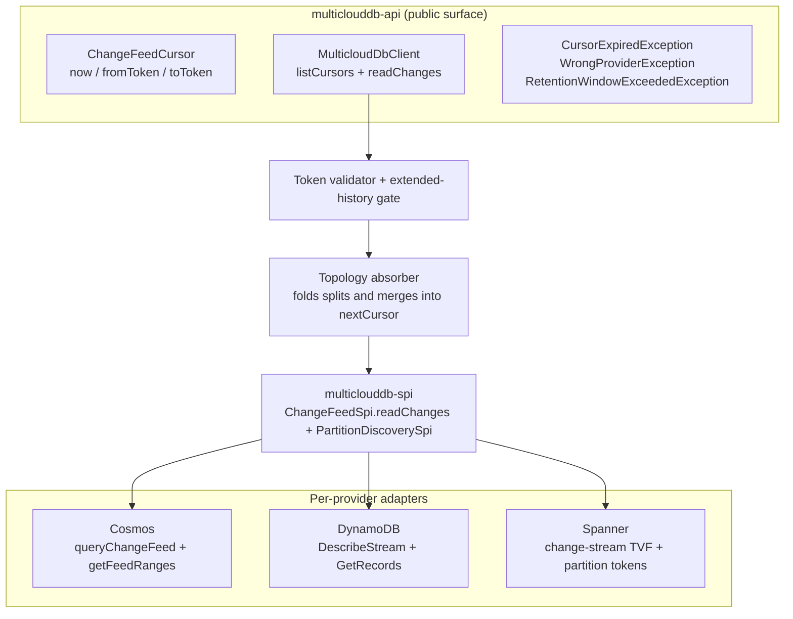
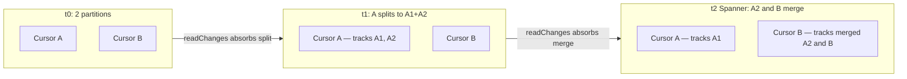

# Scalable Change-Feed API — v1 Design Document

> **Status.** v1 design document, draft for review. v1 ships a **three-primitive pull API** for change feeds — `ChangeFeedCursor`, `listCursors`, `readChanges` — and nothing else on the public surface. Topology changes (split/merge) and provider quirks (trim signals, cursor formats, retention) are hidden behind the cursor. **The SDK does not own parallelism, partition assignment, rebalancing, or checkpoint persistence in v1.** Users compose those on top of the primitives; recommended patterns are in §5.
>
> Aligned with `specs/001-clouddb-sdk/spec.md` for the partition-discovery half of US14 (FR-110) and most of US15 (extended history). Larger divergences from spec PR #83 — SDK-managed parallelism (US14), checkpoint store machinery (FR-157–159), DynamoDB archiver (FR-118), sinks (US21), OpenTelemetry (US22) — are explicit and tracked in §7.
>
> Glossary at the bottom (`CFP`, `KCL`, `Beam`, `SPI`, `TVF`, `PU`, `KDS`, `ACD`).

---

## 1. Overview

### 1.1 Problem statement

Change feeds drive search indexes, materialized views, replication, audit pipelines, and cache invalidation. For an SDK whose value proposition is portability, exposing change feeds across the three managed databases under one API is table-stakes.

Each provider's change-data capture surface is deeply different:

| | **Cosmos DB** | **DynamoDB** | **Spanner** |
|---|---|---|---|
| Native runtime | `ChangeFeedProcessor` (CFP, in-SDK) | KCL + DynamoDB Streams Kinesis Adapter | Apache Beam `SpannerIO.readChangeStream` on Dataflow |
| API style | Push (callback inversion) | Pull (external library) | Job-graph (Beam transforms) |
| Dependency footprint if adopted | Reactor in core | KCL + Kinesis adapter | ~50 MB of Beam |
| Server-side retention | ≤ 30d (continuous backup, min 7d) | **Hard 24h, non-configurable** | Configurable, default 7d, min 1d |
| Partition lifecycle | Split only; surfaces as exception mid-read | Split only; **silent** (empty record + null iterator) | Split *and* merge; in-stream `ChildPartitionsRecord` |
| Trim signal | HTTP 410 | `TrimmedDataAccessException` | gRPC `INVALID_ARGUMENT` |
| Parallel-consumption primitive | Lease container + `ChangeFeedProcessor` | Shard iterators + (optional) KCL coordination | Partition tokens + Beam workers |

A naïve "lowest common denominator" API hides the differences only on paper; in practice every provider quirk leaks through. v1 must surface *one* contract whose every guarantee actually holds on all three.

### 1.2 Goals (v1)

- **One portable pull API** for reading change events across Cosmos, DynamoDB, and Spanner — three primitives only: `ChangeFeedCursor`, `listCursors`, `readChanges`.
- **Cursor-level topology transparency.** `readChanges(...).nextCursor()` self-heals across split and merge — a worker holding a cursor keeps making forward progress without observing the partition lifecycle.
- **Portable, provider-neutral cursor token** (`toToken` / `fromToken`) so users can persist and resume against any store they choose (FR-156).
- **24-hour portable baseline** for cursor age, enforced client-side (FR-115).
- **Extended history opt-in for Cosmos and Spanner** — Cosmos native (ACD mode), Spanner native (`retention_period`) (FR-116, FR-117, FR-119, FR-120). DynamoDB extended history (FR-118) deferred to v1.x.
- **Strict cross-provider parity** for portable contract behavior; capability-gated extensions where providers diverge (FR-114, FR-120).
- **No dependency leaks** — no Reactor, KCL, or Beam reaches the user's classpath.

### 1.3 Out of scope for v1 (deferred to v1.x)

These spec items are intentionally **not** in v1. The SDK exposes the primitives; users compose higher-level behavior on top. Rationale and deferral targets are in §7.

- **SDK-managed parallel consumption** — `ConsumerGroup`, partition assignment, rebalancing, worker lifecycle (the bulk of US14 / FR-109, FR-111–114). v1 satisfies FR-110 partition discovery via `listCursors`; everything above that is user-side. Recommended patterns in §5.
- **Checkpoint persistence machinery** — durable store, restart-resumption orchestration, per-partition checkpoint coordination (FR-157, FR-158, FR-159). v1 ships the portable token only (FR-156 ✓); users persist `cursor.toToken()` themselves.
- **DynamoDB extended history** (FR-118). The SDK-managed archiver that would push DynamoDB Streams events to an external event store is deferred. DynamoDB stays at the 24h baseline in v1; customers needing >24h on DynamoDB use the Kinesis Data Streams native escape (§6).
- **`ChangeFeedSink` abstraction** for forwarding events to external messaging systems (US21, FR-144–148).
- **OpenTelemetry integration** (US22, FR-149–154).

---

## 2. API surface

The entire v1 change-feed surface is three primitives plus a small exception set.

### 2.1 `ChangeFeedCursor`

```java
public final class ChangeFeedCursor {
    public static ChangeFeedCursor now();                 // start at the live tip of the whole address
    public static ChangeFeedCursor fromToken(String t);   // resume from persisted token
    public String toToken();                              // serialize for persistence
}
```

- `now()` — start at the live tip of the entire address; no events before this call are returned. Always valid.
- `fromToken(t)` — resume from a previously persisted SDK token. The token is opaque and provider-tagged; the SDK uses its embedded metadata for the 24-hour age check (§3) and provider-mismatch detection.
- A cursor opaquely represents **one or more partition positions**. Initially a `now()` cursor or a cursor returned by `listCursors` maps to one partition; after a split absorbed inside `readChanges` it may internally track multiple positions (§4.3). Users do not enumerate the positions inside a cursor.

`fromTimestamp(t)` and "from beginning" were rejected: DynamoDB Streams has no timestamp-seek primitive, and "beginning" means different things on each provider.

### 2.2 `listCursors` — partition discovery

```java
public interface MulticloudDbClient {
    List<ChangeFeedCursor> listCursors(Address addr);
    // ...
}
```

Returns one cursor per current partition of the address, each positioned at the live tip. This is the partition-discovery primitive — users distribute the returned cursors across workers or processes for parallel consumption (§5).

- Empty list is valid (an address with no data yet may have zero partitions).
- `listCursors` is idempotent and side-effect-free — it does not allocate persistent ownership or coordination state on the server.
- Re-call `listCursors` periodically to detect topology changes (new cursors after a split, fewer cursors after a merge) so workers can rebalance (§5.5).

### 2.3 `readChanges`

```java
public interface ChangeFeedPage {
    List<ChangeEvent> events();
    ChangeFeedCursor nextCursor();
    boolean hasMore();
}

public interface MulticloudDbClient {
    ChangeFeedPage readChanges(Address addr, ChangeFeedCursor cursor);
    // ...
}
```

Reads one page of events from the position represented by `cursor` and returns the cursor advanced past those events. Users loop on `nextCursor()` to make continuous progress.

- `events()` may be empty — typically when the cursor is at the live tip. The user controls polling cadence.
- `hasMore() == true` indicates the SDK believes more events are immediately available (the page hit its size cap, for example); `false` means the cursor caught up to the tip.
- `nextCursor()` always returns a valid cursor advanced past the returned events, **even when a partition split or merge occurred during this page**. See §4.3 for the cursor self-healing contract.
- A cursor whose partitions have all been absorbed by merges into peers owned by another cursor becomes **terminal**: `readChanges` returns an empty page with `hasMore() == false`, and the user should drop that cursor and re-discover via `listCursors`.

### 2.4 Exceptions

| Exception | Thrown when | User action |
|---|---|---|
| `CursorExpiredException` | `fromToken(t)` age > 24h, or provider-side trim observed | Recover: re-list from `now()`, or enable extended history (§6) |
| `WrongProviderException` | Token from provider X used with provider Y's client | Application bug; do not retry |
| `RetentionWindowExceededException` | Extended history requested without the per-provider gate enabled, or on a provider where it is unsupported (DynamoDB in v1) | Configure extended history (§3.3), or restrict the target set to Cosmos / Spanner |

Transient provider failures (network blips, throttling, retryable HTTP / gRPC codes) are absorbed inside the SDK's transport-layer retry and never reach `readChanges` callers.

---

## 3. Retention contract

### 3.1 The 24-hour portable baseline

> A `fromToken(t)` cursor is readable for up to 24 hours after the SDK last advanced it (FR-115). After 24 hours, `readChanges` throws `CursorExpiredException` *before any service call*. `now()` cursors are always valid at creation.

**Why 24h.** DynamoDB Streams enforces 24h server-side, non-configurable. The SDK cannot offer a longer portable baseline regardless of what Cosmos and Spanner allow. Clamping client-side to 24h is the only way to guarantee uniform expiration on all three.

Server-side reality (internal, not exposed):

| Provider | Server-side cap |
|---|---|
| DynamoDB | **Hard 24h** — set by AWS, no knob |
| Cosmos | ≤ 30d, tied to continuous backup; cannot reduce below 7d |
| Spanner | Configurable, default 7d, min 1d |

DDL is out of scope; the SDK does not configure server-side retention.

### 3.2 Token validation flow

Every `readChanges` call funnels through the same client-side validator before any provider round-trip:

1. **`now()` cursor** — dispatch to the provider directly. Both checks below are skipped.
2. **`fromToken(t)` cursor** — decode the token, then:
   1. **Provider tag check.** Tokens are tagged with their issuing provider. Cross-provider use throws `WrongProviderException` immediately.
   2. **Age check.** If `now() - lastAdvancedAt > 24h` and extended history is not enabled for this provider, throw `CursorExpiredException` *before* the provider call. Expired tokens never reach the network.
3. **Dispatch to the provider.** On the response, if the provider returns a trim error — Cosmos HTTP 410, DynamoDB `TrimmedDataAccessException`, Spanner gRPC `INVALID_ARGUMENT` (with "older than" in the message) — map it to `CursorExpiredException`. Defense in depth covers clock skew.
4. **Success.** Return a `ChangeFeedPage`.

### 3.3 Extended history (Cosmos + Spanner only in v1)

The 24h baseline is the floor. Workloads on **Cosmos or Spanner** that need lookback past 24h — multi-day outage recovery, hydrating a new downstream, replaying days of history — opt in via configuration. There is no builder API; bypassing the portable baseline is a deployment decision, not a coding decision (FR-116, consistent with the SDK's escape-hatch policy).

**DynamoDB is not covered by extended history in v1.** DynamoDB Streams enforces a hard 24h server-side, and the SDK-managed archiver that would push Streams events to an external event store (FR-118) is deferred to v1.x — see §7. DynamoDB workloads that need >24h history in v1 must use the Kinesis Data Streams native escape (§6), outside the portable SDK.

**Enable via configuration — no code change:**

```properties
# multiclouddb.properties
multiclouddb.changeFeed.extendedHistory=enabled
multiclouddb.changeFeed.deleteTracking=enabled    # required for delete events in history (FR-119)
```

Equivalent environment variables work without redeploying:

```bash
export MULTICLOUDDB_CHANGEFEED_EXTENDEDHISTORY=enabled
export MULTICLOUDDB_CHANGEFEED_DELETETRACKING=enabled
```

**Per-provider mechanism (FR-117):**

| Provider | Mechanism | Infrastructure you provide | Performance vs. baseline |
|---|---|---|---|
| **Cosmos DB** | Native change feed in *All Changes and Deletes* (ACD) mode; SDK reads back to container creation or configured retention | None (Cosmos container must be ACD-enabled — a provisioning concern) | Same as baseline |
| **Spanner** | Native change streams with configurable `retention_period` (default 7d, max ≈ data-retention period) | None (Spanner change stream's `retention_period` setting) | Same as baseline |
| **DynamoDB** | **Not supported in v1** — deferred to v1.x (FR-118 archiver). Use the KDS native escape (§6) for >24h history. | n/a in v1 | n/a in v1 |

**What's the same on every supported provider** (cross-provider parity preserved between Cosmos and Spanner):

- Same `ChangeFeedCursor` / `listCursors` / `readChanges` surface — extended-history reads use the existing primitives.
- Same `CursorExpiredException` semantics when data is genuinely gone (Cosmos: bounded by ACD retention; Spanner: bounded by `retention_period`).
- Delete events included on both providers when delete tracking is enabled (FR-119).

**Capability gating.** Extended history is a capability-gated feature (FR-120). The capability manifest declares `EXTENDED_CHANGE_FEED_HISTORY` as supported on **Cosmos and Spanner** in v1; **DynamoDB declares it unsupported**. Enabling `multiclouddb.changeFeed.extendedHistory` on a client whose target set includes DynamoDB fails capability validation per FR-123. Affected applications must either (a) restrict the deployment target to Cosmos/Spanner, (b) use the DynamoDB→KDS native escape outside the portable contract (§6), or (c) wait for the v1.x DynamoDB archiver.

**Observability (v1).** Extended-history reads log `WARN extended-history read (provider=<P>, cursorAge=<duration>)`. Structured metrics (Micrometer / OpenTelemetry) arrive in v1.x — see §7.

---

## 4. Architecture

### 4.1 Module layout

The public API sits in `multiclouddb-api`. Per-provider impls bind to the SPI in `multiclouddb-spi`.



There is **no consumer-group coordinator**, **no checkpoint store**, and **no SDK-side worker pool** in v1. The cursor is the only stateful concept on the read path, and it lives entirely in the caller's process and is persisted by the caller. The SPI seam is the only place per-provider code touches the read path — provider-specific exception types, dependencies, and partition-lifecycle quirks never cross it.

### 4.2 How provider differences are hidden

| Difference | How it's hidden in v1 |
|---|---|
| Provider exception types (`FeedRangeGoneException`, `TrimmedDataAccessException`, `INVALID_ARGUMENT`) | Mapped to `CursorExpiredException` (trim) or absorbed silently (split — see §4.3) |
| Provider cursor formats (continuation tokens vs. sequence numbers vs. partition tokens) | Wrapped in an opaque, provider-tagged token. `toToken()` / `fromToken()` work everywhere |
| Provider partition lifecycle (split-only vs. split-and-merge; exception vs. silent vs. in-stream) | Detected inside each adapter; the *next* cursor encodes the post-event topology |
| Provider retention windows | Clamped to 24h client-side; extended history opt-in for Cosmos and Spanner only in v1 (§3.3). DynamoDB stays at the 24h cap in v1. |
| Provider parallel-consumption primitives (Cosmos feed ranges / DynamoDB shards / Spanner partition tokens) | Hidden inside opaque cursors returned by `listCursors`; users compose parallelism (§5) |
| Provider transport (HTTPS, AWS SDK, gRPC) | Standard retry on transient codes; never visible to the caller |
| Provider dependencies (Reactor, KCL, Beam) | Confined to their respective `multiclouddb-provider-*` modules |

### 4.3 Partition transparency (cursor self-healing)

Each provider's partition lifecycle is genuinely different — different shape, different signal, different recovery:

| Event | Cosmos | DynamoDB | Spanner |
|---|---|---|---|
| **Split (1 → N)** | Thrown `FeedRangeGoneException` mid-pagination | **Silent**: closed shard returns empty records + null next iterator | In-stream `ChildPartitionsRecord` with `parents.size == 1` |
| **Merge (N → 1)** | ❌ Not possible — split-only | ❌ Not possible — split-only | In-stream `ChildPartitionsRecord` with `parents.size > 1` (same child token appears on every parent) |
| **Child discovery** | Diff `container.getFeedRanges()` against parent's range | `DescribeStream(ShardFilter=CHILD_SHARDS)`; up to ~30s propagation delay | Immediate (in-stream record) |
| **Child-cursor start** | Begin where parent left off (continuation tokens fork cleanly) | Begin at shard `TRIM_HORIZON` | `start_timestamp` from the child record |

**The cursor self-healing contract.** All of the above is absorbed inside `readChanges`. The user never observes provider-specific lifecycle events; they only observe their cursor advancing or going terminal.

- **On split.** A cursor that maps to a partition undergoing a split is internally extended to track its child partition(s). `nextCursor` is still a single opaque cursor — it now holds 1-to-N child positions. Subsequent `readChanges(nextCursor)` calls serve events from all children, in parent-before-child order. No exception, no silent gap, no orphaned shard.
- **On merge** (Spanner only). Multiple cursors that map to parent partitions of a single merged child would otherwise serve the same events. To prevent double-processing, the SDK awards the merged child position to exactly one parent cursor's `nextCursor` (deterministic first-claim by partition-token ordering). The remaining parents' `nextCursor` is **terminal** — the next `readChanges` returns an empty page with `hasMore() == false` and no exception. The user drops the terminal cursor and re-discovers via `listCursors`.



**Two properties that matter for parallel users.**

- **`lastAdvancedAt` is `min` across the cursor's internal positions.** The slowest internal position determines the cursor's age; a fast position cannot silently extend the 24h window past a stuck partition.
- **Re-discovery is the user's choice.** Self-healing keeps existing workers correct. Calling `listCursors` again is how the user *gains parallelism* after a split (one cursor now covers two children — a re-discovery gives two cursors to distribute) or *frees workers* after a merge (a terminal cursor signals "this worker is done"). The SDK forces neither.

---

## 5. Multi-thread patterns (user-side)

Parallelism, checkpoint persistence, and process coordination are the **user's responsibility** in v1. This section catalogs the patterns we recommend you build on top of the 3 primitives. The same primitives serve every case from a single-thread backfill to a multi-process leader-elected cluster.

> **Persist after processing.** Every pattern follows the same rule: do work, then persist `cursor.toToken()`, then loop. Persisting before processing risks losing events on crash; persisting after is the at-least-once contract (FR-155).

### 5.1 Single-thread baseline

For one-off jobs, dev environments, low-volume backfills, or prototyping. A single cursor traverses the whole address; topology changes are absorbed inside `readChanges`; persistence is one token.

```java
ChangeFeedCursor cursor = loadSavedToken()
    .map(ChangeFeedCursor::fromToken)
    .orElseGet(ChangeFeedCursor::now);

while (running) {
    try {
        ChangeFeedPage page = client.readChanges(addr, cursor);
        process(page.events());
        cursor = page.nextCursor();
        persist(cursor.toToken());
        if (!page.hasMore()) backoff();                   // back off when caught up
    } catch (CursorExpiredException e) {
        cursor = recover(e);                              // see §6
    }
}
```

The downstream is usually the bottleneck. Move to §5.2 only when one thread cannot keep up.

### 5.2 In-process worker pool — one worker per cursor

For higher throughput on a single process. Discover cursors, hand each to its own worker, persist a token per cursor.

```java
// On startup, prefer resuming persisted tokens over fresh listCursors.
// Fall back to listCursors() only for cursor identities with no saved token.
List<ChangeFeedCursor> initial = resumeOrDiscover(client, addr);

ExecutorService pool = Executors.newFixedThreadPool(initial.size());
for (ChangeFeedCursor start : initial) {
    final String identity = cursorIdentity(start);        // stable key for persistence
    pool.submit(() -> {
        ChangeFeedCursor cursor = start;
        while (running) {
            try {
                ChangeFeedPage page = client.readChanges(addr, cursor);
                process(page.events());
                cursor = page.nextCursor();
                persist(identity, cursor.toToken());
                if (page.events().isEmpty() && !page.hasMore()) {
                    if (isTerminal(page)) {               // post-merge: cursor done
                        clearPersisted(identity);
                        return;
                    }
                    backoff();                            // caught up to tip
                }
            } catch (CursorExpiredException e) {
                cursor = recover(e);
            }
        }
    });
}
```

**Notes.** Each worker only sees forward progress on its own cursor. Split absorption keeps it busy with more events (one cursor now covers N children — see §5.5 to gain parallelism). Merge absorption may make the cursor terminal; the worker exits. To detect new cursors after a split, run §5.5 from a separate thread.

### 5.3 Multi-process leader-elected (app-level coordination)

For HA across processes. App-level leader election decides which process owns which cursor. The SDK is unchanged from §5.2 — the user supplies the leader-election primitive (ZooKeeper, etcd, Postgres advisory locks, a coordination table the user maintains, etc.):

```java
while (running) {
    if (!leaderLock.tryAcquire(leaseTtl)) {
        sleep(jitter(leaseTtl / 3));
        continue;
    }
    try {
        List<ChangeFeedCursor> mine = assignedCursors(myMemberId);
        runWorkerPool(mine);                              // §5.2 body
    } finally {
        leaderLock.release();
    }
}
```

The SDK provides no coordination — but `listCursors` + `toToken` / `fromToken` are the only primitives needed to wire against any existing coordinator. The user owns the partition-to-member assignment policy, member health checks, lease renewal, and rebalancing on join/leave.

### 5.4 In-page parallelism — fan out by key inside one cursor

When a single thread can't keep up with one cursor's page, fan events out across worker threads inside the loop, grouped by primary key so per-key ordering holds. Block until all workers finish before advancing the cursor — otherwise an early-returned page would persist out-of-order progress.

```java
ExecutorService workers = Executors.newFixedThreadPool(N);

while (running) {
    ChangeFeedPage page = client.readChanges(addr, cursor);

    Map<String, List<ChangeEvent>> byKey = page.events().stream()
        .collect(Collectors.groupingBy(
            ChangeEvent::primaryKey, LinkedHashMap::new, Collectors.toList()));

    List<CompletableFuture<Void>> futures = byKey.values().stream()
        .map(group -> CompletableFuture.runAsync(() -> processInOrder(group), workers))
        .toList();

    // CRITICAL: block until ALL workers finish before advancing or persisting.
    CompletableFuture.allOf(futures.toArray(new CompletableFuture[0])).join();

    cursor = page.nextCursor();
    persist(cursor.toToken());
}
```

**Trade-offs.** Parallelism is bounded by per-key diversity within a page; the slowest worker per page paces the checkpoint; a thrown exception re-delivers the whole page (downstream must be idempotent by primary key).

### 5.5 Topology re-discovery (rebalancing)

After a split the holding cursor self-heals — one worker now serves N children. That preserves correctness but loses the parallelism opportunity. After a merge, one cursor goes terminal — one worker becomes idle. Both events change the optimal worker-to-cursor ratio. To rebalance:

```java
// Run on a separate scheduled thread, e.g. every 60 seconds.
List<ChangeFeedCursor> current = client.listCursors(addr);

Set<String> currentIds = current.stream()
    .map(this::cursorIdentity).collect(toSet());

Set<String> inFlightIds = workersByIdentity.keySet();

// New cursors after a split — spawn workers using listCursors positions
// (you cannot derive child positions from a parent token).
for (ChangeFeedCursor c : current) {
    if (!inFlightIds.contains(cursorIdentity(c))) spawnWorker(c);
}

// Cursors gone after a merge — workers will see terminal pages and exit on their own.
// Optionally pre-signal them to exit faster.
for (String stale : Sets.difference(inFlightIds, currentIds)) {
    signalExit(stale);
}
```

Re-discovery is cheap (`listCursors` is idempotent and side-effect-free) and the only cost knob is your polling interval. A minute is plenty for most workloads.

### 5.6 Common pitfalls

- **Persist after processing.** Persisting before `process()` returns risks losing events on crash. The clean return is the at-least-once contract.
- **Downstream idempotency by primary key.** At-least-once is the universal lower bound on all three providers; the same event may be delivered more than once across crashes, retries, and rebalances.
- **Don't share one cursor across threads.** Each cursor is single-owner; concurrent `readChanges` calls on the same cursor have undefined ordering and waste throughput. Use §5.4 to parallelize *within* a cursor instead.
- **Don't conflate "terminal cursor" with "expired cursor".** A terminal cursor (post-merge) returns an empty page with `hasMore() == false` and no exception — drop it and re-list. An expired cursor throws `CursorExpiredException` — recover per §6.
- **Pick polling cadence by event rate, not by hope.** `readChanges` is a pull primitive; tight loops on idle cursors burn cost. Back off when `events().isEmpty() && !hasMore()`.
- **Use stable cursor identities for persistence keys.** Persist tokens keyed by a stable identity (the provider-tagged partition prefix is one option). When you re-list, match new cursors against your saved tokens by that identity so you resume rather than restart.
- **Monitor cursor age client-side.** v1 does not expose a structured metric for cursor age — that arrives with OTel in v1.x (§7). Until then, stamp `System.currentTimeMillis()` alongside any token you persist and alert when the oldest token age approaches 18h.

---

## 6. Beyond extended history

Extended history (§3.3) covers up to provider-side retention: **Cosmos ≤ 30d** and **Spanner up to your `retention_period`**. **DynamoDB is not covered by extended history in v1 — the 24h cap remains** until the v1.x archiver lands (§7). For workloads that need to reach back further — or that want a non-portable native escape — these are the practical patterns:

| Strategy | What you recover | What you lose | Portability |
|---|---|---|---|
| **Extended history (§3.3)** | Cosmos: ≤ 30d; Spanner: `retention_period`; **DynamoDB: not supported in v1** | Bounded by provider retention; DynamoDB unavailable until v1.x | ✅ Portable contract on Cosmos + Spanner; capability-gated |
| **Re-snapshot + resume from `now()`** | Current state of every row | The *events* during the gap | ✅ All three providers, no flag |
| **Drop to the provider-native SDK** | Native retention (Cosmos: container lifetime; Spanner: ≤ 7d; DynamoDB: ≤ 365d via KDS *if* enabled before the event) | Nothing within native retention | ❌ Provider-specific; outside the portable SDK |

**Recommendations by workload pattern.**

- **Disaster recovery after a multi-day outage.** On Cosmos or Spanner, enable extended history if your provider configuration supports the lookback window; otherwise re-snapshot + resume from `now()`. **On DynamoDB, the only options in v1 are (a) re-snapshot + resume, or (b) the Kinesis Data Streams native escape if you enabled it before the event.**
- **Backfill / hydration of a new downstream.** Bootstrap from a snapshot, then attach `now()`. Replaying history is rarely the right tool; backfill is.
- **Compliance / audit with ≥ days of history.** On Cosmos/Spanner, enable extended history with delete tracking. **On DynamoDB in v1, route to your own audit pipeline at write time** (e.g., a sink your application maintains over the §5 patterns), or wait for the v1.x DynamoDB archiver.
- **Anticipating long-window replay on DynamoDB beyond 24h.** Enable Kinesis Data Streams integration *before* the event you want to replay (KDS retention is configurable up to 365d). This is the only path to >24h DynamoDB history in v1, and it is a provider-native escape — outside the portable SDK.
- **Reducing time-to-recover.** Each pattern in §5 persists `cursor.toToken()` after every successful page. Stamp `System.currentTimeMillis()` alongside the saved token and alert when the oldest token approaches ~18h; structured OTel cursor-age metrics arrive in v1.x (§7).

---

## 7. Spec divergence summary (v1 vs. spec PR #83)

These divergences from spec PR #83 are explicit; each is deferred to a v1.x release rather than rejected outright. The PR review should resolve whether to amend the spec to mark these as v1.x targets or to expand v1 scope to include them.

| Spec item | v1 status | Reason | v1.x target |
|---|---|---|---|
| **US14 / FR-109, FR-111–114** — SDK-managed parallel consumption (`ConsumerGroup`, dynamic/static assignment, rebalancing, per-provider mapping) | Deferred — SDK exposes the partition-discovery primitive (`listCursors`, satisfying FR-110) and per-cursor read. Users compose parallelism; §5 documents the recommended patterns. | A `ConsumerGroup` requires committing to a coordination store (overlaps with FR-157), a partition-assignment algorithm, a rebalancing protocol, and a worker lifecycle model. Each has multiple defensible choices that should be informed by user feedback on the primitive surface first. We don't have a working SDK yet — shipping these decisions blind risks the wrong shape. | v1.2 — once external `CheckpointStore` and `ChangeFeedSink` shapes settle, layer a `ConsumerGroup` on top of the same coordination store. |
| **FR-157 / FR-158 / FR-159** — Checkpoint persistence machinery (durable store, restart-resumption orchestration, per-partition coordination) | Deferred — v1 ships only the portable token (FR-156 ✓). Users persist `cursor.toToken()` themselves and resume via `fromToken(t)`. | A `CheckpointStore` SPI without at least two real impls (same-DB + external) risks the wrong shape. Persisting one token per cursor is trivial for users (a row keyed by cursor identity). Shipping the user-side pattern first lets the SPI shape emerge from real usage. | v1.1 — same-DB `CheckpointStore` default + one external impl (Redis or a dedicated table); v1.2 ties it to `ConsumerGroup`. |
| **FR-118** — DynamoDB extended history (SDK-managed archiver) | Deferred — DynamoDB declares `EXTENDED_CHANGE_FEED_HISTORY` as `false` in v1 | Effectively a small distributed system (long-running consumer, lag tracking, retries, external event-store provisioning). Heavy overlap with the deferred `ChangeFeedSink` (US21) — schema, ordering, and replay semantics are decisions both should share. Best shipped together with US21. | v1.1 — ship the archiver alongside the public `ChangeFeedSink` interface. |
| **US21 / FR-144–148** — `ChangeFeedSink` abstraction | Deferred | Public sink shape is hard to lock in without real-world usage. A user-side wrapper over `readChanges` works in the interim. | v1.1 — jointly with FR-118. |
| **US22 / FR-149–154** — OpenTelemetry integration | Deferred | Config-only and additive — can land in any minor release without changing the public API. v1 ships with structured logs and a small Micrometer counter set. | v1.1 — `multiclouddb-otel` optional artifact with the span and metric inventory from spec FR-150/151. |

**What v1 still satisfies from these user stories.**

- FR-110 ✓ (partition discovery — `listCursors` returns one cursor per current partition).
- FR-115 ✓ (24h portable baseline, enforced client-side).
- FR-116 ✓ (extended history opt-in by config, not code, on supported providers).
- FR-117 ✓ (Cosmos ACD and Spanner native `retention_period` mechanisms).
- FR-119 ✓ (delete events when delete tracking is enabled, on Cosmos and Spanner).
- FR-120 ✓ (capability-gated — DynamoDB declares `EXTENDED_CHANGE_FEED_HISTORY` as unsupported in v1).
- FR-155 ✓ (at-least-once delivery — every user pattern in §5 follows the process-then-persist rule).
- FR-156 ✓ (portable checkpoint tokens via `toToken` / `fromToken`).

The remaining gaps (US14 ConsumerGroup machinery, FR-118 DynamoDB archiver, FR-144–148 sinks, FR-149–154 OTel, FR-157/158/159 SDK-managed checkpoint store) are tracked in the v1.x backlog above.

---

## 8. Glossary

| Term | Expansion |
|---|---|
| **ACD** | "All Changes and Deletes" — the Cosmos DB change-feed mode used for extended history (exposes intermediate versions and deletes). |
| **CFP** | `ChangeFeedProcessor` — Cosmos DB's in-SDK push-based change-feed runtime. |
| **KCL** | [Amazon Kinesis Client Library](https://docs.aws.amazon.com/streams/latest/dev/shared-throughput-kcl-consumers.html) — the recommended consumer for DynamoDB Streams (via the Kinesis Adapter). |
| **Beam** | [Apache Beam](https://beam.apache.org/) — the framework Spanner change streams are read through (`SpannerIO.readChangeStream`). |
| **SPI** | Service Provider Interface — the internal seam between `multiclouddb-api` and per-provider impls. |
| **TVF** | Table-Valued Function — Spanner change streams are queried as TVFs. |
| **PU** | Processing Unit — Spanner's capacity unit; 1 PU is the minimum for a database. |
| **KDS** | Kinesis Data Streams — AWS's general-purpose stream service; DynamoDB can optionally tee Streams to KDS for ≤ 365-day retention. |

---

## 9. References

- **Spec**: `specs/001-clouddb-sdk/spec.md` — US14 (parallelism, P0), US15 (extended history, P0). v1 covers FR-110, FR-115–117, FR-119–120, FR-155, FR-156; SC-043–047.
- **Spec deferrals (see §7)**: US14 `ConsumerGroup` machinery (FR-109, FR-111–114), FR-118 (DynamoDB extended history archiver), US21 sinks (FR-144–148), US22 OpenTelemetry (FR-149–154), US23 checkpoint-store machinery (FR-157, FR-158, FR-159).
- **Cosmos DB**
  - [Change feed modes](https://learn.microsoft.com/azure/cosmos-db/nosql/change-feed-modes)
  - [Change feed processor](https://learn.microsoft.com/azure/cosmos-db/nosql/change-feed-processor)
- **DynamoDB**
  - [DynamoDB Streams](https://docs.aws.amazon.com/amazondynamodb/latest/developerguide/Streams.html)
  - [Streams KCL adapter walkthrough](https://docs.aws.amazon.com/amazondynamodb/latest/developerguide/Streams.KCLAdapter.html)
  - [Low-level Streams API walkthrough](https://docs.aws.amazon.com/amazondynamodb/latest/developerguide/Streams.LowLevel.Walkthrough.html)
- **Spanner**
  - [Change streams](https://cloud.google.com/spanner/docs/change-streams)
  - [Manage change streams](https://cloud.google.com/spanner/docs/change-streams/manage)
  - [Use change streams with Dataflow](https://cloud.google.com/spanner/docs/change-streams/use-dataflow)
