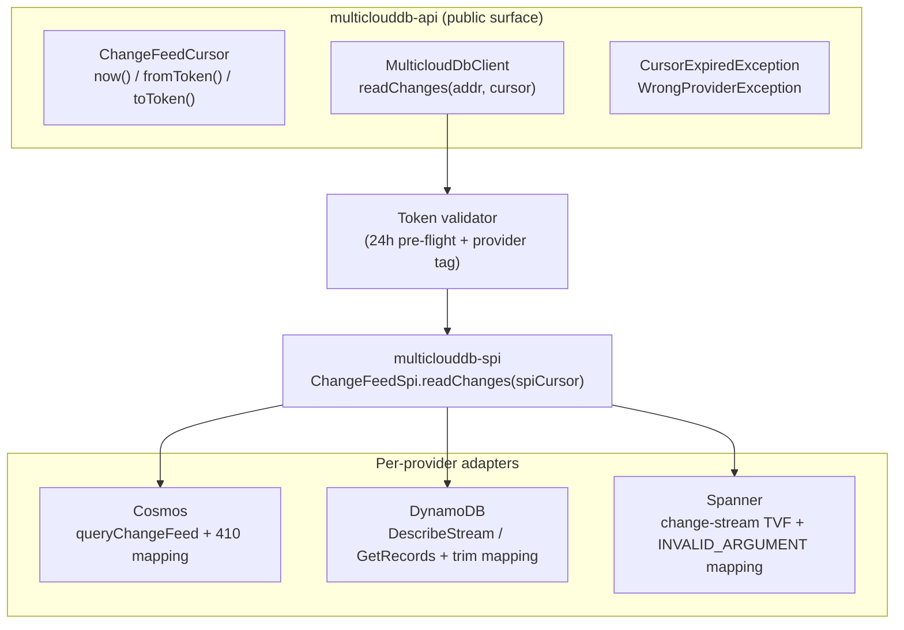
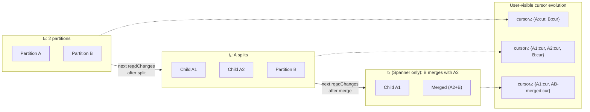

# Scalable Change-Feed API — v1 Design Document

> **Status.** v1 design document, draft for review. The API exposes one
> portable change-feed contract over Cosmos DB, DynamoDB, and Spanner.
> Glossary at the bottom (`DDB`, `CFP`, `KCL`, `Beam`, `SPI`).

---

## 1. Overview

### 1.1 Problem statement

Change feeds are how operational data flows into downstream systems — search indexes, materialized views, cross-region replication, audit pipelines, cache invalidation. For an SDK whose value proposition is database portability, exposing change feeds across the three managed databases under one API is table-stakes.

The hard part is that each provider exposes change-data capture through deeply different surfaces:

| | **Cosmos DB** (DDB stands for *Document DB*, marketing name *Cosmos*) | **DynamoDB** | **Spanner** |
|---|---|---|---|
| Native runtime | `ChangeFeedProcessor` (CFP, in-SDK) | Kinesis Client Library (KCL) + DynamoDB Streams Kinesis Adapter | Apache Beam `SpannerIO.readChangeStream` on Dataflow |
| API style | Push (callback inversion) | Pull (external library) | Job-graph (Beam transforms) |
| Dependency footprint if adopted | Reactor in core | KCL + Kinesis adapter | ~50 MB of Beam |
| Server-side retention | None (bounded by item lifetime) | **Hard 24h, non-configurable** | Configurable, default 7 days, min 1 day |
| Partition lifecycle | Split only; surfaces as exception mid-read | Split only; **silent** (empty record + null iterator) | Split *and* merge; in-stream `ChildPartitionsRecord` |
| Trim signal | HTTP 410 | `TrimmedDataAccessException` | gRPC `INVALID_ARGUMENT` |

A naïve "lowest common denominator" API hides the differences only on paper; in practice every provider-specific behavior leaks through (silent shard close on DynamoDB, ≥ 1 PU separate metadata DB cost on Spanner, Reactor on Cosmos). v1 must surface *one* contract whose every guarantee actually holds on all three.

### 1.2 Goals

- **One portable API** for reading change events across Cosmos, DynamoDB, and Spanner.
- **Strict cross-provider parity** — any behavior that cannot be guaranteed identically on all three is excluded from v1.
- **Minimal v1 surface** — one read method, two cursor factories, two public exceptions. Nothing else.
- **No runtime-dependency leaks** — no Reactor, KCL, or Beam reaches the user's classpath.
- **Predictable retention** — single uniform 24-hour token-age contract, enforced client-side.
- **Forward-compatible** — v1 must not block lease coordination, push wrappers, or scaling helpers in v2.

### 1.3 Non-goals (v1)

The following are explicitly **not** in v1. Each maps to a future extension in §10.

- Built-in lease coordination / managed multi-host scaling.
- Push / callback-based consumer model.
- Cursors that start "from the beginning" or at an arbitrary wall-clock timestamp.
- A multi-thread, single-process processor helper.
- Partition enumeration in the public API.
- Cross-partition global ordering (a universal provider limitation; not solvable in the SDK).
- Exactly-once or at-most-once delivery (all three providers are at-least-once natively).

---

## 2. Design principles

Invariants every later section is judged against. Trade-offs that violate any are flagged in §9.

1. **Portability** — every public behavior must be identical on Cosmos, DynamoDB, and Spanner. Anything that can't ship on all three doesn't ship.
2. **Minimalism (lean v1)** — the smallest API surface that solves the core problem; complexity must be earned by user feedback, not anticipated.
3. **Uniform behavior** — same call, same result, same exception type on every provider. No provider-specific error catalog reaches user code.
4. **No dependency leaks** — no Reactor, KCL, or Beam on the user classpath.
5. **Forward compatibility** — v1 design must remain compatible with the v2 extensions (lease coordination, push, partition enumeration) without breaking the v1 surface.

**Questions for the review.**

- Is "all-three-or-nothing" too strict for v1? Would a single capability flag (`UNSUPPORTED_CAPABILITY`) for narrowly justified exceptions weaken or strengthen the contract?
- Should "uniform observability" be a separate principle (metrics, logs, tracing names identical across providers), or is that covered by *uniform behavior*?
- Is "no dependency leaks" really binary, or is there a tier of allowed leaks (e.g., slf4j-api yes, Reactor no)?

---

## 3. API surface

Three public types, one method. That is the entire v1 surface.

### 3.1 Cursor model

```java
public final class ChangeFeedCursor {
    public static ChangeFeedCursor now();                 // start at tip
    public static ChangeFeedCursor fromToken(String t);   // resume from persisted token
    public String toToken();                              // serialize for persistence
}
```

**Only two factories.** Both have identical semantics on every provider.

- `now()` — start reading from the live tip; no events before this call are returned. Always valid.
- `fromToken(t)` — resume from a token previously returned by the SDK. The token is opaque, provider-tagged internally, and carries the metadata the SDK needs for the 24-hour age check (§4) and provider-mismatch detection.

**`now()` and `fromToken()` are the only ways to construct a cursor in v1.** A third factory `fromTimestamp(t)` was considered and rejected (§9.1) because DynamoDB Streams has no timestamp-seek primitive. A "from beginning" factory was rejected for the same reason — "beginning" means different things on each provider.

### 3.2 The read method

```java
public interface ChangeFeedPage {
    List<ChangeEvent> events();
    ChangeFeedCursor nextCursor();
    boolean hasMore();
}

// The single entry point:
ChangeFeedPage page = client.readChanges(addr, cursor);
```

`readChanges(addr, cursor)` returns one page of events and the next cursor. That's it. No `ChangeFeedRequest` builder, no options object in v1 — keep the surface as small as possible. Per-call options (page size hint, polling timeout) are deferred until proven necessary.

### 3.3 Expected usage patterns

**Fresh consumer going live.**

```java
ChangeFeedCursor cursor = ChangeFeedCursor.now();
while (running) {
    ChangeFeedPage page = client.readChanges(addr, cursor);
    process(page.events());
    cursor = page.nextCursor();
    persist(cursor.toToken());
}
```

**Resuming after restart.**

```java
ChangeFeedCursor cursor = loadSavedToken()
    .map(ChangeFeedCursor::fromToken)
    .orElseGet(ChangeFeedCursor::now);

while (running) {
    try {
        ChangeFeedPage page = client.readChanges(addr, cursor);
        process(page.events());
        cursor = page.nextCursor();
        persist(cursor.toToken());
    } catch (CursorExpiredException e) {
        // Recovery — see §9.3.
    }
}
```

**Public exceptions** (the entire v1 catalog):

| Exception | Thrown when | User action |
|---|---|---|
| `CursorExpiredException` | `fromToken(t)` cursor's age exceeds the 24-hour contract, or provider-side trim is observed. | Recovery — typically re-snapshot the source and resume from `now()` (see §9.3). |
| `WrongProviderException` | A token from one provider is used with another provider's client. | Application bug; do not retry. |

Transient provider failures (network blips, throttling, retryable HTTP / gRPC codes) are absorbed inside the SDK's transport-layer retry. They never reach `readChanges` callers in v1.

**Questions for the review.**

- Should `readChanges` accept an options object from day one (page-size hint, poll timeout) to avoid a v1 → v2 signature change, or does that violate minimalism?
- Two factories on `ChangeFeedCursor` cover "live" and "resume." Is there a third user need we're missing that doesn't reduce to those?

---

## 4. Retention & token handling

### 4.1 The 24-hour portable contract

> A `fromToken(t)` cursor is readable for up to 24 hours after the SDK last advanced it. After 24 hours, `readChanges` throws `CursorExpiredException` *before any service call*. `now()` cursors are always valid at creation.

Why 24h: it is the **lowest common denominator** across the three providers. DynamoDB Streams enforces 24h server-side, non-configurable; the SDK cannot offer "longer than 24h" portably regardless of what Cosmos and Spanner allow. Clamping client-side to 24h is the only way to guarantee uniform expiration semantics.

### 4.2 Server-side reality (internal, not exposed)

| Provider | Server-side cap | Notes |
|---|---|---|
| DynamoDB | **Hard 24h** | Set by AWS, no knob. Approximation `TRIM_HORIZON` ≈ 24h with GC-timing jitter. |
| Cosmos (latest-version mode) | None | Bounded only by item lifetime in the container. |
| Cosmos (all-versions-and-deletes, preview) | Tied to continuous backup (7–30 days) | Cannot reduce below 7 days. |
| Spanner | Configurable, default 7d, min 1d | `CREATE/ALTER CHANGE STREAM ... OPTIONS (retention_period = '1d')`. |

The SDK does not manage server-side retention; DDL is out of scope. The portable 24h contract is enforced client-side regardless of what the server allows.

### 4.3 Token validation flow

Every `readChanges` call funnels through the same client-side validator before any provider round-trip:

```mermaid
flowchart TD
    A["readChanges(addr, cursor) called"] --> B{cursor type?}
    B -->|now()| Z["dispatch to provider"]
    B -->|fromToken(t)| C["decode token<br/>(opaque, provider-tagged)"]
    C --> D{"provider tag<br/>matches client?"}
    D -->|no| W1["throw WrongProviderException"]
    D -->|yes| E{"(now - lastAdvancedAt)<br/>< 24h?"}
    E -->|no| W2["throw CursorExpiredException<br/>(no service call)"]
    E -->|yes| Z
    Z --> F{"provider returns<br/>trim error?"}
    F -->|yes<br/>(defense in depth)| W2
    F -->|no| G["return ChangeFeedPage"]
```

Two checks, in order:

1. **Provider tag match.** Tokens are tagged with their issuing provider. Cross-provider use throws `WrongProviderException` immediately.
2. **Age check.** If `now() - lastAdvancedAt > 24h`, throw `CursorExpiredException` *before* the provider call. This is the **client-side rejection** mandate: expired tokens never reach the network.

**Defense in depth.** Each SPI impl also maps server-side trim errors — Cosmos HTTP 410, DynamoDB `TrimmedDataAccessException`, Spanner gRPC `INVALID_ARGUMENT` (with "older than" in the message) — to the same `CursorExpiredException`. This covers clock skew, unexpected early trim, and (importantly) any case where the escape hatch (§4.4) is enabled but the data is genuinely gone server-side.

### 4.4 Escape hatch (controlled override)

Some workloads legitimately need to read older data — recovering from a multi-day consumer outage, hydrating a new downstream from a Spanner stream with `retention_period = '7d'`, debugging a one-off issue against Cosmos's months of history. v1 provides a **single controlled override** that bypasses the client-side 24h check.

**Two equivalent ways to enable it:**

```java
// At client construction:
MulticloudDbClient client = MulticloudDbClient.builder()
    .provider(...)
    .extendedRetention(ExtendedRetention.allow())
    .build();
```

```bash
# Environment variable (overrides builder default if unset):
export MULTICLOUDDB_EXTENDED_RETENTION=allow
```

**What the override changes.** Exactly one thing: the client-side age pre-flight in §4.3 is skipped. Everything else stays the same:

- The provider call still happens; server-side trim is still detected and surfaced as `CursorExpiredException`.
- DynamoDB still fails at 24h. The escape hatch does not unlock DynamoDB; it cannot.
- Cosmos and Spanner serve older data up to their own retention limits.

**What the override emits (always):**

- **WARN log on every `readChanges` call:** `extended-retention enabled; portable 24h contract bypassed (provider=<P>, cursorAge=<duration>)`. Single line, no rate-limiting in v1 — visibility is the whole point.
- **Metric:** `change_feed.extended_retention_calls_total{provider}` increments per call.

**Why a single global flag (per client / per env), not per-call:**

- Per-call would normalize the override into everyday code paths.
- A client-build-time flag is a deliberate operational choice, surfaced once and reviewed.
- The env var allows ops to flip the switch without code change for emergencies.

**Risks (documented in javadoc *and* `docs/configuration.md`):**

- **Behavior is no longer uniform across providers.** Code that depends on > 24h lookback is not portable to DynamoDB and will throw `CursorExpiredException` there.
- The flag does **not** mean "tokens never expire" — provider-side retention still applies. Cosmos: bounded by item lifetime. Spanner: `retention_period` (default 7d, max 7d on the change stream).
- Once enabled at client build, applies to **every** `readChanges` call on that client. There is no per-call disable.
- Existing observability stack must surface the WARN log and the metric, or the operational signal is lost.

**Questions for the review.**

- Single global flag vs. per-call `ExtendedRetention` parameter on `readChanges` — does per-call give too much rope, or does global hide the user's intent?
- WARN-per-call vs. WARN-once-per-client-lifecycle: noisy logs vs. silent normalization. Where is the right line?
- Should the env var require a non-trivial value (e.g., `MULTICLOUDDB_EXTENDED_RETENTION=I_ACCEPT_NON_PORTABLE_BEHAVIOR`) to prevent accidental enablement in production?
- Is 24h the right number, or should v1 set it lower (e.g., 12h) to give a safety margin for clock skew and slow consumers?

---

## 5. Architecture

### 5.1 Module layout

Three modules, plus the SPI seam. The public API sits in `multiclouddb-api`; per-provider impls bind to the SPI in `multiclouddb-spi`.



*All public types live in `multiclouddb-api`. The SPI seam (`ChangeFeedSpi`) is the only place per-provider code touches the read path. Provider-specific exception types, dependencies, and partition lifecycle quirks never cross this seam.*

### 5.2 Internal abstractions

Four internal building blocks; none are public in v1.

| Abstraction | Responsibility |
|---|---|
| **Opaque cursor token** | Wire format the SDK emits via `toToken()` and consumes via `fromToken()`. Provider-tagged. Carries the metadata the validator needs (`provider`, `lastAdvancedAt`) plus a provider-specific payload (Cosmos: `{feedRangeList, continuationTokens}`; DynamoDB: `{shardId, sequenceNumber}` list; Spanner: `{partitionTokenList, lastReadTimestamps}`). User sees only an opaque string. |
| **Token validator** | Client-side pre-flight (§4.3). Single code path for both `now()` and `fromToken()` callers; `now()` skips both checks. |
| **Provider adapter** | Implements `ChangeFeedSpi.readChanges`. Does three things: translate the SDK-internal cursor payload to the provider's native iterator/query, drive one page of reads, and map provider-side errors to the portable exception catalog. |
| **Partition transparency layer** | Inside each provider adapter — detects split/merge from the provider's native signal (exception, empty record, in-stream record) and absorbs it into the *next* cursor. Detail in §6. |

### 5.3 How provider differences are hidden

| Difference | How it's hidden in v1 |
|---|---|
| Provider-specific exception types (`FeedRangeGoneException`, `TrimmedDataAccessException`, `INVALID_ARGUMENT`) | Mapped to `CursorExpiredException` (trim) or absorbed silently (split — see §6). |
| Provider-specific cursor formats (continuation tokens vs. sequence numbers vs. partition tokens) | Wrapped in the opaque token with a provider tag. User-side `toToken()`/`fromToken()` work everywhere. |
| Provider-specific partition lifecycle (split-only vs. split-and-merge; exception vs. silent vs. in-stream) | Detected inside each adapter; the *next* cursor encodes the post-event topology. User sees one cursor advance. |
| Provider-specific retention windows (none, 24h, configurable) | Clamped to 24h client-side. Escape hatch is the only documented bypass (§4.4). |
| Provider-specific transport (HTTPS, AWS SDK, gRPC) | Inside each adapter; standard retry on transient codes. |
| Provider-specific dependencies (Reactor, KCL, Beam) | Confined to their respective `multiclouddb-provider-*` modules. None reach `multiclouddb-api`. |

**Questions for the review.**

- Should `MulticloudDbClient.readChanges` go through a single in-process validator-as-a-component (testable in isolation), or be inlined in the client (smaller blast radius)?
- The opaque token carries enough metadata to validate without a server call — should the wire format be versioned from day one (`v1:cosmos:<payload>`) to allow future evolution?
- One SPI method (`readChanges`) is the v1 SPI surface. Is that the right granularity, or should partition transparency live behind its own SPI method (`describeTopology`) the adapter calls internally?

---

## 6. Partition transparency

### 6.1 The problem

Each provider's partition lifecycle is genuinely different — different shape, different signal, different recovery:

| Event | Cosmos | DynamoDB | Spanner |
|---|---|---|---|
| **Split (1 → N)** | Thrown `FeedRangeGoneException` mid-pagination | **Silent**: closed shard returns empty records + null next iterator | In-stream `ChildPartitionsRecord` with `parents.size == 1` |
| **Merge (N → 1)** | ❌ Not possible — Cosmos physical partitions are split-only | ❌ Not possible — DynamoDB Streams shards are split-only | In-stream `ChildPartitionsRecord` with `parents.size > 1` — *same child token emitted on every parent's stream* (requires idempotent dedup) |
| **Child discovery** | Diff `container.getFeedRanges()` against parent's range | `DescribeStream(ShardFilter=CHILD_SHARDS)`; up to ~30s propagation delay | Immediate (in-stream record) |
| **Child-cursor start** | Begin where parent left off (continuation tokens fork cleanly) | Begin at shard `TRIM_HORIZON` (parent's last sequence number is per-shard) | `start_timestamp` from the child record (NOT `now()`, NOT parent's last commit) |

A portable consumer cannot carry three lifecycle state machines. The SDK must hide all of it.

### 6.2 The user contract

In v1, **the user sees one cursor and one `readChanges` call.** When the underlying topology changes between two `readChanges` calls (or even mid-call), the SDK:

1. Detects the split/merge via the provider-appropriate signal.
2. Enumerates the children (provider-appropriate call).
3. Encodes the new topology into the returned `nextCursor`.
4. Continues to return events in subsequent `readChanges` calls, drawing from all relevant children.

What the user is guaranteed:

- **No public `PartitionGoneException` or `FeedRangeGoneException` in v1.** Partition-level exceptions do not exist in the v1 surface.
- **No `shardId`, `feedRange`, or `partitionToken` in the public API.** Topology is fully internal.
- **Cursors continue working** regardless of how many splits/merges have happened since `now()` or `fromToken()`.
- **Per-partition ordering is preserved.** A logical key's events arrive in commit order, even across split boundaries.
- **At-least-once delivery.** A crash between `process(page.events())` and `persist(page.nextCursor().toToken())` can re-deliver the last page; downstream must be idempotent by primary key.

### 6.3 How the cursor encodes a multi-partition state



*The cursor is internally a list of per-internal-partition state; the user sees one opaque string. Each `readChanges` call may grow or shrink the internal list as topology evolves.*

**Three key implementation details inside the adapters:**

- **`lastAdvancedAt` is computed as the `min` across the per-partition list.** The slowest internal partition determines the cursor's age. This prevents a fast partition from silently extending the retention window past 24h (§4.3).
- **Spanner merge dedup.** When the same child token arrives on multiple parents' streams, the merge is idempotent: first parent wins, subsequent ones observe the child already in the cursor and just retire themselves.
- **Parent-before-child ordering.** For DynamoDB (per-key order) and Spanner (commit-timestamp continuity), a child partition is not polled until its parent(s) have been fully drained. Cosmos has no such requirement; the rule degenerates to a no-op there.

**Questions for the review.**

- Hiding splits/merges entirely means the user has no hook to react to topology changes (e.g., emit a metric, resize a worker pool). Is that the right call for v1, or should we expose a passive `onTopologyChange` listener?
- The composite-cursor token grows with partition count. A container with thousands of partitions could produce a ~MB-scale token. Should v1 cap partition count somewhere, or document the upper bound and let users monitor?
- Spanner's merge dedup is the only provider-specific algorithmic complexity in the hidden layer. If a future provider adds merge support with different semantics (e.g., 3-way merge), does our hiding strategy still hold?

---

## 7. Responsibility model

The v1 split between SDK and application is deliberately conservative — the SDK does the portable hard parts; the application owns everything else.

| Concern | **SDK** | **Application** |
|---|---|---|
| Reading change events from the provider | ✅ | |
| Cursor opaque encoding / decoding | ✅ | |
| Provider-tag validation (cross-client misuse) | ✅ | |
| 24-hour client-side retention enforcement | ✅ | |
| Mapping provider trim errors → `CursorExpiredException` | ✅ | |
| Partition split/merge detection and absorption | ✅ | |
| Transport-layer retry (network blips, throttling) | ✅ | |
| Honoring the escape-hatch override (§4.4) and emitting warn/metrics | ✅ | |
| **Persisting cursor tokens** | | ✅ |
| **Concurrency** (threads, processes, hosts) | | ✅ |
| **Distributing work** if running multiple consumers | | ✅ |
| **Dedup** for at-least-once redelivery | | ✅ |
| **Downstream idempotency** (by primary key) | | ✅ |
| Choosing whether to enable the escape hatch | | ✅ |
| Reacting to `CursorExpiredException` (recovery path) | | ✅ |

**Why this split.** The SDK takes everything that *cannot* be done portably without provider-internal knowledge (cursor formats, partition lifecycle quirks, error normalization, retention enforcement). The application takes everything that has portable, well-known operational answers (token persistence in any KV store, concurrency via threads / processes / hosts, downstream idempotency by primary key).

**Questions for the review.**

- Is "application owns concurrency" too laissez-faire for v1, or is it the right minimalism stance with §10.1 lease coordination flagged as the v2 follow-up?
- Should the SDK provide a non-binding "recommended token persistence" interface (`TokenStore` SPI with reference impls for file, Redis, DynamoDB), or does that pull operational concerns into an SDK that wants to stay minimal?

---

## 8. Scaling model

### 8.1 Single-thread (v1's natural shape)

The minimum viable consumer is one thread, one process:

```java
ChangeFeedCursor cursor = loadSavedToken()
    .map(ChangeFeedCursor::fromToken)
    .orElseGet(ChangeFeedCursor::now);

while (running) {
    ChangeFeedPage page = client.readChanges(addr, cursor);
    process(page.events());
    cursor = page.nextCursor();
    persist(cursor.toToken());
}
```

**Suitable for:**

- Low-to-moderate write rates (where one thread can keep up).
- Single-process consumers (webhook publishers, indexers, materialized-view maintainers, dev environments).
- Workloads where downstream throughput, not change-feed throughput, is the bottleneck.

This is the recommended starting shape and the only shape that v1 itself provides any helpers for.

### 8.2 Multi-thread / multi-host (application-owned)

v1 does **not** ship lease coordination. Applications that need parallel consumption build it at the application layer. Two practical patterns:

| Pattern | How | Trade-off |
|---|---|---|
| **Sharded by external key range** | Run N consumers, each starts at `now()` and processes a logically disjoint subset of events (e.g., filter by key prefix downstream). Each persists its own token. | Simple; works for *new* consumers only. Cannot retroactively shard a single live cursor. |
| **External leader election** | Use an existing coordination primitive (Redis lock, ZooKeeper, k8s lease, DynamoDB CAS) to ensure exactly one process holds the cursor at a time; survivors fail over and resume from the last persisted token. | Standard, well-understood pattern; no special SDK help needed. Failover latency = lease TTL. |

**What v1 deliberately does not provide:**

- Automatic partition-to-worker assignment (deferred to v2 — see §10.1).
- Multi-host coordination store (deferred to v2).
- A multi-thread, single-process fan-out helper (deferred to v3 — see §10.3).

**If a workload genuinely requires N > 1 workers from day one,** the recommendation is to wait for the v2 lease coordinator, or drop to the provider-native runtime (CFP / KCL / SpannerIO) for that one workload. v1 does not pretend to solve multi-host scaling.

### 8.3 Recommended usage patterns

- **Persist every `nextCursor`** — token serialization is cheap; persisting at every page bounds redelivery on crash to the last page.
- **Make downstream processing idempotent by primary key** — at-least-once delivery is the universal lower bound; SDK-level dedup is out of scope.
- **Handle `CursorExpiredException` explicitly.** The default v1 stance is *fail loudly*; the recovery decision (re-snapshot, drop to native SDK, enable the escape hatch) is the application's. See §9.3.
- **Don't roll your own lease layer.** The v2 lease coordinator (§10.1) will land with conformance coverage; an app-level lease layer built against v1 will not benefit from the v2 partition-aware optimizations.
- **Monitor cursor age.** Read the `cursorAge` from your own observability (the SDK doesn't expose it as a metric in v1) by stamping the local time alongside the persisted token.

**Questions for the review.**

- "App owns concurrency in v1" — is the gap to v2 lease coordination short enough that this is a reasonable hold, or does it block adopters who need multi-host on day one?
- Should v1 ship a tiny single-host `ExecutorService`-based wrapper that does nothing but call `readChanges` on multiple threads with the *same* cursor, or is that a footgun (two threads, one cursor, no coordination)?

---

## 9. Trade-offs & risks

### 9.1 What strict portability costs

| Lost capability | Why it was excluded | Application workaround |
|---|---|---|
| `ChangeFeedCursor.beginning()` (read from oldest available) | "Beginning" means different things per provider: DynamoDB `TRIM_HORIZON` is GC-jittered ≈ 24h; Cosmos = container creation (months); Spanner = `retention_period`. Cannot guarantee uniform semantics. | Out-of-band snapshot of source table, then `now()` (§9.3 pattern). |
| `ChangeFeedCursor.fromTimestamp(t)` | DynamoDB Streams has no timestamp-seek primitive — only `TRIM_HORIZON`, `LATEST`, and sequence-number iterators. | Provider-native SDK on Cosmos/Spanner where it exists; not portable. |
| Lookback > 24h via the portable API | DynamoDB enforces 24h server-side; portable contract is the minimum common. | Escape hatch (§4.4) on Cosmos/Spanner only; provider-native SDK for DynamoDB (requires Kinesis Data Streams integration enabled *before* the event). |
| Cross-partition global ordering | Universal limitation of all three providers. | Document, don't promise. Application-level merge if needed (rare). |
| Exactly-once / at-most-once delivery | Universal limitation of all three providers. | Idempotent downstream by primary key. |
| Partition enumeration in the public API | Forces topology into the public surface; conflicts with §6 partition transparency. | Deferred to v2 (§10.4) under a `LIST_PARTITIONS` capability gate. |

### 9.2 V1 minimalism trade-offs

| What's missing in v1 | Why | When you'll feel it | Mitigation |
|---|---|---|---|
| Lease coordination / managed scaling | Out of scope; must be earned by user feedback. | Workloads with > 1 consumer process. | App-level coordination (§8.2), or wait for v2 (§10.1). |
| Push / callback model | Drags Reactor / KCL / Beam into core. | Reactive-style codebases. | Thin user-side wrapper over `readChanges`. |
| Multi-thread fan-out helper | Defer until §8.2 patterns prove insufficient. | High-event-rate single-process workloads. | User-side thread pool over `readChanges`. |
| Partition enumeration | Conflicts with §6 partition transparency. | Batch engines (Spark, Flink) that own coordination. | Deferred to v2 (§10.4). |
| Per-call options object on `readChanges` | Smallest possible v1 signature. | Workloads needing page-size hints, custom poll timeouts. | Live with defaults; signature is additive-compatible in v2. |

### 9.3 Escape hatch implications

The §4.4 escape hatch is a controlled, observable override — not a portable feature. Risks must be acknowledged at adoption:

- **Code that depends on > 24h lookback is not portable to DynamoDB.** Period. The escape hatch cannot change this; DynamoDB enforces 24h server-side.
- **Per-call WARN logs and metric are by design.** Operators MUST surface them in their observability stack, or the escape hatch becomes a silent normalization.
- **Global per-client switch, not per-call.** Once enabled, every `readChanges` call on that client skips the pre-flight. The deliberate friction discourages casual use.
- **Provider-side retention still applies.** Cosmos: bounded by item lifetime. Spanner: `retention_period` (default 7d, max 7d on the change stream). DynamoDB: 24h. Tokens beyond these still throw `CursorExpiredException` via the defense-in-depth error mapping (§4.3).

**Documented recovery patterns for `CursorExpiredException`:**

| Pattern | What it recovers | What it loses | Portability |
|---|---|---|---|
| **Re-snapshot + resume from `now()`** | Current state of every row. | The *events* during the outage window. | All three providers, no escape hatch needed. |
| **Enable escape hatch + `fromToken(t)`** | Events back to provider-side retention (Cosmos: lifetime; Spanner: ≤ 7d; DynamoDB: still 24h). | Nothing on Cosmos/Spanner if within retention; everything on DynamoDB past 24h. | Non-portable; DynamoDB unaffected. |
| **Drop to provider-native SDK** | Whatever native retention allows (Cosmos: lifetime; Spanner: ≤ 7d; DynamoDB: 365d via KDS *if* enabled before event). | Nothing within native retention. | Provider-specific; not under the portable SDK. |

The recovery decision is the application's. The SDK provides only the portable contract and the controlled override.

### 9.4 At-least-once and the dedup tax

All three providers offer at-least-once delivery natively. v1 inherits this. **There is no SDK-side dedup in v1.** Downstreams must be idempotent by primary key. This is not a v1 omission — it is the universal lower bound across all three providers, and it does not change in v2.

**Questions for the review.**

- Is the §9.1 "lost capabilities" table the right shape, or should it be a more pointed "don't ship this in v1 even if asked" list?
- The escape hatch (§4.4 + §9.3) and "drop to native SDK" together are the two non-portable escapes. Are they enough, or does v1 need a third (e.g., bring-your-own-archive)?
- Should `CursorExpiredException` carry the `provider` tag and `lastAdvancedAt` so the application can route to the right recovery without reconstructing them — or does that bleed provider identity into the portable exception?

---

## 10. Future extensions

The following are deliberately out of v1. Each is sketched here with a forward-compatibility note so v1 reviewers can confirm v1 doesn't paint us into a corner.

### 10.1 Lease coordination / managed multi-host scaling (v2)

A `LeaseStore` SPI + portable coordinator that automatically assigns partitions across workers, handles split/merge, supports multi-host scale-out with crash recovery.

- Each provider ships a `LeaseStore` impl (Cosmos lease container, DynamoDB lease table, Spanner collocated lease table — the Spanner default avoids the Beam-recommended ~$650/mo separate metadata DB).
- Built over v1 `readChanges` — no v1 API change.
- Conformance suite extension: multi-host split, worker-death recovery, Spanner merge dedup, cost-regression test.

**Forward compatibility check.** The v2 coordinator wraps v1 `readChanges` and persists cursors in its `LeaseStore`. v1 token format, exception types, and partition transparency layer (§6) are exactly what the v2 coordinator needs. No v1 API change required.

### 10.2 Push / callback model (v2 or later)

A `ChangeFeedProcessor` interface with `onPage(callback)` semantics. Shipped as an optional artifact (`multiclouddb-changefeed-processor`) to keep Reactor / KCL / Beam off the core classpath. Implemented over v1 `readChanges` (or v2 lease coordinator when available).

**Forward compatibility check.** Pure user-mode wrapper over v1 pull primitives. No v1 API change.

### 10.3 Multi-thread, single-process processor (later)

A thread-pool-based reader for single-host workloads that outgrow §8.1 but don't need multi-host coordination. Inspired by [Azure-Samples/cosmosdb-cassandra-changefeed-processor](https://github.com/Azure-Samples/cosmosdb-cassandra-changefeed-processor) (a Cassandra-API customer sample that fans `feedRanges` across worker threads with in-memory coordination only). A near-perfect fit for our v2 partition enumeration (§10.4).

**Forward compatibility check.** Composition over v1 `readChanges` plus v2's partition enumeration. No v1 API change.

### 10.4 Partition enumeration for batch engines (v2)

`Capability.LIST_PARTITIONS` + `listChangeFeedCursors(addr)` for Spark / Flink / MapReduce that own their own coordination. Returns a list of cursors that can be distributed across workers; each worker still goes through v1 `readChanges`.

**Forward compatibility check.** Additive — new method, new capability gate. No v1 API change. The v2 method's return type (`List<ChangeFeedCursor>`) is the same `ChangeFeedCursor` v1 already defines.

### 10.5 Pluggable archive (`ArchiveStore`) for > 24h recovery (later)

A pluggable `ArchiveStore` SPI (S3 / GCS / Azure Blob) that an out-of-process archiver writes to. On `CursorExpiredException`, the SDK transparently falls back to the archive. Strictly opt-in; portable across all three providers when opted in (the archive is provider-symmetric).

**Forward compatibility check.** Requires `CursorExpiredException` to carry `lastAdvancedAt` (a v1 design item to lock in — see §9.3 question).

### 10.6 Soft-warning hook before `CursorExpiredException`

`onApproachingRetentionLimit(cursor, remaining)` callback that fires when a cursor is, e.g., 30 minutes from expiry — letting the application persist faster, scale up, or alert ops before the hard failure.

**Forward compatibility check.** Additive listener interface; no v1 API change.

**Questions for the review.**

- Is this the right ordering (v2 = lease coordination + partition enumeration; later = push, multi-thread, archive, soft-warn), or does a different sequencing better match user demand?
- Are any of these *required* in v1 disguised as "future" — i.e., does shipping v1 without them strand a user category?
- Is "additive-only after v1" a hard constraint, or are breaking changes OK at v2 if the v1 contract is found to have a real flaw?

---

## Glossary

| Term | Expansion |
|---|---|
| **CFP** | `ChangeFeedProcessor` — Cosmos DB's in-SDK push-based change-feed runtime. |
| **KCL** | [Amazon Kinesis Client Library](https://docs.aws.amazon.com/streams/latest/dev/shared-throughput-kcl-consumers.html) — the recommended consumer for DynamoDB Streams (via the Kinesis Adapter). |
| **Beam** | [Apache Beam](https://beam.apache.org/) — the batch/stream framework Spanner change streams are read through (`SpannerIO.readChangeStream`). |
| **SPI** | Service Provider Interface — the internal seam between `multiclouddb-api` and per-provider impls in this SDK. |
| **DDB** (in *Cosmos DB* / *Document DB*) | Cosmos DB's original name; "Cosmos DB" is used throughout this doc. The DynamoDB product is always written *DynamoDB* (never *DDB*) to avoid confusion. |
| **TVF** | Table-Valued Function — Spanner change streams are queried as TVFs. |
| **PU** | Processing Unit — Spanner's capacity unit. 1 PU is the minimum for a database. |
| **AVAD** | "All Versions And Deletes" — Cosmos change-feed mode (preview) that exposes deletes and intermediate versions. |
| **KDS** | Kinesis Data Streams — AWS's general-purpose stream service; DynamoDB can optionally tee Streams to KDS for ≤ 365-day retention. |

---

## References

- **Cosmos DB**
  - [Change feed modes](https://learn.microsoft.com/azure/cosmos-db/nosql/change-feed-modes)
  - [Change feed processor](https://learn.microsoft.com/azure/cosmos-db/nosql/change-feed-processor)
  - `Azure/azure-sdk-for-java`: `ChangeFeedProcessorBuilder`, `EqualPartitionsBalancingStrategy`, `PartitionControllerImpl`
- **DynamoDB**
  - [DynamoDB Streams](https://docs.aws.amazon.com/amazondynamodb/latest/developerguide/Streams.html)
  - [Streams KCL adapter walkthrough](https://docs.aws.amazon.com/amazondynamodb/latest/developerguide/Streams.KCLAdapter.html)
  - [Low-level Streams API walkthrough](https://docs.aws.amazon.com/amazondynamodb/latest/developerguide/Streams.LowLevel.Walkthrough.html)
  - `awslabs/dynamodb-streams-kinesis-adapter`: `StreamsSchedulerFactory`, `DynamoDBStreamsShardSyncer`
- **Spanner**
  - [Change streams](https://cloud.google.com/spanner/docs/change-streams)
  - [Manage change streams](https://cloud.google.com/spanner/docs/change-streams/manage)
  - [Use change streams with Dataflow](https://cloud.google.com/spanner/docs/change-streams/use-dataflow)
  - `apache/beam`: `SpannerIO.readChangeStream`, `DetectNewPartitionsDoFn`, `ReadChangeStreamPartitionDoFn`, `PartitionMetadataAdminDao`
- **Spec**: `specs/002-change-feed/`
