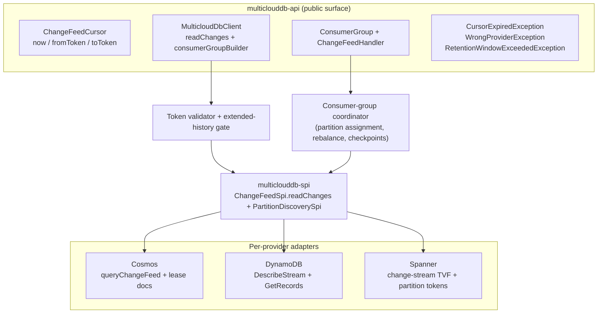
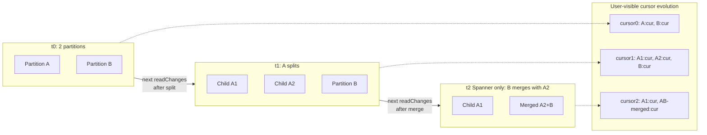

# Scalable Change-Feed API — v1 Design Document

> **Status.** v1 design document, draft for review. Aligned with spec
> `specs/001-clouddb-sdk/spec.md` for the **P0** change-feed features:
> US14 (parallelism, FR-109–114) and US15 (extended history,
> FR-115–117, FR-119–120). The following spec items are **deferred to
> v1.x**: US15's DynamoDB archiver (FR-118), US21 sinks (FR-144–148),
> US22 OpenTelemetry (FR-149–154), and external `CheckpointStore`
> (part of FR-157). See §7.
>
> Glossary at the bottom (`CFP`, `KCL`, `Beam`, `SPI`, `TVF`, `PU`, `KDS`, `ACD`).

---

## 1. Overview

### 1.1 Problem statement

Change feeds drive search indexes, materialized views, replication, audit pipelines, and cache invalidation. For an SDK whose value proposition is portability, exposing change feeds across the three managed databases under one API is table-stakes.

Each provider's change-data capture surface is deeply different:

| | **Cosmos DB** | **DynamoDB** | **Spanner** |
|---|---|---|---|
| Native runtime | `ChangeFeedProcessor` (CFP, in-SDK) | KCL + DynamoDB Streams Kinesis Adapter | Apache Beam `SpannerIO.readChangeStream` on Dataflow |
| API style | Push (callback inversion) | Pull (external library) | Job-graph (Beam transforms) |
| Dependency footprint if adopted | Reactor in core | KCL + Kinesis adapter | ~50 MB of Beam |
| Server-side retention | ≤ 30d (continuous backup, min 7d) | **Hard 24h, non-configurable** | Configurable, default 7d, min 1d |
| Partition lifecycle | Split only; surfaces as exception mid-read | Split only; **silent** (empty record + null iterator) | Split *and* merge; in-stream `ChildPartitionsRecord` |
| Trim signal | HTTP 410 | `TrimmedDataAccessException` | gRPC `INVALID_ARGUMENT` |
| Parallel-consumption primitive | Lease container + `ChangeFeedProcessor` | Shard iterators + (optional) KCL coordination | Partition tokens + Beam workers |

A naïve "lowest common denominator" API hides the differences only on paper; in practice every provider quirk leaks through. v1 must surface *one* contract whose every guarantee actually holds on all three.

### 1.2 Goals (v1)

- **One portable API** for reading change events across Cosmos, DynamoDB, and Spanner.
- **Strict cross-provider parity** for portable contract behavior; capability-gated extensions where providers diverge (FR-114, FR-120).
- **Built-in horizontal scaling** via a portable consumer-group abstraction (FR-109–114).
- **24-hour portable baseline** for cursor age, enforced client-side (FR-115).
- **Extended history opt-in for Cosmos and Spanner only** — Cosmos native (ACD mode), Spanner native (`retention_period`). **DynamoDB extended history (FR-118) is deferred to v1.x**; v1 keeps DynamoDB at the 24h baseline. Delete-event coverage and capability gating still apply on the supported providers (FR-116, FR-117, FR-119, FR-120).
- **In-database checkpoint persistence** — provider-neutral tokens, persisted to a SDK-managed collection inside the target database (FR-156, partial FR-157).
- **No dependency leaks** — no Reactor, KCL, or Beam reaches the user's classpath.

### 1.3 Out of scope for v1 (deferred to v1.x)

These spec items are intentionally **not** in v1 to keep the initial release shippable and the public surface minimal. Details and rationale in §7.

- **DynamoDB extended history** (FR-118). The SDK-managed archiver that would push DynamoDB Streams events to an external event store (Kafka, Kinesis, etc.) is deferred. DynamoDB stays at the 24h portable baseline in v1; customers needing >24h on DynamoDB use the Kinesis Data Streams native escape (§6).
- **External `CheckpointStore` SPI** (other half of FR-157).
- **`ChangeFeedSink` abstraction** for forwarding events to external messaging systems (US21, FR-144–148).
- **OpenTelemetry integration** (US22, FR-149–154).

---

## 2. API surface

The public surface in v1 has three layers:

- **Core read API** — `ChangeFeedCursor`, `readChanges`, exceptions.
- **Parallel consumption** — `ConsumerGroup` for SDK-managed partition assignment and rebalancing.
- **Checkpoint persistence** — same-database, automatic.

### 2.1 Cursor and `readChanges`

```java
public final class ChangeFeedCursor {
    public static ChangeFeedCursor now();                 // start at tip
    public static ChangeFeedCursor fromToken(String t);   // resume from persisted token
    public String toToken();                              // serialize for persistence
}

public interface ChangeFeedPage {
    List<ChangeEvent> events();
    ChangeFeedCursor nextCursor();
    boolean hasMore();
}

// The single read entry point:
ChangeFeedPage page = client.readChanges(addr, cursor);
```

- `now()` — start at the live tip; no events before this call are returned. Always valid.
- `fromToken(t)` — resume from a previously persisted SDK token. The token is opaque and provider-tagged; the SDK uses its embedded metadata for the 24-hour age check (§3) and provider-mismatch detection.

`fromTimestamp(t)` and "from beginning" were rejected: DynamoDB Streams has no timestamp-seek primitive, and "beginning" means different things on each provider.

### 2.2 Consumer group (parallel consumption)

```java
public interface ConsumerGroup extends AutoCloseable {
    void start();                                         // begin polling and rebalancing
    void stop();
}

public interface ChangeFeedHandler {
    void onEvents(PartitionId partition, List<ChangeEvent> events) throws Exception;
}

ConsumerGroup group = client.consumerGroupBuilder(addr, "my-group")
    .handler(handler)
    .assignment(Assignment.dynamic())                     // or Assignment.static(partitions)
    .rebalanceTimeout(Duration.ofSeconds(30))
    .build();

group.start();
```

The consumer group owns partition discovery, assignment among group members, per-partition `readChanges` polling, checkpoint persistence after `onEvents` returns successfully, and rebalancing on join/leave (FR-110, FR-111, FR-159). Members coordinate through the SDK-managed checkpoint collection (§2.3); on join/leave, the coordination records trigger a rebalance.

### 2.3 Checkpoint persistence (v1: same-database only)

In v1, the SDK persists checkpoints to a managed collection inside the target database — no configuration required, no external infrastructure. The collection name and per-partition write semantics are internal to the SDK and not part of the public surface (satisfies FR-156 + FR-157(a)).

```java
// No CheckpointStore builder API in v1 — persistence is automatic.
// Each (group, partition) pair has its own checkpoint row.
```

The spec's external-store option (FR-157(b)) is deferred to v1.x — see §7.

### 2.4 Exceptions

| Exception | Thrown when | User action |
|---|---|---|
| `CursorExpiredException` | `fromToken(t)` age > 24h, or provider-side trim observed | Recover (§6) |
| `WrongProviderException` | Token from provider X used with provider Y's client | Application bug; do not retry |
| `RetentionWindowExceededException` | Extended history requested without the per-provider gate enabled | Configure extended history (§3.3) |

Transient provider failures (network blips, throttling, retryable HTTP / gRPC codes) are absorbed inside the SDK's transport-layer retry and never reach `readChanges` or `onEvents` callers.

---

## 3. Retention contract

### 3.1 The 24-hour portable baseline

> A `fromToken(t)` cursor is readable for up to 24 hours after the SDK last advanced it (FR-115). After 24 hours, `readChanges` throws `CursorExpiredException` *before any service call*. `now()` cursors are always valid at creation.

**Why 24h.** DynamoDB Streams enforces 24h server-side, non-configurable. The SDK cannot offer a longer portable baseline regardless of what Cosmos and Spanner allow. Clamping client-side to 24h is the only way to guarantee uniform expiration on all three.

Server-side reality (internal, not exposed):

| Provider | Server-side cap |
|---|---|
| DynamoDB | **Hard 24h** — set by AWS, no knob |
| Cosmos | ≤ 30d, tied to continuous backup; cannot reduce below 7d |
| Spanner | Configurable, default 7d, min 1d |

DDL is out of scope; the SDK does not configure server-side retention.

### 3.2 Token validation flow

Every `readChanges` call funnels through the same client-side validator before any provider round-trip:

1. **`now()` cursor** — dispatch to the provider directly. Both checks below are skipped.
2. **`fromToken(t)` cursor** — decode the token, then:
   1. **Provider tag check.** Tokens are tagged with their issuing provider. Cross-provider use throws `WrongProviderException` immediately.
   2. **Age check.** If `now() - lastAdvancedAt > 24h` and extended history is not enabled for this provider, throw `CursorExpiredException` *before* the provider call. Expired tokens never reach the network.
3. **Dispatch to the provider.** On the response, if the provider returns a trim error — Cosmos HTTP 410, DynamoDB `TrimmedDataAccessException`, Spanner gRPC `INVALID_ARGUMENT` (with "older than" in the message) — map it to `CursorExpiredException`. Defense in depth covers clock skew.
4. **Success.** Return a `ChangeFeedPage`.

### 3.3 Extended history (Cosmos + Spanner only in v1)

The 24h baseline is the floor. Workloads on **Cosmos or Spanner** that need lookback past 24h — multi-day outage recovery, hydrating a new downstream, replaying days of history — opt in via configuration. There is no builder API; bypassing the portable baseline is a deployment decision, not a coding decision (FR-116, consistent with the SDK's escape-hatch policy).

**DynamoDB is not covered by extended history in v1.** DynamoDB Streams enforces a hard 24h server-side, and the SDK-managed archiver that would push Streams events to an external event store (FR-118) is deferred to v1.x — see §7. DynamoDB workloads that need >24h history in v1 must use the Kinesis Data Streams native escape (§6), outside the portable SDK.

**Enable via configuration — no code change:**

```properties
# multiclouddb.properties
multiclouddb.changeFeed.extendedHistory=enabled
multiclouddb.changeFeed.deleteTracking=enabled    # required for delete events in history (FR-119)
```

Equivalent environment variables work without redeploying:

```bash
export MULTICLOUDDB_CHANGEFEED_EXTENDEDHISTORY=enabled
export MULTICLOUDDB_CHANGEFEED_DELETETRACKING=enabled
```

**Per-provider mechanism (FR-117):**

| Provider | Mechanism | Infrastructure you provide | Performance vs. baseline |
|---|---|---|---|
| **Cosmos DB** | Native change feed in *All Changes and Deletes* (ACD) mode; SDK reads back to container creation or configured retention | None (Cosmos container must be ACD-enabled — a provisioning concern) | Same as baseline |
| **Spanner** | Native change streams with configurable `retention_period` (default 7d, max ≈ data-retention period) | None (Spanner change stream's `retention_period` setting) | Same as baseline |
| **DynamoDB** | **Not supported in v1** — deferred to v1.x (FR-118 archiver). Use the KDS native escape (§6) for >24h history. | n/a in v1 | n/a in v1 |

**What's the same on every supported provider** (cross-provider parity preserved between Cosmos and Spanner):

- Same `ChangeFeedCursor` / `readChanges` / `ConsumerGroup` surface — extended-history reads use the existing API.
- Same `CursorExpiredException` semantics when data is genuinely gone (Cosmos: bounded by ACD retention; Spanner: bounded by `retention_period`).
- Delete events included on both providers when delete tracking is enabled (FR-119).

**Capability gating.** Extended history is a capability-gated feature (FR-120). The capability manifest declares `EXTENDED_CHANGE_FEED_HISTORY` as supported on **Cosmos and Spanner** in v1; **DynamoDB declares it unsupported**. Enabling `multiclouddb.changeFeed.extendedHistory` on a client whose target set includes DynamoDB fails capability validation per FR-123. Affected applications must either (a) restrict the deployment target to Cosmos/Spanner, (b) use the DynamoDB→KDS native escape outside the portable contract (§6), or (c) wait for the v1.x DynamoDB archiver.

**Observability (v1).** Extended-history reads log `WARN extended-history read (provider=<P>, cursorAge=<duration>)`. Structured metrics (Micrometer / OpenTelemetry) arrive in v1.x — see §7.

---

## 4. Architecture

### 4.1 Module layout

The public API sits in `multiclouddb-api`. Per-provider impls bind to the SPI in `multiclouddb-spi`.



All public types live in `multiclouddb-api`. The SPI seam is the only place per-provider code touches the read path. Provider-specific exception types, dependencies, and partition lifecycle quirks never cross this seam.

### 4.2 How provider differences are hidden

| Difference | How it's hidden in v1 |
|---|---|
| Provider exception types (`FeedRangeGoneException`, `TrimmedDataAccessException`, `INVALID_ARGUMENT`) | Mapped to `CursorExpiredException` (trim) or absorbed silently (split — see §4.3) |
| Provider cursor formats (continuation tokens vs. sequence numbers vs. partition tokens) | Wrapped in an opaque, provider-tagged token. `toToken()` / `fromToken()` work everywhere |
| Provider partition lifecycle (split-only vs. split-and-merge; exception vs. silent vs. in-stream) | Detected inside each adapter; the *next* cursor encodes the post-event topology |
| Provider retention windows | Clamped to 24h client-side; extended history opt-in for Cosmos and Spanner only in v1 (§3.3). DynamoDB stays at the 24h cap in v1. |
| Provider parallel-consumption primitives (Cosmos leases / DynamoDB shards / Spanner partition tokens) | Hidden behind `ConsumerGroup`; per-provider mapping in §5.3 |
| Provider transport (HTTPS, AWS SDK, gRPC) | Standard retry on transient codes; never visible to the caller |
| Provider dependencies (Reactor, KCL, Beam) | Confined to their respective `multiclouddb-provider-*` modules |

### 4.3 Partition transparency

Each provider's partition lifecycle is genuinely different — different shape, different signal, different recovery:

| Event | Cosmos | DynamoDB | Spanner |
|---|---|---|---|
| **Split (1 → N)** | Thrown `FeedRangeGoneException` mid-pagination | **Silent**: closed shard returns empty records + null next iterator | In-stream `ChildPartitionsRecord` with `parents.size == 1` |
| **Merge (N → 1)** | ❌ Not possible — split-only | ❌ Not possible — split-only | In-stream `ChildPartitionsRecord` with `parents.size > 1` (same child token on every parent — requires idempotent dedup) |
| **Child discovery** | Diff `container.getFeedRanges()` against parent's range | `DescribeStream(ShardFilter=CHILD_SHARDS)`; up to ~30s propagation delay | Immediate (in-stream record) |
| **Child-cursor start** | Begin where parent left off (continuation tokens fork cleanly) | Begin at shard `TRIM_HORIZON` | `start_timestamp` from the child record |

**Single-partition contract.** When the user calls `readChanges` directly, the SDK hides all of it: cursors keep working regardless of how many splits/merges have happened; per-key ordering is preserved across split boundaries; at-least-once is the universal lower bound.

**Multi-partition contract (consumer group).** When using `ConsumerGroup`, partition discovery and assignment are handled by the coordinator (§5). On split, the parent partition's handler is notified of drain completion before the child partition(s) are assigned. On merge (Spanner), the coordinator dedups the same child appearing on multiple parents.



**Two implementation details that matter for parallel consumers:**

- **`lastAdvancedAt` is `min` across the per-partition list.** The slowest partition determines the cursor's age. A fast partition cannot silently extend the 24h window.
- **Parent-before-child ordering.** A child partition is not polled (or assigned) until its parent(s) have been fully drained. Preserves per-key order on DynamoDB and commit-timestamp continuity on Spanner.

---

## 5. Parallel consumption

This is the production-grade entry point. The SDK ships a portable consumer-group abstraction (FR-109) that handles partition discovery, assignment, rebalancing, and checkpointing for you. App-level patterns are still available for workloads the consumer group can't satisfy.

> **Process first, then checkpoint.** The consumer group will not advance the checkpoint until `onEvents` returns normally. Throwing from `onEvents` triggers a retry (at-least-once). This is the same property the §5.5 single-thread pattern enforces by hand.

### 5.1 Consumer group — the default path

For most production consumers, this is everything you need:

```java
ConsumerGroup group = client.consumerGroupBuilder(addr, "position-updates-v1")
    .handler((partition, events) -> {
        for (ChangeEvent e : events) {
            project(e);
        }
        // No explicit checkpoint call — the SDK checkpoints after onEvents returns normally.
    })
    .assignment(Assignment.dynamic())
    .rebalanceTimeout(Duration.ofSeconds(30))
    .build();

Runtime.getRuntime().addShutdownHook(new Thread(group::stop));
group.start();   // blocks; or call on a background thread
```

**What you get:**

- Partition discovery and assignment across all members of the group (FR-110).
- Per-partition `readChanges` polling on internal worker threads.
- Per-partition checkpointing after each successful `onEvents` (FR-112, FR-159).
- Automatic rebalancing within `rebalanceTimeout` when members join/leave (FR-111).
- Topology changes (split/merge) absorbed by §4.3.

### 5.2 Static vs. dynamic assignment

| Mode | When to use | Trade-off |
|---|---|---|
| `Assignment.dynamic()` (default) | Most workloads; want rebalancing on join/leave | Requires the SDK-managed checkpoint collection (default in v1) |
| `Assignment.static(partitionIds)` | Deterministic mapping is required; provider lacks dynamic partition discovery; small fixed worker count | No automatic rebalancing on member failure — the failed member's partitions sit idle until it returns |

Dynamic mode is what you want unless you have a specific reason otherwise. Static mode exists primarily as the fallback for "provider doesn't support dynamic partition discovery" (FR-114) — documented as such in the capability manifest.

### 5.3 Per-provider partition mapping (internal)

The consumer group's coordinator maps to each provider's native primitive (FR-113):

| Provider | Logical partition unit | Discovery | Assignment mechanism |
|---|---|---|---|
| **Cosmos DB** | Feed range (physical partition slice) | `container.getFeedRanges()` | Lease docs in a SDK-managed `__leases__` collection — pattern from `ChangeFeedProcessor`, but the user never sees the leases |
| **DynamoDB** | Shard | `DescribeStream(ShardFilter=CHILD_SHARDS)` | Per-shard ownership records in the SDK-managed checkpoint collection; shard close → child shards inherit lineage |
| **Spanner** | Partition token | In-stream `ChildPartitionsRecord` | Token ownership records in the SDK-managed checkpoint collection; merge → dedup by first-claim wins |

The application sees `PartitionId` — an opaque, provider-tagged identifier surfaced to `onEvents` so handlers that need per-partition state (caches, queues) can key off it. **No provider-specific shard/range/token types appear on the public surface.**

### 5.4 Rebalancing

When a member joins or leaves (heartbeat lapse + lease TTL expiry), the coordinator triggers a rebalance:

1. All current members pause polling and complete their in-flight `onEvents` (bounded by `rebalanceTimeout`).
2. The coordinator recomputes partition assignment across the current member set.
3. Partitions released by departing members are re-claimed by remaining members.
4. Polling resumes; each member starts from the last checkpoint for its newly-assigned partitions.

**Properties:**

- Bounded rebalance latency = `rebalanceTimeout` + member heartbeat interval.
- No event loss — partitions are only reassigned after their current handler returns or the timeout expires (handler is then assumed crashed, which is at-least-once safe).
- No double processing within `rebalanceTimeout` — the coordinator gates partition transfer on checkpoint flush of the prior owner.

### 5.5 Single-thread baseline (no consumer group)

Use this for one-off jobs, dev environments, low-volume backfills, or when you explicitly do not want SDK-managed coordination.

```java
ChangeFeedCursor cursor = loadSavedToken()
    .map(ChangeFeedCursor::fromToken)
    .orElseGet(ChangeFeedCursor::now);

while (running) {
    try {
        ChangeFeedPage page = client.readChanges(addr, cursor);
        process(page.events());
        cursor = page.nextCursor();
        persist(cursor.toToken());
    } catch (CursorExpiredException e) {
        cursor = recover(e);   // see §6
    }
}
```

**Use when.** Single process, low-to-moderate write rate, downstream is the bottleneck, or you're prototyping. The consumer group is preferred for production.

### 5.6 In-process worker pool — parallelizing within a partition

A `ChangeFeedHandler.onEvents` callback runs single-threaded per partition. When a single thread can't keep up with one partition, fan out *events* across worker threads inside the handler, grouped by key so per-key ordering is preserved. Block until all workers finish before returning — the SDK only checkpoints after a clean return.

```java
ExecutorService workers = Executors.newFixedThreadPool(N);

ConsumerGroup group = client.consumerGroupBuilder(addr, "my-group")
    .handler((partition, events) -> {
        Map<String, List<ChangeEvent>> byKey = events.stream()
            .collect(Collectors.groupingBy(
                ChangeEvent::primaryKey, LinkedHashMap::new, Collectors.toList()));

        List<CompletableFuture<Void>> futures = byKey.values().stream()
            .map(keyEvents -> CompletableFuture.runAsync(() -> processInOrder(keyEvents), workers))
            .toList();

        // CRITICAL: block until ALL workers finish. Throwing or returning early loses ordering.
        CompletableFuture.allOf(futures.toArray(new CompletableFuture[0])).join();
    })
    .build();
```

**Trade-offs.** Parallelism is bounded by per-key diversity within a page; the slowest worker per page paces the checkpoint; a thrown exception re-delivers the whole page (downstream must be idempotent by primary key).

### 5.7 App-level leader-elected (when the consumer group isn't enough)

The consumer group is the right answer for almost all workloads. The pre-existing app-level leader-elected pattern is preserved here only for niche cases: legacy coordinators you must integrate with, sub-second failover guarantees the consumer group can't meet, or environments that disallow SDK-managed coordination state.

```java
while (running) {
    if (!leaderLock.tryAcquire(leaseTtl)) {
        sleep(jitter(leaseTtl / 3));
        continue;
    }
    try {
        ChangeFeedCursor cursor = loadSharedToken()
            .map(ChangeFeedCursor::fromToken)
            .orElseGet(ChangeFeedCursor::now);

        while (leaderLock.isHeld() && running) {
            ChangeFeedPage page = client.readChanges(addr, cursor);
            process(page.events());
            cursor = page.nextCursor();
            persistShared(cursor.toToken());
            leaderLock.renew();
        }
    } catch (CursorExpiredException e) {
        cursor = recover(e);
    } finally {
        leaderLock.release();
    }
}
```

### 5.8 Common pitfalls

- **Don't checkpoint from inside the handler.** The consumer group does it automatically after `onEvents` returns. Manual checkpoints are not part of the v1 surface.
- **Don't catch and swallow inside `onEvents`.** A clean return tells the SDK "checkpoint this page". If processing failed, throw — the SDK retries.
- **Downstream idempotency by primary key.** At-least-once is the universal lower bound on all three providers.
- **Monitor cursor age client-side.** v1 does not expose a structured metric for cursor age — that arrives with OTel in v1.x (§7). Until then, stamp `System.currentTimeMillis()` alongside any checkpoint you persist externally.
- **Pick `rebalanceTimeout` shorter than your handler's max processing time.** Otherwise the coordinator assumes the handler crashed and reassigns the partition mid-flight, causing the prior owner to find its lease revoked.

---

## 6. Beyond extended history

Extended history (§3.3) covers up to provider-side retention: **Cosmos ≤ 30d** and **Spanner up to your `retention_period`**. **DynamoDB is not covered by extended history in v1 — the 24h cap remains** until the v1.x archiver lands (§7). For workloads that need to reach back further — or that want a non-portable native escape — these are the practical patterns:

| Strategy | What you recover | What you lose | Portability |
|---|---|---|---|
| **Extended history (§3.3)** | Cosmos: ≤ 30d; Spanner: `retention_period`; **DynamoDB: not supported in v1** | Bounded by provider retention; DynamoDB unavailable until v1.x | ✅ Portable contract on Cosmos + Spanner; capability-gated |
| **Re-snapshot + resume from `now()`** | Current state of every row | The *events* during the gap | ✅ All three providers, no flag |
| **Drop to the provider-native SDK** | Native retention (Cosmos: container lifetime; Spanner: ≤ 7d; DynamoDB: ≤ 365d via KDS *if* enabled before the event) | Nothing within native retention | ❌ Provider-specific; outside the portable SDK |

**Recommendations by workload pattern.**

- **Disaster recovery after a multi-day outage.** On Cosmos or Spanner, enable extended history if your provider configuration supports the lookback window; otherwise re-snapshot + resume from `now()`. **On DynamoDB, the only options in v1 are (a) re-snapshot + resume, or (b) the Kinesis Data Streams native escape if you enabled it before the event.**
- **Backfill / hydration of a new downstream.** Bootstrap from a snapshot, then attach `now()`. Replaying history is rarely the right tool; backfill is.
- **Compliance / audit with ≥ days of history.** On Cosmos/Spanner, enable extended history with delete tracking. **On DynamoDB in v1, route to your own audit pipeline at write time** (e.g., a sink your application maintains over `ConsumerGroup`), or wait for the v1.x DynamoDB archiver.
- **Anticipating long-window replay on DynamoDB beyond 24h.** Enable Kinesis Data Streams integration *before* the event you want to replay (KDS retention is configurable up to 365d). This is the only path to >24h DynamoDB history in v1, and it is a provider-native escape — outside the portable SDK.
- **Reducing time-to-recover.** The consumer group checkpoints per page automatically. Alert at ~18h of cursor age once OTel is wired in v1.x (§7).

---

## 7. Spec divergence summary (v1 vs. spec PR #83)

These divergences from spec PR #83 are explicit; each is deferred to a v1.x release rather than rejected outright. The PR review should resolve whether to amend the spec to mark these as v1.x targets or to expand v1 scope to include them.

| Spec item | v1 status | Reason | v1.x target |
|---|---|---|---|
| **DynamoDB extended history (FR-118)** | Deferred — `EXTENDED_CHANGE_FEED_HISTORY` capability is `false` on DynamoDB in v1; Cosmos and Spanner are `true` | The SDK-managed archiver is effectively a small distributed system (long-running consumer, lag tracking, retries, external event-store provisioning). It also forces choices on event-store schema, ordering, and replay semantics that overlap heavily with the deferred sink abstraction (US21). Best shipped after — or together with — the public `ChangeFeedSink`. | v1.1 — ship the DynamoDB archiver alongside the public `ChangeFeedSink` interface (FR-118 + US21 land together). |
| External `CheckpointStore` SPI (FR-157(b)) | Deferred — same-database only in v1 | Public SPI shape is hard to lock in without real-world usage from multiple stores. Same-DB default satisfies the bulk of the FR-156/157 intent. | v1.1 — add `CheckpointStore` interface with at least one external impl (Redis or a dedicated table). |
| `ChangeFeedSink` abstraction (US21, FR-144–148) | Deferred | A general-purpose sink interface should follow once the DynamoDB archiver's shape is proven. A user-side wrapper over `ConsumerGroup` works in the interim. | v1.1 — ship a `ChangeFeedSink` interface with a `KafkaSink` built-in, jointly with FR-118. |
| OpenTelemetry integration (US22, FR-149–154) | Deferred | OTel is config-only and additive — it can land in any minor release without changing the public API. v1 ships with structured logs and a small Micrometer counter set instead. | v1.1 — `multiclouddb-otel` optional artifact with the span and metric inventory from spec FR-150/151. |

**What v1 still satisfies from these user stories.**

- FR-115 ✓ (24h portable baseline, enforced client-side).
- FR-116 ✓ (extended history is opt-in by config, not code, on the supported providers).
- FR-117 ✓ (Cosmos ACD and Spanner native `retention_period` mechanisms).
- FR-119 ✓ (delete events when delete tracking is enabled, on Cosmos and Spanner).
- FR-120 ✓ (capability-gated — DynamoDB declares `EXTENDED_CHANGE_FEED_HISTORY` as unsupported in v1).
- FR-155 ✓ (at-least-once delivery).
- FR-156 ✓ (portable checkpoint tokens — already in `toToken`/`fromToken`).
- FR-157(a) ✓ (default same-database checkpoint store).
- FR-158 ✓ (consumer group resumes from last checkpoint after restart).
- FR-159 ✓ (per-partition checkpoints in parallel consumption).

The remaining gaps (FR-118 DynamoDB archiver, FR-144–148 sinks, FR-149–154 OTel, FR-157(b) external store) are tracked in the v1.x backlog.

---

## 8. Glossary

| Term | Expansion |
|---|---|
| **ACD** | "All Changes and Deletes" — the Cosmos DB change-feed mode used for extended history (exposes intermediate versions and deletes). |
| **CFP** | `ChangeFeedProcessor` — Cosmos DB's in-SDK push-based change-feed runtime. |
| **KCL** | [Amazon Kinesis Client Library](https://docs.aws.amazon.com/streams/latest/dev/shared-throughput-kcl-consumers.html) — the recommended consumer for DynamoDB Streams (via the Kinesis Adapter). |
| **Beam** | [Apache Beam](https://beam.apache.org/) — the framework Spanner change streams are read through (`SpannerIO.readChangeStream`). |
| **SPI** | Service Provider Interface — the internal seam between `multiclouddb-api` and per-provider impls. |
| **TVF** | Table-Valued Function — Spanner change streams are queried as TVFs. |
| **PU** | Processing Unit — Spanner's capacity unit; 1 PU is the minimum for a database. |
| **KDS** | Kinesis Data Streams — AWS's general-purpose stream service; DynamoDB can optionally tee Streams to KDS for ≤ 365-day retention. |

---

## 9. References

- **Spec**: `specs/001-clouddb-sdk/spec.md` — US14 (parallelism, P0), US15 (extended history, P0); FR-109–117, FR-119–120; SC-043–047. FR-118 (DynamoDB archiver) deferred — see §7.
- **Spec deferrals**: PR #83 US21 (sinks, FR-144–148), US22 (OpenTelemetry, FR-149–154), US23 (external checkpoint store, FR-157(b)), and US15's FR-118 (DynamoDB extended history archiver) — see §7.
- **Cosmos DB**
  - [Change feed modes](https://learn.microsoft.com/azure/cosmos-db/nosql/change-feed-modes)
  - [Change feed processor](https://learn.microsoft.com/azure/cosmos-db/nosql/change-feed-processor)
- **DynamoDB**
  - [DynamoDB Streams](https://docs.aws.amazon.com/amazondynamodb/latest/developerguide/Streams.html)
  - [Streams KCL adapter walkthrough](https://docs.aws.amazon.com/amazondynamodb/latest/developerguide/Streams.KCLAdapter.html)
  - [Low-level Streams API walkthrough](https://docs.aws.amazon.com/amazondynamodb/latest/developerguide/Streams.LowLevel.Walkthrough.html)
- **Spanner**
  - [Change streams](https://cloud.google.com/spanner/docs/change-streams)
  - [Manage change streams](https://cloud.google.com/spanner/docs/change-streams/manage)
  - [Use change streams with Dataflow](https://cloud.google.com/spanner/docs/change-streams/use-dataflow)
