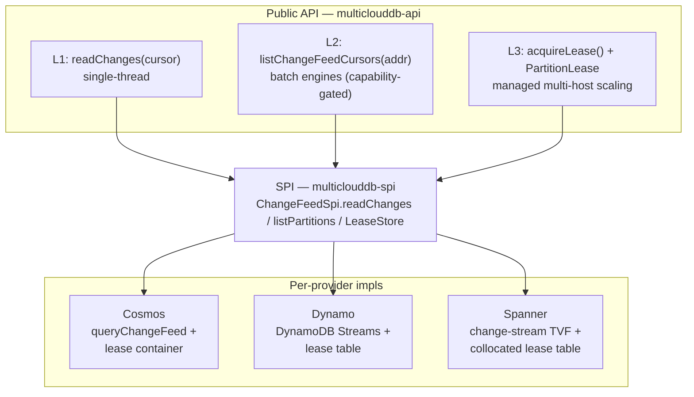
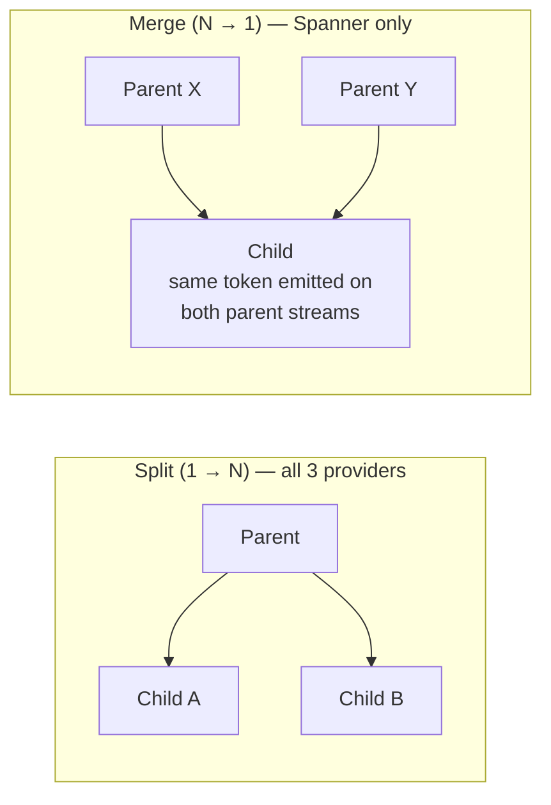
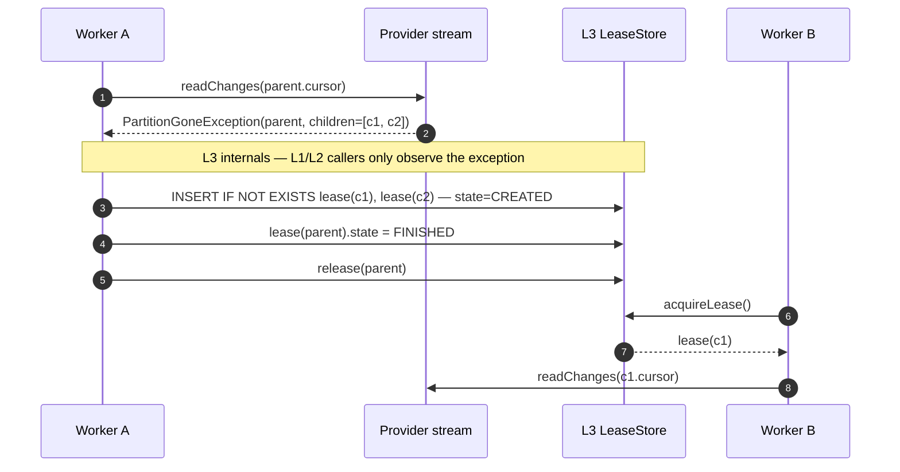

# Scalable Change-Feed API — Research & Design

How to expose change feeds across Cosmos DB, DynamoDB, and Spanner under a
single portable API that scales from a single thread to multi-host parallel
consumption without leaking provider-specific runtime dependencies into the SDK.

---

## TL;DR

1. **Use a pull-based API**, not a push processor. All three providers' native scaling runtimes — Cosmos `ChangeFeedProcessor` (CFP), the Amazon Kinesis Client Library (KCL) for DynamoDB Streams, and Apache Beam (`SpannerIO.readChangeStream`) — are internally pull-loops; we don't need to expose the callback inversion. Avoids Reactor / KCL / Beam dependency leaks.
2. **Minimal cursor surface — `now()` and `fromToken(savedToken)` only.** Both are exact on all three providers. Dropped `beginning()` (semantics differ per provider) and `fromTimestamp(t)` (DynamoDB Streams has no timestamp seek). The strict-portability principle wins over convenience features that don't truly portably exist. Historical backfill is an out-of-band concern (§4.6).
3. **Three layered APIs** built on the same SPI primitives:
   - L1 — `readChanges(cursor)` for single-thread (PR 1 below).
   - L2 — `listChangeFeedCursors(addr)` for batch engines that own their coordination (capability-gated).
   - L3 — `acquireLease()` + `PartitionLease` + `LeaseStore` SPI for managed multi-host scaling.
4. **24-hour retention is the portable contract — strict, no opt-out.** Token age is capped client-side. Provider-specific behaviors (Cosmos has no server-side knob; Spanner configurable via `retention_period='1d'`; Dynamo native) are handled *internally*. The public API only exposes the portable 24h promise via a uniform `CursorExpiredException`.
5. **Split / merge handled transparently in L3**, surfaced as `PartitionGoneException` in L1/L2. All provider-specific lifecycle quirks (Cosmos child-range diff, Dynamo parent-shard graph, Spanner merge-dedup) live inside the per-provider SPI impls.
6. **Ship as 3 focused PRs**, each capability complete and reviewable end-to-end:
   - PR 1 — Foundation (typed cursor + single-cursor read + all 3 providers + 24h enforcement).
   - PR 2 — Partition discovery (`listChangeFeedCursors` + capability gating + all 3 providers).
   - PR 3 — Managed scaling (lease SPI + coordinator + all 3 provider `LeaseStore` impls + split/merge tests).

---

## Background

Change feeds are how operational data flows into downstream systems — search indexes, materialized views, analytics pipelines, audit trails, cross-region replication, cache invalidation. For an SDK whose value proposition is database portability, exposing change feeds across Cosmos DB, DynamoDB, and Spanner under one API is table-stakes. The hard part is that the three providers expose change-data capture through deeply different surfaces — push processors, pull iterators, and DoFn-based streaming — with different scaling models, retention models, and failure modes.

Designing one portable surface that doesn't quietly leak any of those differences requires answering three coupled questions up front; each forces public-API decisions, and answering any one in isolation produces a partial — and likely incoherent — API. This document answers them together.

### Q1 — How do we scale change feeds across many hosts?

Real workloads have hundreds of partitions and many worker hosts polling concurrently, with split/merge, rebalancing, crash recovery, and back-pressure. Each provider ships its own scaling runtime, and none of them is adoptable as the portable abstraction:

| | **Cosmos** | **Dynamo** | **Spanner** |
|---|---|---|---|
| **Native scaling runtime** | `ChangeFeedProcessor` (CFP) | Amazon Kinesis Client Library (KCL) + DynamoDB Streams Kinesis Adapter | Apache Beam `SpannerIO.readChangeStream` on Dataflow |
| **API surface** | Push (callback inversion) | Pull (external library) | Job-graph (Dataflow) |
| **Dependency leak if adopted** | Reactor into core | KCL + Kinesis adapter | ~50 MB of Beam |
| **Cost floor of the native runtime** | ~400 RU/s lease container (~$24/mo) | Modest (~$5-6/mo lease table) | ≥ 1 PU separate metadata DB (~$650/mo, per Beam's default recommendation) |
| **Hard runtime caps** | None | 2 readers/shard; 4 `GetRecords`/sec/shard | None (CPU-bound) |

Adopting any one as the abstraction would leak its runtime model, dependency footprint, and cost floor into the SDK. We need a scaling model that's portable across all three without dragging Reactor / KCL / Beam into core. → §1 (per-provider analysis), §2 (the layered pull-based design), §2.3 (lease coordinator + cost transparency).

### Q2 — How do we keep the API portable given DynamoDB's 24-hour retention?

DynamoDB Streams enforces a non-configurable 24h retention — any cursor older than 24h is permanently dead, server-side, no opt-out. The other two providers behave very differently:

| | **Cosmos** | **Dynamo** | **Spanner** |
|---|---|---|---|
| **Server-side retention** | No knob; bounded only by item lifetime in container | **Fixed 24h, non-configurable** | Configurable; default 7 days, minimum 1 day |
| **`fromTimestamp(t)` natively supported?** | ✅ via `IfModifiedSince` / continuation | ❌ no timestamp-seek primitive (only `TRIM_HORIZON`, `LATEST`, sequence-number iterators) | ✅ via `start_timestamp` parameter |
| **"Read from beginning" semantics** | Months of history (or whatever items survive) | GC-timing-dependent `TRIM_HORIZON` (≈ but ≠ 24h) | Bounded by `retention_period` |
| **What "lookback > 24h" means** | Routinely possible | Impossible | Possible if `retention_period` raised |

A permissive cursor surface (`fromTimestamp(t)`, `beginning()`, "lookback > 24h") works on Cosmos and Spanner but silently fails on Dynamo — exactly the "works on two providers, mysteriously broken on the third" trap the SDK exists to prevent.

We need a strict portable contract that absorbs the per-provider difference inside the SDK and exposes a single uniform expiration surface — even on providers where the server would happily serve older data. → §2.1 (the minimal `now()` / `fromToken(t)` cursor surface), §4 (the 24h contract and client-side enforcement), §4.6 (the recommended pattern for historical backfill), §6 (the rejected alternatives and why each one breaks portability).

### Q3 — How do we normalize provider-specific lifecycle errors and outages?

Each provider signals split, merge, trim (data aged out), and liveness through a different *kind* of channel — exception, silent empty response, in-band record, or status code. That heterogeneity, not just the per-event detail, is what makes a portable error surface non-trivial:

| Signal | **Cosmos** | **Dynamo** | **Spanner** |
|---|---|---|---|
| **Split (1 → N)** | Thrown `FeedRangeGoneException`, mid-pagination | **Silent**: closed shard returns empty records + null next iterator (no exception) | In-band record (`ChildPartitionsRecord`) interleaved with data |
| **Merge (N → 1)** | ❌ No merge — Cosmos physical partitions are split-only, never recombine | ❌ No merge — DynamoDB Streams shards are split-only, never recombine | In-band record, **same child token emitted on every parent's stream** — requires idempotent dedup |
| **Trim (data aged out)** | HTTP 410 (AVAD mode only) | Thrown `TrimmedDataAccessException` | gRPC `INVALID_ARGUMENT` |
| **Liveness signal** | Implicit (cursor advances) | Implicit (next iterator returned) | Explicit `HeartbeatRecord` element |
| **Child-partition discovery delay** | Immediate (diff `getFeedRanges()` against parent's range) | Up to ~30s (`DescribeStream` propagation) | Immediate (in-stream record) |
| **Network blip** | Standard HTTP retry | Standard SDK retry | gRPC retry |

A portable consumer can't carry three error catalogs and three lifecycle state machines. We need a uniform error surface — `PartitionGoneException` for split/merge, `CursorExpiredException` for trim, transport-layer retry for blips — with all per-provider translation hidden inside the SPI impls. That's what makes "write once, run on three providers" actually true at the operational boundary, where consumers spend most of their time. → §3 (event matrix and detection responsibility by layer), §3.3 (idempotent merge), §3.4 (parent-before-child invariant), §3.5–3.6 (recovery semantics and provider-specific edge cases).

---

## 1. How each provider scales change feed

| | **Cosmos** | **Dynamo** | **Spanner** |
|---|---|---|---|
| **Native runtime** | `ChangeFeedProcessor` (CFP, in-SDK) | Amazon Kinesis Client Library (KCL) + DynamoDB Streams Kinesis Adapter (external library) | Apache Beam `SpannerIO.readChangeStream` on Dataflow |
| **Coordination store** | Lease container (Cosmos container) | Lease table (DynamoDB table) | Metadata DB (separate Spanner DB recommended) |
| **Lease unit** | EPK range | Shard ID (+ `parentShardId`) | Partition token (4-state machine) |
| **Rebalancing** | `EqualPartitionsBalancingStrategy` — steal ≤ 1 lease/cycle | Optimistic lock on `leaseCounter` | Implicit (Beam's SDF element scheduling) |
| **Split handling** | `FeedRangeGoneException` → child leases via `synchronizer.splitPartition()` | `DynamoDBStreamsShardSyncer` walks `parentShardId` graph | `ChildPartitionsRecord` in-stream |
| **Merge** | ❌ Split-only (partitions never merge) | ❌ Split-only (shards never merge) | ✅ Child has `parents.size > 1` |
| **Hard caps** | none | **2 readers/shard, 24h retention, 4 GetRecords/sec/shard** | none (CPU-bound) |
| **Cost floor** | ~400 RU/s lease container | $5-6/mo lease table + $2/mo per shard | ≥ 1 PU metadata DB + Dataflow worker |
| **In-SDK orchestrator?** | ✅ | ❌ | ❌ |
| **Java entry point** | `ChangeFeedProcessorBuilder` | `StreamsSchedulerFactory.createScheduler(...)` | `SpannerIO.readChangeStream()` |

**Architectural insight**: despite different surfaces, all three runtimes do the same thing internally — acquire a per-partition lease, poll the partition, checkpoint on success, renew lease, handle split/merge via children/parents graph. **This is what enables a portable abstraction.** Cosmos exposes a push surface; KCL and Beam wrap pull semantics in framework runtimes.

---

## 2. Portable design — pull-based layered API



*The three public layers share one SPI. Per-provider runtime complexity (Cosmos lease container, Dynamo lease table, Spanner change-stream TVF + collocated lease table) stays inside one impl each; nothing provider-specific reaches the public API.*

### 2.1 Layer 1 — Typed cursor

Replace `StartPosition` + `continuationToken` with a single typed cursor. **Only two constructors** — every operation has exact, identical semantics on every provider:

```java
public final class ChangeFeedCursor {
    public static ChangeFeedCursor now();                // start at tip
    public static ChangeFeedCursor fromToken(String t);  // resume from persistence
    public String toToken();
    public Instant lastAdvancedAt();                     // used for 24h enforcement
}

// Existing API, unchanged otherwise:
ChangeFeedPage page = client.readChanges(
    ChangeFeedRequest.builder(addr).cursor(cursor).build(), opts);
ChangeFeedCursor next = page.nextCursor();
```

**Why no `beginning()` and no `fromTimestamp(t)`?** Both look portable but aren't (§6 has the full rationale). `beginning()` means different things on each provider (Dynamo: GC-timing-dependent `TRIM_HORIZON`; Cosmos: months of history; Spanner: bounded by `retention_period`). `fromTimestamp(t)` is impossible to implement on Dynamo (no timestamp seek in DynamoDB Streams — only sequence numbers). The portable surface is therefore *only* what every provider can do exactly: start at the tip, or resume from a token the SDK previously issued.

Token is **strictly opaque** to users. Internally provider-tagged for `fromToken()` validation; throws `WrongProviderException` if used against the wrong provider. Internal payload (Dynamo example): `{shardId, sequenceNumber, lastAdvancedAt}`; for Cosmos `{feedRange, continuationToken, lastAdvancedAt}`; for Spanner `{partitionToken, lastReadTimestamp, lastAdvancedAt}`. All providers natively support resume-from-checkpoint, so `fromToken()` is exact everywhere.

For the "I need a historical backfill before going live" use case, see §4.6.

### 2.2 Layer 2 — List partition cursors (capability-gated)

For batch engines (Spark, Flink) that have their own coordination layer:

```java
if (!client.supports(addr, Capability.LIST_PARTITIONS)) { ... }
List<ChangeFeedCursor> seeds = client.listChangeFeedCursors(addr, startAt, opts);
// User distributes seeds across workers. User owns crash recovery and split handling.
// On read of a stale cursor → PartitionGoneException with children.
```

Notes:
- Cosmos returns one cursor per current feed range.
- Dynamo returns one cursor per current shard.
- Spanner returns a **single seed cursor** (`null` partition token); rest discovered in-stream via `ChildPartitionsRecord`. Documented loudly.

### 2.3 Layer 3 — Managed lease-based pull

```java
public interface PartitionLease extends AutoCloseable {
    String partitionId();
    ChangeFeedCursor cursor();
    Instant expiresAt();
    boolean isOwned();

    void heartbeat();                              // extend lease, no checkpoint
    void renew(ChangeFeedCursor newCursor);        // checkpoint + extend
    void release();                                // graceful, transfer to peer
}

// User runs N worker threads (virtual threads compose naturally):
PartitionLease lease = client.acquireLease(addr, leaseOpts);
if (lease == null) { /* no work — sleep + retry */ }
try (lease) {
    ChangeFeedCursor cursor = lease.cursor();
    while (running && lease.isOwned()) {
        ChangeFeedPage page = client.readChanges(req(addr, cursor), opts);
        if (page.events().isEmpty()) { lease.heartbeat(); continue; }
        process(page.events());
        cursor = page.nextCursor();
        lease.renew(cursor);
    }
} catch (PartitionGoneException e) {
    // SDK already inserted children into LeaseStore; next acquireLease picks one up.
}
```

`acquireLease()` internally:
1. Calls SPI `listPartitions()` to get current topology.
2. Selects a lease where `owner == null || expiresAt < now()` (with steal-from-busy fallback).
3. CAS-writes `{owner, expiresAt}` into the `LeaseStore`.
4. Returns the lease.

**`LeaseStore` SPI** is per-provider:
- **Cosmos** → lease container (`/id` PK).
- **Dynamo** → lease table with optimistic concurrency on `leaseCounter`.
- **Spanner** → lease table **collocated with the app DB** (avoids the ≥ 1 PU separate-metadata-DB cost; Beam's separate-DB recommendation is for DDL hygiene, not correctness).
- **Pluggable** → `withCustomLeaseStore(...)` for Redis / Postgres / in-memory.

### 2.3.1 Cost transparency

Lease coordination is not free. Operators need a budget.

**Capacity modes** (relevant to the costs below):

- **Cosmos provisioned throughput** — reserve a fixed RU/s on a container (minimum 400 RU/s ≈ $24/mo). Predictable monthly bill; requests that exceed the reservation are throttled (HTTP 429).
- **Cosmos serverless** — pay-per-RU consumed, no reservation, no minimum. Cheaper for low or spiky traffic; per-RU price is higher, so sustained workloads above ~2 M ops/mo end up more expensive than provisioned.
- **DynamoDB on-demand** — pay-per-request (per RCU/WCU consumed), no reservation. The alternative is *provisioned capacity*; we model on-demand here because lease coordination traffic is bursty (workers come and go, splits cause brief op bursts).
- **Spanner Processing Units (PU)** — Spanner's capacity unit. 1 PU is the minimum for a database (≈ $650/mo in most regions). Spanner has no serverless tier, which is why a *separate* metadata DB is expensive and our *collocated* design (§2.3) materially matters.

**Per-provider cost components** (steady state):

| Provider | Fixed cost | Per-op cost |
|---|---|---|
| Cosmos | ~400 RU/s minimum container (~$24/mo provisioned) or serverless base | ~10 RU per heartbeat / checkpoint / steal |
| Dynamo | Table free; storage negligible | ~1 WCU per heartbeat / checkpoint; ~1 RCU per scanned lease on acquire |
| Spanner (collocated, our default) | None — shares app DB capacity | Standard transactional RW per heartbeat / checkpoint |
| Spanner (separate metadata DB, Beam default) | **≥ 1 PU ≈ $650/mo** | Same as collocated |

**Example workload**: 100 partitions, 10 workers, 5 s heartbeat, checkpoint per page.

```
Heartbeat ops:   100 / 5s            ≈ 20 ops/sec   ≈ 1.7M ops/day
Checkpoint ops:  ~event rate / batch ≈ 5-50 ops/sec
Acquire ops:     sporadic            ≈ 1 op/min/worker
```

| Provider | Steady-state monthly bill |
|---|---|
| Cosmos provisioned | ~$24 base + sustained 2K RU/s → **~$120/mo** |
| Cosmos serverless | ~$15-30/mo — only beats provisioned at < 2 M ops/mo |
| Dynamo on-demand | ~1.7 M writes/day → **~$10-15/mo** |
| Spanner collocated | < 1% of app DB capacity → **effectively free** |

**Native runtime comparison**: we introduce no new cost categories. Cosmos CFP, KCL, and Beam SpannerIO all maintain the same lease pattern. **For Spanner we are cheaper** — Beam recommends a separate metadata DB (~$650/mo); we collocate by default.

### 2.3.2 Cost optimization techniques (built into the coordinator)

Implemented as the default `acquireLease()` coordinator; tunable via `LeaseOptions`.

**Free wins (no performance cost):**

| Technique | Mechanism | Savings |
|---|---|---|
| **Batched heartbeats per worker** | One worker holding N leases does one multi-row write per heartbeat tick (Cosmos `TransactionalBatch` with `/workerId` PK; Dynamo `BatchWriteItem` ≤ 25; Spanner multi-mutation tx) | **5-10× fewer heartbeat ops** for typical 5-10 leases/worker |
| **Heartbeat-checkpoint coalescing** | If a checkpoint is about to fire (advances cursor *and* extends lease), skip the heartbeat. Never two writes within 500 ms. | Eliminates redundant writes |
| **Indexed acquisition scan** | Filter `(state IN CREATED OR expiresAt < now())` via secondary index (Dynamo GSI on `(state, expiresAt)`; Cosmos composite index; Spanner secondary index) | O(N) → O(eligible) at the lease store, big win at high partition counts |
| **`InMemoryLeaseStore` for single-process** | If user runs one JVM, no persistent lease store is needed. Documented as the recommended choice for single-process scaling. | **$0** |

**Tunable trade-offs (small perf cost for big savings):**

| Technique | Knob | Savings | Cost |
|---|---|---|---|
| **Lazy checkpoint** | `checkpointEvery = N events` or `maxCheckpointLagMs` | 10-100× fewer checkpoint ops | Up to N events re-delivered on crash — no impact if handler is idempotent (which is required for at-least-once anyway) |
| **Adaptive heartbeat** | Back off 5 s → 10 s → 15 s when recent heartbeats succeed in < 100 ms; reset on first slow / failed ping | 30-50% heartbeat ops at steady state | +5-10 s to detect dead worker |
| **Idle partition back-off** | After K consecutive reads with 0 events, exponentially back off polling 1 s → 30 s (capped) | 50-90% read ops during off-peak | +N s latency to first event after idle period |

**Has real perf cost — exposed but not the default:**

| Knob | Default | Effect of raising |
|---|---|---|
| `leaseTTL` | 30 s (= 6× heartbeat) | 60-120 s reduces heartbeat pressure further but extends worker-failure detection proportionally |

### 2.3.3 Monitoring

The coordinator exposes these metrics (OpenTelemetry conventions):

- `lease_store.ops_per_second{op=heartbeat|checkpoint|acquire|scan}` — cost predictor
- `lease.acquire_latency_p95` — distribution health
- `lease.lost_to_steal_total` — high values indicate coordination thrash
- `lease.heartbeat_failure_rate` — lease store / network health

Operators should alert when `ops_per_second` approaches the provisioned throughput floor.

### 2.4 What's portable, what isn't

| Feature | Portable? |
|---|---|
| Multi-host parallel consumption | ✅ |
| At-least-once delivery, per-partition order | ✅ |
| Automatic split (and merge for Spanner) handling | ✅ |
| `PartitionGoneException` on stale cursor | ✅ |
| `CursorExpiredException` on trimmed data | ✅ |
| Pluggable `LeaseStore` (Redis, in-memory, etc.) | ✅ |
| Cross-partition global ordering | ❌ universal limitation |
| At-most-once / exactly-once semantics | ❌ universal limitation |
| `beginning()` / "read all history" cursor | ❌ Not exposed — semantics aren't uniform across providers (see §6). Use the native SDK or do an out-of-band backfill (§4.6). |
| Point-in-time start (`fromTimestamp(Instant)`) | ❌ Not exposed — DynamoDB Streams has no timestamp seek (see §6). |
| Lookback > 24h | ❌ Not exposed — use the provider-native SDK directly if you need this. |

### 2.5 Push wrapper — deferred

A push-style `ChangeFeedProcessor` is ~100 LOC over Layer 3. Ship later in a separate optional artifact (`multiclouddb-changefeed-processor`) if users ask. Don't drag Reactor / KCL / Beam into core.

---

## 3. Split, merge, and lifecycle handling

### 3.1 Provider event matrix

| Event | Cosmos | Dynamo | Spanner |
|---|---|---|---|
| Split (1 → N) | `FeedRangeGoneException` mid-read | Parent shard sealed (`EndingSequenceNumber` set); children appear in `DescribeStream` with `parentShardId` set | `ChildPartitionsRecord` in-stream; `parents.size == 1` |
| Merge (N → 1) | ❌ Cosmos physical partitions only split, never merge | ❌ DynamoDB Streams shards only split (or close on TTL), never merge — each child has a single `parentShardId` | `ChildPartitionsRecord` where `parents.size > 1`; **same child token emitted on every parent's stream** |
| Trim (data aged out) | latest-version mode: none. AVAD mode: HTTP 410 | `TrimmedDataAccessException` | `INVALID_ARGUMENT` ("timestamp ... is older than") |
| Heartbeat | implicit (token advances) | implicit (next iterator returned) | explicit `HeartbeatRecord` (default 2000 ms) |



*Cosmos physical partitions and DynamoDB Streams shards form strictly split-only DAGs — each child has exactly one parent. Spanner is the only provider whose partitions can fan in, which is what makes idempotent merge dedup (§3.3) a Spanner-only concern.*

**Why merge is Spanner-only.** Cosmos physical partitions subdivide as storage or throughput grows but the engine never recombines them; once a hash range is split, that split is permanent. DynamoDB Streams shards similarly form a strictly split-only DAG — each child carries a single `parentShardId`, and a closed shard is never replaced by a merged successor. Spanner change-stream partitions are the only ones in the matrix that fan in: when write rate drops, two adjacent partitions can merge into a single child (`parents.size > 1`). This is what makes idempotent dedup (§3.3) a Spanner-only concern; on the other two providers, `PartitionGoneException` always carries a child set whose entries each have exactly one parent.

### 3.2 Detection responsibility by layer

- **L1 (`readChanges`)** — provider impl translates native errors → portable `PartitionGoneException(parentId, children)` or `CursorExpiredException(partitionId, latestAvailableCursor)`. Children list is best-effort (empty for Spanner; populated for Cosmos via `getFeedRanges()` and Dynamo via `DescribeStream(ShardFilter=CHILD_SHARDS)`).
- **L2 (`listChangeFeedCursors`)** — snapshot; goes stale on next split. User re-lists on `PartitionGoneException`.
- **L3 (lease coordinator)** — catches `PartitionGoneException`, inserts children into `LeaseStore` with `state=CREATED`, marks parent `FINISHED`, releases parent lease. Transparent to user.



*Steps 3–5 are inside L3 — L1/L2 callers only see the `PartitionGoneException` and the next `acquireLease()` returning a child. Children become eligible only after every parent is `FINISHED` (parent-before-child invariant, §3.4).*

### 3.3 Idempotent merge (Spanner only)

Same child token arrives on every parent's stream. Coordinator uses `INSERT IF NOT EXISTS` keyed on child token; first parent wins, others observe the existing row and just mark themselves `FINISHED`.

### 3.4 Parent-before-child invariant

Required for **Dynamo** (per-key ordering) and **Spanner** (commit-timestamp continuity in both split and merge cases). Not required for Cosmos. Enforced uniformly by `acquireLease()`:

```
eligible = leases WHERE
    (owner IS NULL OR expiresAt < now())
    AND state IN (CREATED, RUNNING)
    AND (parents IS EMPTY OR ALL p IN parents: leaseStore.get(p).state == FINISHED)
```

For Cosmos, `parents` is always empty on inserted children → degenerates to immediate eligibility.

### 3.5 Recovery semantics

| Scenario | Recovery | User impact |
|---|---|---|
| Worker crash mid-batch | Lease expires; another worker resumes from last persisted cursor | At-least-once redelivery (idempotent handler → no impact) |
| Split during read | `PartitionGoneException` → coordinator updates `LeaseStore` (§3.2) | Brief pause; no data loss |
| Merge during read (Spanner) | Idempotent child insert; both parents → `FINISHED` | Brief pause; child not acquirable until all parents drained |
| Cursor outside retention | `CursorExpiredException` → apply `staleCheckpointPolicy` (`FAIL` / `RESTART_FROM_LATEST` / `RESTART_FROM_NOW`) | Data loss for the gap; always logged at WARN |
| Network blip | Transport-layer retry; lease heartbeat continues independently | None |
| `LeaseStore` outage | Coordinator can't heartbeat → releases leases, throws to user | Pause; no data loss |

### 3.6 Provider-specific edge cases

- **Cosmos**: `FeedRangeGoneException` can fire mid-pagination, not just on first call. After catching, compute children by diffing `getFeedRanges()` against the parent's old range.
- **Dynamo**: a closed shard's last `GetRecords` returns 0 records + null next iterator — not an exception. Detect via `EndingSequenceNumber != null && records.isEmpty()`. Child shards may have up to ~30s propagation delay before appearing in `DescribeStream`.
- **Spanner**: `ChildPartitionsRecord`, `DataChangeRecord`, and `HeartbeatRecord` interleave in the same TVF result set. Child's `start_timestamp` (from the record) MUST be the child query's `start_timestamp` — not `now()`, not the parent's last commit.

---

## 4. 24-hour portable retention contract

### 4.1 The contract

Dynamo Streams enforces a non-configurable 24-hour retention. To keep the SDK fully portable, **the portable API caps token age at 24 hours, strictly**. Provider differences are absorbed internally; users see a single uniform contract.

> "A `ChangeFeedCursor.fromToken(t)` is readable for up to 24 hours after the token was last advanced. Past that, `CursorExpiredException` is thrown. `ChangeFeedCursor.now()` is always valid. Users who need longer history or arbitrary-timestamp starts must use the provider-native SDK directly."

### 4.2 Server-side reality (internal concern, not exposed)

| Provider | Server-side 24h? | Mechanism |
|---|---|---|
| Dynamo | ✅ always 24h | Hard-coded by AWS |
| Spanner | ✅ configurable | `CREATE/ALTER CHANGE STREAM ... OPTIONS (retention_period = '1d')`. Default 7 days. |
| Cosmos (latest-version) | ❌ no knob | Bounded only by item lifetime in container |
| Cosmos (all-versions-and-deletes, preview) | ⚠️ tied to continuous backup (7-30 days) | Cannot reduce below 7 days |

The SDK does not configure server-side retention (DDL is out of scope for a data-plane SDK). The portable contract is enforced **client-side** regardless of server-side configuration.

### 4.3 Client-side enforcement (uniform, no opt-out)

With the cursor surface restricted to `now()` and `fromToken(t)` (§2.1), enforcement reduces to two checks:

1. **`ChangeFeedCursor.lastAdvancedAt: Instant`** — stamped on every `fromToken()` decode and updated on every `page.nextCursor()` advance.
2. **Pre-flight check** in `readChanges()` for `fromToken()` cursors: if `now() - cursor.lastAdvancedAt > 24h`, throw `CursorExpiredException` before the provider round-trip. Always.
3. **Provider error mapping** in each SPI impl (defense in depth — covers clock skew, unexpected early trim): Cosmos HTTP 410, Dynamo `TrimmedDataAccessException`, Spanner `INVALID_ARGUMENT` → uniform `CursorExpiredException(partitionId, latestAvailableCursor)`.

`now()` cursors never need a check — they're always valid the moment they're created.

### 4.4 Configuration guidance (`docs/configuration.md`)

- **Dynamo**: nothing to do.
- **Spanner**: recommend `CREATE CHANGE STREAM MyStream FOR ALL OPTIONS (retention_period = '1d');` for cost efficiency (longer retention costs more storage); the SDK enforces 24h regardless of this setting.
- **Cosmos**: document the SDK's strict 24h enforcement explicitly. Users needing longer history use the Cosmos SDK directly.

### 4.5 Future: opt-in extended retention via `ArchiveStore`

A pluggable `ArchiveStore` SPI could tee events to S3/GCS/Cosmos/Dynamo-with-TTL on consumption, then `readChanges()` falls back to the archive when the requested timestamp is past native retention. This would let users portably exceed 24h *without* the portable API leaking provider-specific behavior. Out of scope for the initial implementation; cleanly composable with L3.

### 4.6 Recommended pattern for "I need historical backfill before going live"

Since the portable API only exposes `now()` and `fromToken()`, here is the recommended pattern for the common "new consumer wants to catch up" scenario:

| Scenario | Recommended pattern |
|---|---|
| New consumer going live | `now()` → process pages → persist `nextCursor()` on every checkpoint → on restart, `fromToken(savedToken)`. |
| Need a snapshot of pre-existing data | Do an out-of-band, point-in-time scan of the source data (e.g., `client.queryItems()` with a consistent snapshot). Start the change feed with `now()` *before* the scan begins, persist tokens during the scan, and consume the buffered change feed after the scan completes. |
| Need > 24h of change history | Use the provider-native SDK directly (Cosmos PITR, Kinesis Data Streams for DynamoDB, Spanner→BQ Beam template). The portable API doesn't pretend to support this. |
| Test / development | `now()` + write test data; or use the conformance test fixtures. |

This is the same pattern Cosmos CFP, KCL, and Spanner Beam users follow in production — no one starts production consumers from "the beginning of the container." Document this in `docs/guide.md`.

---

## 5. Delivery plan — 3 PRs

**Recommendation: ship as 3 focused PRs.** Each PR delivers one user-visible capability end-to-end, including all three provider impls, full conformance coverage, and docs. Provider-specific behavior stays inside each PR's SPI impls; the public API in every PR is fully portable.

### PR 1 — Foundation: single-cursor change feed

**User capability**: read changes from a single thread, portably, with strict 24h retention enforcement.

| Component | Module | Notes |
|---|---|---|
| `ChangeFeedCursor` (typed; `now/fromToken/toToken`) with internal `lastAdvancedAt` | `multiclouddb-api` | Replaces `StartPosition` + raw token strings. Opaque, provider-tagged. |
| `ChangeFeedRequest`, `ChangeFeedPage`, `ChangeEvent` | `multiclouddb-api` | Pagination + page-cursor advancement. |
| Exceptions: `CursorExpiredException`, `WrongProviderException` | `multiclouddb-api` | Uniform across all providers. |
| `ChangeFeedSpi.readChanges` | `multiclouddb-spi` | Single SPI method. |
| `MulticloudDbClient.readChanges(req, opts)` | `multiclouddb-api` | Wraps SPI; enforces 24h retention strictly (§4.3). |
| Cosmos `ChangeFeedSpi` impl | `multiclouddb-provider-cosmos` | Latest-version mode via `CosmosAsyncContainer.queryChangeFeed`. Maps HTTP 410 → `CursorExpiredException`. |
| Dynamo `ChangeFeedSpi` impl | `multiclouddb-provider-dynamo` | DynamoDB Streams low-level API. Maps `TrimmedDataAccessException` → `CursorExpiredException`. Honors 2-readers-per-shard server-side cap. |
| Spanner `ChangeFeedSpi` impl | `multiclouddb-provider-spanner` | TVF query against the change stream. Maps timestamp errors → `CursorExpiredException`. |
| Portable conformance suite | `multiclouddb-conformance` | Read from now; resume from token; 24h token-age cap; provider mismatch via `fromToken()`. |
| Docs | `docs/changelog.md`, `docs/configuration.md` | Per-provider retention guidance from §4.4. |

**Outcome**: users can portably consume change feeds single-threaded across all three providers under a uniform `ChangeFeedCursor` + `CursorExpiredException` contract, with strict 24-hour retention enforced client-side.

### PR 2 — Partition discovery: `listChangeFeedCursors`

**User capability**: enumerate the current partition cursors for batch engines (Spark, Flink, MapReduce) that own their own coordination.

| Component | Module | Notes |
|---|---|---|
| `Capability.LIST_PARTITIONS` | `multiclouddb-api` | Gates the API; unsupported providers throw `UnsupportedCapabilityException`. |
| `PartitionGoneException(parentId, children)` | `multiclouddb-api` | Thrown from `readChanges()` when cursor is stale due to split. Children list best-effort. |
| `MulticloudDbClient.listChangeFeedCursors(addr, startAt, opts)` | `multiclouddb-api` | Returns `List<ChangeFeedCursor>`. |
| `ChangeFeedSpi.listPartitionSeeds` | `multiclouddb-spi` | Provider returns current topology snapshot. |
| Cosmos impl | `multiclouddb-provider-cosmos` | Uses `container.getFeedRanges()`. Computes children on `FeedRangeGoneException` via topology diff. |
| Dynamo impl | `multiclouddb-provider-dynamo` | Uses `DescribeStream`. On parent-shard exhaustion, queries `DescribeStream(ShardFilter=CHILD_SHARDS)` for children. |
| Spanner impl | `multiclouddb-provider-spanner` | Returns a single seed cursor (`null` partition token). Javadoc explains children are discovered in-stream via `ChildPartitionsRecord`. |
| Conformance suite extension | `multiclouddb-conformance` | List seeds; consume each in parallel; trigger split; verify `PartitionGoneException`. |

**Outcome**: power users have a portable discovery API. Provider-specific partition semantics (Cosmos feed ranges, Dynamo shards, Spanner partition tokens) live inside the SPI impls; the public API only sees opaque cursors and a portable exception type.

### PR 3 — Managed scaling: `acquireLease` + `LeaseStore`

**User capability**: multi-host parallel consumption with automatic split/merge handling, crash recovery, and rebalancing — without writing any coordination code.

| Component | Module | Notes |
|---|---|---|
| `PartitionLease` (interface) | `multiclouddb-api` | `cursor()`, `heartbeat()`, `renew(cursor)`, `release()`, `AutoCloseable`. |
| `LeaseStore` SPI + `InMemoryLeaseStore` reference impl | `multiclouddb-spi` | CAS-based ownership + state machine (`CREATED → RUNNING → FINISHED → EXPIRED`). |
| `MulticloudDbClient.acquireLease(addr, leaseOpts)` | `multiclouddb-api` | Returns next eligible lease or null. |
| Default lease coordinator | `multiclouddb-api` | Internal: handles `PartitionGoneException` → inserts children, marks parent FINISHED. Enforces parent-before-child invariant. Implements batched heartbeats, heartbeat-checkpoint coalescing, adaptive heartbeat, idle partition back-off (see §2.3.2). |
| `staleCheckpointPolicy` config | `multiclouddb-api` | `FAIL` (default) / `RESTART_FROM_LATEST` / `RESTART_FROM_NOW`. |
| `LeaseOptions` tuning knobs | `multiclouddb-api` | `heartbeatInterval`, `leaseTTL`, `checkpointEvery`, `maxCheckpointLagMs`, `idleBackoff*` — each with cost-vs-latency javadoc per §2.3.2. |
| OpenTelemetry metrics | `multiclouddb-api` | `lease_store.ops_per_second`, `lease.acquire_latency_p95`, `lease.lost_to_steal_total`, `lease.heartbeat_failure_rate` (§2.3.3). |
| Cosmos `LeaseStore` impl | `multiclouddb-provider-cosmos` | Cosmos container, `/id` PK. Uses `TransactionalBatch` for batched heartbeats. Composite index for acquisition scan. |
| Dynamo `LeaseStore` impl | `multiclouddb-provider-dynamo` | DynamoDB table with optimistic concurrency on `leaseCounter`. Uses `BatchWriteItem` for batched heartbeats. GSI on `(state, expiresAt)` for acquisition. Encodes parent-shard graph internally. |
| Spanner `LeaseStore` impl | `multiclouddb-provider-spanner` | Spanner table **collocated with app DB** (no separate metadata DB). Multi-mutation transactions for batched heartbeats. Secondary index for acquisition. Idempotent merge insert. |
| Conformance suite extension | `multiclouddb-conformance` | Multi-host split; worker-death recovery; trim → `staleCheckpointPolicy`; Spanner merge dedup; cost-regression test (`ops_per_second` budget at fixed workload). |

**Outcome**: users get portable parallel scaling. Every provider-specific behavior — Cosmos feed-range-gone diff, Dynamo parent-shard ordering and 2-reader cap, Spanner merge dedup and `start_timestamp` correctness — is handled inside the per-provider `LeaseStore` impl. The public API surface is identical for all three providers.

### Sequencing and dependencies

```
PR 1 (foundation) ──> PR 2 (discovery) ──> PR 3 (scaling)
```

Strict serial; each PR builds on the last. Within each PR, the three provider impls can be reviewed in parallel by provider-area owners but ship together — this ensures the capability isn't half-portable on merge.

### Reviewer-agent gates per PR

The multiclouddb-reviewer agent checks on every PR:
1. **Portability** — no provider-specific type leaks to the public API; capability flags are explicit, not silent fallbacks.
2. **Cost-efficiency** — no design forces an expensive provider configuration (e.g., Spanner separate metadata DB).
3. **Doc/code alignment** — javadoc, changelog, and `docs/configuration.md` reflect the new contract.
4. **Error uniformity** — all provider-specific trim/split errors mapped to `CursorExpiredException` / `PartitionGoneException`.
5. **Retention contract honored** — 24h cap is enforced at the SDK boundary; no opt-out path exists.

---

## 6. Decisions deliberately rejected

| Idea | Why rejected |
|---|---|
| Push `ChangeFeedProcessor` as the primary scaling API | Leaks Reactor (Cosmos) / KCL / Beam runtime deps; ~10× the LOC; harder to compose with virtual threads. Pull is the right primitive; push is sugar. |
| User-distributed cursor list (`listChangeFeedCursors`) as the primary scaling story | Re-invents the lease layer at the user level. Users would have to implement crash recovery, parent-before-child ordering, the Dynamo 2-reader cap, merge dedup, heartbeats. Most will get it wrong. Use Layer 3 instead. |
| Provider-native runtime delegation (CFP / KCL / Beam under our SPI) | Three different bootstrap stories and ~50 MB of Beam deps; locks us into Google's job-graph model. Build our own coordinator on top of the pull primitives instead. |
| Server-side 24h enforcement everywhere | Cosmos has no such knob. Client-side enforcement is the only universal path. |
| User opt-out from the portable 24h contract (`LOOKBACK_BEYOND_PORTABLE_CONTRACT` capability) | Strict portability means provider-specific behavior stays internal. Exposing an opt-out re-introduces the "this works on Cosmos but not Dynamo" trap the SDK exists to avoid. Users who need longer history use the provider-native SDK directly. |
| `ChangeFeedCursor.beginning()` (read from oldest available) | Semantics aren't uniform: Dynamo `TRIM_HORIZON` is GC-timing-dependent (≈ but ≠ 24h); Cosmos "from beginning" could be months of history (latest-version mode also drops deletes); Spanner depends on configured `retention_period`. Clamping Cosmos/Spanner to `now - 24h` internally still leaves clock skew and per-provider event semantics differences. Strict portability requires we don't pretend these are equivalent. Use `now()` + persist tokens, or do an out-of-band snapshot (§4.6). |
| `ChangeFeedCursor.fromTimestamp(Instant t)` (start at arbitrary wall-clock time) | DynamoDB Streams has no timestamp-seek primitive — only `TRIM_HORIZON`, `LATEST`, and sequence-number-based iterators. Approximating via `TRIM_HORIZON` + client-side `ApproximateCreationDateTime` filter requires scanning up to 24h of records before returning the first useful one — a footgun, not a feature. Capability-gating it (Cosmos/Spanner only) would violate strict portability. |
| Exposing `FeedScope` / `PhysicalPartition` types in the public API | Physical-partition semantics differ too much across providers (Cosmos hash-range PKRangeId, Dynamo Streams `shardId`, Spanner change-stream partition tokens — all with different split/merge lifecycles). Keep partition info inside opaque cursors. |
| Cross-partition global ordering | Universal limitation across all three providers. Document, don't promise. |

---

## 7. References

- **Cosmos**
  - `Azure/azure-sdk-for-java`: `ChangeFeedProcessorBuilder.java`, `EqualPartitionsBalancingStrategy.java`, `PartitionControllerImpl.java`
  - https://learn.microsoft.com/azure/cosmos-db/nosql/change-feed-modes
  - https://learn.microsoft.com/azure/cosmos-db/nosql/change-feed-processor
- **Dynamo**
  - https://docs.aws.amazon.com/amazondynamodb/latest/developerguide/Streams.html
  - https://docs.aws.amazon.com/amazondynamodb/latest/developerguide/Streams.KCLAdapter.html
  - https://docs.aws.amazon.com/amazondynamodb/latest/developerguide/Streams.LowLevel.Walkthrough.html
  - `awslabs/dynamodb-streams-kinesis-adapter`: `StreamsSchedulerFactory.java`, `DynamoDBStreamsShardSyncer.java`
- **Spanner**
  - https://cloud.google.com/spanner/docs/change-streams
  - https://cloud.google.com/spanner/docs/change-streams/manage
  - https://cloud.google.com/spanner/docs/change-streams/use-dataflow
  - `apache/beam`: `SpannerIO.readChangeStream`, `DetectNewPartitionsDoFn`, `ReadChangeStreamPartitionDoFn`, `PartitionMetadataAdminDao.java`
- **Spec**: `specs/002-change-feed/`
