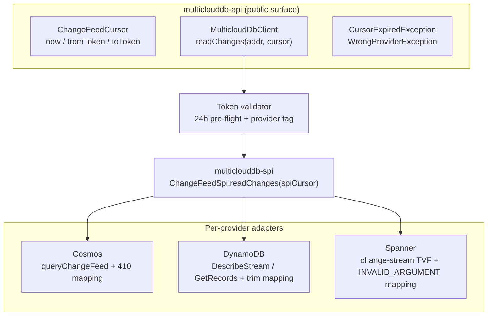
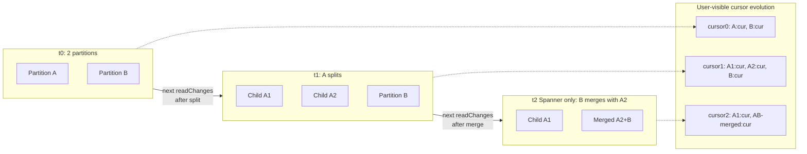

# Scalable Change-Feed API — v1 Design Document

> **Status.** v1 design document, draft for review. The API exposes one
> portable change-feed contract over Cosmos DB, DynamoDB, and Spanner.
> Glossary at the bottom (`CFP`, `KCL`, `Beam`, `SPI`, `TVF`, `PU`, `KDS`).

---

## 1. Overview

### 1.1 Problem statement

Change feeds drive search indexes, materialized views, replication, audit pipelines, and cache invalidation. For an SDK whose value proposition is database portability, exposing change feeds across the three managed databases under one API is table-stakes.

Each provider's change-data capture surface is deeply different:

| | **Cosmos DB** | **DynamoDB** | **Spanner** |
|---|---|---|---|
| Native runtime | `ChangeFeedProcessor` (CFP, in-SDK) | KCL + DynamoDB Streams Kinesis Adapter | Apache Beam `SpannerIO.readChangeStream` on Dataflow |
| API style | Push (callback inversion) | Pull (external library) | Job-graph (Beam transforms) |
| Dependency footprint if adopted | Reactor in core | KCL + Kinesis adapter | ~50 MB of Beam |
| Server-side retention | ≤ 30d (tied to continuous backup, min 7d) | **Hard 24h, non-configurable** | Configurable, default 7d, min 1d |
| Partition lifecycle | Split only; surfaces as exception mid-read | Split only; **silent** (empty record + null iterator) | Split *and* merge; in-stream `ChildPartitionsRecord` |
| Trim signal | HTTP 410 | `TrimmedDataAccessException` | gRPC `INVALID_ARGUMENT` |

A naïve "lowest common denominator" API hides the differences only on paper; in practice every provider quirk leaks through. v1 must surface *one* contract whose every guarantee actually holds on all three.

### 1.2 Goals

- **One portable API** for reading change events across Cosmos, DynamoDB, and Spanner.
- **Strict cross-provider parity** — any behavior that cannot be guaranteed identically on all three is excluded from v1.
- **Minimal v1 surface** — one read method, two cursor factories, two public exceptions.
- **Uniform behavior** — same call, same result, same exception type on every provider.
- **No dependency leaks** — no Reactor, KCL, or Beam reaches the user's classpath.
- **Predictable retention** — uniform 24-hour token-age contract, enforced client-side.
- **Forward-compatible** — v1 must not block lease coordination, push wrappers, or scaling helpers in v2.

---

## 2. API surface

Three public types, one method. That is the entire v1 surface.

### 2.1 Cursor

```java
public final class ChangeFeedCursor {
    public static ChangeFeedCursor now();                 // start at tip
    public static ChangeFeedCursor fromToken(String t);   // resume from persisted token
    public String toToken();                              // serialize for persistence
}
```

- `now()` — start at the live tip; no events before this call are returned. Always valid.
- `fromToken(t)` — resume from a token previously returned by the SDK. The token is opaque and provider-tagged; the SDK uses its embedded metadata for the 24-hour age check (§3) and provider-mismatch detection.

`fromTimestamp(t)` was considered and rejected because DynamoDB Streams has no timestamp-seek primitive. A "from beginning" factory was rejected for the same reason — "beginning" means different things on each provider.

### 2.2 Read method

```java
public interface ChangeFeedPage {
    List<ChangeEvent> events();
    ChangeFeedCursor nextCursor();
    boolean hasMore();
}

// The single entry point:
ChangeFeedPage page = client.readChanges(addr, cursor);
```

No `ChangeFeedRequest` builder, no options object in v1. Per-call options (page size, polling timeout) are deferred until proven necessary.

### 2.3 Exceptions

| Exception | Thrown when | User action |
|---|---|---|
| `CursorExpiredException` | `fromToken(t)` cursor's age exceeds 24h, or provider-side trim is observed | Recover (§6) |
| `WrongProviderException` | A token from one provider is used with another provider's client | Application bug; do not retry |

Transient provider failures (network blips, throttling, retryable HTTP / gRPC codes) are absorbed inside the SDK's transport-layer retry and never reach `readChanges` callers.

---

## 3. Retention contract

### 3.1 The 24-hour portable window

> A `fromToken(t)` cursor is readable for up to 24 hours after the SDK last advanced it. After 24 hours, `readChanges` throws `CursorExpiredException` *before any service call*. `now()` cursors are always valid at creation.

**Why 24h.** DynamoDB Streams enforces 24h server-side, non-configurable. The SDK cannot offer a longer portable window regardless of what Cosmos and Spanner allow. Clamping client-side to 24h is the only way to guarantee uniform expiration on all three.

Server-side reality (internal, not exposed):

| Provider | Server-side cap |
|---|---|
| DynamoDB | **Hard 24h** — set by AWS, no knob |
| Cosmos | ≤ 30d, tied to continuous backup; cannot reduce below 7d |
| Spanner | Configurable, default 7d, min 1d (`CREATE/ALTER CHANGE STREAM ... OPTIONS (retention_period = '1d')`) |

DDL is out of scope; the SDK does not configure server-side retention.

### 3.2 Token validation flow

Every `readChanges` call funnels through the same client-side validator before any provider round-trip:

1. **`now()` cursor** — dispatch to the provider directly. Both checks below are skipped.
2. **`fromToken(t)` cursor** — decode the token, then:
   1. **Provider tag check.** Tokens are tagged with their issuing provider. Cross-provider use throws `WrongProviderException` immediately.
   2. **Age check.** If `now() - lastAdvancedAt > 24h`, throw `CursorExpiredException` *before* the provider call. Expired tokens never reach the network.
3. **Dispatch to the provider.** On the response, if the provider returns a trim error — Cosmos HTTP 410, DynamoDB `TrimmedDataAccessException`, Spanner gRPC `INVALID_ARGUMENT` (with "older than" in the message) — map it to `CursorExpiredException`. This defense in depth covers clock skew and the §3.3 escape hatch.
4. **Success.** Return a `ChangeFeedPage`.

### 3.3 Escape hatch (config-only override)

Some workloads legitimately need to read older data — recovering from a multi-day consumer outage, hydrating a new downstream from a Spanner stream with `retention_period = '7d'`, or replaying days of Cosmos history. v1 provides a **single config-only override** that bypasses the client-side 24h check.

**Enable via configuration — no code change, no builder API:**

```properties
# multiclouddb.properties
multiclouddb.changeFeed.extendedRetention=allow
```

For ops-emergency use, the equivalent environment variable works without redeploying:

```bash
export MULTICLOUDDB_CHANGEFEED_EXTENDED_RETENTION=allow
```

Bypassing the portable contract is a **deployment decision, not a coding decision** — it must be visible in the application's config and reviewable in ops change-control. The override is intentionally **not** exposed on the client builder.

**What the override changes.** Exactly one thing: the client-side age pre-flight in §3.2 is skipped. Everything else stays the same:

- The provider call still happens; server-side trim is still detected and surfaced as `CursorExpiredException`.
- DynamoDB still fails at 24h. The escape hatch does not — cannot — unlock DynamoDB.
- Cosmos and Spanner serve older data up to their own retention limits.

**Observability.** Every `readChanges` call with the override enabled logs `WARN extended-retention enabled; portable 24h contract bypassed (provider=<P>, cursorAge=<duration>)` and increments `change_feed.extended_retention_calls_total{provider}`. Operators must surface these in their observability stack, or the escape hatch becomes silent normalization.

For workloads that need lookback regardless of provider, see §6.

---

## 4. Architecture

### 4.1 Module layout

The public API sits in `multiclouddb-api`. Per-provider impls bind to the SPI in `multiclouddb-spi`.



All public types live in `multiclouddb-api`. The SPI seam (`ChangeFeedSpi`) is the only place per-provider code touches the read path. Provider-specific exception types, dependencies, and partition lifecycle quirks never cross this seam.

### 4.2 How provider differences are hidden

| Difference | How it's hidden in v1 |
|---|---|
| Provider exception types (`FeedRangeGoneException`, `TrimmedDataAccessException`, `INVALID_ARGUMENT`) | Mapped to `CursorExpiredException` (trim) or absorbed silently (split — see §4.3) |
| Provider cursor formats (continuation tokens vs. sequence numbers vs. partition tokens) | Wrapped in an opaque, provider-tagged token. `toToken()` / `fromToken()` work everywhere |
| Provider partition lifecycle (split-only vs. split-and-merge; exception vs. silent vs. in-stream) | Detected inside each adapter; the *next* cursor encodes the post-event topology |
| Provider retention windows | Clamped to 24h client-side; escape hatch is the only documented bypass (§3.3) |
| Provider transport (HTTPS, AWS SDK, gRPC) | Standard retry on transient codes; never visible to the caller |
| Provider dependencies (Reactor, KCL, Beam) | Confined to their respective `multiclouddb-provider-*` modules |

### 4.3 Partition transparency

Each provider's partition lifecycle is genuinely different — different shape, different signal, different recovery:

| Event | Cosmos | DynamoDB | Spanner |
|---|---|---|---|
| **Split (1 → N)** | Thrown `FeedRangeGoneException` mid-pagination | **Silent**: closed shard returns empty records + null next iterator | In-stream `ChildPartitionsRecord` with `parents.size == 1` |
| **Merge (N → 1)** | ❌ Not possible — split-only | ❌ Not possible — split-only | In-stream `ChildPartitionsRecord` with `parents.size > 1` (same child token on every parent — requires idempotent dedup) |
| **Child discovery** | Diff `container.getFeedRanges()` against parent's range | `DescribeStream(ShardFilter=CHILD_SHARDS)`; up to ~30s propagation delay | Immediate (in-stream record) |
| **Child-cursor start** | Begin where parent left off (continuation tokens fork cleanly) | Begin at shard `TRIM_HORIZON` | `start_timestamp` from the child record |

A portable consumer cannot carry three lifecycle state machines. The SDK hides all of it.

**User contract.** The user sees one cursor and one `readChanges` call. When the underlying topology changes, the SDK detects it, enumerates the children, encodes the new topology into the returned `nextCursor`, and continues to return events in subsequent calls. The user is guaranteed:

- No public partition / shard / feed-range types in v1.
- Cursors keep working regardless of how many splits/merges occurred since `now()` or `fromToken()`.
- Per-key ordering is preserved across split boundaries.
- **At-least-once delivery.** A crash between `process(...)` and `persist(...)` can re-deliver the last page; downstream must be idempotent by primary key.

**Internally,** the opaque cursor carries a list of per-partition states that grows/shrinks as topology evolves:



**Two implementation details that matter for multi-thread consumers (§5):**

- **`lastAdvancedAt` is computed as the `min` across the per-partition list.** The slowest internal partition determines the cursor's age. A fast partition cannot silently extend the retention window past 24h.
- **Parent-before-child ordering.** A child partition is not polled until its parent(s) have been fully drained. Preserves per-key order on DynamoDB and commit-timestamp continuity on Spanner.

---

## 5. Multi-thread & multi-process workflows

This is what users will actually build on top of `readChanges`. v1 does **not** ship a lease coordinator (that's v2). The patterns below are what production consumers should look like *today*.

> Common to every pattern: **process first, then persist `nextCursor`.** Persisting before processing guarantees data loss; persisting after guarantees at-least-once. Persist on every page — tokens are cheap, and per-page persistence bounds redelivery on crash to a single page.

### 5.1 Single-thread baseline

The minimum viable consumer. Use this until you actually hit a throughput limit.

```java
ChangeFeedCursor cursor = loadSavedToken()
    .map(ChangeFeedCursor::fromToken)
    .orElseGet(ChangeFeedCursor::now);

while (running) {
    try {
        ChangeFeedPage page = client.readChanges(addr, cursor);
        process(page.events());
        cursor = page.nextCursor();
        persist(cursor.toToken());
    } catch (CursorExpiredException e) {
        cursor = recover(e);   // see §6
    }
}
```

**Use when.** Single process, low-to-moderate write rate, downstream is the bottleneck.

### 5.2 In-process worker pool — parallel processing within a page

When a single thread can't keep up but you only run one consumer process. Fan out *events from a page* across worker threads (grouped by key so per-key ordering is preserved), then advance the cursor only after the whole page is acknowledged.

```java
ChangeFeedCursor cursor = loadSavedToken()
    .map(ChangeFeedCursor::fromToken)
    .orElseGet(ChangeFeedCursor::now);

ExecutorService workers = Executors.newFixedThreadPool(N);

while (running) {
    ChangeFeedPage page = client.readChanges(addr, cursor);

    // Group by primary key so per-key ordering is preserved within the page.
    Map<String, List<ChangeEvent>> byKey = page.events().stream()
        .collect(Collectors.groupingBy(
            ChangeEvent::primaryKey, LinkedHashMap::new, Collectors.toList()));

    // Each key's events run sequentially on a worker; different keys run in parallel.
    List<CompletableFuture<Void>> futures = byKey.values().stream()
        .map(group -> CompletableFuture.runAsync(() -> processInOrder(group), workers))
        .toList();

    // CRITICAL: wait for ALL workers before advancing the cursor.
    CompletableFuture.allOf(futures.toArray(new CompletableFuture[0])).join();

    cursor = page.nextCursor();
    persist(cursor.toToken());
}
```

**Trade-offs.**

- Parallelism is bounded by per-key diversity within a single page.
- Cursor pacing = the slowest worker per page; one slow key starves the cursor.
- A crash inside the page re-delivers the whole page on restart — downstream must remain idempotent by primary key.
- Do **not** persist the cursor before `allOf().join()` returns, or you lose at-least-once.

### 5.3 Multi-process, sharded by key hash

When you need horizontal scale-out and don't want a coordinator. Run N independent processes, each owning a slice of the keyspace. Every process reads the full stream but only acts on its slice; each persists its own cursor.

```java
// Process #workerId of N total workers, configured at deploy time:
ChangeFeedCursor cursor = loadSavedToken(workerId)
    .map(ChangeFeedCursor::fromToken)
    .orElseGet(ChangeFeedCursor::now);

while (running) {
    ChangeFeedPage page = client.readChanges(addr, cursor);

    page.events().stream()
        .filter(e -> Math.floorMod(e.primaryKey().hashCode(), N) == workerId)
        .forEach(this::process);

    cursor = page.nextCursor();
    persist(cursor.toToken(), workerId);
}
```

**Trade-offs.**

- Every worker still reads (and pays for) the full event stream — bandwidth-inefficient.
- Works for *fresh* consumers only; you cannot retroactively shard a single live cursor.
- N is fixed at deploy time; resharding requires a coordinated restart of all workers.
- No coordination between workers — failure of one only affects that slice.

### 5.4 Multi-process, leader-elected single cursor

When you want exactly one active reader (no duplicate processing across workers) plus standby capacity for failover. The lock is yours: Redis `SET NX EX`, k8s `Lease`, DynamoDB conditional write, ZooKeeper ephemeral node — pick whatever your stack already runs.

```java
while (running) {
    if (!leaderLock.tryAcquire(leaseTtl)) {
        sleep(jitter(leaseTtl / 3));
        continue;
    }
    try {
        ChangeFeedCursor cursor = loadSharedToken()
            .map(ChangeFeedCursor::fromToken)
            .orElseGet(ChangeFeedCursor::now);

        while (leaderLock.isHeld() && running) {
            ChangeFeedPage page = client.readChanges(addr, cursor);
            process(page.events());
            cursor = page.nextCursor();
            persistShared(cursor.toToken());
            leaderLock.renew();
        }
    } catch (CursorExpiredException e) {
        cursor = recover(e);   // §6 — may need to coordinate snapshot+resume across the fleet
    } finally {
        leaderLock.release();
    }
}
```

**Trade-offs.**

- Failover latency ≈ lease TTL (standbys poll until the lease expires).
- Keep lease TTL well under 24h — an evicted leader's cursor must not risk expiry mid-failover.
- All workers must read/write the *same* persisted-token slot; only the leader writes.
- Throughput ceiling is still one active reader. Combine with 5.2 inside the leader for in-process parallelism.

### 5.5 What v1 will *not* do for you

| Want | Build it from | Or wait for |
|---|---|---|
| Automatic partition-to-worker assignment | — | v2 lease coordinator |
| Multi-host coordination store | App-level (Redis / k8s / DynamoDB CAS) | v2 `LeaseStore` SPI |
| Push / callback API (`onPage(...)`) | Thin user wrapper over `readChanges` | v2 `ChangeFeedProcessor` artifact |
| Partition enumeration (Spark / Flink) | — | v2 `Capability.LIST_PARTITIONS` |

### 5.6 Common pitfalls

- **Persist after processing, not before.** Persisting before guarantees data loss; persisting after guarantees at-least-once.
- **Persist on every page.** Tokens are cheap; per-page persistence bounds redelivery on crash to one page.
- **Monitor cursor age client-side.** v1 does not expose it as a metric. Stamp `System.currentTimeMillis()` alongside the persisted token; alert at ~18h to leave room for recovery before expiry.
- **Downstream idempotency by primary key.** At-least-once is the universal lower bound across all three providers — it does not change in v2.
- **Don't roll your own lease layer if you can avoid it.** App-level coordination is fine for v1, but apps that build heavy lease logic against v1 will not benefit from v2's partition-aware optimizations.

---

## 6. Going beyond 24h

The 24h portable contract is non-negotiable on DynamoDB. For workloads that need lookback beyond 24h, here are the practical options ranked by portability.

| Strategy | What you recover | What you lose | Portability |
|---|---|---|---|
| **Re-snapshot + resume from `now()`** | Current state of every row | The *events* during the gap | ✅ All three providers, no flag |
| **Enable §3.3 escape hatch + `fromToken(t)`** | Events back to provider-side retention (Cosmos: ≤ 30d; Spanner: `retention_period`, default 7d; **DynamoDB: still 24h**) | Events past provider-side retention | ⚠️ Non-portable; DynamoDB unaffected |
| **Drop to the provider-native SDK** | Native retention (Cosmos: container lifetime; Spanner: ≤ 7d; DynamoDB: ≤ 365d via KDS *if* enabled before the event) | Nothing within native retention | ❌ Provider-specific; outside the portable SDK |
| **External archiver** — a long-running v1 consumer that lands the stream in S3 / GCS / Azure Blob | Anything you've archived | Whatever happened before archiving started | ✅ Portable (archive format is provider-symmetric) |

**Recommendations by workload pattern.**

- **Disaster recovery after a multi-day outage.** Re-snapshot the source table + resume from `now()`. Universally portable, no extra infra. Accept that the *event sequence* during the outage is lost — only the resulting state is recovered.
- **Backfill / hydration of a new downstream.** Bootstrap from a snapshot, then attach `now()`. Replaying history is rarely the right tool; backfill is.
- **Compliance / audit with ≥ days of history.** Stand up an archiver (a single-thread v1 consumer whose only job is to land events in object storage). The archive becomes the system of record for > 24h reads, and plays nicely with the future v2 `ArchiveStore` SPI.
- **Cosmos- or Spanner-only deployments needing days of replay.** Enable the §3.3 escape hatch and document that the application is no longer portable to DynamoDB.
- **Anticipating long-window replay on DynamoDB.** Turn on Kinesis Data Streams integration *before* the event you want to replay (KDS retention is configurable up to 365d). This is a provider-native escape, outside the portable SDK.
- **Reducing time-to-recover.** Persist on every page; monitor cursor age client-side and alert at ~18h so you have a recovery window before expiry.

---

## 7. Glossary

| Term | Expansion |
|---|---|
| **CFP** | `ChangeFeedProcessor` — Cosmos DB's in-SDK push-based change-feed runtime. |
| **KCL** | [Amazon Kinesis Client Library](https://docs.aws.amazon.com/streams/latest/dev/shared-throughput-kcl-consumers.html) — the recommended consumer for DynamoDB Streams (via the Kinesis Adapter). |
| **Beam** | [Apache Beam](https://beam.apache.org/) — the framework Spanner change streams are read through (`SpannerIO.readChangeStream`). |
| **SPI** | Service Provider Interface — the internal seam between `multiclouddb-api` and per-provider impls. |
| **TVF** | Table-Valued Function — Spanner change streams are queried as TVFs. |
| **PU** | Processing Unit — Spanner's capacity unit; 1 PU is the minimum for a database. |
| **KDS** | Kinesis Data Streams — AWS's general-purpose stream service; DynamoDB can optionally tee Streams to KDS for ≤ 365-day retention. |

---

## 8. References

- **Cosmos DB**
  - [Change feed modes](https://learn.microsoft.com/azure/cosmos-db/nosql/change-feed-modes)
  - [Change feed processor](https://learn.microsoft.com/azure/cosmos-db/nosql/change-feed-processor)
- **DynamoDB**
  - [DynamoDB Streams](https://docs.aws.amazon.com/amazondynamodb/latest/developerguide/Streams.html)
  - [Streams KCL adapter walkthrough](https://docs.aws.amazon.com/amazondynamodb/latest/developerguide/Streams.KCLAdapter.html)
  - [Low-level Streams API walkthrough](https://docs.aws.amazon.com/amazondynamodb/latest/developerguide/Streams.LowLevel.Walkthrough.html)
- **Spanner**
  - [Change streams](https://cloud.google.com/spanner/docs/change-streams)
  - [Manage change streams](https://cloud.google.com/spanner/docs/change-streams/manage)
  - [Use change streams with Dataflow](https://cloud.google.com/spanner/docs/change-streams/use-dataflow)
- **Spec**: `specs/002-change-feed/`
