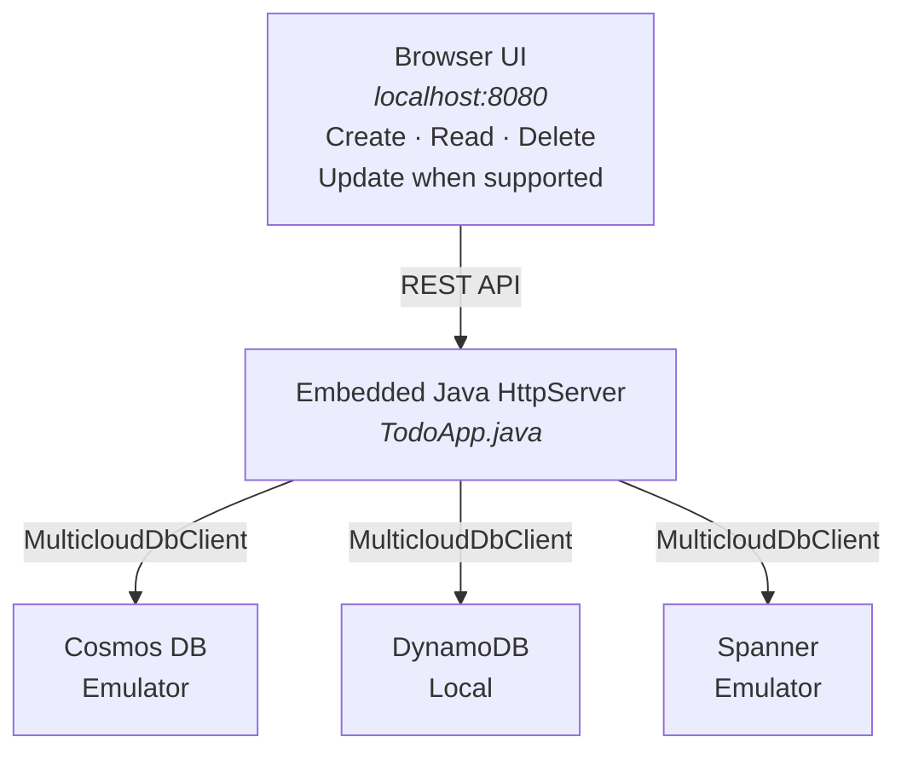

# TODO App Sample

A web application demonstrating the Multicloud DB SDK's portable base API. The
same create/read/upsert/delete/query code runs against **Azure Cosmos DB**,
**Amazon DynamoDB**, or **Google Cloud Spanner** by changing a properties file.
The completion update is optional and must check `Capability.PARTIAL_UPDATE`;
Cosmos DB and DynamoDB support it, while the current Spanner provider rejects a
valid update before provider I/O.

The app starts an embedded HTTP server on `http://localhost:8080` with a
browser-based UI for managing TODO items.

!!! tip "Samples repository"

    The TODO App source code and full setup instructions are in the
    **[multiclouddb-sdk-for-java-samples](https://github.com/microsoft/multiclouddb-sdk-for-java-samples)**
    repository. See the
    [TODO App README](https://github.com/microsoft/multiclouddb-sdk-for-java-samples/blob/main/README-todo-app.md)
    for complete emulator setup, build, and run instructions.

---

## Architecture



---

## Quick Start

Clone the samples repository and build:

```bash
git clone https://github.com/microsoft/multiclouddb-sdk-for-java-samples.git
cd multiclouddb-sdk-for-java-samples
mvn clean install -DskipTests
```

Then run against your chosen provider:

=== "Cosmos DB"

    ```bash
    mvn exec:java \
      -Dexec.mainClass=com.multiclouddb.samples.todo.TodoApp \
      -Dtodo.config=todo-app-cosmos.properties \
      -Djavax.net.ssl.trustStore=$PWD/.tools/cacerts-local \
      -Djavax.net.ssl.trustStorePassword=changeit
    ```

=== "DynamoDB"

    ```bash
    mvn exec:java \
      -Dexec.mainClass=com.multiclouddb.samples.todo.TodoApp \
      -Dtodo.config=todo-app-dynamo.properties
    ```

=== "Spanner"

    ```bash
    mvn exec:java \
      -Dexec.mainClass=com.multiclouddb.samples.todo.TodoApp \
      -Dtodo.config=todo-app-spanner.properties
    ```

Then open **http://localhost:8080** in your browser.

For detailed emulator setup and prerequisites, see the
[full TODO App guide](https://github.com/microsoft/multiclouddb-sdk-for-java-samples/blob/main/README-todo-app.md).

---

## Web UI Features

The browser UI provides:

- **Create** — add new TODO items with a title
- **Read** — view all TODO items in a list
- **Update** — toggle completion status when `PARTIAL_UPDATE` is advertised
- **Delete** — remove items

All operations use `MulticloudDbClient`. Base paths are portable across the
three providers. The update endpoint must be disabled or skipped for current
Spanner because it does not advertise `PARTIAL_UPDATE`; Cosmos DB and DynamoDB
run the shallow partial-update path.
