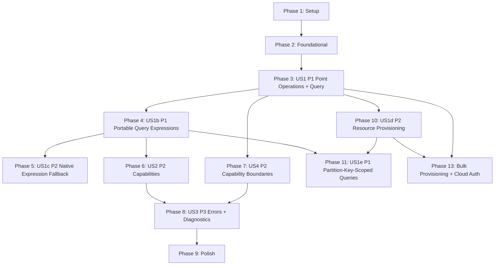

# Tasks: Multicloud DB SDK (Unifying Database Client)

**Input**: Design documents from `specs/001-clouddb-sdk/`  
**Prerequisites**: plan.md (required), spec.md (required), research.md, data-model.md, contracts/openapi.yaml, quickstart.md

**Tech stack (from plan.md)**: Java 17 (LTS), multi-module Maven, SLF4J API, Jackson `JsonNode`, JUnit 5 + Mockito

## Format: `- [ ] T### [P?] [US?] Description with file path`

- **[P]**: Can run in parallel (different files, no dependencies)
- **[US#]**: User story label (required for story phases only)

---

## Phase 1: Setup (Shared Infrastructure)

**Purpose**: Create the multi-module Maven library skeleton and baseline build configuration.

- [x] T001 Create parent Maven aggregator `pom.xml` (modules + shared properties for Java 17)
- [x] T002 Create `multiclouddb-api/pom.xml` (API module; depends on Jackson + SLF4J)
- [x] T003 Create provider SPI interfaces under `multiclouddb-api/src/main/java/com/multiclouddb/spi/` (the shipped project does not use a separate SPI module)
- [x] T004 [P] Create `multiclouddb-provider-cosmos/pom.xml` (provider module; depends on `multiclouddb-api` + `com.azure:azure-cosmos`)
- [x] T005 [P] Create `multiclouddb-provider-dynamo/pom.xml` (provider module; depends on `multiclouddb-api` + `software.amazon.awssdk:dynamodb`)
- [x] T006 [P] Create `multiclouddb-provider-spanner/pom.xml` (provider module; depends on `multiclouddb-api` + `com.google.cloud:google-cloud-spanner`)
- [x] T007 Create `multiclouddb-conformance/pom.xml` (JUnit 5 conformance tests module; depends on `multiclouddb-api` + all provider modules as test/runtime)
- [x] T008 Create `multiclouddb-e2e/pom.xml` (cross-provider executable harness; depends on `multiclouddb-api` + provider modules)
- [x] T009 Configure parent build plugins in `pom.xml` (maven-compiler-plugin Java 17, maven-enforcer-plugin, maven-surefire-plugin JUnit 5)
- [x] T010 [P] Add ServiceLoader resource directories to provider modules (`multiclouddb-provider-*/src/main/resources/META-INF/services/`)

**Checkpoint**: `mvn -q test` runs (even if no tests yet) and the build enforces Java 17.

---

## Phase 2: Foundational (Blocking Prerequisites)

**Purpose**: Define the portable contract, shared types, SPI, configuration model, and the conformance harness scaffolding.

**⚠️ CRITICAL**: No provider adapter work should start until these types are in place.

- [x] T011 Create provider identifier enum in `multiclouddb-api/src/main/java/com/multiclouddb/api/ProviderId.java`
- [x] T012 [P] Create resource addressing type in `multiclouddb-api/src/main/java/com/multiclouddb/api/ResourceAddress.java`
- [x] T013 [P] Create portable key model in `multiclouddb-api/src/main/java/com/multiclouddb/api/MulticloudDbKey.java`
- [~] T014 **SUPERSEDED by Decision 7:** do not add a portability-warning type; use runtime `CapabilitySet` introspection and structured `UNSUPPORTED_CAPABILITY` errors
- [x] T015 [P] Create operation options type in `multiclouddb-api/src/main/java/com/multiclouddb/api/OperationOptions.java` (timeout + cancellation token placeholder)
- [x] T016 [P] Create query request and response types in `multiclouddb-api/src/main/java/com/multiclouddb/api/QueryRequest.java` and `multiclouddb-api/src/main/java/com/multiclouddb/api/QueryPage.java`
- [x] T017 Create error categories in `multiclouddb-api/src/main/java/com/multiclouddb/api/MulticloudDbErrorCategory.java`
- [x] T018 Create error model in `multiclouddb-api/src/main/java/com/multiclouddb/api/MulticloudDbError.java` (includes provider details in sanitized form)
- [x] T019 Create exception wrapper in `multiclouddb-api/src/main/java/com/multiclouddb/api/MulticloudDbException.java` (carries `MulticloudDbError`)
- [x] T020 Create client configuration model in `multiclouddb-api/src/main/java/com/multiclouddb/api/MulticloudDbClientConfig.java` (provider + connection/auth maps + portable options + explicit feature flags)
- [x] T021 Create portable client interface in `multiclouddb-api/src/main/java/com/multiclouddb/api/MulticloudDbClient.java` (create/read/update/upsert/delete/query)
- [x] T022 Create default client implementation shell in `multiclouddb-api/src/main/java/com/multiclouddb/api/internal/DefaultMulticloudDbClient.java` (delegates to SPI adapter; throws structured errors until adapters exist)
- [x] T023 Create factory that selects adapter via ServiceLoader in `multiclouddb-api/src/main/java/com/multiclouddb/api/MulticloudDbClientFactory.java`
- [x] T024 Define the SPI adapter contract in `multiclouddb-api/src/main/java/com/multiclouddb/spi/MulticloudDbProviderAdapter.java` (provider id + createClient)
- [x] T025 Define the SPI client contract in `multiclouddb-api/src/main/java/com/multiclouddb/spi/MulticloudDbProviderClient.java` (create/read/update/upsert/delete/query)
- [x] T026 Create conformance test config loader in `multiclouddb-conformance/src/test/java/com/multiclouddb/conformance/ConformanceConfig.java` (reads env vars / system props; validates required fields)
- [x] T027 Create conformance harness utilities in `multiclouddb-conformance/src/test/java/com/multiclouddb/conformance/ConformanceHarness.java` (build client from config; create unique test resource names)

**Checkpoint**: `multiclouddb-api` (including its SPI package) and `multiclouddb-conformance` compile; conformance tests can instantiate a client.

---

## Phase 3: User Story 1 - Write Once, Run Anywhere Point Operations + Query (Priority: P1) 🎯 MVP

**Goal**: A single Java API provides portable create/read/upsert/delete/query across Cosmos/Dynamo/Spanner. Partial update uses the same API but runs only when the selected provider advertises `PARTIAL_UPDATE`.

**Independent Test**: A single sample class runs create/read/upsert/delete + query against any provider by changing configuration only; capability-gated update runs only on providers advertising `PARTIAL_UPDATE`.

### Tests for User Story 1 (Requested by spec: FR-017 conformance suite)

- [x] T028 [P] [US1] Add provider-inherited CRUD conformance tests in `multiclouddb-conformance/src/test/java/com/multiclouddb/conformance/CrudConformanceTests.java`
- [x] T029 [P] [US1] Add query paging conformance tests in `multiclouddb-conformance/src/test/java/com/multiclouddb/conformance/us1/QueryPagingConformanceTest.java`
- [x] T030 [P] [US1] Add key validation conformance tests in `multiclouddb-conformance/src/test/java/com/multiclouddb/conformance/us1/KeyValidationConformanceTest.java`

### Implementation for User Story 1

- [x] T031 [P] [US1] Implement Cosmos adapter registration in `multiclouddb-provider-cosmos/src/main/resources/META-INF/services/com.multiclouddb.spi.MulticloudDbProviderAdapter`
- [x] T032 [P] [US1] Implement Dynamo adapter registration in `multiclouddb-provider-dynamo/src/main/resources/META-INF/services/com.multiclouddb.spi.MulticloudDbProviderAdapter`
- [x] T033 [P] [US1] Implement Spanner adapter registration in `multiclouddb-provider-spanner/src/main/resources/META-INF/services/com.multiclouddb.spi.MulticloudDbProviderAdapter`

- [x] T034 [US1] Implement Cosmos adapter entrypoint in `multiclouddb-provider-cosmos/src/main/java/com/multiclouddb/provider/cosmos/CosmosProviderAdapter.java` (creates `MulticloudDbProviderClient`)
- [x] T035 [US1] Implement Cosmos client operations in `multiclouddb-provider-cosmos/src/main/java/com/multiclouddb/provider/cosmos/CosmosProviderClient.java` (create/read/update/upsert/delete/query + continuation token paging)

- [x] T036 [US1] Implement Dynamo adapter entrypoint in `multiclouddb-provider-dynamo/src/main/java/com/multiclouddb/provider/dynamo/DynamoProviderAdapter.java` (creates `MulticloudDbProviderClient`)
- [x] T037 [P] [US1] Implement Dynamo JSON↔AttributeValue mapping in `multiclouddb-provider-dynamo/src/main/java/com/multiclouddb/provider/dynamo/DynamoItemMapper.java`
- [x] T038 [US1] Implement Dynamo client operations in `multiclouddb-provider-dynamo/src/main/java/com/multiclouddb/provider/dynamo/DynamoProviderClient.java` (create/read/update/upsert/delete + scan/query with paging token serialization)

- [x] T039 [US1] Implement Spanner adapter entrypoint in `multiclouddb-provider-spanner/src/main/java/com/multiclouddb/provider/spanner/SpannerProviderAdapter.java` (creates `MulticloudDbProviderClient`)
- [x] T040 [P] [US1] Implement Spanner JSON row mapping in `multiclouddb-provider-spanner/src/main/java/com/multiclouddb/provider/spanner/SpannerRowMapper.java`
- [x] T041 [US1] Implement Spanner provider-direct operations in `multiclouddb-provider-spanner/src/main/java/com/multiclouddb/provider/spanner/SpannerProviderClient.java` (create/read/provider-direct update/upsert/delete + query with best-effort paging; portable update remains capability-gated)

- [x] T042 [US1] Wire adapter selection and delegation in `multiclouddb-api/src/main/java/com/multiclouddb/api/internal/DefaultMulticloudDbClient.java` (invoke provider client; normalize failures)

- [x] T043 [P] [US1] Create the E2E config loader in `multiclouddb-e2e/src/main/java/com/microsoft/multiclouddb/e2e/ConfigLoader.java` (properties-file and system-property support)
- [x] T044 [US1] Implement portable point operations and query examples in `multiclouddb-e2e/src/main/java/com/microsoft/multiclouddb/e2e/Main.java` (switch provider by config only)

**Checkpoint**: Running the `multiclouddb-e2e` harness succeeds against each configured provider; partial update runs only when advertised, and conformance tests pass for the supported subset.

---

## Phase 4: User Story 1b - Portable Query Expressions Across Providers (Priority: P1)

**Goal**: Write query filter expressions once using a portable SQL-subset syntax with named `@paramName` parameters and portable function names. The SDK automatically translates expressions into each provider's native query format (Cosmos SQL, DynamoDB PartiQL, Spanner GoogleSQL).

**Independent Test**: A single portable expression (e.g., `status = @status AND starts_with(name, @prefix)`) executed against each provider returns equivalent results. Switching providers requires no expression changes.

**Key Design Decisions**: SQL-subset WHERE clause syntax (Decision 10), DynamoDB PartiQL backend (Decision 11), 5 portable functions (Decision 12), parsed AST via hand-written recursive-descent parser (Decision 13), capability-gated query features fail fast at translation time (Decision 15).

### Tests for User Story 1b (FR-017 conformance + FR-028 validation)

- [x] T045 [P] [US1b] Add expression parser unit tests in `multiclouddb-conformance/src/test/java/com/multiclouddb/conformance/us1b/ExpressionParserTest.java` (literals, operators, precedence, parentheses, functions, IN, BETWEEN, parameters, malformed input, empty/null)
- [x] T046 [P] [US1b] Add per-provider expression translation unit tests in `multiclouddb-conformance/src/test/java/com/multiclouddb/conformance/us1b/ExpressionTranslationTest.java` (verify AST→Cosmos SQL, AST→DynamoDB PartiQL, AST→Spanner GoogleSQL for each operator, function, and edge case)
- [x] T047 [P] [US1b] Add cross-provider portable query conformance tests in `multiclouddb-conformance/src/test/java/com/multiclouddb/conformance/us1b/PortableQueryConformanceTest.java` (same expression, same data, same results on all providers; covers SC-006, SC-007, SC-010)

### Implementation — AST Types (multiclouddb-api)

- [x] T048 [P] [US1b] Create supporting leaf types in `multiclouddb-api/src/main/java/com/multiclouddb/api/query/`: `FieldRef.java` (field name string, supports single-level dot notation), `Literal.java` (typed value: string, number, boolean, null), `Parameter.java` (`@paramName` reference resolved from parameters map)
- [x] T049 [P] [US1b] Create enums in `multiclouddb-api/src/main/java/com/multiclouddb/api/query/`: `ComparisonOp.java` (EQ, NE, LT, GT, LE, GE), `LogicalOp.java` (AND, OR), `PortableFunction.java` (STARTS_WITH, CONTAINS, FIELD_EXISTS, STRING_LENGTH, COLLECTION_SIZE)
- [x] T050 [US1b] Create Expression sealed interface and 6 expression record types in `multiclouddb-api/src/main/java/com/multiclouddb/api/query/`: `Expression.java` (sealed root), `ComparisonExpression.java` (field op value/param), `LogicalExpression.java` (left AND/OR right), `NotExpression.java` (NOT child), `FunctionCallExpression.java` (portable function with arguments), `InExpression.java` (field IN values), `BetweenExpression.java` (field BETWEEN low AND high)

### Implementation — Parser & Validator (multiclouddb-api)

- [x] T051 [US1b] Implement hand-written recursive-descent ExpressionParser in `multiclouddb-api/src/main/java/com/multiclouddb/api/query/ExpressionParser.java` (tokenizer + parser; handles operator precedence NOT > AND > OR, parentheses, function calls, IN lists, BETWEEN, literal types, @param references; returns Expression AST; throws on malformed input per FR-028)
- [x] T052 [US1b] Implement ExpressionValidator in `multiclouddb-api/src/main/java/com/multiclouddb/api/query/ExpressionValidator.java` (validates all @param references have corresponding entries in parameters map, validates function names against provider capabilities, validates capability-gated features per FR-028/FR-032; produces typed validation errors with position info)

### Implementation — Translator SPI (multiclouddb-api)

- [x] T053 [US1b] Create `ExpressionTranslator` in `multiclouddb-api/src/main/java/com/multiclouddb/api/query/ExpressionTranslator.java` (translate an expression and parameter map for a provider collection into `TranslatedQuery`)
- [x] T054 [US1b] Create TranslatedQuery result type in `multiclouddb-api/src/main/java/com/multiclouddb/api/query/TranslatedQuery.java` (fields: nativeExpression string, boundParameters map/list, optional fullStatement string)

### Implementation — API Modifications (multiclouddb-api)

- [x] T055 [US1b] Add `nativeExpression` field to `multiclouddb-api/src/main/java/com/multiclouddb/api/QueryRequest.java` (mutually exclusive with `expression`; builder validation: exactly one of expression/nativeExpression set, or both null for full scan per FR-029/FR-030; `nativeExpression` includes target provider id for validation)
- [x] T056 [US1b] Add 6 query capability constants to `multiclouddb-api/src/main/java/com/multiclouddb/api/Capability.java` (PORTABLE_QUERY_EXPRESSION, LIKE_OPERATOR, ORDER_BY, ENDS_WITH, REGEX_MATCH, CASE_FUNCTIONS)

### Implementation — Provider Translators

- [x] T057 [P] [US1b] Implement CosmosExpressionTranslator in `multiclouddb-provider-cosmos/src/main/java/com/multiclouddb/provider/cosmos/CosmosExpressionTranslator.java` (AST → Cosmos SQL WHERE clause; adds `c.` prefix to field refs; keeps `@paramName` parameters; translates functions: starts_with→STARTSWITH, contains→CONTAINS, field_exists→IS_DEFINED, string_length→LENGTH, collection_size→ARRAY_LENGTH; generates full statement `SELECT * FROM c WHERE ...`)
- [x] T058 [P] [US1b] Implement DynamoExpressionTranslator in `multiclouddb-provider-dynamo/src/main/java/com/multiclouddb/provider/dynamo/DynamoExpressionTranslator.java` (AST → DynamoDB PartiQL WHERE clause; double-quotes table name; converts `@paramName` to positional `?` parameters and builds ordered parameter list; translates functions: starts_with→begins_with, contains→contains, field_exists→IS NOT MISSING, string_length→char_length, collection_size→size; handles reserved word escaping with double-quotes)
- [x] T059 [P] [US1b] Implement SpannerExpressionTranslator in `multiclouddb-provider-spanner/src/main/java/com/multiclouddb/provider/spanner/SpannerExpressionTranslator.java` (AST → Spanner GoogleSQL WHERE clause; bare field names; keeps `@paramName` parameters; translates functions: starts_with→STARTS_WITH, contains→STRPOS(field,value)>0, field_exists→field IS NOT NULL, string_length→CHAR_LENGTH, collection_size→ARRAY_LENGTH; generates full statement `SELECT * FROM <table> WHERE ...`)

### Implementation — Provider Integration

- [x] T060 [US1b] Switch DynamoDB query backend from Scan + FilterExpression to PartiQL `executeStatement` in `multiclouddb-provider-dynamo/src/main/java/com/multiclouddb/provider/dynamo/DynamoProviderClient.java` (replace Scan-based query with `DynamoDbClient.executeStatement()`; handle PartiQL parameter binding with positional `?` params; implement continuation token via `nextToken`; preserve paging semantics per Decision 11)
- [x] T061 [US1b] Integrate expression parsing, validation, and translation in `multiclouddb-api/src/main/java/com/multiclouddb/api/internal/DefaultMulticloudDbClient.java` (when `expression` is set: parse → validate → translate via provider's ExpressionTranslator → pass TranslatedQuery to provider client; when `nativeExpression` is set: pass through; when both null: full scan per FR-029; fail fast on validation errors before any I/O per FR-028)
- [x] T062 [P] [US1b] Update CosmosProviderClient to accept TranslatedQuery for portable expressions in `multiclouddb-provider-cosmos/src/main/java/com/multiclouddb/provider/cosmos/CosmosProviderClient.java` (use translated fullStatement as Cosmos SQL query; bind parameters from TranslatedQuery)
- [x] T063 [P] [US1b] Update SpannerProviderClient to accept TranslatedQuery for portable expressions in `multiclouddb-provider-spanner/src/main/java/com/multiclouddb/provider/spanner/SpannerProviderClient.java` (use translated fullStatement as Spanner GoogleSQL; bind named parameters from TranslatedQuery)
- [x] T064 [P] [US1b] Update CosmosCapabilities to include query DSL capabilities in `multiclouddb-provider-cosmos/src/main/java/com/multiclouddb/provider/cosmos/CosmosCapabilities.java` (add: PORTABLE_QUERY_EXPRESSION, LIKE_OPERATOR, ORDER_BY, ENDS_WITH, REGEX_MATCH, CASE_FUNCTIONS — all supported)
- [x] T065 [P] [US1b] Update DynamoCapabilities to include query DSL capabilities in `multiclouddb-provider-dynamo/src/main/java/com/multiclouddb/provider/dynamo/DynamoCapabilities.java` (add: PORTABLE_QUERY_EXPRESSION supported; LIKE_OPERATOR, ORDER_BY, ENDS_WITH, REGEX_MATCH, CASE_FUNCTIONS unsupported)
- [x] T066 [P] [US1b] Update SpannerCapabilities to include query DSL capabilities in `multiclouddb-provider-spanner/src/main/java/com/multiclouddb/provider/spanner/SpannerCapabilities.java` (add: PORTABLE_QUERY_EXPRESSION, LIKE_OPERATOR, ORDER_BY, ENDS_WITH, CASE_FUNCTIONS supported; REGEX_MATCH supported)

**Checkpoint**: A portable expression like `status = @status AND starts_with(name, @prefix)` executes correctly against each provider via the conformance tests. DynamoDB queries now use PartiQL. Capability-gated features (e.g., LIKE on DynamoDB) fail fast with typed errors before execution. SC-006, SC-007, SC-008, SC-010 verifiable.

---

## Phase 5: User Story 1c - Native Expression Fallback (Priority: P2)

**Goal**: Use provider-specific query features (e.g., `LIKE` on Cosmos, regex on Spanner) by submitting a native expression that bypasses the portable translator. The SDK passes the expression through directly and clearly signals non-portability.

**Independent Test**: A native Cosmos SQL expression with `LIKE` executes correctly on Cosmos. Attempting to run the same native expression against DynamoDB produces a clear error. SC-009 verifiable.

### Tests for User Story 1c

- [x] T067 [P] [US1c] Add native-expression passthrough coverage in `multiclouddb-conformance/src/test/java/com/multiclouddb/conformance/us1b/NativeExpressionTest.java`
- [x] T068 [P] [US1c] Add provider-target mismatch coverage in `multiclouddb-conformance/src/test/java/com/multiclouddb/conformance/us1b/NativeExpressionTest.java` (mismatches fail before provider execution per FR-030)

### Implementation for User Story 1c

- [x] T069 [US1c] Implement native-expression validation and passthrough in `multiclouddb-api/src/main/java/com/multiclouddb/api/internal/DefaultMulticloudDbClient.java` (target mismatches fail fast with a structured error; matching expressions pass through without translation)
- [x] T070 [P] [US1c] Implement Cosmos native expression passthrough in `multiclouddb-provider-cosmos/src/main/java/com/multiclouddb/provider/cosmos/CosmosProviderClient.java` (accept raw native expression string; execute as Cosmos SQL directly; bind parameters if provided)
- [x] T071 [P] [US1c] Implement DynamoDB native expression passthrough (PartiQL) in `multiclouddb-provider-dynamo/src/main/java/com/multiclouddb/provider/dynamo/DynamoProviderClient.java` (accept raw native expression string; execute as PartiQL directly via executeStatement; bind positional parameters)
- [x] T072 [P] [US1c] Implement Spanner native expression passthrough in `multiclouddb-provider-spanner/src/main/java/com/multiclouddb/provider/spanner/SpannerProviderClient.java` (accept raw native expression string; execute as Spanner GoogleSQL directly; bind named parameters)

**Checkpoint**: Native expressions pass through to each provider correctly. Cross-provider mismatch is detected and produces structured errors. Portable contract is unaffected when native mode is not used. SC-009 passes.

---

## Phase 6: User Story 2 - Portability Confidence via Capabilities & Clear Differences (Priority: P2)

**Goal**: Users can preflight capabilities and get fail-fast, actionable errors when a capability is not supported.

**Independent Test**: A test run can assert that unsupported capabilities are discoverable and cause structured fail-fast errors. This now includes the 6 query DSL capabilities added in Phase 4.

### Tests for User Story 2

- [x] T073 [P] [US2] Add capability discovery tests in `multiclouddb-conformance/src/test/java/com/multiclouddb/conformance/us2/CapabilitiesConformanceTest.java` (includes query DSL capabilities: verify Cosmos reports all 6 supported, DynamoDB reports only PORTABLE_QUERY_EXPRESSION, Spanner reports all except those unsupported)
- [x] T074 [P] [US2] Add fail-fast unsupported capability tests in `multiclouddb-conformance/src/test/java/com/multiclouddb/conformance/us2/UnsupportedCapabilityConformanceTest.java` (includes query capability-gated features: LIKE on DynamoDB → structured error per SC-008)

### Implementation for User Story 2

- [x] T075 [US2] Define capability names and model in `multiclouddb-api/src/main/java/com/multiclouddb/api/Capability.java` and `multiclouddb-api/src/main/java/com/multiclouddb/api/CapabilitySet.java` (general CRUD capabilities + query DSL capabilities from T056)
- [x] T076 [US2] Add `capabilities()` to `multiclouddb-api/src/main/java/com/multiclouddb/api/MulticloudDbClient.java` and implement in `multiclouddb-api/src/main/java/com/multiclouddb/api/internal/DefaultMulticloudDbClient.java`
- [x] T077 [P] [US2] Implement Cosmos capabilities in `multiclouddb-provider-cosmos/src/main/java/com/multiclouddb/provider/cosmos/CosmosCapabilities.java` (merge CRUD + query capabilities into single capability set)
- [x] T078 [P] [US2] Implement Dynamo capabilities in `multiclouddb-provider-dynamo/src/main/java/com/multiclouddb/provider/dynamo/DynamoCapabilities.java` (merge CRUD + query capabilities into single capability set)
- [x] T079 [P] [US2] Implement Spanner capabilities in `multiclouddb-provider-spanner/src/main/java/com/multiclouddb/provider/spanner/SpannerCapabilities.java` (merge CRUD + query capabilities into single capability set)
- [x] T080 [US2] Enforce fail-fast checks in `multiclouddb-api/src/main/java/com/multiclouddb/api/internal/DefaultMulticloudDbClient.java` (when request depends on an unsupported capability, including query capability-gated features)

**Checkpoint**: Apps can call `client.capabilities()` and receive deterministic support info for all capabilities including query DSL features; unsupported operations return `MulticloudDbException` with actionable messages.

---

## Phase 7: User Story 4 - Configuration-Only Provider Opt-ins (Priority: P2)

**Goal**: Provider-specific behavior is not silently exposed through the portable contract. Callers use explicit configuration, capability introspection, and structured errors; no native-client or provider-extension API is exposed.

**Independent Test**: Unsupported or provider-mismatched operations expose the boundary through `CapabilitySet` and structured errors while the portable contract remains unchanged.

### Tests for User Story 4

- [~] T081 [P] [US4] **SUPERSEDED by Decision 7:** capability and fail-fast behavior is covered by `multiclouddb-conformance/src/test/java/com/multiclouddb/conformance/us2/CapabilitiesConformanceTest.java` and `UnsupportedCapabilityConformanceTest.java`
- [~] T082 [P] [US4] **SUPERSEDED by FR-015/FR-020:** native-client access tests are not applicable because no native-client API is exposed.

### Implementation for User Story 4

- [~] T083 [US4] **SUPERSEDED by FR-015/FR-020:** do not add `nativeClient(Class<T>)` or any other native-client escape hatch.
- [~] T084 [US4] **SUPERSEDED by FR-015/FR-020:** no default-client wiring for native-client access is permitted.
- [~] T085 [P] [US4] **SUPERSEDED by FR-015/FR-020:** no Cosmos provider-extension API is part of the public SDK.
- [~] T086 [P] [US4] **SUPERSEDED by FR-015/FR-020:** no DynamoDB provider-extension API is part of the public SDK.
- [~] T087 [P] [US4] **SUPERSEDED by FR-015/FR-020:** no Spanner provider-extension API is part of the public SDK.
- [~] T088 [US4] **SUPERSEDED by FR-015/FR-020:** there is no portability-warning result surface or escape-hatch result wiring.

**Checkpoint**: Opt-ins are configuration-driven and visible through capabilities and structured errors. No portability-warning, native-client, or provider-extension API exists.

---

## Phase 8: User Story 3 - Consistent Failure Handling & Diagnostics (Priority: P3)

**Goal**: Errors are categorized consistently across providers with retryability + sanitized details, and each operation exposes diagnostics.

**Independent Test**: Unit/conformance tests verify consistent categories and diagnostics presence without secret leakage.

### Tests for User Story 3

- [x] T089 [P] [US3] Add error mapping unit tests for Cosmos in `multiclouddb-provider-cosmos/src/test/java/com/multiclouddb/provider/cosmos/CosmosErrorMappingTest.java`
- [x] T090 [P] [US3] Add error mapping unit tests for Dynamo in `multiclouddb-provider-dynamo/src/test/java/com/multiclouddb/provider/dynamo/DynamoErrorMappingTest.java`
- [x] T091 [P] [US3] Add error mapping unit tests for Spanner in `multiclouddb-provider-spanner/src/test/java/com/multiclouddb/provider/spanner/SpannerErrorMappingTest.java`
- [x] T092 [P] [US3] Add diagnostics-presence tests in `multiclouddb-conformance/src/test/java/com/multiclouddb/conformance/us2/DiagnosticsConformanceTest.java`

### Implementation for User Story 3

- [x] T093 [US3] Define diagnostics model in `multiclouddb-api/src/main/java/com/multiclouddb/api/OperationDiagnostics.java` (provider, operation, duration, request id)
- [x] T094 [US3] Attach diagnostics to results/errors in `multiclouddb-api/src/main/java/com/multiclouddb/api/MulticloudDbException.java` and `multiclouddb-api/src/main/java/com/multiclouddb/api/internal/DefaultMulticloudDbClient.java`
- [x] T095 [P] [US3] Implement Cosmos exception mapping + sanitization in `multiclouddb-provider-cosmos/src/main/java/com/multiclouddb/provider/cosmos/CosmosErrorMapper.java`
- [x] T096 [P] [US3] Implement Dynamo exception mapping + sanitization in `multiclouddb-provider-dynamo/src/main/java/com/multiclouddb/provider/dynamo/DynamoErrorMapper.java`
- [x] T097 [P] [US3] Implement Spanner exception mapping + sanitization in `multiclouddb-provider-spanner/src/main/java/com/multiclouddb/provider/spanner/SpannerErrorMapper.java`
- [x] T098 [US3] Use mappers in provider clients (`multiclouddb-provider-cosmos/src/main/java/com/multiclouddb/provider/cosmos/CosmosProviderClient.java`, `multiclouddb-provider-dynamo/src/main/java/com/multiclouddb/provider/dynamo/DynamoProviderClient.java`, `multiclouddb-provider-spanner/src/main/java/com/multiclouddb/provider/spanner/SpannerProviderClient.java`) to produce consistent `MulticloudDbException` and retryable signals

**Checkpoint**: Errors are consistent across providers, include retryability, and diagnostics are available without logging secrets.

---

## Phase 9: Polish & Cross-Cutting Concerns

**Purpose**: Documentation, compatibility policy, sample updates, and baseline quality improvements that cut across stories.

- [x] T099 [P] Document provider compatibility & portability guarantees in `docs/compatibility.md` (fulfills FR-018; includes query DSL portability matrix and capability-gated features table)
- [x] T100 Update quickstart to match actual module/artifact usage in `specs/001-clouddb-sdk/quickstart.md` (verify portable expression examples work end-to-end)
- [x] T101 Add provider configuration examples for conformance + samples in `specs/001-clouddb-sdk/quickstart.md` (env vars/system props)
- [x] T102 Run and update conceptual contract notes (if needed) in `specs/001-clouddb-sdk/contracts/openapi.yaml`
- [x] T103 [P] Update `multiclouddb-e2e/src/main/java/com/microsoft/multiclouddb/e2e/Main.java` to demonstrate portable query expressions; native-expression boundaries remain documented in the quickstart

---

## Phase 10: User Story 1d - Portable Resource Provisioning (Priority: P2)

**Goal**: Applications can create database and collection/container/table resources using the SDK's portable API (`ensureDatabase` + `ensureContainer`) without any provider-specific provisioning code.

**Independent Test**: The E2E harness provisions its configured database and collection through `client.ensureDatabase()` and `client.ensureContainer()` only; provider tests verify each native mapping.

**Key Design Decisions**: Provisioning is exposed through backward-compatible SPI defaults and idempotent provider overrides, with the standard portable key/data schema mapped natively by each provider.

### Implementation — SPI & Public API

- [x] T104 [US1d] Add `ensureDatabase(String database)` and `ensureContainer(ResourceAddress address)` as default methods to `multiclouddb-api/src/main/java/com/multiclouddb/spi/MulticloudDbProviderClient.java` (providers override as needed)
- [x] T105 [US1d] Add `ensureDatabase(String database)` and `ensureContainer(ResourceAddress address)` to `multiclouddb-api/src/main/java/com/multiclouddb/api/MulticloudDbClient.java` (public API surface)
- [x] T106 [US1d] Add provisioning delegation with diagnostics/timing to `multiclouddb-api/src/main/java/com/multiclouddb/api/internal/DefaultMulticloudDbClient.java` (Instant timing, MulticloudDbException enrichment, wrapUnexpected pattern consistent with existing operations)

### Implementation — Provider Provisioning

- [x] T107 [P] [US1d] Implement Cosmos provisioning in `multiclouddb-provider-cosmos/src/main/java/com/multiclouddb/provider/cosmos/CosmosProviderClient.java` (`ensureDatabase` → `cosmosClient.createDatabaseIfNotExists(database)`; `ensureContainer` → `database.createContainerIfNotExists(new CosmosContainerProperties(collection, "/partitionKey"))`)
- [x] T108 [P] [US1d] Implement DynamoDB provisioning in `multiclouddb-provider-dynamo/src/main/java/com/multiclouddb/provider/dynamo/DynamoProviderClient.java` (`ensureDatabase` → no-op with debug log; `ensureContainer` → resolves table name via `resolveTableName()`, checks `listTables()`, creates table with `ATTR_ID` hash key + `ATTR_SORT_KEY` sort key, `BillingMode.PAY_PER_REQUEST`, catches `ResourceInUseException` for race conditions)
- [x] T109 [P] [US1d] Implement Spanner provisioning in `multiclouddb-provider-spanner/src/main/java/com/multiclouddb/provider/spanner/SpannerProviderClient.java` (`ensureDatabase` validates the configured database name, creates the emulator instance only in emulator mode, and creates the database in both modes; production requires the instance to pre-exist. `ensureContainer` probes with `SELECT 1 FROM tableName LIMIT 1`, catches NOT_FOUND/INVALID_ARGUMENT, then creates via `DatabaseAdminClient.updateDatabaseDdl()` with DDL: `CREATE TABLE tableName (partitionKey STRING(MAX) NOT NULL, sortKey STRING(MAX) NOT NULL, data STRING(MAX)) PRIMARY KEY (partitionKey, sortKey)`, catching "Duplicate name in schema" for race conditions.)

### Integration — E2E Harness

- [x] T110 [US1d] Exercise portable provisioning through `client.ensureDatabase()` and `client.ensureContainer()` in `multiclouddb-e2e/src/main/java/com/microsoft/multiclouddb/e2e/Main.java`

**Checkpoint**: The E2E harness uses only portable provisioning APIs, and provider tests cover Cosmos DB, DynamoDB, and Spanner mappings.

---

## Phase 11: User Story 1e - Partition-Key-Scoped Queries (Priority: P1)

**Goal**: Queries can be scoped to a specific partition key value, enabling each provider to use its native efficient partition-scoping mechanism instead of cross-partition scans. Conformance tests demonstrate partition-key co-location.

**Independent Test**: A query with `partitionKey("portfolio-alpha")` returns only items within that partition on Cosmos DB, DynamoDB, and Spanner, using each provider-native scoping mechanism.

**Key Design Decisions**: `QueryRequest.partitionKey` is optional (null preserves cross-partition behavior). Cosmos DB uses `CosmosQueryRequestOptions.setPartitionKey()`, DynamoDB adds a `partitionKey` PartiQL predicate, and Spanner adds a bound `partitionKey` GoogleSQL predicate.

### Implementation — API Modification

- [x] T111 [US1e] Add optional `partitionKey` field to `multiclouddb-api/src/main/java/com/multiclouddb/api/QueryRequest.java` (builder method `partitionKey(String value)`, getter `partitionKey()`, null by default for backward compatibility)

### Implementation — Provider Partition Scoping

- [x] T112 [P] [US1e] Update Cosmos query methods in `multiclouddb-provider-cosmos/src/main/java/com/multiclouddb/provider/cosmos/CosmosProviderClient.java` to set `CosmosQueryRequestOptions.setPartitionKey(new PartitionKey(pk))` when `QueryRequest.partitionKey()` is non-null (applies to both `query()` and `queryWithTranslation()` methods); also updated `create()`/`upsert()` to always set `partitionKey` document field (defaulting to `key.sortKey()` when partition is null) for correct container partition key path `/partitionKey`
- [x] T113 [P] [US1e] Update DynamoDB query methods in `multiclouddb-provider-dynamo/src/main/java/com/multiclouddb/provider/dynamo/DynamoProviderClient.java` to add `AND "partitionKey" = '?'` WHERE condition in PartiQL when `QueryRequest.partitionKey()` is non-null (applies to both `query()` and `queryWithTranslation()` methods)
- [x] T114 [P] [US1e] Update Spanner query methods in `multiclouddb-provider-spanner/src/main/java/com/multiclouddb/provider/spanner/SpannerProviderClient.java` to add `AND partitionKey = @_pkval` WHERE condition when `QueryRequest.partitionKey()` is non-null

### External Sample Work (Not Shipped by This Reactor)

- [~] T115 [US1e] **SUPERSEDED:** Risk Platform seeding belongs to the external samples repository; partition isolation is covered in `multiclouddb-conformance/src/test/java/com/multiclouddb/conformance/CrudConformanceTests.java`
- [~] T116 [US1e] **SUPERSEDED:** `RiskPlatformApp` is not a shipped SDK artifact; portable partition-scoped query behavior is covered by conformance tests
- [~] T117 [US1e] **SUPERSEDED:** `TenantManager` is not a shipped SDK artifact; provider switching is exercised by the E2E and conformance profiles

### Tests — Partition-Key-Scoped Queries

- [x] T118 [P] [US1e] Add partition-key-scoped query conformance tests in `multiclouddb-conformance/src/test/java/com/multiclouddb/conformance/CrudConformanceTests.java` — added 3 tests: `queryByPartitionKey` (Order 11), `queryWithoutPartitionKey` (Order 12), `queryNonexistentPartition` (Order 13) — verifies partition isolation, cross-partition backward compatibility, and empty-result handling
- [x] T119 [US1e] Build and validate partition-key-scoped query support across the then-applicable Cosmos DB and DynamoDB suites; exact historical test totals are intentionally not retained

**Checkpoint**: Partition-key-scoped queries work on all providers, and conformance coverage verifies isolation, cross-partition compatibility, and empty results. SC-013 and SC-014 pass.

---

## Dependencies & Execution Order

### Phase Dependencies

- **Setup (Phase 1)**: No dependencies; start immediately
- **Foundational (Phase 2)**: Depends on Setup; blocks all user stories
- **US1 — Point Operations + Query (Phase 3)**: Depends on Foundational; MVP target
- **US1b — Portable Query Expressions (Phase 4)**: Depends on US1 (needs working adapters and query infrastructure)
- **US1c — Native Expression Fallback (Phase 5)**: Depends on US1b (needs nativeExpression field on QueryRequest from T055 and translator integration from T061)
- **US2 — Capabilities (Phase 6)**: Depends on US1b (needs query capability constants from T056 and per-provider capabilities from T064–T066)
- **US4 — Configuration-Only Opt-ins (Phase 7)**: Depends on US1; superseded native-extension and warning-surface work remains documented as such
- **US3 — Errors & Diagnostics (Phase 8)**: Depends on US2 and US4
- **Polish (Phase 9)**: Depends on completing the desired user stories
- **US1d — Resource Provisioning (Phase 10)**: Depends on Foundational (Phase 2); needs MulticloudDbClient, MulticloudDbProviderClient, DefaultMulticloudDbClient, and working provider adapters. Can proceed independently of US1b/US1c.
- **US1e — Partition-Key-Scoped Queries (Phase 11)**: Depends on US1b (needs QueryRequest + working query infrastructure).
- **Bulk Provisioning + Cloud Auth (Phase 13)**: Depends on US1d (extends provisioning with provisionSchema API); Cosmos cloud auth depends on Cosmos provider adapter (Phase 3).

### Dependency Graph

### User Story Dependencies

- **US1 (P1)**: Depends on Phase 2 only
- **US1b (P1)**: Depends on US1 (working provider adapters + query infrastructure)
- **US1c (P2)**: Depends on US1b (nativeExpression field + translator integration)
- **US1d (P2)**: Depends on US1 (working provider adapters + MulticloudDbClient/SPI interfaces); independent of US1b/US1c
- **US1e (P1)**: Depends on US1b (QueryRequest + query infrastructure)
- **US2 (P2)**: Depends on US1b (query capability constants and per-provider capability sets)
- **US4 (P2)**: Depends on US1 client/adapters; independent of US1b/US1c
- **US3 (P3)**: Depends on US2 and US4

---

## Parallel Opportunities

- **Phase 1**: Provider `pom.xml` files (T004–T006) are parallel
- **Phase 2**: Most portable type files are parallel (T012–T016)
- **US1**: Adapter registrations (T031–T033) and mapping helpers (T037, T040) are parallel
- **US1b — AST types**: Supporting leaf types (T048) and enums (T049) are parallel; AST tests (T045–T047) are parallel with each other
- **US1b — Translators**: All three provider translators (T057–T059) are parallel; provider capability updates (T064–T066) are parallel
- **US1b — Provider integration**: Provider client updates (T062, T063) are parallel with each other
- **US1c**: Native passthrough per provider (T070–T072) are parallel; tests (T067–T068) are parallel
- **US2/US4/US3**: Capability/extension/error-mapper implementations per provider are parallel (tasks marked [P])

---

## Parallel Example: User Story 1b — AST + Enums

Run these in parallel (different files, no inter-dependencies):

- Task T045: `multiclouddb-conformance/.../us1b/ExpressionParserTest.java`
- Task T046: `multiclouddb-conformance/.../us1b/ExpressionTranslationTest.java`
- Task T047: `multiclouddb-conformance/.../us1b/PortableQueryConformanceTest.java`
- Task T048: `multiclouddb-api/.../query/FieldRef.java`, `Literal.java`, `Parameter.java`
- Task T049: `multiclouddb-api/.../query/ComparisonOp.java`, `LogicalOp.java`, `PortableFunction.java`

---

## Parallel Example: User Story 1b — Provider Translators

Run these in parallel (different modules, no cross-dependencies):

- Task T057: `multiclouddb-provider-cosmos/.../CosmosExpressionTranslator.java`
- Task T058: `multiclouddb-provider-dynamo/.../DynamoExpressionTranslator.java`
- Task T059: `multiclouddb-provider-spanner/.../SpannerExpressionTranslator.java`
- Task T064: `multiclouddb-provider-cosmos/.../CosmosCapabilities.java` (query caps)
- Task T065: `multiclouddb-provider-dynamo/.../DynamoCapabilities.java` (query caps)
- Task T066: `multiclouddb-provider-spanner/.../SpannerCapabilities.java` (query caps)

---

## Parallel Example: User Story 1c — Native Passthrough

Run these in parallel (different modules):

- Task T067: `multiclouddb-conformance/.../us1c/NativeExpressionConformanceTest.java`
- Task T068: `multiclouddb-conformance/.../us1c/NativeExpressionMismatchTest.java`
- Task T070: `multiclouddb-provider-cosmos/.../CosmosProviderClient.java` (native passthrough)
- Task T071: `multiclouddb-provider-dynamo/.../DynamoProviderClient.java` (native passthrough)
- Task T072: `multiclouddb-provider-spanner/.../SpannerProviderClient.java` (native passthrough)

---

## Parallel Example: User Story 1

Run these in parallel (different files, low conflict):

- Task T031: `multiclouddb-provider-cosmos/src/main/resources/META-INF/services/com.multiclouddb.spi.MulticloudDbProviderAdapter`
- Task T032: `multiclouddb-provider-dynamo/src/main/resources/META-INF/services/com.multiclouddb.spi.MulticloudDbProviderAdapter`
- Task T033: `multiclouddb-provider-spanner/src/main/resources/META-INF/services/com.multiclouddb.spi.MulticloudDbProviderAdapter`
- Task T037: `multiclouddb-provider-dynamo/src/main/java/com/multiclouddb/provider/dynamo/DynamoItemMapper.java`
- Task T040: `multiclouddb-provider-spanner/src/main/java/com/multiclouddb/provider/spanner/SpannerRowMapper.java`

---

## Parallel Example: User Story 2

Run these in parallel (different files, low conflict):

- Task T073: `multiclouddb-conformance/.../us2/CapabilitiesConformanceTest.java`
- Task T074: `multiclouddb-conformance/.../us2/UnsupportedCapabilityConformanceTest.java`
- Task T077: `multiclouddb-provider-cosmos/.../CosmosCapabilities.java`
- Task T078: `multiclouddb-provider-dynamo/.../DynamoCapabilities.java`
- Task T079: `multiclouddb-provider-spanner/.../SpannerCapabilities.java`

---

## Parallel Example: User Story 3

Run these in parallel (different files, low conflict):

- Task T089: `multiclouddb-provider-cosmos/src/test/.../CosmosErrorMappingTest.java`
- Task T090: `multiclouddb-provider-dynamo/src/test/.../DynamoErrorMappingTest.java`
- Task T091: `multiclouddb-provider-spanner/src/test/.../SpannerErrorMappingTest.java`
- Task T095: `multiclouddb-provider-cosmos/.../CosmosErrorMapper.java`
- Task T096: `multiclouddb-provider-dynamo/.../DynamoErrorMapper.java`
- Task T097: `multiclouddb-provider-spanner/.../SpannerErrorMapper.java`

---

## Implementation Strategy

### MVP Scope (US1 Only)

1. Complete Phase 1 (Setup)
2. Complete Phase 2 (Foundational)
3. Complete Phase 3 (US1) including conformance tests + E2E harness
4. Validate portability by running the E2E harness + conformance against at least one provider, then expand

### Incremental Delivery

- Add US1b (portable query expressions — parser, AST, translators, PartiQL migration)
- Add US1c (explicit native-expression fallback for provider-specific query syntax)
- Add US1d (portable resource provisioning — ensureDatabase + ensureContainer across all providers)
- Add US2 (capabilities + fail-fast, including query DSL capabilities)
- Add US4 (configuration-only provider opt-ins through capabilities and structured errors; no extension or warning API)
- Add US3 (errors/diagnostics consistency)
- Add US1e (partition-key-scoped queries — QueryRequest.partitionKey and native provider scoping)

---

## Phase 12 — MulticloudDbKey Semantic Rename (T120–T127)

Renames key accessors from `MulticloudDbKey.partition()`/`MulticloudDbKey.id()`
to `MulticloudDbKey.partitionKey()`/`MulticloudDbKey.sortKey()`
and renames CRUD operations from `put/get/delete` to `create/read/update/upsert/delete`.
All three providers share consistent key semantics:
`MulticloudDbKey.partitionKey()` → distribution/hash key,
`MulticloudDbKey.sortKey()` → item identifier/sort key.

### Sequential Tasks

- [x] Task T120: Rename `DynamoProviderClient.java` — update key mapping to use
  `MulticloudDbKey.partitionKey()` → HASH (`partitionKey` attribute) and
  `MulticloudDbKey.sortKey()` → RANGE (`sortKey` attribute);
  rename `ATTR_SORT_KEY` → `ATTR_PARTITION_KEY`; update `create/read/update/upsert/delete/query/ensureContainer`;
  rename `appendSortKeyCondition` → `appendPartitionKeyCondition`.
  `multiclouddb-provider-dynamo/src/main/java/com/multiclouddb/provider/dynamo/DynamoProviderClient.java`

- [x] Task T121: Rename `SpannerProviderClient.java` — update PK columns to use
  `partitionKey` (stores `MulticloudDbKey.partitionKey()`) and `sortKey`
  (stores `MulticloudDbKey.sortKey()`);
  update DDL to `PRIMARY KEY (partitionKey, sortKey)`; update `create/read/update/upsert/delete/query`;
  rename `appendSortKeyConditionSQL` → `appendPartitionKeyConditionSQL`.
  `multiclouddb-provider-spanner/src/main/java/com/multiclouddb/provider/spanner/SpannerProviderClient.java`

- [x] Task T122: Update `DynamoConformanceTest.java` — change table schema to
  HASH=`partitionKey`, RANGE=`sortKey`.
  `multiclouddb-conformance/src/test/java/com/multiclouddb/conformance/DynamoConformanceTest.java`

- [x] Task T123: Update `SpannerConformanceTest.java` — change DDL to
  `PRIMARY KEY (partitionKey, sortKey)` with `partitionKey` column.
  `multiclouddb-conformance/src/test/java/com/multiclouddb/conformance/SpannerConformanceTest.java`

- [x] Task T124: Update `DynamoQueryIntegrationTest.java` — change table schema to
  HASH=`partitionKey`, RANGE=`sortKey`.
  `multiclouddb-conformance/src/test/java/com/multiclouddb/conformance/us1b/DynamoQueryIntegrationTest.java`

- [x] Task T125: Update `SpannerQueryIntegrationTest.java` — change DDL to
  `PRIMARY KEY (partitionKey, sortKey)` with `partitionKey` column.
  `multiclouddb-conformance/src/test/java/com/multiclouddb/conformance/us1b/SpannerQueryIntegrationTest.java`

- [~] Task T126: **SUPERSEDED:** the referenced external sample classes are not shipped in this repository; SDK and E2E documentation use `partitionKey` terminology.

- [x] Task T127: Build & validate — `mvn clean install -DskipTests` then targeted
  unit test run to confirm compilation and test pass.

---

## Phase 13 — Bulk Schema Provisioning and Cloud Authentication (T128–T135)

Adds `provisionSchema(Map<String, List<String>>)` bulk provisioning API, `DefaultAzureCredential`
support in the Cosmos provider, and data-plane-only provisioning. The proposed
ARM management SDK integration was superseded and never introduced. The earlier
in-repository `ResourceProvisioner` sample task is retained as superseded history.

### Implementation — provisionSchema API

- [x] Task T128: Add `provisionSchema(Map<String, List<String>>)` default method to
  `MulticloudDbProviderClient` (SPI) with parallel CompletableFuture implementation:
  Phase 1 creates all databases in parallel, Phase 2 creates all containers in parallel,
  bounded thread pool (max 10 threads).
  `multiclouddb-api/src/main/java/com/multiclouddb/spi/MulticloudDbProviderClient.java`

- [x] Task T129: Add `provisionSchema(Map<String, List<String>>)` to public API
  `MulticloudDbClient.java`.
  `multiclouddb-api/src/main/java/com/multiclouddb/api/MulticloudDbClient.java`

- [x] Task T130: Add `provisionSchema` delegation with timing/diagnostics to
  `DefaultMulticloudDbClient.java` (consistent with existing ensureDatabase/ensureContainer pattern).
  `multiclouddb-api/src/main/java/com/multiclouddb/api/internal/DefaultMulticloudDbClient.java`

### Implementation — Cosmos Cloud Authentication

- [x] Task T131: Add `DefaultAzureCredential` fallback to `CosmosProviderClient` constructor --
  when `key` config is absent, authenticate via `DefaultAzureCredentialBuilder` which supports
  Managed Identity, Azure CLI, environment variables, and other credential types.
  `multiclouddb-provider-cosmos/src/main/java/com/multiclouddb/provider/cosmos/CosmosProviderClient.java`

- [x] Task T132: Add `azure-identity` 1.12.0 dependency to `multiclouddb-provider-cosmos/pom.xml`
  and version property to parent `pom.xml`.
  `multiclouddb-provider-cosmos/pom.xml`, `pom.xml`

### Implementation — Azure Resource Manager SDK for Provisioning

- [~] Task T133: ~~Add `azure-resourcemanager-cosmos` 2.51.0 + `azure-core-management` 1.17.0~~
  **SUPERSEDED by spec decision** (see Phase 14): SDK must NOT depend on ARM/management SDKs.
  These dependencies were never introduced; the spec has now been updated to explicitly prohibit them.
  `multiclouddb-provider-cosmos/pom.xml`, `pom.xml`

- [~] Task T134: ~~Update `CosmosProviderClient.ensureDatabase()` to use `CosmosManager` ARM SDK~~
  **SUPERSEDED by spec decision** (see Phase 14): provisioning stays data-plane-only; ARM/management
  SDK integration is a future consideration outside v1 scope. `ensureDatabase` Javadoc updated to
  document permission requirements and failure semantics.
  `multiclouddb-provider-cosmos/src/main/java/com/multiclouddb/provider/cosmos/CosmosProviderClient.java`

### External Sample Follow-up

- [~] Task T135: **SUPERSEDED:** `ResourceProvisioner` belongs to the external samples repository and is not a shipped reactor artifact. The portable `provisionSchema` API itself is implemented and covered in this repository.

---

## Phase 14: Provider Constants Centralization — Completion (FR-049–051)

**Purpose**: Complete the constants/diagnostics work left unfinished after Phase 13. All three tasks touch different files and can be done in parallel.

- [x] T136 [P] Create `SpannerConstants.java` centralizing all hard-coded string literals used by the Spanner provider — field names (`partitionKey`, `sortKey`, `data`, `lastModified`), config keys, query fragments (SELECT ALL, partition key WHERE clause, LIMIT/OFFSET skeleton), error messages, and default values. Mirror the structure of `CosmosConstants` and `DynamoConstants`.
  File: `multiclouddb-provider-spanner/src/main/java/com/multiclouddb/provider/spanner/SpannerConstants.java`

- [x] T137 [P] Create `OperationNamesTest.java` that reflectively reads all `public static final String` fields declared in `OperationNames` using Java reflection, collects their runtime values into a list, and asserts (via JUnit 5) that the list contains no duplicates — catching any future re-declaration that would cause log-correlation ambiguity (SC-017).
  File: `multiclouddb-api/src/test/java/com/multiclouddb/api/OperationNamesTest.java`

- [x] T138 [P] Add `logItemDiagnostics` and `logQueryDiagnostics` private helper methods to `SpannerProviderClient` and call them on every successful data-plane operation (`create`, `read`, `update`, `upsert`, `delete`, `query`, `queryWithTranslation`). Log format: `spanner.diagnostics op={} db={} col={} itemCount={} hasMore={}` at `DEBUG` level via SLF4J. Use `SpannerConstants` for log prefix strings (FR-051).
  File: `multiclouddb-provider-spanner/src/main/java/com/multiclouddb/provider/spanner/SpannerProviderClient.java`

---

## Phase 15: User Story 5 — Result Set Control: Top N and Ordering (Priority: P1)

**Goal**: `QueryRequest` supports an optional result limit (Top N) and optional ORDER BY, enabling efficient "top K results" queries. ORDER BY is capability-gated: only Cosmos DB and Spanner support it. All three providers support LIMIT N.

### New Types for User Story 5

- [x] T139 [P] [US5] Create `SortDirection` enum with values `ASC` and `DESC`. Create `SortOrder` final class with fields `String field` (validated non-null, non-empty) and `SortDirection direction` (non-null), a static factory `SortOrder.of(String field, SortDirection direction)`, and `field()` / `direction()` accessors.
  Files: `multiclouddb-api/src/main/java/com/multiclouddb/api/SortDirection.java`, `multiclouddb-api/src/main/java/com/multiclouddb/api/SortOrder.java`

- [x] T140 [P] [US5] Add `RESULT_LIMIT = "result_limit"` constant to `Capability` alongside the existing query DSL constants.
  File: `multiclouddb-api/src/main/java/com/multiclouddb/api/Capability.java`

### QueryRequest Extension

- [x] T141 [US5] Extend `QueryRequest` with two new optional fields: `Integer limit` (null = no limit, minimum 1) and `List<SortOrder> orderBy` (null/empty = no ordering). Add builder methods `limit(int n)` and `orderBy(String field, SortDirection direction)` (appends a `SortOrder` to the list). Add `limit()` and `orderBy()` getters. The constructor must validate `limit >= 1` when non-null and copy `orderBy` defensively. Depends on T139 (`SortOrder` type).
  File: `multiclouddb-api/src/main/java/com/multiclouddb/api/QueryRequest.java`

### Provider Implementations for User Story 5

- [x] T142 [P] [US5] Update `CosmosProviderClient` to apply `limit` and `orderBy` from `QueryRequest` in both `query()` and `queryWithTranslation()`. For `query()`: when `limit` is set and `expression` is not a native expression, rewrite the SQL by replacing `SELECT VALUE c` with `SELECT TOP N VALUE c`; when `orderBy` is set, append `ORDER BY c.{field} {ASC|DESC}` to the SQL string.
  File: `multiclouddb-provider-cosmos/src/main/java/com/multiclouddb/provider/cosmos/CosmosProviderClient.java`

- [x] T143 [P] [US5] Update `DynamoProviderClient` to apply `limit` from `QueryRequest`: cap page size to `Math.min(pageSize, limit)` on scan and PartiQL paths. When `query.orderBy()` is non-empty, fail fast immediately by throwing `MulticloudDbException(UNSUPPORTED_CAPABILITY, "ORDER_BY not supported by DynamoDB provider")` before any I/O.
  File: `multiclouddb-provider-dynamo/src/main/java/com/multiclouddb/provider/dynamo/DynamoProviderClient.java`

- [x] T144 [P] [US5] Update `SpannerProviderClient` to apply `limit` and `orderBy` from `QueryRequest` in `executeStatement()` and `queryWithTranslation()`. When `limit` is set, cap the effective page size via `Math.min(pageSize, limit)`. When `orderBy` is non-empty, append `ORDER BY {field} {ASC|DESC}` before LIMIT/OFFSET using `appendResultSetControl()` helper.
  File: `multiclouddb-provider-spanner/src/main/java/com/multiclouddb/provider/spanner/SpannerProviderClient.java`

- [x] T145 [P] [US5] Update all three provider capabilities files to add `RESULT_LIMIT` entries: `CosmosCapabilities`: `RESULT_LIMIT=true` ("TOP N supported in Cosmos SQL"); `DynamoCapabilities`: `RESULT_LIMIT=true` ("LIMIT N via DynamoDB Scan/PartiQL limit"), `ORDER_BY` note updated; `SpannerCapabilities`: `RESULT_LIMIT=true` ("LIMIT N supported in GoogleSQL").
  Files: `CosmosCapabilities.java`, `DynamoCapabilities.java`, `SpannerCapabilities.java`

### Tests for User Story 5

- [x] T146 [US5] Create `ResultSetControlConformanceTest.java` with JUnit 5 tests: limit field round-trips through builder; provider honours RESULT_LIMIT; orderBy field round-trips; ORDER BY on unsupported provider throws UNSUPPORTED_CAPABILITY; ASC and DESC produce different first items; limit=0 and limit<0 are rejected at construction.
  File: `multiclouddb-conformance/src/test/java/com/multiclouddb/conformance/us5/ResultSetControlConformanceTest.java`

---

## Phase 16: User Story 6 — Document TTL and Write Metadata (Priority: P2)

**Goal**: Applications can set TTL at write time where supported and request an opt-in `DocumentMetadata` envelope whose independently nullable fields follow provider mappings: Cosmos DB exposes `lastModified` and `version`, DynamoDB exposes `ttlExpiry` when present, and Spanner exposes an empty envelope. `read()` returns `DocumentResult` wrapping the document and optional metadata.

### New Types for User Story 6

- [x] T147 [P] [US6] Create `DocumentMetadata` final class with `Instant lastModified()`, `Instant ttlExpiry()`, `String version()` accessors and a static builder. Create `DocumentResult` final class with `ObjectNode document()` and `DocumentMetadata metadata()` (nullable) accessors.
  Files: `multiclouddb-api/src/main/java/com/multiclouddb/api/DocumentMetadata.java`, `multiclouddb-api/src/main/java/com/multiclouddb/api/DocumentResult.java`

- [x] T148 [P] [US6] Extend `OperationOptions` with `Integer ttlSeconds` (null = no TTL; validated ≥ 1) and `boolean includeMetadata` (default false). Refactor to a builder pattern keeping `defaults()` and `withTimeout(Duration)` as backward-compatible shortcuts.
  File: `multiclouddb-api/src/main/java/com/multiclouddb/api/OperationOptions.java`

- [x] T149 [P] [US6] Add `ROW_LEVEL_TTL = "row_level_ttl"` and `WRITE_TIMESTAMP = "write_timestamp"` string constants to `Capability`.
  File: `multiclouddb-api/src/main/java/com/multiclouddb/api/Capability.java`

### API Surface Change: read() → DocumentResult

- [x] T150 [US6] Change the `read()` method return type in the SPI interface from `JsonNode` to `DocumentResult`.
  File: `multiclouddb-api/src/main/java/com/multiclouddb/spi/MulticloudDbProviderClient.java`

- [x] T151 [US6] Change the `read()` method return type in the public client interface from `JsonNode` to `DocumentResult` for both the primary method and default overload.
  File: `multiclouddb-api/src/main/java/com/multiclouddb/api/MulticloudDbClient.java`

- [x] T152 [US6] Update `DefaultMulticloudDbClient.read()` to return `DocumentResult` — delegate to `providerClient.read(address, key, options)` and propagate the `DocumentResult` directly.
  File: `multiclouddb-api/src/main/java/com/multiclouddb/api/internal/DefaultMulticloudDbClient.java`

### Provider Implementations for User Story 6

- [x] T153 [P] [US6] Update `CosmosProviderClient.read()` return type to `DocumentResult`. When `options.includeMetadata()` is true, return metadata with `_ts` as `lastModified`, ETag as `version`, and null `ttlExpiry`. Change response type from `JsonNode` to `ObjectNode`.
  File: `multiclouddb-provider-cosmos/src/main/java/com/multiclouddb/provider/cosmos/CosmosProviderClient.java`

- [x] T154 [P] [US6] Update `DynamoProviderClient.read()` return type to `DocumentResult`. When `options.includeMetadata()` is true, map the stored `ttlExpiry` attribute when present; `lastModified` and `version` remain null.
  File: `multiclouddb-provider-dynamo/src/main/java/com/multiclouddb/provider/dynamo/DynamoProviderClient.java`

- [x] T155 [P] [US6] Update `SpannerProviderClient.read()` return type to `DocumentResult`. When `options.includeMetadata()` is true, return empty metadata shell.
  File: `multiclouddb-provider-spanner/src/main/java/com/multiclouddb/provider/spanner/SpannerProviderClient.java`

- [x] T156 [P] [US6] Update all three provider capability files to declare `ROW_LEVEL_TTL` and `WRITE_TIMESTAMP` entries: `ROW_LEVEL_TTL` is true for Cosmos DB/DynamoDB and false for Spanner; `WRITE_TIMESTAMP` is true only for Cosmos DB.
  Files: `CosmosCapabilities.java`, `DynamoCapabilities.java`, `SpannerCapabilities.java`

### Tests for User Story 6

- [x] T157 [US6] Create `TtlAndMetadataConformanceTest.java` (us6 package) covering the existing FR-056–FR-059 create/upsert TTL and metadata opt-in checks. Provider-level TTL expiration-window validation remains deferred to live-provider runs; update-TTL rejection is covered by shared `CrudConformanceTests`.
  File: `multiclouddb-conformance/src/test/java/com/multiclouddb/conformance/us6/TtlAndMetadataConformanceTest.java`

---

## Phase 17: User Story 7 — Uniform Document Size and Quota Limits (Priority: P2)

**Goal**: The SDK enforces 390 KiB serialized and structural write-input bounds, portable value shape, field-name, and nesting limits across all providers before I/O. Violations are rejected with `INVALID_REQUEST`.

- [x] T158 [P] [US7] [FR-060/FR-061] Create `DocumentSizeValidator` with `MAX_BYTES = 390 * 1024`, serialized and structural measurement, binary/name/depth validation, and typed non-retryable `INVALID_REQUEST` mapping for invalid or unserializable inputs.
  File: `multiclouddb-api/src/main/java/com/multiclouddb/api/internal/DocumentSizeValidator.java`

- [x] T159 [US7] [FR-061] Update `DefaultMulticloudDbClient` to call `DocumentSizeValidator.validate(document, operation)` at the start of `create()` and `upsert()`, and validate incoming update fields, before provider delegation.
  File: `multiclouddb-api/src/main/java/com/multiclouddb/api/internal/DefaultMulticloudDbClient.java`

- [x] T160 [US7] [FR-060/FR-061] Cover the serialized and structural 390 KiB pass/fail boundaries in shared `CrudConformanceTests`: exact-limit create/upsert succeeds with read-back on every provider, while oversized inputs fail with `INVALID_REQUEST`.
  File: `multiclouddb-conformance/src/test/java/com/multiclouddb/conformance/CrudConformanceTests.java`

---

## Phase 18: Build and Validate

- [x] T161 Build and validate all modules compile and the targeted API suite passes. The historical validation completed successfully; exact test totals are intentionally not retained as mutable task metadata.

---

## Phase 19: User Story 14 — Portable Change Feed (Priority: P2)

**Goal**: Deliver a portable pull-mode change feed across Cosmos / Dynamo / Spanner. Three primitives: `ChangeFeedCursor.now()`, `ChangeFeedCursor.fromToken(String)`, and `MulticloudDbClient.readChanges(addr, cursor)`. See `plan.md` → *Change Feed (US14) — Planning Addendum* for the per-provider mapping and the deferred-work register.

- [x] T162 [US14] Public API types in `multiclouddb-api`: `ChangeFeedCursor`, `ChangeFeedPage`, `ChangeEvent`, `ChangeType`, `CursorExpiredException`.
  Files: `multiclouddb-api/src/main/java/com/multiclouddb/api/changefeed/*.java`
- [x] T163 [US14] Internal token model + codec: `CursorToken` (immutable record-shaped class), `CursorAnchor` enum, `PartitionPosition`, `CursorTokenCodec` (Base64URL JSON wire format, 24h client-side age cap, `expired(reason, message)` factory).
  Files: `multiclouddb-api/src/main/java/com/multiclouddb/api/changefeed/internal/*.java`
- [x] T164 [US14] `MulticloudDbClient.listCursors` + `readChanges` (with and without `OperationOptions`) + `MulticloudDbProviderClient` SPI mirror; `DefaultMulticloudDbClient` delegates with provider/resource validation.
  Files: `multiclouddb-api/src/main/java/com/multiclouddb/api/MulticloudDbClient.java`, `multiclouddb-api/src/main/java/com/multiclouddb/spi/MulticloudDbProviderClient.java`, `multiclouddb-api/src/main/java/com/multiclouddb/api/internal/DefaultMulticloudDbClient.java`
- [x] T165 [P] [US14] Cosmos provider: `CosmosChangeFeedReader` backed by `CosmosContainer.queryChangeFeed(...)` + `getFeedRanges()`. Always reads in All-Versions-and-Deletes (AVAD) mode and unwraps the AVAD envelope so `ChangeEvent.type()` faithfully distinguishes `CREATE`/`UPDATE`/`DELETE` and `ChangeEvent.data()` carries the document body (not the transport envelope). 410 GONE → `CursorExpiredException(PROVIDER_TRIMMED)`. Caller must provision the target container with an AVAD change-feed policy.
  File: `multiclouddb-provider-cosmos/src/main/java/com/multiclouddb/provider/cosmos/CosmosChangeFeedReader.java`
- [x] T166 [P] [US14] Dynamo provider: `DynamoChangeFeedReader` backed by `DynamoDbStreams.getRecords(...)` with `ShardIteratorType=AT_SEQUENCE_NUMBER`/`LATEST`. Requires stream-enabled table; `TrimmedDataAccessException` → `CursorExpiredException(PROVIDER_TRIMMED)`.
  File: `multiclouddb-provider-dynamo/src/main/java/com/multiclouddb/provider/dynamo/DynamoChangeFeedReader.java`
- [x] T167 [P] [US14] Spanner provider: `SpannerChangeFeedReader` backed by `READ_<stream>(...)` TVF in a single-use read-only TX. `child_partitions_record` rows rotate the partition set in place. `OUT_OF_RANGE` → `CursorExpiredException(PROVIDER_TRIMMED)`. Per-collection stream-name resolution: `changeStream.<collection>` connection key, defaults to `<collection>_changes`. `ChangeEvent.data()` is filtered by the row's `FIELD_DATA` metadata so it matches the read-path full-document-replace contract.
  File: `multiclouddb-provider-spanner/src/main/java/com/multiclouddb/provider/spanner/SpannerChangeFeedReader.java`
- [x] T168 [US14] Spanner upsert change-feed parity: flip `upsert()` from `Mutation.newReplaceBuilder(...)` back to `Mutation.newInsertOrUpdateBuilder(...)` so Spanner's change stream emits the correct CREATE-vs-UPDATE record. Read-path semantics are preserved by `FIELD_DATA` field-set tracking.
  File: `multiclouddb-provider-spanner/src/main/java/com/multiclouddb/provider/spanner/SpannerProviderClient.java`
- [x] T169 [US14] Add `Capability.CHANGE_FEED` and declare it on all three provider `*Capabilities` classes.
  Files: `multiclouddb-api/src/main/java/com/multiclouddb/api/Capability.java`, `multiclouddb-provider-cosmos/...CosmosCapabilities.java`, `multiclouddb-provider-dynamo/...DynamoCapabilities.java`, `multiclouddb-provider-spanner/...SpannerCapabilities.java`
- [x] T170 [US14] Conformance suite `us14`: cross-provider behavioural coverage (live-tip semantics, ordering within partition, resume across re-bootstrap, expired-token diagnostics, per-partition cursor mint). Per-provider concrete subclasses run the suite under Cosmos AVAD, Dynamo `NEW_AND_OLD_IMAGES`, and Spanner with a provisioned change stream.
  Files: `multiclouddb-conformance/src/test/java/com/multiclouddb/conformance/us14/ChangeFeedConformanceTest.java` + per-provider `*ChangeFeedConformanceTest.java`
- [x] T171 [US14] Error-normalization coverage for the codec-side aged-token path: mint a `CursorToken` with `issuedAt = now-25h`, encode, call `ChangeFeedCursor.fromToken(...)`, assert `CursorExpiredException` with `operation="fromToken"`, `retryable=false`, and `providerDetails.reason="TOKEN_AGED_OUT"`.
  File: `multiclouddb-conformance/src/test/java/com/multiclouddb/conformance/us2/ErrorNormalizationConformanceTest.java`
- [x] T172 [US14] Documentation: add `changeStream.<collection>` (Spanner) connection key to `docs/configuration.md`; add `Change Feeds` section to `docs/guide.md` describing the three primitives, the Cosmos AVAD container-provisioning prerequisite, the deferred sub-capabilities, and Spanner `CREATE CHANGE STREAM` provisioning prerequisite; add `[Unreleased]` *Added — Change-Feed support* sections to `multiclouddb-provider-{cosmos,dynamo,spanner}` in `docs/changelog.md`.
  Files: `docs/configuration.md`, `docs/guide.md`, `docs/changelog.md`
- [ ] T173 [US14] Multi-thread change-feed e2e demonstrator: a worker-pool fixture in `multiclouddb-e2e/` that fan-outs `listCursors(addr)` to N workers and drains them in parallel against the live emulator, asserting (a) no duplicate `eventID` across workers and (b) each worker's `nextCursor` remains individually resumable. Documents the recommended deployment pattern referenced in `docs/guide.md` Change Feeds section.
  Files: `multiclouddb-e2e/src/test/java/com/multiclouddb/e2e/changefeed/MultiThreadChangeFeedE2ETest.java` (new), `docs/guide.md` cross-link
- [ ] T174 [US14] Honour `OperationOptions.timeout()` on the change-feed path. v1 emits a one-shot `WARN` when a non-default timeout is passed because no built-in provider enforces it; this task replaces the warning with per-call wall-clock bounding (Cosmos: per-request HTTP timeout; Dynamo: `GetRecords` request timeout; Spanner: TVF window scaled to the remaining timeout) so callers can compose timeouts uniformly with CRUD operations.
  Files: `multiclouddb-provider-{cosmos,dynamo,spanner}/.../*ChangeFeedReader.java`, `multiclouddb-api/.../internal/DefaultMulticloudDbClient.java` (drop the one-shot WARN), `multiclouddb-conformance/.../us14/ChangeFeedConformanceTest.java` (add timeout-honoured assertion)

- [x] T175 [US14] Extended change-feed retention opt-in API: new
  `Capability.EXTENDED_CHANGE_FEED_HISTORY` constant + `_CAP` /
  `_UNSUPPORTED` singletons; new `ChangeFeedConfig` value class with
  builder validation (must be > 24 h); wired into
  `MulticloudDbClientConfig.changeFeed(...)`; per-provider declarations
  (Cosmos / Spanner `_CAP`; Dynamo `_UNSUPPORTED`).
  Files: `multiclouddb-api/src/main/java/com/multiclouddb/api/Capability.java`,
  `multiclouddb-api/src/main/java/com/multiclouddb/api/changefeed/ChangeFeedConfig.java`,
  `multiclouddb-api/src/main/java/com/multiclouddb/api/MulticloudDbClientConfig.java`,
  `multiclouddb-provider-{cosmos,dynamo,spanner}/.../{Cosmos,Dynamo,Spanner}Capabilities.java`
- [x] T176 [US14] Build-time capability gate in
  `MulticloudDbClientFactory.create(...)`: when
  `config.changeFeed().hasExtendedRetention()` is true and the resolved
  provider client does not declare `EXTENDED_CHANGE_FEED_HISTORY`, throw
  `MulticloudDbException` with category `UNSUPPORTED_CAPABILITY` and
  `providerDetails.reason="extended_retention_unavailable"` before any change-feed-substrate I/O is issued.
  File: `multiclouddb-api/src/main/java/com/multiclouddb/api/MulticloudDbClientFactory.java`
- [x] T177 [US14] Cosmos `ensureContainer()` extension: provision AVAD
  `ChangeFeedPolicy` with `ChangeFeedConfig.extendedRetention(...)` duration
  when the opt-in is set. Normalise a 400 BadRequest with a "continuous
  backup" fingerprint to `UNSUPPORTED_CAPABILITY` with
  `providerDetails.reason="continuous_backup_required"`. No behaviour change
  when the opt-in is unset.
  File: `multiclouddb-provider-cosmos/src/main/java/com/multiclouddb/provider/cosmos/CosmosProviderClient.java`
- [x] T178 [US14] Spanner `ensureContainer()` extension: emit idempotent
  `CREATE CHANGE STREAM <table>_changes FOR <table> OPTIONS
  (value_capture_type = 'NEW_ROW', retention_period = '<value>')` after the
  table-create when the opt-in is set (`NEW_ROW` is required so UPDATE
  events carry the full post-update row). Stream name matches
  `SpannerChangeFeedReader` default convention. Normalise
  `INVALID_ARGUMENT` whose message references retention to
  `UNSUPPORTED_CAPABILITY` with
  `providerDetails.reason="retention_exceeds_native_max"`. Swallow
  "Duplicate name in schema" for idempotency. New package-private static
  `formatRetentionPeriod(Duration)` helper that picks the coarsest stable
  GoogleSQL suffix.
  File: `multiclouddb-provider-spanner/src/main/java/com/multiclouddb/provider/spanner/SpannerProviderClient.java`
- [x] T179 [US14] Historical capability registry size assertion bump: at this
  change-feed milestone, `CapabilitiesConformanceTest.capabilityCountIs17`
  asserted 17 capabilities (was 16), and `EXTENDED_CHANGE_FEED_HISTORY` was
  added to the `knownNames[]` array. Feature 002 later superseded that count:
  current built-in effective sets contain 18 rows after `CapabilitySet` applies
  only the omitted core partial-update default. Proposed provider-specific size
  and TTL capability work was removed during review because it did not define a
  portable contract.
  File: `multiclouddb-conformance/src/test/java/com/multiclouddb/conformance/us2/CapabilitiesConformanceTest.java`
- [x] T180 [US14] Unit-test coverage for the opt-in surface and DDL helper:
  `ChangeFeedConfigTest` exercises builder validation (zero / negative /
  &le;24 h / null-clear / 24 h + 1 ms acceptance) and the value-class
  contract; `MulticloudDbClientConfigTest` exercises the
  `changeFeed(...)` wiring (default / round-trip / null-fallback);
  `SpannerRetentionPeriodFormatTest` exercises the
  `formatRetentionPeriod(Duration)` helper across `d` / `h` / `m` / `s`
  suffixes and stability.
  Files: `multiclouddb-api/src/test/java/com/multiclouddb/api/changefeed/ChangeFeedConfigTest.java`,
  `multiclouddb-api/src/test/java/com/multiclouddb/api/MulticloudDbClientConfigTest.java`,
  `multiclouddb-provider-spanner/src/test/java/com/multiclouddb/provider/spanner/SpannerRetentionPeriodFormatTest.java`
- [x] T181 [US14] Documentation: new
  `docs/guide.md` → *Extending change-feed history beyond 24 hours* section
  (with per-provider cost-driver callout — Cosmos Continuous-Backup tier
  storage-GB billing, Spanner change-data-volume × retention, Dynamo
  not-applicable / customer-provisioned Kafka escape); new
  `docs/compatibility.md` → *Change-Feed History Retention* subsection;
  `[Unreleased]` extended-retention entries in `docs/changelog.md` and all
  four per-module `CHANGELOG.md` files; FR-068 implementation-status note in
  `specs/001-clouddb-sdk/spec.md` records that `EXTENDED_CHANGE_FEED_HISTORY`
  now ships.
  Files: `docs/guide.md`, `docs/compatibility.md`, `docs/changelog.md`,
  `multiclouddb-api/CHANGELOG.md`,
  `multiclouddb-provider-{cosmos,dynamo,spanner}/CHANGELOG.md`,
  `specs/001-clouddb-sdk/spec.md`

**Checkpoint**: ``mvn test -Dtest=*ChangeFeed*ConformanceTest`` passes against all three providers (Cosmos AVAD-enabled emulator, Dynamo with `NEW_AND_OLD_IMAGES` stream, Spanner with a provisioned change stream).
