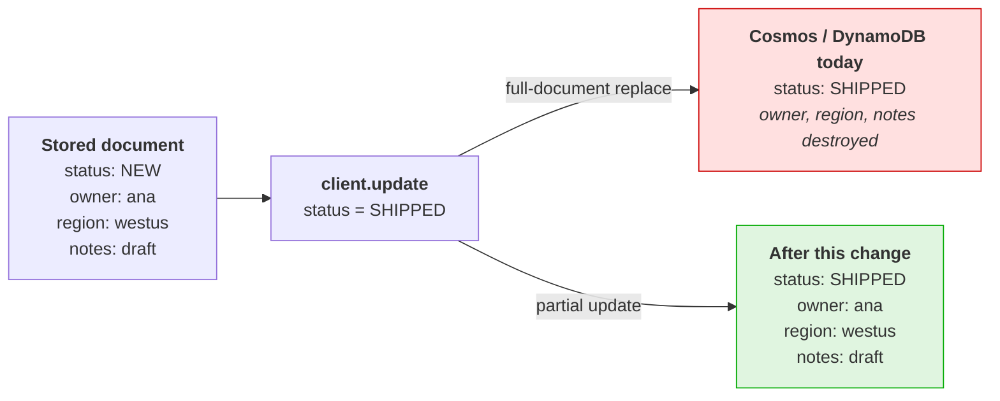
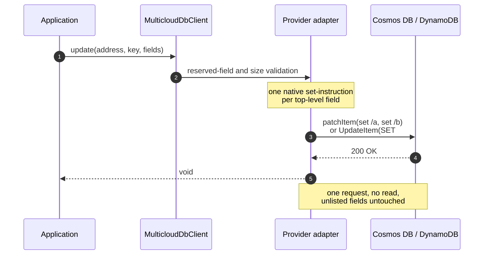

# Portable Partial Update Design

| Metadata | Value |
|---|---|
| Status | **Proposed** — ready for implementation |
| Scope | `MulticloudDbClient.update(...)` on Cosmos DB and DynamoDB |
| Deferred | Spanner — already conformant, see section 5.3 |
| Out of scope | The portable PATCH API (`patch()`, `PatchOperation`, `REMOVE` / `INCREMENT`) — separate surface on its own branch |
| Updated | 2026-08-27 |

> **Note on the Cosmos Patch API.** Section 5.1 uses
> `CosmosContainer.patchItem(...)` as an *internal implementation detail* of
> `update()`. Callers still call `update()`; they gain no patch surface, no new
> capability, and no new error category. The distinction is between the provider
> SDK call the adapter makes and the product surface the SDK exposes.

## 1. Decision

`MulticloudDbClient.update(...)` becomes a **partial update with set/replace-only
semantics**:

```java
// Stored: {"status":"NEW","owner":"ana","region":"westus"}
client.update(address, key, Map.of("status", "SHIPPED"));
// Stored: {"status":"SHIPPED","owner":"ana","region":"westus"}
```

Fields present in the supplied document are written; fields absent from it are
preserved. No new API, no new operation vocabulary, no new capability.

Each provider implements this with its **native single-request partial-write
API**. Read-modify-write in the adapter is a bounded fallback, not the design.

## 2. Why

### 2.1 The signature already promises it

```java
void update(ResourceAddress address, MulticloudDbKey key,
            Map<String, Object> document, OperationOptions options);
```

A caller passing two fields reads this as "apply these two fields". Nothing
suggests "and delete everything else" — yet that is exactly what Cosmos DB and
DynamoDB do today.



Silent data loss from a call that looks additive is the sharpest edge in the
current API. Aligning behaviour with the signature removes it.

### 2.2 Set/replace is the portability floor

"Set this field to this value" is the one partial-write primitive that is
uniformly available across all three engines, uniformly typed, and free of
ordering-dependent behaviour. The operations that would extend the vocabulary —
removal and arithmetic — are exactly the ones that diverge, in engine semantics
and in replay-safety (section 7). Holding the floor here is what lets partial
update ship as universal behaviour with no `CapabilitySet` gate and no
provider-specific error categories.

### 2.3 Conditional writes belong to a different feature

Compare-and-set is a distinct capability with its own error category, cost model,
and contention semantics. Folding it into `update()` would overload one operation
with two unrelated jobs. Keeping `update()` unconditional leaves room to design
conditional writes properly if they are ever required.

### 2.4 Consumer validation

Corroborated independently during design review — one consuming team, asked
whether partial updates needed removal or arithmetic, drew the same boundary:

> Partial Updates are set/replace only. One of the design goals we have with the
> Aladdin Data Layer is an idempotency guarantee for puts. We are not supporting
> the Cassandra Counter Type and we are not supporting Light Weight Transactions.
> Essentially, if a put fails for us, we expect to be able to replay it as a part
> of our error handling without adverse effect.

This confirms the floor is set at the right level; it is not the origin of the
requirement. Sections 2.1 through 2.3 stand without it.

## 3. What changes

The providers already disagree about what `update()` means. This is a live,
undeclared cross-provider divergence on `main`, not a problem introduced here:

| Provider | `update()` today | Observable semantics |
|---|---|---|
| Cosmos DB | `replaceItem` | **Full-document replace** — unlisted fields destroyed |
| DynamoDB | `PutItem` + `attribute_exists(partitionKey)` | **Full-item replace** — unlisted attributes destroyed |
| Spanner | `readWriteTransaction` read-merge-write | **Partial merge** — unlisted fields preserved |

The same application code, against three providers the SDK presents as
interchangeable, produces two different documents.
`SpannerProviderClient.update(...)` already admits this in its own Javadoc:

> **Cross-provider asymmetry.** [...] The portable SPI contract for `update()`
> partial-vs-full semantics is currently undefined; aligning the three providers
> is tracked as follow-up work.

This design resolves that follow-up. Spanner's behaviour matches the shape of the
API, so **Cosmos DB and DynamoDB move to Spanner's semantics.**

## 4. Portable contract

| Aspect | Contract |
|---|---|
| Missing **document** | `NOT_FOUND`. `update()` never creates a document; the existence guard is unchanged. |
| Missing **field** | **Created.** A field named in the payload but absent from the stored document is added. |
| Present field | Overwritten with the supplied value. |
| Untouched fields | Every stored field not named in the payload is preserved unchanged. |
| Merge depth | **Shallow.** An object-valued field replaces the stored value entirely; no recursive merge. |
| `null` values | Stores JSON `null`. Does **not** remove the field. |
| Atomicity | All fields in one call are applied together, or none are. |
| Idempotency | Applying the same call twice is indistinguishable from applying it once. |
| Reserved fields | `id`, `partitionKey`, `sortKey`, `ttl`, `ttlExpiry`, `data`, and `_`-prefixed names are rejected before any provider I/O, unchanged. |

### 4.1 What holds everywhere, and why

A capability earns a place in the portable API when every provider produces the
same observable result. Each row below is enforced by the engine, not
reconstructed by adapter code — which is why it survives concurrency, retries,
and partial failure without the SDK having to get anything subtle right:

| Guarantee | Delivered by |
|---|---|
| Named fields written exactly as supplied | Cosmos `set`, DynamoDB `SET`, Spanner column write |
| Unnamed fields survive untouched | Native path-scoped writes; no read-modify-write to lose them |
| A named field is created if absent | `set` and `SET` are both create-or-overwrite |
| All fields land together, or none do | Single native request per provider |
| Replaying a call changes nothing | Absolute values only, no dependence on stored state |
| Concurrent writes to disjoint fields both survive | Server-side field scoping, not adapter merging |
| A missing document fails cleanly | `NOT_FOUND` from the provider's own existence check |

**Adjacent needs and where they are served.** `update()` covers one job well
rather than several partially:

- **Remove a field, or clear stale fields wholesale** — `upsert()` with the
  complete desired document (see open question 11.2).
- **Increment a counter** — read, compute in the caller, write the result.
  Section 7.2 shows what the native SDKs' automatic retries would otherwise do to
  a server-side increment.
- **Write only if a precondition holds** — a separate feature, section 2.3.

**Behaviour is portable; mechanism and cost need not be.** Reaching an identical
result through different native instructions is the entire job of a provider
adapter. Request count and cost may legitimately differ and are documented in
`docs/compatibility.md` rather than equalised (section 8). What may **not** differ
is which calls succeed, which fail, and what the stored document looks like
afterwards.

### 4.2 Absent document vs absent field

**A missing document fails; a missing field is created.** The guard sits at the
document level because addressing a document that is not there is almost always
caller error — a stale key, a lost race, an already deleted record — and silently
creating one hides it. At the field level the opposite holds: these are
schemaless stores, so requiring a field to pre-exist would mean no new field
could ever be introduced through `update()`, forcing every rollout of an optional
field onto a full-document `upsert()`.

Both engines do this natively, at no cost to the adapter: Cosmos `set` and
DynamoDB `SET` are create-or-overwrite. (Cosmos `replace` would fail on a missing
path — this is why the design uses `set`.) The strict alternative is also not
worth its price: failing on a missing field would need an `attribute_exists(#n)`
condition per field on DynamoDB, and a trip would yield one
`ConditionalCheckFailedException` that **does not say which field was missing**.

### 4.3 Why shallow merge

A recursive merge would have to define how it treats arrays, how it addresses a
nested field that does not exist yet, and what happens when a stored scalar
collides with an incoming object. The engines answer differently — and neither is
uniformly the strict one:

| Case | Cosmos DB (`set`) | DynamoDB (`SET`) |
|---|---|---|
| Write to `a.b` where `a` is missing | Creates the missing ancestor | **`ValidationException`** — *"The document path provided in the update expression is invalid for update."* |
| Write to an out-of-range array index | **Error** — index greater than array length is rejected | Silently **appends** to the end of the list |

They are strict and lenient on *opposite* axes, and in both rows one provider
fails loudly where the other quietly succeeds — the silent-divergence shape this
SDK exists to prevent. Shallow merge makes both cases unreachable, since every
path the adapter emits is a single top-level segment. It is also what makes the
native single-request path possible: one set-instruction per field, with no read.

If deep paths are ever revisited they need an explicit `CapabilitySet` gate, and
the Cosmos row above needs verifying against a live account first — Microsoft
documents `add` as *"if the target path specifies an element that doesn't exist,
it's added"* and defines `set` as similar outside arrays, but never states the
intermediate-object case outright, so that row is inference from RFC 6902 rather
than a documented guarantee. The DynamoDB row is documented verbatim.
## 5. Provider implementations

| Provider | Native mechanism | Requests | Read required |
|---|---|---|---|
| Cosmos DB | `patchItem` with one `set` per top-level field | 1 | No |
| DynamoDB | `UpdateItem` with a `SET` update expression | 1 | No |
| Spanner | Deferred — already conformant | 1 txn | n/a |



### 5.1 Cosmos DB

`CosmosProviderClient.update(...)` switches from `replaceItem` to `patchItem`,
building one `set` operation per top-level field:

```java
CosmosPatchOperations ops = CosmosPatchOperations.create();
for (Map.Entry<String, Object> field : document.entrySet()) {
    ops.set("/" + escapeJsonPointer(field.getKey()), field.getValue());
}
container.patchItem(cosmosId, partitionKey, ops, ObjectNode.class);
```

Cosmos `set` is create-or-overwrite at the addressed path and never touches a
path the request does not name. Four details follow:

1. **JSON Pointer escaping.** Field names come from a caller-supplied `Map` and
   may contain `/` or `~`, which are structural in JSON Pointer. Each must be
   escaped per RFC 6901 (`~` to `~0`, then `/` to `~1`) before concatenation.
   Skipping this silently addresses the wrong field — `a/b` would be written as
   nested `b` under `a`. This is escaping only; JSON Pointer never becomes a
   caller-facing concept.
2. **No key injection.** Today `update()` writes `id` and `partitionKey` into the
   document before `replaceItem`. With `patchItem` those are already on the
   stored item and must not be patched. Reserved-field validation already
   prevents a caller supplying them.
3. **TTL consumes an operation slot.** When `options.ttlSeconds()` is set the
   adapter adds `set("/ttl", n)`, counting against the 10-operation cap. The
   effective field budget is 10, or **9 when a TTL is supplied**.
4. **Error mapping is unchanged.** `patchItem` against a missing item returns
   HTTP 404, which `CosmosErrorMapper` already maps to `NOT_FOUND` — the same
   category today's `replaceItem` produces.

**Payloads above the operation cap.** Microsoft documents: *"It's possible to
execute multiple patch operations on a single document. The maximum limit is 10
operations."* A larger payload cannot be one native patch; the options are
weighed in open question 11.1, which recommends a point-read / merge /
`replaceItem` fallback.

If that fallback is adopted, two properties are mandatory. First, the `If-Match`
ETag is **not optional**: without it two concurrent `update()` calls to disjoint
fields would each write from a stale read, and the later would silently discard
the earlier — a lost update on Cosmos alone. Second, **retry exhaustion must not
become a Cosmos-only error.** Under sustained contention the ETag can be
invalidated on every attempt; surfacing that as a failure after N tries would
make `update()` fail on Cosmos for a workload that always succeeds on DynamoDB —
a divergence *created* by the adapter rather than inherited from the engine. The
loop must retry until it succeeds or the caller's own `OperationOptions` timeout
expires. A timeout is a portable outcome any provider can produce; "ran out of
adapter retries" is not. Each attempt re-applies the same absolute values, so any
attempt that lands produces the correct document.

### 5.2 DynamoDB

`UpdateItem` with a `SET` expression expresses the semantics natively in a single
request with no read:

- One `SET #name = :value` clause per top-level field.
- Attribute names passed through `ExpressionAttributeNames`, so fields colliding
  with DynamoDB reserved words are handled — and so a field name containing `.`
  is treated as a literal name rather than a nested path.
- The existing `attribute_exists(partitionKey)` condition is retained, so
  `ConditionalCheckFailedException` continues to map to `NOT_FOUND` exactly as it
  does for today's `PutItem`.

`SET` is create-or-overwrite and never touches an unnamed attribute. There is no
operation-count cap; the practical bound is DynamoDB's documented expression size
quota, which the adapter should check before sending.

### 5.3 Spanner — deferred

Spanner already implements the target semantics via read-merge-write inside
`readWriteTransaction` at column granularity, including the `FIELD_DATA`
bookkeeping that keeps merged fields visible to later reads. It is the provider
the other two are moving *toward*, so deferring it costs nothing in portability
terms. The deferred items are documentation and optimisation only:

- Remove the "contract undefined" caveat from the `SpannerProviderClient` Javadoc
  and point it at this document.
- Decide whether the transactional read-merge-write should become a plain
  `UPDATE` mutation over the named columns, which would be cheaper and drop the
  read. An optimisation, not a correctness fix.

## 6. Capabilities

**No `CapabilitySet` gate is required, and that is the headline result.** Partial
update becomes universal — same semantics everywhere, nothing to interrogate at
runtime, nothing to branch on.

| Behaviour | Cosmos | Dynamo | Spanner | Gate needed |
|---|---|---|---|---|
| Partial update (set/replace) | Yes | Yes | Yes (already) | No — universal |
| Field removal | No | No | No | No — uniform |
| Server-side increment | No | No | No | No — uniform |
| Conditional / compare-and-set write | No | No | No | No — uniform |

A `CapabilitySet` entry exists to warn callers that providers disagree. Every row
is unanimous — the first because all three support it, the rest because none
does — so a caller writes one code path and runs it anywhere.

## 7. Idempotency, retries, and concurrency

### 7.1 Replay-safe by construction

Every field is written to an **absolute value** that does not depend on the
stored value, so re-applying a call is indistinguishable from applying it once:


Had the contract included server-side arithmetic, step 6 would have applied the
delta a second time and the final state would depend on how many retries
occurred — an outcome the caller cannot detect or correct.

### 7.2 Retries inside the native SDKs

This matters more than it first appears: **both native SDKs retry on their own**,
beneath the adapter, without the SDK or the caller being consulted.

| Behaviour | Cosmos DB (`azure-cosmos` v4) | DynamoDB (AWS SDK v2) |
|---|---|---|
| Retry on throttling | Yes — `maxRetryAttemptsOnThrottledRequests` defaults to **9** (10 attempts), capped by `maxRetryWaitTime` of **30 s** cumulative, honouring `Retry-After` | Yes — **4 attempts** (1 + 3 retries), 1,000 ms base backoff |
| Retry on transient 5xx / network failure | Reads yes, across regions. **Writes: no by default** | Yes — 4 attempts, **25 ms** base backoff (DynamoDB-specific; other AWS services use 50 ms) |
| Retry when the outcome is *ambiguous* | **No** — suppressed unless opted in | **Yes** — unconditionally |
| Checks idempotency first? | Assumes writes are unsafe and declines | **No** — retries blindly |

The two vendors made opposite choices, and each reinforces this design.

**DynamoDB retries writes blindly.** The AWS SDK does not inspect an update
expression before retrying. Had the contract offered increment, the adapter would
emit `SET #n = #n + :d` or `ADD`, and the SDK's *own default policy* could
double-apply it with no caller involvement. AWS documents this for atomic
counters:

> With an atomic counter, the updates are **not idempotent**. [...] If an
> `UpdateItem` operation fails, the application could simply retry the operation.
> **This would risk updating the counter twice.**

Because the adapter emits only `SET #name = :absoluteValue`, that entire class of
bug is unreachable.

**Cosmos DB refuses to retry writes.** The Java SDK deliberately suppresses write
retries on ambiguous failures. From `ClientRetryPolicy`:

> For any causes that SDK not sure whether the request has reached/processed from
> server side, unless customer has specifically opted in for
> nonIdempotentWriteRetries, SDK should not retry.

Correct as a general-purpose default, but it costs availability for writes that
*are* idempotent — which, after this change, is every `update()` the Cosmos
adapter issues. The opt-in
`CosmosItemRequestOptions.setNonIdempotentWriteRetryPolicy(true, true)` is
tracked as open question 11.4.

`attribute_exists(pk)` does not weaken any of this: if a first attempt succeeded
but its response was lost, the item exists on retry, the condition holds, and the
same absolute values are re-applied for the same result.

> **Verification note.** The Cosmos defaults and the `ClientRetryPolicy`
> write-suppression behaviour were read from `Azure/azure-sdk-for-java` source,
> not published documentation, and could change between SDK versions. Microsoft
> does not publish an explicit statement that a `set`-only `patchItem` is
> idempotent; that follows from the operation's semantics. The 4-attempt DynamoDB
> default is confirmed for `standard` retry mode.

### 7.3 Concurrency

| Provider | Disjoint-field concurrency handled by |
|---|---|
| Cosmos DB, native path | `patchItem` `set` is path-scoped, evaluated server-side |
| Cosmos DB, fallback path | `If-Match` ETag + retry; the loser re-reads and re-applies its own fields |
| DynamoDB | `UpdateItem` `SET` is attribute-scoped, never rewrites unnamed attributes |
| Spanner | `readWriteTransaction` retries on `ABORTED` |

Concurrent calls to the **same** field are last-writer-wins everywhere. No
portable `CONFLICT` arises from concurrency alone. On the native paths this falls
out of the provider's own execution rather than adapter code that must be written
correctly and kept correct — the main reason native mechanisms are preferred.

## 8. Cost

**This change removes a read from the common path.** Today, a caller who wants
partial-update semantics on Cosmos or DynamoDB cannot use `update()` safely — it
would destroy unlisted fields — so they must read the document, merge in the
caller, and write it back. That is two round trips plus the transfer of a full
document. After this change the same intent is one request that carries only the
changed fields:

| Path | Today (Cosmos / Dynamo) | After |
|---|---|---|
| Partial update of a few fields | read + write, 2 round trips, full document on the wire twice | 1 write, changed fields only |
| Full-document replace | 1 write | 1 write via `upsert()` — unchanged |

Per-provider cost drivers after the change:

| Provider | Driver | Direction |
|---|---|---|
| Cosmos DB | `patchItem` RU is charged against the patch operations rather than a full-document write, and the request body carries only changed fields | Lower than `replaceItem`, materially so for large documents |
| DynamoDB | `UpdateItem` WCU is computed from the larger of the before/after item size, the same basis as `PutItem` | **No per-request saving**; the saving is the eliminated caller-side read (RCU) and round trip |
| Spanner | Unchanged — already read-merge-write. Replacing it with a plain `UPDATE` mutation would drop its read | Deferred, section 5.3 |

The one place cost increases is the Cosmos over-budget fallback, which adds a
point read and sends a full document. It applies only to payloads above the
operation budget and is bounded; it belongs in `docs/compatibility.md` under the
existing convention for operations that are not always one request. No cost
asymmetry here is unbounded or scales with data volume.
## 9. Breaking change and migration

For Cosmos DB and DynamoDB this **changes the observable behaviour of an existing
published operation**. Code relying on `update()` to drop unlisted fields will
silently stop dropping them.

| Caller intent | Before | After |
|---|---|---|
| Apply a few fields, keep the rest | `update()` — worked on Spanner, destroyed data on Cosmos/Dynamo | `update()` |
| Replace the whole document | `update()` on Cosmos/Dynamo | `upsert()` |

`upsert()` is the closest existing operation but not an exact replacement: it
creates the document when absent instead of failing `NOT_FOUND`, so a caller
needing full replacement *and* the existence guard has no equivalent single call.
Whether that gap is closed by adding `replace()` is section 11.2, and the answer
determines how complete the migration table above actually is.

Documentation that must ship with the change:

| Doc | Content |
|---|---|
| `multiclouddb-api/CHANGELOG.md` | Behaviour change to `update()` under `[Unreleased]` |
| `multiclouddb-provider-cosmos/CHANGELOG.md` | `replaceItem` to `patchItem` |
| `multiclouddb-provider-dynamo/CHANGELOG.md` | `PutItem` to `UpdateItem` |
| `docs/changelog.md` | User-visible behaviour change |
| `docs/guide.md` | Migration section with the before/after table |
| `docs/compatibility.md` | Cost note and the Cosmos fallback request count |

## 10. Conformance coverage

`CrudConformanceTests` must assert, identically on every provider:

1. `update()` preserves a field absent from the payload.
2. `update()` overwrites a field present in the payload.
3. `update()` creates a field that was absent from the stored document.
4. `update()` on a missing document is `NOT_FOUND`.
5. A `null` value stores JSON `null` and does not remove the field.
6. An object-valued field replaces the stored object wholesale (no deep merge).
7. An array-valued field is replaced wholesale — not appended to, not merged.
8. A field name containing `.` is stored as a literal top-level field, not
   interpreted as a nested path.
9. Applying the same `update()` twice yields the same document as applying it once.
10. Concurrent updates to disjoint fields both survive.
11. A reserved field name is `INVALID_REQUEST` before provider I/O.

Items 9 and 10 are the headline assertions: 9 is the direct expression of the
idempotency guarantee, 10 is what protects against a regression into a lost
update. Item 8 would fail on DynamoDB without `ExpressionAttributeNames`.

Because Spanner already satisfies the contract, all eleven can be enabled for
every provider immediately — Spanner should pass with no product change, which is
itself evidence the target semantics are right.

Cosmos additionally needs provider-level tests the portable suite cannot express:

- A field name containing `/` or `~` round-trips correctly (section 5.1 detail 1).
- A payload at the operation budget uses the native path and one above it uses the
  fallback, with identical observable results.
- A TTL-bearing update is correctly accounted against the operation budget.

**E2E.** `multiclouddb-e2e/Main.java` already exercises `update()` against
whichever provider the active `*.properties` selects. It should be extended to
write a document, update a subset of its fields, and read back to confirm the
unlisted fields survived — the single scenario that would have caught this
divergence.

## 11. Open questions

### 11.1 Payloads above the Cosmos operation budget

**Question.** What happens when a payload carries more top-level fields than one
`patchItem` can express — 11 or more, or 10 or more with a TTL?

**Why it matters.** It decides whether `update()` keeps a uniform portable
acceptance envelope or grows a provider-specific cliff, and whether the Cosmos
adapter has one code path or two.

| Option | Consequence |
|---|---|
| **A. Fallback** — read, merge, `replaceItem` with `If-Match` | Preserves today's envelope: every call that works now keeps working. Costs a second Cosmos code path with a different request count, and it is the only place a lost update could reappear, so it needs its own concurrency test. |
| **B. Portable cap** — reject over-budget payloads with `INVALID_REQUEST` | One code path, trivial to document and test. But it rejects calls that succeed today — a *second* breaking change stacked on the first — and imposes a Cosmos limit on DynamoDB and Spanner callers who have no such limit. |
| **C. Cosmos-only cap via `CapabilitySet`** | Honest rather than silent. But a capability reading "at most 10 fields on Cosmos" forces portable code to become provider-aware, precisely what the SDK exists to prevent. |

**Recommendation: A.** The deciding factor is that B is not a clean limit — 10
fields normally but 9 with a TTL, so the contract would read "at most 10
top-level fields, unless you set a TTL, in which case 9": awkward to document,
easy to violate accidentally, and tied to one provider's implementation detail.

**What would change the answer.** If usage data showed over-budget updates are
vanishingly rare and the team valued a single code path more than backward
compatibility, B becomes reasonable. If Cosmos raises the cap, the question
disappears.

### 11.2 Migration target for callers who want full replacement

**Question.** After this change no operation performs "replace the whole
document, but only if it already exists" — exactly what `update()` does today on
Cosmos and DynamoDB. Is `upsert()` adequate?

**Why it matters.** `upsert()` differs in a way that has a correctness
consequence: it *creates* the document when absent instead of failing
`NOT_FOUND`.

| Option | Consequence |
|---|---|
| **A. Point callers at `upsert()`** | No new API. But a caller needing the existence guard must read then upsert, and that sequence is not atomic — a concurrent `delete()`, or a TTL expiry, landing in between resurrects the document. Those callers have no correct single-call migration, so this silently converts a data-integrity guarantee into a race. |
| **B. Add `replace(address, key, document, options)`** | Full-document replace with the existence guard — today's `update()` behaviour under a name that says what it does. Migration becomes mechanical. Cost: one more operation to document, test, and hold portable. On Cosmos and DynamoDB the implementation is the code being removed from `update()`, so close to free; Spanner needs a genuine replace path rather than its current merge. |
| **C. A mode flag on `update()`** | Avoids a new method name, but a boolean that inverts the semantics of an operation is the hardest kind of API to reason about portably, and it doubles the conformance matrix — every assertion in section 10 run in both modes on every provider. |

**Recommendation: B.** A has an atomicity hole and is therefore not a migration
at all for some callers. B preserves a capability that otherwise disappears, and
is largely a rename of code being removed rather than new functionality.

**The deciding test.** Does any consumer depend on `update()` failing when the
document is absent? If no, A is genuinely correct and the portable surface stays
smaller. Note that TTL expiry makes the resurrection scenario reachable without
any concurrent client — the engine itself does the deleting.

**Dependency.** Coupled to 11.3: whether a hard break is acceptable depends on
whether affected callers have somewhere to go.

### 11.3 How the behaviour change reaches users

**Question.** Hard break, or transitional switch?

**Why it matters.** This is a *silent* behaviour change. Signature, return type,
and exceptions are unchanged, so nothing fails to compile and nothing throws —
the only difference is which data survives. That is the most dangerous shape a
breaking change can take.

Two facts weigh on it:

1. **The SDK is at `0.1.0-beta.2`.** Under SemVer, 0.x makes no compatibility
   promise. The bar is far lower than post-1.0.
2. **There is no single "old behaviour" to preserve.** `update()` is already
   provider-dependent, so a compatibility flag would have to ask "compatible with
   *which* provider?" — and any caller portable across all three is *already*
   getting inconsistent results today.

| Option | Consequence |
|---|---|
| **A. Hard break, loud changelog** | One behaviour, one code path, matches repo practice (no transitional-flag precedent exists). Silent at compile time. |
| **B. Transitional flag defaulting to today's behaviour** | Opt-in migration, but doubles the conformance matrix, makes the flag itself portable surface, and prolongs the divergence this design exists to end. Fact 2 makes it close to incoherent — the flag cannot restore a consistent prior behaviour because none existed. |
| **C. Hard break plus `replace()` in the same release** | A, with a mechanical migration path for every affected caller. |

**Recommendation: C**, contingent on adopting 11.2 option B. A hard break is
defensible here mainly *because* an affected caller can fix their code with a
one-word change.

**Regardless of the option chosen**, the changelog must be explicit that this is
a behaviour change with data-loss-shaped consequences in reverse — code that
expected fields to disappear will now find them retained — and must name the
migration target directly.

### 11.4 Opting into Cosmos non-idempotent write retries

**Question.** Should the Cosmos adapter set
`setNonIdempotentWriteRetryPolicy(true, true)` on `update()`?

**Why it matters.** Section 7.2: the Cosmos SDK does not retry writes whose
outcome is ambiguous, so a `patchItem` that times out surfaces to the caller even
when a retry would be harmless. After this change every `update()` the adapter
issues is idempotent, so the conservative default guards a hazard that no longer
exists on this path.

**Enabling it** improves write availability, particularly for multi-region
accounts, and moves Cosmos closer to DynamoDB — which already retries these
writes unconditionally — narrowing a real difference in how often a transient
fault reaches the caller. **Leaving it off** means the same application sees a
higher error rate on Cosmos than DynamoDB for identical workloads.

**Caveats.** Scope it to `update()` alone; other operations are not necessarily
idempotent and setting it globally would be wrong. If the 11.1 fallback is
adopted, check its interaction with the `If-Match` path.

**Recommendation: yes, scoped to `update()`**, once 11.1 is settled. A direct
dividend of the set/replace-only decision.

## 12. References

- `SpannerProviderClient.update(...)` — existing partial-merge implementation and its asymmetry note
- [Cosmos DB partial document update](https://learn.microsoft.com/en-us/azure/cosmos-db/partial-document-update) — `set` semantics, 10-operation cap, array out-of-range error
- [RFC 6901 — JSON Pointer](https://www.rfc-editor.org/rfc/rfc6901.txt) — `~0` / `~1` escaping
- [Cosmos DB Java SDK v4 troubleshooting](https://learn.microsoft.com/en-us/azure/cosmos-db/nosql/troubleshoot-java-sdk-v4) — timeout and retry guidance
- `ClientRetryPolicy` / `ThrottlingRetryOptions` in `Azure/azure-sdk-for-java` — write-retry suppression, 9-retry / 30 s throttling defaults
- [DynamoDB update expressions](https://docs.aws.amazon.com/amazondynamodb/latest/developerguide/Expressions.UpdateExpressions.html) — `SET` action
- [DynamoDB nested map attributes](https://docs.aws.amazon.com/amazondynamodb/latest/developerguide/Expressions.UpdateExpressions.html#Expressions.UpdateExpressions.SET.AddingNestedMapAttributes) — parent-must-exist rule and exact `ValidationException` message
- [DynamoDB list elements](https://docs.aws.amazon.com/amazondynamodb/latest/developerguide/Expressions.UpdateExpressions.html#Expressions.UpdateExpressions.SET.AddingListElements) — out-of-range index appends rather than failing
- [DynamoDB expression attribute names](https://docs.aws.amazon.com/amazondynamodb/latest/developerguide/Expressions.ExpressionAttributeNames.html) — reserved-word handling
- [DynamoDB atomic counters](https://docs.aws.amazon.com/amazondynamodb/latest/developerguide/WorkingWithItems.html#WorkingWithItems.AtomicCounters) — "the updates are not idempotent... this would risk updating the counter twice"
- [DynamoDB service quotas](https://docs.aws.amazon.com/amazondynamodb/latest/developerguide/ServiceQuotas.html) — expression size limits
- [AWS SDK retry behaviour](https://docs.aws.amazon.com/sdkref/latest/guide/feature-retry-behavior.html) — attempt counts and backoff defaults
- [DynamoDB capacity consumption](https://docs.aws.amazon.com/amazondynamodb/latest/developerguide/read-write-operations.html) — WCU basis for `UpdateItem`
