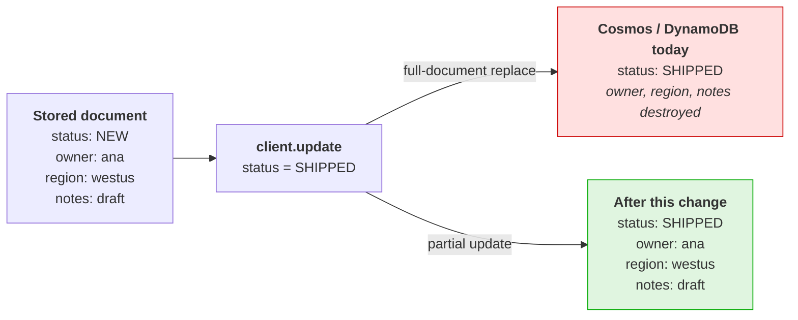
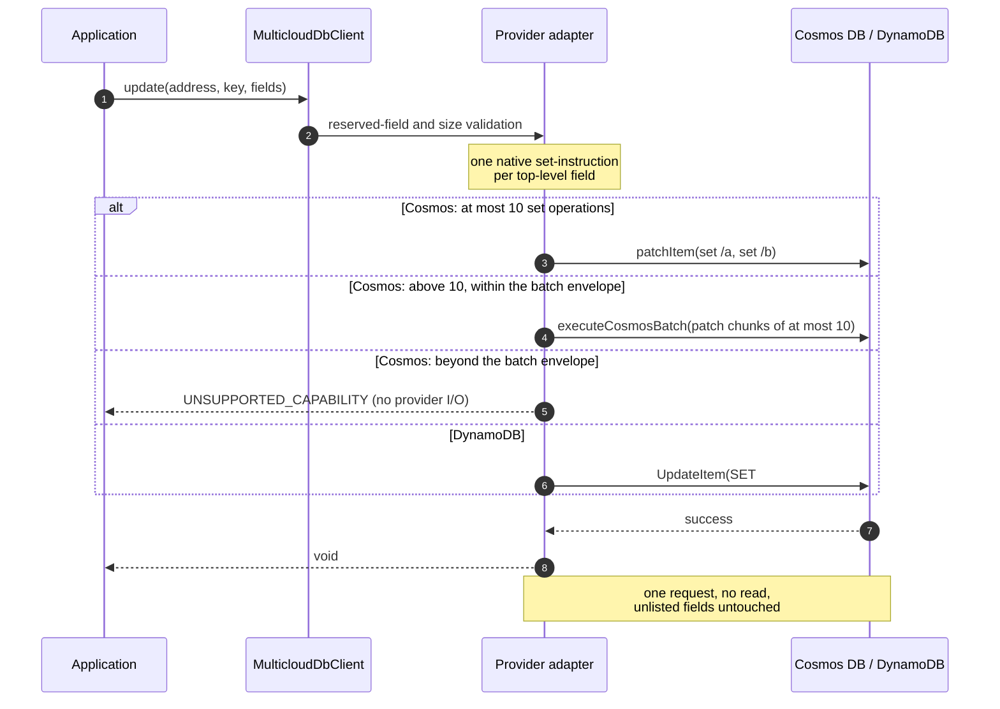
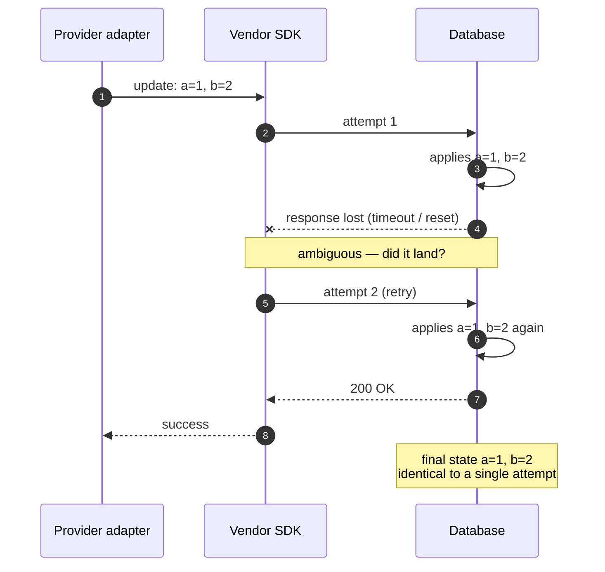

# Portable Partial Update Design

| Metadata | Value |
|---|---|
| Status | **Proposed** — ready for implementation |
| Scope | `MulticloudDbClient.update(...)` on Cosmos DB and DynamoDB |
| Deferred | Spanner — already conformant, see section 5.3 |
| Out of scope | The portable PATCH API (`patch()`, `PatchOperation`, `REMOVE` / `INCREMENT`) — separate surface on its own branch |
| Updated | 2026-09-01 |

> **Terminology.** Three layers are distinguished throughout, because the
> difference between them carries real weight in this design:
>
> | Term | Refers to | Examples |
> |---|---|---|
> | **Engine** | The database service itself, executing server-side | Cosmos DB, DynamoDB, Spanner |
> | **Vendor SDK** | The vendor's Java client library that talks to an engine | `azure-cosmos` v4, AWS SDK for Java v2 |
> | **Provider** | This repository's adapter for one engine | `multiclouddb-provider-cosmos` |
>
> A guarantee enforced by the **engine** holds under concurrency, retries, and
> partial failure without any adapter code having to be correct — which is why
> section 4.1 argues for native mechanisms over adapter-side merging. Retry
> policies, by contrast, live in the **vendor SDK** and run beneath the provider
> without consulting it or the caller (section 7.2). Unqualified, "the SDK" means
> this project, the Multicloud DB SDK.

> **Note on the Cosmos partial-update APIs.** Section 5.1 uses
> `CosmosContainer.patchItem(...)` and `executeCosmosBatch(...)` as *internal
> implementation details* of `update()`. Callers still call `update()`; they gain
> no patch or batch surface. Ordinary partial update remains universal and
> ungated. `PARTIAL_UPDATE_EXTENDED_PAYLOAD` describes whether a provider
> guarantees every otherwise-valid field shape through the shared 399 KB limit,
> including shapes beyond its native atomic partial-write envelope (section 6).
> The distinction is between vendor SDK calls made by the provider and the
> product surface exposed by this SDK.

## 1. Decision

`MulticloudDbClient.update(...)` becomes a **partial update with set/replace-only
semantics**:

```java
// Stored: {"status":"NEW","owner":"ana","region":"westus"}
client.update(address, key, Map.of("status", "SHIPPED"), options);
// Stored: {"status":"SHIPPED","owner":"ana","region":"westus"}
```

Entries present in `fields` are written; fields absent from it are preserved. No
new API or operation vocabulary is introduced. Normal partial update is a
universal, ungated capability within each provider's native atomic partial-write
envelope. A separate `PARTIAL_UPDATE_EXTENDED_PAYLOAD` capability describes
whether a provider guarantees every otherwise-valid partial update through the
SDK's shared 399 KB payload limit regardless of field shape. An unsupported
declaration does not gate ordinary requests that fit the provider's envelope.

Each provider implements this with a **native single-request partial write**.
Cosmos uses one direct patch or one transactional batch without reading the
item. If the prospective Cosmos transactional batch exceeds its native envelope,
the provider fails locally with `UNSUPPORTED_CAPABILITY`; it does not perform a
read/merge/write path (section 11.1).

**Parameters.** No parameter is added by this design; one is renamed.

| Parameter | | What it is | Example |
|---|---|---|---|
| `address` | required | Which database and collection to target | `new ResourceAddress("orders-db", "orders")` |
| `key` | required | Which record inside that collection | `MulticloudDbKey.of("cust-42", "order-7")` |
| `fields` | required | The fields to set — **not** a replacement document | `Map.of("status", "SHIPPED")` |
| `options` | optional | Per-call timeout, TTL, and metadata hints | `OperationOptions.defaults()` |

Only the payload changes meaning: it stops being *"the new document"* and
becomes *"the fields to set"*. Section 3 renames it `document` -> `fields`.

`options` is optional in the sense that omitting it selects a three-argument
overload of the same method, which supplies `OperationOptions.defaults()` on your
behalf. Both call sites below are the same operation:

```java
client.update(address, key, Map.of("status", "SHIPPED"), options);
client.update(address, key, Map.of("status", "SHIPPED"));
```

## 2. Why

### 2.1 The signature already promises it

```java
void update(ResourceAddress address, MulticloudDbKey key,
            Map<String, Object> document, OperationOptions options);
```

A caller passing two fields reads this as "apply these two fields". Nothing
suggests "and delete everything else" — yet that is exactly what Cosmos DB and
DynamoDB do today.



Silent data loss from a call that looks additive is the sharpest edge in the
current API. Aligning behaviour with the signature removes it.

**One part of the signature argues the other way.** The payload parameter is
named `document`, and its Javadoc reads *"@param document document payload"* —
the only element of the declaration that suggests "here is the whole document".
Section 3 renames it to `fields`, so that the entire signature, and not just its
type and verb, says what the operation does.

### 2.2 Set/replace is the portability floor

"Set this field to this value" is the one partial-write primitive that is
uniformly available across all three engines, uniformly typed, and free of
ordering-dependent behaviour. The operations that would extend the vocabulary —
removal and arithmetic — are exactly the ones that diverge, in engine semantics
and in replay-safety (section 7). Holding the floor here is what lets partial
update ship as universal behaviour with no `CapabilitySet` gate and no
provider-specific error categories at the portable baseline. Requests beyond a
provider's native atomic partial-write envelope are a separate extension boundary:
`PARTIAL_UPDATE_EXTENDED_PAYLOAD` is declared through `CapabilitySet`, while the
set/replace semantics themselves remain universal.

### 2.3 Conditional writes belong to a different feature

Compare-and-set is a distinct capability with its own error category, cost model,
and contention semantics. Folding it into `update()` would overload one operation
with two unrelated jobs. Keeping `update()` unconditional leaves room to design
conditional writes properly if they are ever required.

### 2.4 Consumer validation

Corroborated independently during design review — one consuming team, asked
whether partial updates needed removal or arithmetic, drew the same boundary:

> Partial Updates are set/replace only. One of the design goals we have with the
> Aladdin Data Layer is an idempotency guarantee for puts. We are not supporting
> the Cassandra Counter Type and we are not supporting Light Weight Transactions.
> Essentially, if a put fails for us, we expect to be able to replay it as a part
> of our error handling without adverse effect.

This confirms the floor is set at the right level; it is not the origin of the
requirement. Sections 2.1 through 2.3 stand without it.

## 3. What changes

The providers already disagree about what `update()` means. This is a live,
undeclared cross-provider divergence on `main`, not a problem introduced here:

| Provider | `update()` today | Observable semantics |
|---|---|---|
| Cosmos DB | `replaceItem` | **Full-document replace** — unlisted fields destroyed |
| DynamoDB | `PutItem` + `attribute_exists(partitionKey)` | **Full-item replace** — unlisted attributes destroyed |
| Spanner | `readWriteTransaction` read-merge-write | **Partial merge** — unlisted fields preserved |

The same application code, against three providers the SDK presents as
interchangeable, produces two different documents.
`SpannerProviderClient.update(...)` already admits this in its own Javadoc:

> **Cross-provider asymmetry.** [...] The portable SPI contract for `update()`
> partial-vs-full semantics is currently undefined; aligning the three providers
> is tracked as follow-up work.

This design resolves that follow-up. Spanner's behaviour matches the shape of the
API, so **Cosmos DB and DynamoDB move to Spanner's semantics.**

**The payload parameter is renamed on `update()`.** It becomes `fields`:

```java
void create(..., Map<String, Object> document, ...);  // whole document
void upsert(..., Map<String, Object> document, ...);  // whole document
void update(..., Map<String, Object> fields,    ...);  // named fields only
```

`document` is the one part of today's signature that argues for full
replacement, so leaving it would make partial update *more* confusing, not less.
`create()` and `upsert()` keep it because they genuinely take a whole document.
Parameter names bind neither the source nor the binary contract for callers — the
build sets no `-parameters` flag — so this costs callers nothing. It touches seven
method declarations across six types: `MulticloudDbClient` (abstract plus default
overload), `MulticloudDbProviderClient`, `DefaultMulticloudDbClient`, and the
three provider implementations. Type-level separation is considered and deferred
in 11.5.

## 4. Portable contract

| Aspect | Contract |
|---|---|
| Missing **document** | `NOT_FOUND`. `update()` never creates a document; the existence guard is unchanged. |
| Missing **field** | **Created.** A field named in the payload but absent from the stored document is added. |
| Present field | Overwritten with the supplied value. |
| Untouched fields | Every stored field not named in the payload is preserved unchanged. |
| Merge depth | **Shallow.** An object-valued field replaces the stored value entirely; no recursive merge. |
| `null` values | Stores JSON `null`. Does **not** remove the field. |
| Atomicity | All fields in one call are applied together, or none are. |
| Idempotency | Applying the same call twice is indistinguishable from applying it once. |
| Reserved fields | `id`, `partitionKey`, `sortKey`, `ttl`, `ttlExpiry`, `data`, and `_`-prefixed names are rejected before any provider I/O, unchanged. |

### 4.1 What holds everywhere, and why

A capability earns a place in the portable API when every provider produces the
same observable result. Each row below is enforced by the engine, not
reconstructed by adapter code — which is why it survives concurrency, retries,
and partial failure without the SDK having to get anything subtle right:

| Guarantee | Delivered by |
|---|---|
| Named fields written exactly as supplied | Cosmos `set`, DynamoDB `SET`, Spanner column write |
| Unnamed fields survive untouched | Native path-scoped writes; no read-modify-write to lose them |
| A named field is created if absent | `set` and `SET` are both create-or-overwrite |
| All fields land together, or none do | Single native request per provider |
| Replaying a call changes nothing | Absolute values only, no dependence on stored state |
| Concurrent writes to disjoint fields both survive | Server-side field scoping, not adapter merging |
| A missing document fails cleanly | `NOT_FOUND` from the provider's own existence check |

**Adjacent needs and where they are served.** `update()` covers one job well
rather than several partially:

- **Remove a field, or clear stale fields wholesale** — `upsert()` with the
  complete desired document (see the team decision in section 11.2).
- **Increment a counter** — read, compute in the caller, write the result.
  Section 7.2 shows what the vendor SDKs' automatic retries would otherwise do to
  a server-side increment.
- **Write only if a precondition holds** — a separate feature, section 2.3.

**Behaviour is portable; mechanism and cost need not be.** Reaching an identical
result through different native instructions is the entire job of a provider
adapter. Request count and cost may legitimately differ and are documented in
`docs/compatibility.md` rather than equalised (section 8). What may **not**
differ is the result inside the portable baseline. Any wider acceptance envelope
must be exposed through `CapabilitySet`, and rejection must use the portable
`UNSUPPORTED_CAPABILITY` category rather than silently diverge.

### 4.2 Absent document vs absent field

**A missing document fails; a missing field is created.** The guard sits at the
document level because addressing a document that is not there is almost always
caller error — a stale key, a lost race, an already deleted record — and silently
creating one hides it. At the field level the opposite holds: these are
schemaless stores, so requiring a field to pre-exist would mean no new field
could ever be introduced through `update()`, forcing every rollout of an optional
field onto a full-document `upsert()`.

Both engines do this natively, at no cost to the adapter: Cosmos `set` and
DynamoDB `SET` are create-or-overwrite. (Cosmos `replace` would fail on a missing
path — this is why the design uses `set`.) The strict alternative is also not
worth its price: failing on a missing field would need an `attribute_exists(#n)`
condition per field on DynamoDB, and a trip would yield one
`ConditionalCheckFailedException` that **does not say which field was missing**.

### 4.3 Why shallow merge

A recursive merge would have to define how it treats arrays, how it addresses a
nested field that does not exist yet, and what happens when a stored scalar
collides with an incoming object. The engines answer differently — and neither is
uniformly the strict one:

| Case | Cosmos DB (`set`) | DynamoDB (`SET`) |
|---|---|---|
| Write to `a.b` where `a` is missing | Creates the missing ancestor | **`ValidationException`** — *"The document path provided in the update expression is invalid for update."* |
| Write to an out-of-range array index | **Error** — index greater than array length is rejected | Silently **appends** to the end of the list |

They are strict and lenient on *opposite* axes, and in both rows one provider
fails loudly where the other quietly succeeds — the silent-divergence shape this
SDK exists to prevent. Shallow merge makes both cases unreachable, since every
path the adapter emits is a single top-level segment. It is also what makes the
native single-request path possible: one set-instruction per field, with no read.

**Examples.** An object-valued field is one top-level value, so both providers
replace it as a unit:

```java
// Stored: {"status":"NEW","profile":{"name":"Ana","city":"Seattle"}}
client.update(address, key,
    Map.of("profile", Map.of("name", "Bob")), options);
// Both: {"status":"NEW","profile":{"name":"Bob"}}
```

`status` survives because it was omitted. `city` does not, because `profile` was
named and therefore replaced as one value.

An array follows the same rule:

```java
// Stored: {"tags":["a","b"]}
client.update(address, key,
    Map.of("tags", List.of("a", "b", "c")), options);
// Both: {"tags":["a","b","c"]}
```

The adapter never emits a path such as `tags[5]`, so neither engine's
out-of-range index behaviour is reachable. To change an element, the caller
supplies the complete desired array as the value of the top-level `tags` field.

If deep paths are ever revisited they need an explicit `CapabilitySet` gate, and
the Cosmos row above needs verifying against a live account first — Microsoft
documents `add` as *"if the target path specifies an element that doesn't exist,
it's added"* and defines `set` as similar outside arrays, but never states the
intermediate-object case outright, so that row is inference from RFC 6902 rather
than a documented guarantee. The DynamoDB row is documented verbatim.

## 5. Provider implementations

| Provider | Native mechanism | Native requests | Read required |
|---|---|---|---|
| Cosmos DB | `patchItem` for at most 10 set operations; `executeCosmosBatch` with patch chunks above 10; local `UNSUPPORTED_CAPABILITY` beyond the batch envelope | 1 for direct or batch; 0 when rejected locally | No |
| DynamoDB | `UpdateItem` with a `SET` update expression | 1 | No |
| Spanner | Deferred — already conformant | 1 txn | n/a |



### 5.1 Cosmos DB

`CosmosProviderClient.update(...)` switches from `replaceItem` to one of two
server-side partial-write paths. The adapter first builds one `set` operation per
top-level field, plus one for TTL when present, then groups them into patches of
at most 10 operations:

```java
List<CosmosPatchOperations> patches = buildPatchChunks(fields, options, 10);

if (patches.size() == 1) {
    container.patchItem(cosmosId, partitionKey, patches.get(0), ObjectNode.class);
} else {
    CosmosBatch batch = CosmosBatch.createCosmosBatch(partitionKey);
    for (CosmosPatchOperations patch : patches) {
        batch.patchItemOperation(cosmosId, patch);
    }
    BatchMeasurements measured = measureSerializedBatch(batch);
    if (!fitsTransactionalBatch(measured)) {
        throw unsupportedExtendedPayload(
            "cosmos_transactional_batch_limit",
            measured.providerDetails()); // no provider I/O
    }
    CosmosBatchResponse response = container.executeCosmosBatch(batch);
    requireSuccessfulBatch(response);
}
```

`buildPatchChunks(...)` escapes each field name, adds its value with `set`, and
adds TTL exactly once. `ObjectNode.class` is the response type token required by
the direct `patchItem` overload; it does not describe the request payload.

Cosmos `set` is create-or-overwrite at the addressed path and never touches a
path the request does not name. Seven details follow:

1. **JSON Pointer escaping.** Field names come from a caller-supplied `Map` and
   may contain `/` or `~`, which are structural in JSON Pointer. Each must be
   escaped per RFC 6901 (`~` to `~0`, then `/` to `~1`) before concatenation.
   Skipping this silently addresses the wrong field — `a/b` would be written as
   nested `b` under `a`. This is escaping only; JSON Pointer never becomes a
   caller-facing concept.
2. **No key injection.** Today `update()` writes `id` and `partitionKey` into the
   document before `replaceItem`. On either partial-write path those values are
   already stored and must not be patched. Reserved-field validation already
   prevents a caller supplying them.
3. **Ten operations select the path; they do not limit the portable API.** Up to
   10 total set operations use direct `patchItem`. More than 10 are divided into
   chunks of at most 10 and placed in one transactional batch. TTL counts as one
   operation and appears in exactly one chunk, so 10 fields plus TTL selects the
   batch path. No shared field-count validation is added.
4. **Transactional means all-or-nothing.** Every patch chunk targets the same
   item and partition key. Cosmos serialises the chunks into one service request,
   executes them in order, and commits all of them or rolls back all of them. Do
   not substitute multiple `patchItem` requests or `executeBulkOperations`; both
   would permit a partial update.
5. **Batch errors must be normalised.** `executeCosmosBatch` can return a failed
   `CosmosBatchResponse` rather than throw. The provider must check
   `isSuccessStatusCode()`, find the operation result whose status is not `424
   Failed Dependency`, and map that underlying status. A missing item is therefore
   `NOT_FOUND` on both paths; `424` must never escape as the caller-facing cause.
6. **Suppress write response bodies.** `CosmosProviderClient` currently enables
   `contentResponseOnWriteEnabled(true)`. A batch can otherwise return the full
   updated item after every patch chunk. Portable writes return `void`, so the
   implementation should disable write content globally while retaining response
   headers and diagnostics. The direct SDK overload still requires
   `ObjectNode.class` even when content is disabled.
7. **The batch has its own envelope and must be measured locally.** Cosmos
   permits at most 100 operations per transactional batch, a 2 MB serialised
   request, and five seconds of execution. One hundred patch operations of at
   most 10 sets each is a theoretical maximum of 1,000 set operations, but TTL
   consumes one set operation and the serialised 2 MB limit may bind first; this
   is not a promise that every 1,000-field request is accepted. The provider must
   build and measure the prospective batch before provider I/O. If it exceeds
   either 100 patch operations or 2 MB, it fails with
   `UNSUPPORTED_CAPABILITY`, reason `cosmos_transactional_batch_limit`, and
   structured provider details containing actual and maximum operation counts
   and actual and maximum bytes where available. `INVALID_REQUEST` is wrong:
   the request is valid within the shared SDK limit, but Cosmos cannot satisfy
   the atomicity guarantee. Section 11.4 covers whole-batch retry on timeout.

The ordinary direct and transactional-batch paths are both one request, require
no read, and preserve server-side field scoping. The official Java SDK test
`PatchAsyncTest.conditionalPatchInBatch` also exercises two patch operations
against the same item in one successful batch; this is supported behaviour, not
an assumption based only on the builder API.

### 5.2 DynamoDB

`UpdateItem` with a `SET` expression expresses the semantics natively in a single
request with no read:

- One `SET #name = :value` clause per top-level field.
- Attribute names passed through `ExpressionAttributeNames`, so fields colliding
  with DynamoDB reserved words are handled — and so a field name containing `.`
  is treated as a literal name rather than a nested path.
- The existing `attribute_exists(partitionKey)` condition is retained, so
  `ConditionalCheckFailedException` continues to map to `NOT_FOUND` exactly as it
  does for today's `PutItem`.

`SET` is create-or-overwrite and never touches an unnamed attribute. The provider
must build and measure the prospective `UpdateExpression` before provider I/O.
If its encoded expression exceeds DynamoDB's expression-size limit, the provider
fails locally with `UNSUPPORTED_CAPABILITY`, reason
`dynamodb_update_expression_limit`, and `providerDetails` containing actual and
maximum expression bytes where available.

DynamoDB therefore conservatively declares
`PARTIAL_UPDATE_EXTENDED_PAYLOAD` unsupported: implementation research has not
proved that `UpdateItem` can atomically encode every otherwise-valid field set
through the shared 399 KB payload limit, and the expression limit can bind
first. This does not gate requests whose expression fits the service envelope;
those ordinary `update()` calls remain supported without a capability check.

### 5.3 Spanner — deferred

Spanner already implements the target semantics via read-merge-write inside
`readWriteTransaction` at column granularity, including the `FIELD_DATA`
bookkeeping that keeps merged fields visible to later reads. It is the provider
the other two are moving *toward*, so deferring it costs nothing in portability
terms. The deferred items are documentation and optimisation only:

- Remove the "contract undefined" caveat from the `SpannerProviderClient` Javadoc
  and point it at this document.
- Decide whether the transactional read-merge-write should become a plain
  `UPDATE` mutation over the named columns, which would be cheaper and drop the
  read. An optimisation, not a correctness fix.

## 6. Capabilities

**Base partial update is not gated.** Set/replace-only partial update is universal
within each provider's native atomic partial-write envelope. A caller using that
portable baseline writes one code path and does not interrogate `CapabilitySet`.

`PARTIAL_UPDATE_EXTENDED_PAYLOAD` is a separate, binary capability answering
whether a provider guarantees every otherwise-valid partial update through the
shared 399 KB payload limit regardless of field shape. It fits the existing
`CapabilitySet` plus notes model: the capability is declared supported or
unsupported, and static notes may describe the provider envelope. Notes do not
carry per-request measurements; an actual failure carries those numeric values
in `providerDetails`.

| Behaviour | Cosmos | Dynamo | Spanner | Gate needed |
|---|---|---|---|---|
| Partial update (set/replace) | Yes | Yes | Yes (already) | No — universal |
| `PARTIAL_UPDATE_EXTENDED_PAYLOAD` | **No** — 100 batch operations or 2 MB can bind before 399 KB | **No** — the `UpdateExpression` limit can bind before 399 KB | **Yes** — all otherwise-valid field shapes through 399 KB | Yes — only to rely on every otherwise-valid shape through 399 KB |
| Field removal | No | No | No | No — uniform |
| Server-side increment | No | No | No | No — uniform |
| Conditional / compare-and-set write | No | No | No | No — uniform |

Cosmos capability notes document its 100-operation and 2 MB transactional-batch
envelope without promising an exact caller field count. DynamoDB capability
notes document that its expression-size limit may bind first. Spanner declares
the extension supported through the shared 399 KB limit. Portable callers that
must issue every otherwise-valid field shape through that limit should inspect
the extension capability first or handle `UNSUPPORTED_CAPABILITY`.

On Cosmos, an over-envelope request fails before provider I/O with reason
`cosmos_transactional_batch_limit` and structured `providerDetails` containing
actual/maximum operation counts and bytes where available. On DynamoDB, an
over-expression request likewise fails locally with reason
`dynamodb_update_expression_limit` and actual/maximum expression bytes where
available. A false extension capability never blocks an ordinary request that
fits the provider envelope: direct-patch and within-envelope transactional-batch
updates on Cosmos, and encodable `UpdateItem` requests on DynamoDB, remain
supported and ungated.

## 7. Idempotency, retries, and concurrency

### 7.1 Replay-safe by construction

Every field is written to an **absolute value** that does not depend on the
stored value, so re-applying a call is indistinguishable from applying it once:



Had the contract included server-side arithmetic, step 6 would have applied the
delta a second time and the final state would depend on how many retries
occurred — an outcome the caller cannot detect or correct.

### 7.2 Retries inside the vendor SDKs

This matters more than it first appears: **both vendor SDKs retry on their own**,
beneath the adapter, without the SDK or the caller being consulted.

| Behaviour | Cosmos DB (`azure-cosmos` v4) | DynamoDB (AWS SDK v2) |
|---|---|---|
| Retry on throttling | Yes — `maxRetryAttemptsOnThrottledRequests` defaults to **9** (10 attempts), capped by `maxRetryWaitTime` of **30 s** cumulative, honouring `Retry-After` | Yes — **4 attempts** (1 + 3 retries), 1,000 ms base backoff |
| Retry on transient 5xx / network failure | Reads yes, across regions. **Writes: no by default** | Yes — 4 attempts, **25 ms** base backoff (DynamoDB-specific; other AWS services use 50 ms) |
| Retry when the outcome is *ambiguous* | **No** — suppressed unless opted in | **Yes** — unconditionally |
| Checks idempotency first? | Assumes writes are unsafe and declines | **No** — retries blindly |

The two vendors made opposite choices, and each reinforces this design.

**The AWS SDK retries writes blindly.** It does not inspect an update
expression before retrying. Had the contract offered increment, the adapter would
emit `SET #n = #n + :d` or `ADD`, and the SDK's *own default policy* could
double-apply it with no caller involvement. AWS documents this for atomic
counters:

> With an atomic counter, the updates are **not idempotent**. [...] If an
> `UpdateItem` operation fails, the application could simply retry the operation.
> **This would risk updating the counter twice.**

Because the adapter emits only `SET #name = :absoluteValue`, that entire class of
bug is unreachable.

**The Cosmos SDK refuses to retry writes.** It deliberately suppresses write
retries on ambiguous failures. From `ClientRetryPolicy`:

> For any causes that SDK not sure whether the request has reached/processed from
> server side, unless customer has specifically opted in for
> nonIdempotentWriteRetries, SDK should not retry.

Correct as a general-purpose default, but it costs availability for writes that
*are* idempotent — which, after this change, is every `update()` the Cosmos
adapter issues. The direct path can opt in through
`CosmosItemRequestOptions.setNonIdempotentWriteRetryPolicy(true, true)`.
`CosmosBatchRequestOptions` in azure-cosmos 4.78.0 has no equivalent public
switch, so open question 11.4 covers both paths rather than only `patchItem`.

`attribute_exists(pk)` does not weaken any of this: if a first attempt succeeded
but its response was lost, the item exists on retry, the condition holds, and the
same absolute values are re-applied for the same result.

> **Verification note.** The Cosmos defaults and the `ClientRetryPolicy`
> write-suppression behaviour were read from `Azure/azure-sdk-for-java` source,
> not published documentation, and could change between SDK versions. Microsoft
> does not publish an explicit statement that a `set`-only `patchItem` is
> idempotent; that follows from the operation's semantics. The 4-attempt DynamoDB
> default is confirmed for `standard` retry mode.

### 7.3 Concurrency

| Provider | Disjoint-field concurrency handled by |
|---|---|
| Cosmos DB, direct path | `patchItem` `set` is path-scoped and evaluated server-side |
| Cosmos DB, transactional-batch path | Each chunk is path-scoped; all chunks commit as one ACID transaction |
| DynamoDB | `UpdateItem` `SET` is attribute-scoped, never rewrites unnamed attributes |
| Spanner | `readWriteTransaction` retries on `ABORTED` |

Concurrent calls to the **same** field are last-writer-wins everywhere. No
portable `CONFLICT` arises from concurrency alone. On the native paths this falls
out of the provider's own execution rather than adapter code that must be written
correctly and kept correct — the main reason native mechanisms are preferred.

## 8. Cost

**This change removes a read from every payload inside the native Cosmos batch
envelope.** Today, a caller who wants partial-update semantics on Cosmos or
DynamoDB cannot use `update()` safely — it would destroy unlisted fields — so
they must read the document, merge in the caller, and write it back. The new
paths send only changed fields:

| Path | Today (Cosmos / Dynamo) | After |
|---|---|---|
| At most 10 Cosmos set operations | read + write, 2 round trips, full document transferred | 1 `patchItem`, changed fields only |
| More than 10, within the Cosmos batch envelope | read + write, 2 round trips, full document transferred | 1 transactional-batch request containing patch chunks, changed fields only |
| Full-document replace | 1 write | 1 write via `upsert()`; creates the document if it is missing |

Per-provider cost drivers after the change:

| Provider | Driver | Direction |
|---|---|---|
| Cosmos DB | Direct path is one patch operation. The batch path remains one network round trip but contains `ceil(total set operations / 10)` patch operations; total request charge includes those chunks and must be measured. Only changed values cross the request wire. | Eliminates the caller-side read and extra round trip; do not promise a fixed RU saving over `replaceItem` without measurement |
| DynamoDB | `UpdateItem` WCU is computed from the larger of the before/after item size, the same basis as `PutItem` | **No per-request saving**; the saving is the eliminated caller-side read (RCU) and round trip |
| Spanner | Unchanged — already read-merge-write. Replacing it with a plain `UPDATE` mutation would drop its read | Deferred, section 5.3 |

The Cosmos client must disable write response content before using multiple patch
chunks; otherwise each batch result can carry another copy of the updated item.
Status, request charge, and diagnostics remain available without those bodies.

An otherwise-valid Cosmos payload beyond the 100-operation or 2 MB
transactional-batch envelope fails locally before provider I/O, so it consumes no
Cosmos request charge and performs no read. `docs/compatibility.md` must
distinguish direct and transactional-batch request counts and cost, and document
the `PARTIAL_UPDATE_EXTENDED_PAYLOAD` boundary. No 10-field limit is imposed on
DynamoDB or Spanner merely to mirror a Cosmos implementation detail.

## 9. Breaking change and migration

For Cosmos DB and DynamoDB this **changes the observable behaviour of an existing
published operation**. Code relying on `update()` to drop unlisted fields will
silently stop dropping them.

| Caller intent | Before | After |
|---|---|---|
| Apply a few fields, keep the rest | `update()` — worked on Spanner, destroyed data on Cosmos/Dynamo | `update()` |
| Replace the whole document | `update()` on Cosmos/Dynamo | `upsert()` |

**Team decision:** `upsert()` is the migration path for full-document replacement;
this release does not add a `replace()` API. This deliberately accepts that
`upsert()` creates a missing document instead of preserving `update()`'s current
`NOT_FOUND` existence guard. The team knows of no consumer that depends on that
guard, and the SDK currently has few customers, so a separate guarded-replace
operation is not justified now. The decision can be revisited if customer demand
establishes that need.

Documentation that must ship with the change:

| Doc | Content |
|---|---|
| `multiclouddb-api/CHANGELOG.md` | Loud behaviour change to `update()` under `[Unreleased]`; direct full-replacement callers to `upsert()` and warn that it creates a missing document |
| `multiclouddb-provider-cosmos/CHANGELOG.md` | `replaceItem` to direct `patchItem` / transactional-batch patching |
| `multiclouddb-provider-dynamo/CHANGELOG.md` | `PutItem` to `UpdateItem` |
| `docs/changelog.md` | Loud user-visible behaviour change with the `upsert()` migration and create-on-missing warning |
| `docs/guide.md` | Migration section with the before/after table |
| `docs/compatibility.md` | Cosmos direct and transactional-batch request counts and cost; `PARTIAL_UPDATE_EXTENDED_PAYLOAD` declarations; local `UNSUPPORTED_CAPABILITY` rejection beyond the Cosmos or DynamoDB expression envelope |

## 10. Conformance coverage

`CrudConformanceTests` must assert, identically on every provider:

1. `update()` preserves a field absent from the payload.
2. `update()` overwrites a field present in the payload.
3. `update()` creates a field that was absent from the stored document.
4. `update()` on a missing document is `NOT_FOUND`.
5. A `null` value stores JSON `null` and does not remove the field.
6. An object-valued field replaces the stored object wholesale (no deep merge).
7. An array-valued field is replaced wholesale — not appended to, not merged.
8. A field name containing `.` is stored as a literal top-level field, not
   interpreted as a nested path.
9. Applying the same `update()` twice yields the same document as applying it once.
10. Concurrent updates to disjoint fields both survive.
11. A reserved field name is `INVALID_REQUEST` before provider I/O.
12. An update carrying 11 top-level fields succeeds and writes all 11, proving
    that Cosmos's direct-patch cap is not part of the portable acceptance envelope.

Items 9, 10, and 12 are the headline assertions: 9 expresses idempotency, 10
protects against a lost-update regression, and 12 prevents a Cosmos implementation
detail from leaking into the common contract. Item 8 would fail on DynamoDB
without `ExpressionAttributeNames`.

Because Spanner already satisfies the contract, all twelve can be enabled for
every provider immediately — Spanner should pass with no product change, which is
itself evidence the target semantics are right.

Cosmos additionally needs provider-level tests the portable suite cannot express:

- A field name containing `/` or `~` round-trips correctly (section 5.1 detail 1).
- Ten total set operations call `patchItem`; eleven call
  `executeCosmosBatch` once with two patch chunks against the same item.
- Ten fields plus TTL select the batch path, and TTL appears in exactly one chunk.
- A failure in any chunk rolls back every chunk; `executeBulkOperations` is never
  used for this path.
- A missing item in a batch maps the underlying 404 to `NOT_FOUND`; sibling 424
  statuses never become the caller-facing error.
- Write response content is disabled while batch status, request charge, and
  diagnostics remain available.
- A prospective batch above 100 patch operations or 2 MB fails before provider
  I/O as `UNSUPPORTED_CAPABILITY`, with reason
  `cosmos_transactional_batch_limit` and actual/maximum operation counts and
  bytes in `providerDetails` where available.

DynamoDB additionally needs provider-level tests proving that it builds and
measures the `UpdateExpression` before provider I/O, that an expression over the
service limit fails locally as `UNSUPPORTED_CAPABILITY` with reason
`dynamodb_update_expression_limit` and actual/maximum expression bytes where
available, and that no vendor call is made on that path. A wide request whose
expression remains within the limit must still succeed without a capability
gate.

`CapabilitiesConformanceTest` must assert that Cosmos and DynamoDB declare
`PARTIAL_UPDATE_EXTENDED_PAYLOAD` unsupported and Spanner declares it supported.
Extension conformance tests should run otherwise-valid wide field shapes through
the shared 399 KB limit only for supporting providers and assert all-or-nothing
set/replace semantics. The Cosmos and DynamoDB provider-level rejection tests
must additionally verify that no vendor call was made; ordinary 11-field and
other within-envelope conformance cases remain ungated on every provider.

**E2E.** `multiclouddb-e2e/Main.java` already exercises `update()` against
whichever provider the active `*.properties` selects. It should be extended to
write a document, update a subset of its fields, and read back to confirm the
unlisted fields survived. A second scenario should update 11 fields in one call
and verify that all 11 landed — the case that exercises Cosmos transactional
batch while remaining ordinary portable input everywhere else.

## 11. Open questions

### 11.1 Payloads beyond the Cosmos transactional-batch envelope

**Resolved boundary.** More than 10 set operations do **not** fail validation and
do not trigger a read path. The Cosmos provider divides them into patch chunks of
at most 10 and sends those chunks as one transactional batch. That is one
request, one ACID transaction, and no read.

**Team decision.** When the built batch needs more than 100 patch chunks or
exceeds the 2 MB serialised batch limit, Cosmos does not attempt an adapter-side
merge. One hundred chunks carry at most 1,000 set operations only in the ideal
operation-count case; TTL consumes one set operation and serialised size may bind
first. The service's five-second execution limit is an operational timeout
handled by whole-batch retry in section 11.4, not a reason to split the
transaction.

**Why it matters.** The existing shared 399 KB payload limit makes these cases
unusual but not impossible — a map can contain more than 1,000 small fields. The
answer must expose a provider-specific acceptance boundary honestly without
imposing a Cosmos implementation detail on other provider callers. The same
extension-boundary pattern also covers DynamoDB field shapes whose encoded
`UpdateExpression` exceeds its service envelope before payload bytes reach
399 KB.

| Option | Consequence |
|---|---|
| **A. Read/merge/replace** — read, merge, `replaceItem` with `If-Match` | Preserves today's accepted payloads, but adds a second Cosmos algorithm, a read path, an ETag retry loop, and contention-sensitive cost merely to emulate an envelope Cosmos cannot satisfy natively. |
| **B. Portable cap** — reject beyond the batch envelope with `INVALID_REQUEST` | Easy to validate, but rejects calls that succeed today and imposes Cosmos's batch limit on DynamoDB and Spanner. |
| **C. Provider-specific extension via `CapabilitySet`** | Keep normal partial update universal; define `PARTIAL_UPDATE_EXTENDED_PAYLOAD` as the guarantee that every otherwise-valid field shape works through 399 KB. Declare it unsupported on Cosmos and, conservatively, DynamoDB; retain support on Spanner. Cosmos and DynamoDB reject only requests exceeding their respective envelopes with `UNSUPPORTED_CAPABILITY` and measured limit details. |

**Decision and recommendation: C.** This keeps the ordinary at-most-10 direct
patch and over-10-within-envelope transactional-batch paths to one request, no
read, and all-or-nothing execution. It removes the complex read algorithm and
ETag retry loop entirely, preserves atomicity instead of reconstructing it in the
adapter, and makes the genuine provider divergence explicit. The provider builds
and measures the prospective batch locally; above 100 patch operations or 2 MB
it fails before provider I/O with `UNSUPPORTED_CAPABILITY`, reason
`cosmos_transactional_batch_limit`, and actual/maximum operation counts and bytes
where available. The same pattern applies to DynamoDB's expression envelope:
the adapter builds and measures the `UpdateExpression` locally and, above the
expression limit, returns `UNSUPPORTED_CAPABILITY`, reason
`dynamodb_update_expression_limit`, with actual/maximum expression bytes in
`providerDetails` where available.

The tradeoff is deliberate: portable callers that require the guarantee for
every otherwise-valid field shape through 399 KB must inspect
`PARTIAL_UPDATE_EXTENDED_PAYLOAD` or handle `UNSUPPORTED_CAPABILITY`. This is
preferable to either imposing one provider's limit on the others or hiding a
costly, concurrency-sensitive Cosmos-only algorithm behind otherwise identical
calls. A false capability does not reject all `update()` calls: ordinary
requests fitting the Cosmos or DynamoDB envelope remain supported and ungated.

### 11.2 Migration target for callers who want full replacement

**Historical question.** After this change no operation performs "replace the whole
document, but only if it already exists" — exactly what `update()` does today on
Cosmos and DynamoDB. Is `upsert()` adequate?

**Why it matters.** `upsert()` differs in a way that has a correctness
consequence: it *creates* the document when absent instead of failing
`NOT_FOUND`.

| Option | Consequence |
|---|---|
| **A. Point callers at `upsert()`** | No new API. A caller needing the existence guard must read then upsert, and that sequence is not atomic — a concurrent `delete()`, or a TTL expiry, landing in between can recreate the document. |
| **B. Add `replace(address, key, document, options)`** | Full-document replace with the existence guard — today's `update()` behaviour under a name that says what it does. Migration becomes mechanical. Cost: one more operation to document, test, and hold portable. On Cosmos and DynamoDB the implementation is the code being removed from `update()`, so close to free; Spanner needs a genuine replace path rather than its current merge. |
| **C. A mode flag on `update()`** | Avoids a new method name, but a boolean that inverts the semantics of an operation is the hardest kind of API to reason about portably, and it doubles the conformance matrix — every assertion in section 10 run in both modes on every provider. |

**Team decision and recommendation: A.** Full-document replacement callers
migrate to the existing `upsert()` operation; no `replace()` API is added now.
The team explicitly accepts the create-on-missing difference from the old
Cosmos/DynamoDB `update()` behaviour. There are few current customers and no
known consumers that require the `NOT_FOUND` existence guard, so preserving it
does not justify another portable operation in this release. If customer demand
demonstrates a need for guarded replacement, the team can reconsider a dedicated
API. Callers that independently require the guard should note that a read
followed by `upsert()` is not atomic and can recreate a document after a
concurrent delete or TTL expiry.

### 11.3 How the behaviour change reaches users

**Historical question.** Hard break, or transitional switch?

**Why it matters.** This is a *silent* behaviour change. Signature, return type,
and exceptions are unchanged, so nothing fails to compile and nothing throws —
the only difference is which data survives. That is the most dangerous shape a
breaking change can take.

Two facts weigh on it:

1. **The SDK is at `0.1.0-beta.2`.** Under SemVer, 0.x makes no compatibility
   promise. The bar is far lower than post-1.0.
2. **There is no single "old behaviour" to preserve.** `update()` is already
   provider-dependent, so a compatibility flag would have to ask "compatible with
   *which* provider?" — and any caller portable across all three is *already*
   getting inconsistent results today.

| Option | Consequence |
|---|---|
| **A. Hard break, loud changelog** | One behaviour, one code path, matches repo practice (no transitional-flag precedent exists). Silent at compile time. |
| **B. Transitional flag defaulting to today's behaviour** | Opt-in migration, but doubles the conformance matrix, makes the flag itself portable surface, and prolongs the divergence this design exists to end. Fact 2 makes it close to incoherent — the flag cannot restore a consistent prior behaviour because none existed. |
| **C. Hard break plus `replace()` in the same release** | A, with a mechanical migration path for every affected caller. |

**Team decision and recommendation: A.** Ship the semantic change as a hard
break with no transitional flag and no `replace()` API in this release. The SDK
is beta, has few customers, and its old `update()` behaviour is already
provider-divergent, so a compatibility switch would prolong rather than resolve
the portability problem.

The changelog must loudly and explicitly identify the behaviour change and its
data-loss-shaped consequences in reverse: code that expected omitted fields to
disappear will now find them retained. It must direct full-document-replacement
callers to `upsert()` and warn that `upsert()` creates the document when it is
missing rather than failing `NOT_FOUND`.

### 11.4 Retrying idempotent Cosmos writes

**Question.** How should the Cosmos provider retry ambiguous failures on both the
direct `patchItem` and transactional-batch paths?

**Why it matters.** Section 7.2: the Cosmos SDK normally suppresses write retries
when it cannot tell whether the service applied the request. Every update in this
design is replay-safe, including a whole transactional batch: each operation sets
an absolute value, and the batch commits all chunks or none.

**Direct path.** Set
`CosmosItemRequestOptions.setNonIdempotentWriteRetryPolicy(true, true)` only on
`update()` requests. Other operations are not necessarily idempotent, so enabling
it globally would be wrong.

**Batch path.** `CosmosBatchRequestOptions` in azure-cosmos 4.78.0 exposes no
public equivalent. The provider therefore needs either a verified client-level
mechanism in the implementation SDK version or its own retry of the entire batch
for transient or ambiguous outcomes. Retrying individual chunks would destroy the
atomicity guarantee and is forbidden. A provider-level loop must use the caller's
`OperationOptions` timeout rather than a fixed attempt count.

**Recommendation: enable replay-safe retries on both native paths**, using the
item request option for direct patch and a whole-batch retry for transactional
batch unless the selected SDK version adds an equivalent option. This narrows the
transient error-rate difference from DynamoDB without changing stored results.

### 11.5 Type vocabulary for document payloads

**The question.** Should payloads be a named type rather than `Map<String, Object>`?

**Why it comes up here.** This design gives `update()` a payload whose meaning
differs from `create()` and `upsert()` — fields to merge rather than a whole
document — while all three keep the same type. The section 3 rename separates
them by parameter name, not by type.

**Why a type would not have prevented the bug in section 2.1.** A field set and a
whole document have identical shape: both are string-keyed maps. No type can tell
the compiler whether a caller supplied every field or only some. The gain would be
readability, not safety.

**The real inconsistency it would address.** Writes and reads already disagree —
writes take `Map<String, Object>`, while `DocumentResult.document()` returns a
Jackson `ObjectNode`. Read-modify-write, the most common pattern, makes callers
convert between the two. Any type work should settle both sides, not just writes.

**Precedent.** The MongoDB Java driver's `org.bson.Document` implements
`Map<String, Object>` — a named payload that does not break `Map` call sites. AWS
SDK v2 keeps a raw `Map<String, AttributeValue>`.

**Recommendation: defer.** Payload types break every call site, span
`create`/`update`/`upsert`/`read` and all three providers plus conformance, and
contradict this design's "no new API" boundary. Track separately; the section 3
rename already captures the cheap part of the benefit.

### 11.6 Dotted field names vs nested-path intent

**The question.** If a caller passes `Map.of("name.first", "John")`, should
`update()` treat `name.first` as a literal top-level field name, reject it as an
attempted nested update, or interpret it as the path `name` → `first`?

**Why it matters.** The current contract and conformance item 8 treat `.` as
ordinary field-name content, but callers may assume dot-path syntax and silently
create the wrong top-level field. `Map<String, Object>` cannot distinguish those
intentions. Reading the stored document to infer intent would add a read and make
the result race-dependent.

**Escaping is adapter-internal, not path syntax.** The JSON Pointer escaping in
section 5.1 is only a Cosmos provider-adapter implementation detail; it does not
mean the portable `update()` API supports nested paths. The caller always supplies
the raw literal top-level field name. For example, Cosmos internally encodes raw
top-level `customer/name` as `/customer~1name`, while DynamoDB uses
`ExpressionAttributeNames`; both must store or update the same literal top-level
field. A shallow update still has one logical path segment: escaping prevents a
literal slash or tilde from being misinterpreted as path structure.
Provider-specific escaped forms must never appear in the public API.

| Option | Semantics and trade-off |
|---|---|
| **A — Keep literal top-level semantics** | Preserves arbitrary JSON field names and a one-request shallow update; nested updates remain unsupported. |
| **B — Reject path-looking names** | Fails with `INVALID_REQUEST` before provider I/O and prevents the likely mistake, but forbids valid top-level names containing `.` or `/`. |
| **C — Add an explicit path vocabulary later** | A future Patch API can express intent with `DocumentPath.of("name", "first")`. |

**Recommendation: A now, C with a Patch API.** Do not infer path intent from
punctuation. Documentation should demonstrate dotted literal behavior and
whole-object replacement. If B is chosen instead, conformance item 8 must be
reversed.

## 12. References

- `SpannerProviderClient.update(...)` — existing partial-merge implementation and its asymmetry note
- [Cosmos DB partial document update](https://learn.microsoft.com/en-us/azure/cosmos-db/partial-document-update) — `set` semantics, 10-operation cap, array out-of-range error
- [Cosmos DB transactional batch](https://learn.microsoft.com/en-us/azure/cosmos-db/transactional-batch) — one-request ACID execution, rollback and 424 failure semantics, 100-operation / 2 MB / five-second envelope
- [`PatchAsyncTest.conditionalPatchInBatch`](https://github.com/Azure/azure-sdk-for-java/blob/main/sdk/cosmos/azure-cosmos-tests/src/test/java/com/azure/cosmos/PatchAsyncTest.java) — official Java SDK coverage for multiple patch operations against the same item in one batch
- [RFC 6901 — JSON Pointer](https://www.rfc-editor.org/rfc/rfc6901.txt) — `~0` / `~1` escaping
- [Cosmos DB Java SDK v4 troubleshooting](https://learn.microsoft.com/en-us/azure/cosmos-db/nosql/troubleshoot-java-sdk-v4) — timeout and retry guidance
- `ClientRetryPolicy` / `ThrottlingRetryOptions` in `Azure/azure-sdk-for-java` — write-retry suppression, 9-retry / 30 s throttling defaults
- [DynamoDB update expressions](https://docs.aws.amazon.com/amazondynamodb/latest/developerguide/Expressions.UpdateExpressions.html) — `SET` action
- [DynamoDB nested map attributes](https://docs.aws.amazon.com/amazondynamodb/latest/developerguide/Expressions.UpdateExpressions.html#Expressions.UpdateExpressions.SET.AddingNestedMapAttributes) — parent-must-exist rule and exact `ValidationException` message
- [DynamoDB list elements](https://docs.aws.amazon.com/amazondynamodb/latest/developerguide/Expressions.UpdateExpressions.html#Expressions.UpdateExpressions.SET.AddingListElements) — out-of-range index appends rather than failing
- [DynamoDB expression attribute names](https://docs.aws.amazon.com/amazondynamodb/latest/developerguide/Expressions.ExpressionAttributeNames.html) — reserved-word handling
- [DynamoDB atomic counters](https://docs.aws.amazon.com/amazondynamodb/latest/developerguide/WorkingWithItems.html#WorkingWithItems.AtomicCounters) — "the updates are not idempotent... this would risk updating the counter twice"
- [DynamoDB service quotas](https://docs.aws.amazon.com/amazondynamodb/latest/developerguide/ServiceQuotas.html) — expression size limits
- [AWS SDK retry behaviour](https://docs.aws.amazon.com/sdkref/latest/guide/feature-retry-behavior.html) — attempt counts and backoff defaults
- [DynamoDB capacity consumption](https://docs.aws.amazon.com/amazondynamodb/latest/developerguide/read-write-operations.html) — WCU basis for `UpdateItem`
