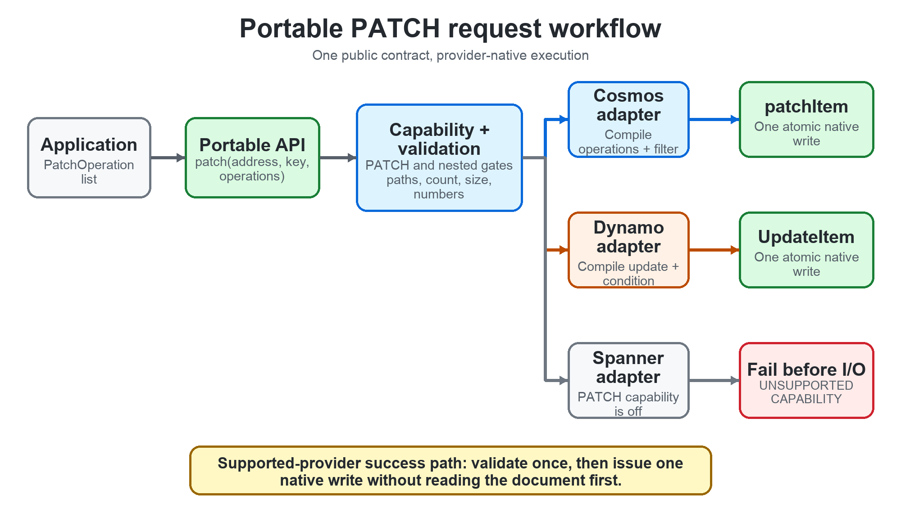
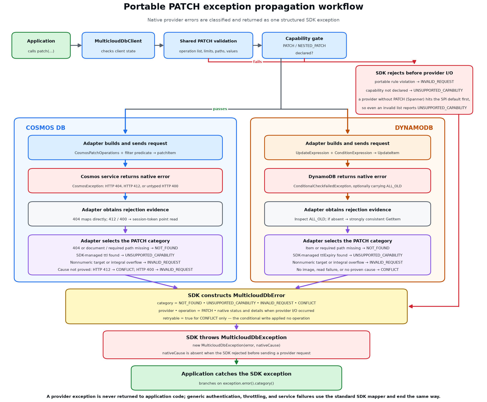

# Portable PATCH API Design

| Metadata | Value |
|---|---|
| Status | Implemented by `feat/patch-api` / PR #95 |
| Providers | Cosmos DB and DynamoDB |
| Deferred | Spanner |
| Updated | 2026-08-20 |

## 1. Decision

The SDK exposes one provider-neutral field-level PATCH API:

```java
client.patch(address, key, List.of(
        PatchOperation.replace("/status", "SHIPPED"),
        PatchOperation.increment("/revision", 1)));
```

Cosmos DB and DynamoDB use native server-side partial writes. Spanner declares
PATCH unsupported in this release and can implement the same API later.

| Provider | Implementation |
|---|---|
| Cosmos DB | One conditional `patchItem` |
| DynamoDB | One conditional `UpdateItem` |
| Spanner | `UNSUPPORTED_CAPABILITY` before provider I/O |



*Figure 1. Shared validation routes the request to one native write or rejects
an unsupported provider before I/O.*

## 2. Portable contract

All operations in one call are atomic: either all changes are applied or none
are applied. The target document must already exist.

| Operation | Behavior |
|---|---|
| `SET` | Create or overwrite a field. A nested parent must already exist. |
| `REPLACE` | Replace an existing field; otherwise `NOT_FOUND`. |
| `REMOVE` | Remove an existing field; otherwise `NOT_FOUND`. |
| `INCREMENT` | Atomically add to an existing number. |

Shared validation applies before provider dispatch:

- maximum 10 operations;
- absolute JSON Pointer paths;
- no array indexes or `~` escapes;
- no duplicate, case-only alias, or overlapping paths;
- no key, TTL, `data`, or `_`-prefixed fields;
- signed 64-bit integral deltas and results;
- portable fractional deltas within the range described below;
- maximum 399 KB (408,576-byte) serialized request envelope.

### Why these limits?

| Limit | Readable rule | Reason |
|---|---|---|
| Fractional `INCREMENT` | `delta = 0`, or a non-zero magnitude from `1E-130` to about `9.007E15` | `1E-130` is DynamoDB's minimum non-zero numeric magnitude. The exact upper value is `2^53 - 1`, or `9.007199254740991E15`. It is the largest safe integer: every integer through that magnitude is exactly representable in IEEE-754 binary64. This lets Cosmos DB and DynamoDB receive the same normalized delta. |
| PATCH request envelope | At most 399 KB (`408,576` bytes) | DynamoDB's 400 KB item limit is the lowest provider limit. The SDK subtracts 1 KB for provider-injected fields and representation overhead, then reuses that portable ceiling for the serialized PATCH operation list. |

The size calculation is `400 * 1024 - 1 * 1024 = 408,576` bytes.

For PATCH, the 399 KB check measures each operation's type, path, and optional
value; a `REMOVE` still contributes its type and path. It bounds the request,
not the resulting document. A patch can still be rejected if its post-image
exceeds a provider's native item limit.

`OperationOptions.ttlSeconds()` is ignored. PATCH never creates or resets an
expiry.

## 3. Cosmos DB

### Request flow

1. Validate the portable request.
2. Translate operations into `CosmosPatchOperations`.
3. Add one server-side filter predicate.
4. Execute one `patchItem`.

The predicate checks:

- required paths and nested parents exist;
- increment targets are numeric;
- integral increment results stay within signed 64-bit range;
- the item does not contain SDK-managed `ttl`.

There is no success-path read and no item-wide `If-Match` ETag. The path-scoped
predicate allows concurrent updates to unrelated fields.

### Failure classification

Cosmos may return HTTP 412 or an untyped HTTP 400 for stored-state failures.
After such a rejection, the adapter uses a session-token point read to classify
the result:

| State | Error |
|---|---|
| Document or required path missing | `NOT_FOUND` |
| Nonnumeric target or integral overflow | `INVALID_REQUEST` |
| SDK-managed `ttl` present | `UNSUPPORTED_CAPABILITY` |
| Condition failed but current state proves no cause | `CONFLICT` |

### Provider differences

- Fractional increments use IEEE-754 binary64, so
  `EXACT_FRACTIONAL_INCREMENT` is unsupported.
- Native patch advances `_ts`; an item with SDK-managed relative `ttl` is
  rejected because its expiry cannot be preserved.

## 4. DynamoDB

### Request flow

1. Validate the portable request.
2. Compile one `UpdateExpression`.
3. Add one `ConditionExpression`.
4. Execute one `UpdateItem`.

The condition checks:

- the document exists;
- required paths and nested parents exist;
- integral increment results stay within signed 64-bit range.

Caller field names use expression-name placeholders, so reserved words and
special characters remain safe.

### Failure classification

The request asks for `ALL_OLD` on condition failure. The returned old image
normally identifies the portable error:

| State | Error |
|---|---|
| Document or required path missing | `NOT_FOUND` |
| Nonnumeric target or integral overflow | `INVALID_REQUEST` |
| Condition failed but the image proves no cause | `CONFLICT` |

If `ALL_OLD` is absent, the adapter uses one strongly consistent point read.

### Provider differences

- DynamoDB uses exact decimal `N` arithmetic, so
  `EXACT_FRACTIONAL_INCREMENT` is supported.
- PATCH does not write `ttlExpiry`, so the existing absolute expiry is
  preserved.



*Figure 2. Cosmos and DynamoDB use different provider evidence but normalize
the rejection to the same portable error categories.*

## 5. Capability matrix

| Capability | Cosmos DB | DynamoDB | Spanner |
|---|---|---|---|
| `PATCH` | Supported | Supported | Unsupported |
| `NESTED_PATCH` | Supported | Supported | Unsupported |
| `EXACT_FRACTIONAL_INCREMENT` | Unsupported | Supported | Unsupported |
| `PATCH_PRESERVES_TTL` | Unsupported | Supported | Unsupported |

The arithmetic capability is informational: both supported providers accept
portable fractional deltas, but accumulated fractional results may differ.
Applications requiring identical totals should use integral minor units.

## 6. Concurrency and retry behavior

Both providers evaluate increments on the server, so concurrent increments do
not lose updates.

An SDK-reported PATCH `CONFLICT` is safe to retry because the conditional write
was rejected and no operation was applied.

PATCH does not provide an idempotency token. Applications must not blindly
replay an `INCREMENT` after an ambiguous transport failure because the original
request may already have committed.

## 7. Cost expectations

PATCH is a latency, payload, and concurrency optimization, not a billing
guarantee.

| Provider | Successful request | Rejection-only work |
|---|---|---|
| Cosmos DB | One `patchItem` | Point read for HTTP 412 or untyped 400 classification |
| DynamoDB | One `UpdateItem` | Point read only when the failed response omits `ALL_OLD` |
| Spanner | No request | No request |

Actual RU/WCU usage depends on provider configuration, indexing, item shape,
and pricing.

## 8. Deferred Spanner implementation

The API and validation are already provider-neutral. A future Spanner
implementation only needs to:

1. implement the same SPI method;
2. satisfy the same error and atomicity contract;
3. pass the shared conformance suite;
4. update its capability declarations.

The detailed Spanner proposal is maintained separately on `spanner/patch` in
`specs/002-patch-api/spanner-design.md`.

## 9. References

- Requirements: `specs/001-clouddb-sdk/spec.md`, FR-181 through FR-192
- Planning decisions: `specs/001-clouddb-sdk/plan.md`
- User guidance: `docs/guide.md`
- Compatibility matrix: `docs/compatibility.md`
- Shared tests:
  `multiclouddb-conformance/.../us28/PatchConformanceTest.java`
- Cosmos implementation:
  `multiclouddb-provider-cosmos/.../CosmosProviderClient.java`
- DynamoDB implementation:
  `multiclouddb-provider-dynamo/.../DynamoProviderClient.java`
