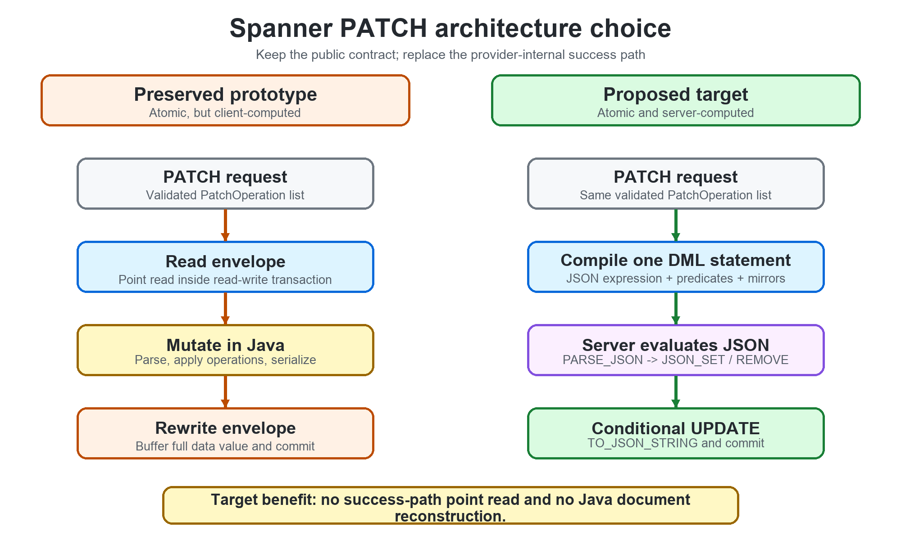
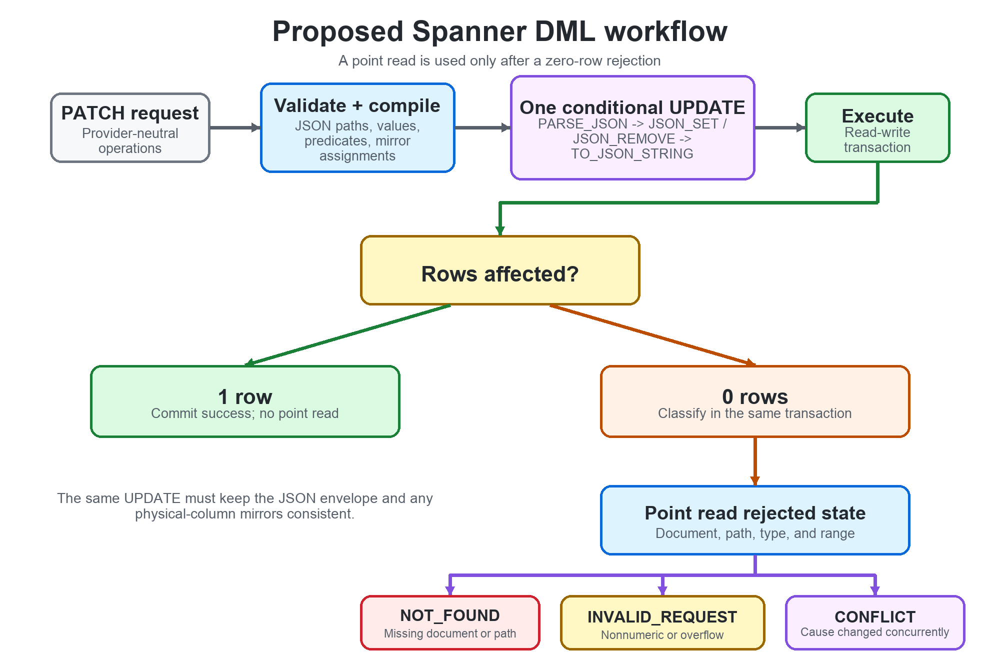

# Spanner PATCH - Deferred Design

| Metadata | Value |
|---|---|
| Status | Proposed for a separate Spanner PR |
| Branch | `spanner/patch` |
| Canonical PATCH design | [`design.md`](design.md) |
| Updated | 2026-08-20 |

## 1. Decision

Spanner PATCH is not part of PR #95. That PR ships:

- Cosmos DB native `patchItem`;
- DynamoDB native `UpdateItem`;
- Spanner `UNSUPPORTED_CAPABILITY`.

The preserved Spanner prototype is useful for testing, but it should not ship
unchanged. The final implementation should apply PATCH with one server-side
GoogleSQL `UPDATE`, without reading and rebuilding the document in Java on the
success path.

This change remains Spanner-specific. It does not require a public API change
or any behavioral change to Cosmos DB or DynamoDB.

## 2. Preserved prototype

The current experimental branch:

1. starts a Spanner read-write transaction;
2. reads the JSON document envelope from `data STRING(MAX)`;
3. applies operations in Java;
4. rewrites the envelope and compatible physical columns;
5. commits the transaction.

It is atomic and passed the experimental Spanner conformance run, but it has
two drawbacks:

- every successful PATCH performs a document read;
- every successful PATCH rebuilds the complete envelope in Java.

The prototype is a fallback and test reference, not the preferred release
architecture.



*Figure 1. The public PATCH contract stays unchanged; only the Spanner
provider's success path changes.*

## 3. Target architecture

Keep `data` as `STRING(MAX)` for the first Spanner PATCH release and transform
the JSON envelope inside Spanner:

```sql
UPDATE <table>
SET data = TO_JSON_STRING(
    <JSON_SET / JSON_REMOVE expression over SAFE.PARSE_JSON(data)>
)
WHERE partitionKey = @partitionKey
  AND sortKey = @sortKey
  AND <portable path, type, and range predicates>
```

The request runs in a Spanner read-write transaction but performs no
success-path point read.

| Portable operation | GoogleSQL approach |
|---|---|
| `SET` | `JSON_SET` |
| `REPLACE` | existence predicate plus `JSON_SET` |
| `REMOVE` | existence predicate plus `JSON_REMOVE` |
| `INCREMENT` | numeric/range predicate plus `JSON_SET(current + delta)` |

All operations are compiled into one `UPDATE`, so they commit together or not
at all.

## 4. Strict portable behavior

The DML `WHERE` clause must enforce the same contract as Cosmos DB and
DynamoDB:

- the document exists;
- `REPLACE`, `REMOVE`, and `INCREMENT` targets exist;
- a nested `SET` parent exists;
- increment targets are numeric;
- integral results remain within signed 64-bit range.

`JSON_SET` and `JSON_REMOVE` can silently ignore incompatible or missing paths.
The explicit predicates are therefore required.

If the update affects zero rows, classify the cause with a point read in the
same transaction:

| State | Error |
|---|---|
| Document or required path missing | `NOT_FOUND` |
| Nonnumeric target or integral overflow | `INVALID_REQUEST` |
| State no longer proves a deterministic cause | `CONFLICT` |



*Figure 2. A successful update has no point read; rejected state is read only
when the conditional DML affects zero rows.*

## 5. Storage and migration

The existing Spanner provider historically used `data` as a JSON list of field
names. The prototype changes it to an object envelope containing
`_mcdbDocument`.

Before PATCH is enabled:

1. new writes must use the envelope format;
2. reads must recognize legacy and envelope rows;
3. existing rows must have a documented migration path;
4. malformed or unknown formats must fail explicitly.

A native Spanner `JSON` column may be considered later. It is not required for
the first PATCH implementation because `PARSE_JSON` and `TO_JSON_STRING` can
operate server-side over the existing string column.

## 6. Physical-column mirrors

The envelope is authoritative. Physical columns used for querying or
interoperability must not remain stale.

For every patched top-level field, the same DML statement must:

- update the compatible physical column;
- recompute its serialized value; or
- clear it to SQL `NULL`.

Queries, reads, and change feeds must return the same post-patch document.

## 7. Capability plan

| Capability | Initial target |
|---|---|
| `PATCH` | Supported after the server-side DML implementation passes conformance |
| `NESTED_PATCH` | Supported only after JSONPath and nested-mirror behavior pass conformance |
| `EXACT_FRACTIONAL_INCREMENT` | Unsupported; initial arithmetic uses JSON/FLOAT64 behavior |
| `PATCH_PRESERVES_TTL` | Unsupported while Spanner row-level TTL is unavailable |

Capabilities stay unsupported until the related behavior is complete.

## 8. Implementation sequence

1. Rebase `spanner/patch` onto the merged PR #95 branch while keeping PATCH
   unsupported.
2. Verify required JSON functions against emulator `1.5.56` and a real Spanner
   database.
3. Implement the validated PATCH-to-DML compiler.
4. Add zero-row rejection classification.
5. Complete envelope migration and physical-mirror handling.
6. Run the shared PATCH conformance suite.
7. Enable only the capabilities proven by the tests.

## 9. Release gates

The Spanner PR is ready only when:

- a successful PATCH uses one server-side DML statement and no point read;
- all operations are atomic;
- concurrent increments lose no updates;
- legacy rows have explicit migration behavior;
- physical mirrors cannot remain stale;
- reads, queries, and change feeds agree;
- emulator and real-service tests pass;
- Cosmos DB and DynamoDB behavior remains unchanged.

## 10. Cost expectation

Server-side DML removes the client read and Java document reconstruction. It
does not guarantee that Spanner updates only the changed JSON bytes internally.

The correct claim is:

> Spanner PATCH provides an atomic server-side field-mutation interface, not a
> guaranteed byte-level or billing reduction.

## 11. Final recommendation

Keep Spanner unsupported in PR #95. In the separate Spanner PR, replace the
prototype's Java read-modify-write success path with one conditional GoogleSQL
`UPDATE`, solve envelope migration and mirror consistency, then enable
capabilities only after shared conformance passes.
