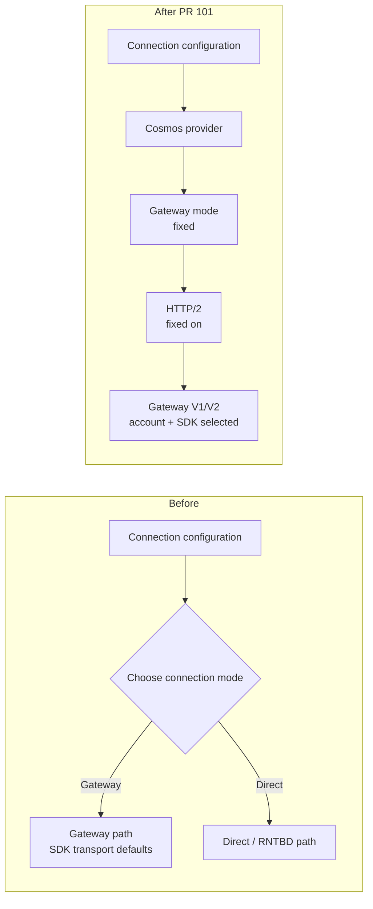
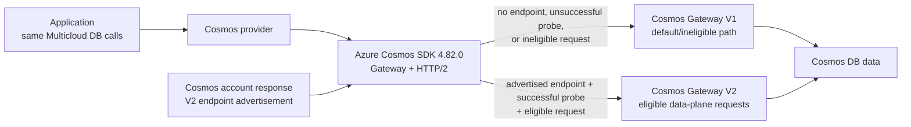
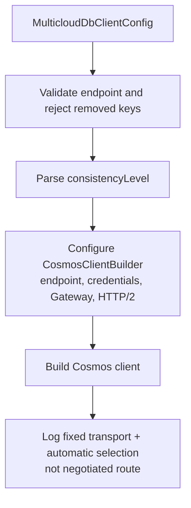
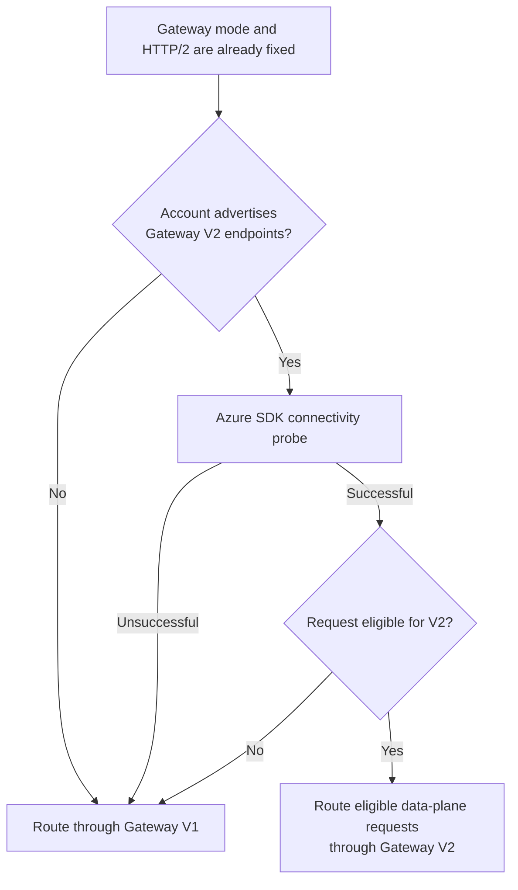

# Design: Cosmos Gateway Transport Defaults

**Status**: In review — implementation proposed in PR #101
**Created**: 2026-08-31
**Last updated**: 2026-09-09
**Feature spec**: [spec.md](spec.md)
**Implementation plan**: [plan.md](plan.md)

## Context

The Cosmos adapter previously exposed `connectionMode`, allowing Gateway or
Direct/RNTBD operation. Gateway HTTP/2 and Gateway V2 routing were also easy to
treat as one setting even though they are separate layers:

1. **Gateway mode** selects the HTTP-based Cosmos connectivity path instead of
   Direct/RNTBD.
2. **Gateway HTTP/2** selects the wire protocol used by the Gateway client.
3. **Gateway V2** selects a lower-overhead data-plane proxy when the account and
   network path support it.

The product decision is to standardize the first two and leave Gateway version
selection to Cosmos account configuration and the native SDK.

## Change at a Glance



Multicloud DB exposes no connection-mode, HTTP-version, or Gateway-version
selector. Cosmos DB service routing remains authoritative.

## Goals

- Construct every Cosmos client in Gateway mode.
- Explicitly enable HTTP/2 for every Gateway client because Gateway V2 and
  newer supported Cosmos features require it.
- Delegate Gateway V1/V2 selection to account-advertised endpoints and SDK
  4.82.0's connectivity probe.
- Avoid promoting internal JVM-wide Azure flags into a wrapper API.
- Reject removed settings rather than silently changing their meaning.
- Keep the provider-neutral API and cross-provider data semantics unchanged.

## Non-goals

- Exposing Direct/RNTBD through the portable wrapper.
- Implementing a wrapper-owned Gateway V2 connectivity probe.
- Exposing a wrapper-owned Gateway V1/V2 selector or internal Azure SDK flags.
- Exposing the narrower Azure query-plan kill switch.
- Defining Gateway connection-pool sizes; those are performance-tuning work in
  dependent PR #98.

## Decision Summary

| Area | Decision |
|---|---|
| Native SDK | Upgrade Azure Cosmos Java SDK to 4.82.0 |
| Connection mode | Always Gateway; no supported switch |
| HTTP protocol | Always HTTP/2 via explicit builder configuration |
| Gateway version | Account advertises V2 endpoints; SDK probes and selects automatically |
| User override | None in Multicloud DB |
| Internal SDK flags | Neither read nor written by the wrapper |
| Removed keys | Reject `connectionMode`, `gatewayHttp2Enabled`, `gatewayV2Enable`, and `thinClientEnabled` |
| Portable API | No change |

## Gateway V2 Terminology

Gateway V2 is the public feature name. Azure Cosmos SDK internals and native
code also call this path the "thin client". It is **not** another client
library, application-side process, sidecar, or proxy that users install, and
Multicloud DB does not expose those internal controls.



Gateway mode and HTTP/2 remain fixed regardless of which branch the SDK uses.
There is no wrapper preference, and the route does not change the portable API
or document/query behavior. Gateway V2 handles eligible data-plane requests;
metadata and unsupported requests remain on Gateway V1.


## Construction Flow



Validation precedes native client construction so malformed or stale
configuration cannot trigger credential work or network I/O.

## Transport Observability

The provider emits one INFO record only after `CosmosClientBuilder.buildClient()`
succeeds:

```text
Cosmos transport configured: Gateway mode, HTTP/2 enabled. Gateway V1/V2
routing is selected automatically from account configuration by Azure Cosmos
DB and its SDK.
```

This is deliberately a **configuration snapshot**, not a negotiated Gateway
version. Azure Cosmos SDK 4.82.0 exposes no public client-construction getter
for that result, and routing can vary by account topology, connectivity-probe
result, and request type. Logging "using Gateway V1" or "using Gateway V2" at
construction would therefore be incorrect.


## Gateway V2 Selection



The account response is the source of Gateway V2 endpoint availability. The
SDK starts conservatively on Gateway V1 and probes only when an endpoint is
advertised. A successful probe enables V2 eligibility; it does not guarantee
that every request uses V2.

### Service and SDK boundary

- The wrapper configures only supported public builder APIs: Gateway mode and
  `Http2ConnectionConfig.setEnabled(true)`.
- The wrapper exposes no Gateway-version property and does not read or write
  internal Azure SDK thin-client flags.
- Azure Cosmos DB account configuration controls whether V2 endpoints are
  advertised.
- The SDK owns connectivity probing and per-request routing.
- Metadata and unsupported request types can remain on Gateway V1 after a
  successful V2 probe.

This avoids turning an internal, JVM-wide SDK switch into a public Multicloud
DB contract and preserves the SDK's safe probe-gated behavior.

## Compatibility and Migration

This is a deliberate pre-release configuration and public-constant cleanup.

| Previous input | New result | Migration |
|---|---|---|
| no `connectionMode` | Fixed Gateway | none |
| `connectionMode=gateway` | construction failure | remove key |
| `connectionMode=direct` | construction failure | construct and use an Azure SDK client directly if Direct is essential |
| no HTTP/2 key | Fixed HTTP/2 | none |
| `gatewayHttp2Enabled=true/false` | construction failure | remove key |
| no Gateway V2 key | automatic account/SDK selection | none |
| `gatewayV2Enable=<value>` | construction failure | remove key |
| `thinClientEnabled=<value>` | construction failure | remove key |

Failing even fixed-equivalent stale values ensures deployments do not retain
configuration that appears to control behavior but no longer does.

## Portability Analysis

The change is isolated to provider connection configuration. It does not alter
portable CRUD, query, paging, diagnostics, capability, or error contracts.
DynamoDB and Spanner have no corresponding provider setting to add.


The default favors portability operationally: applications still switch
providers through configuration only, while the Cosmos adapter owns its safe
native transport policy. Users needing Direct/RNTBD must construct and use the
Azure SDK directly and accept provider-specific code.

## Failure Handling

| Failure | Surface | Network I/O |
|---|---|---:|
| missing/blank endpoint | `IllegalArgumentException` | no |
| removed transport key | `IllegalArgumentException` with migration guidance | no |
| Gateway V2 probe failure | automatic Gateway V1 fallback | probe only |

The wrapper does not catch or success-shape native connectivity failures.

## Testing Strategy

- Construction test captures `GatewayConnectionConfig`, asserts HTTP/2 is
  enabled, and verifies Direct mode is never called.
- Logging coverage verifies the fixed Gateway/HTTP2 snapshot and automatic
  account/SDK selection without a negotiated-route claim.
- Logging assertions distinguish the construction snapshot from actual
  per-request routing.
- Validation tests cover all four removed transport keys.
- `CosmosGatewayDefaultsTest` uses a fluent default answer for builder mocks
  and captures the argument passed to `gatewayMode(GatewayConnectionConfig)`.
  Existing `CosmosConsistencyTest` and `CosmosPostCloseTest` initializers still
  stub the no-argument `gatewayMode()`; the constructor discards the config
  overload's return value.
- Cosmos emulator conformance confirms the fixed transport remains compatible
  with the emulator.

## Rollout and Rollback

Rollout is a normal provider-module release with Azure Cosmos SDK 4.82.0.
Release notes and configuration docs call out the removed transport keys,
fixed HTTP/2, automatic Gateway selection, and transport snapshot.

Rollback requires reverting both the provider implementation and the Cosmos
SDK version. Gateway mode and HTTP/2 are intentional fixed policy and have no
runtime rollback switch.

## Dependency with Performance PRs

PR #101 is the base:

```text
#101 Cosmos Gateway defaults
  -> #98 performance harness and pool tuning
      -> #99 performance tests
```

PR #98 may retain pool-size and write-response controls, but it must not
reintroduce connection-mode or HTTP/2 enablement switches.
