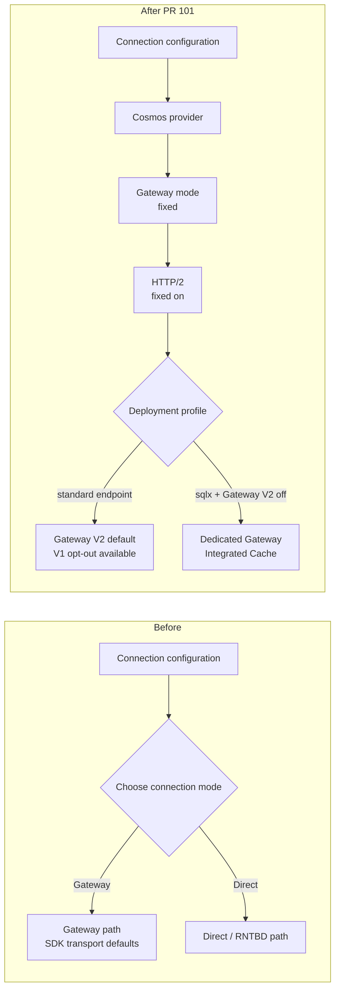
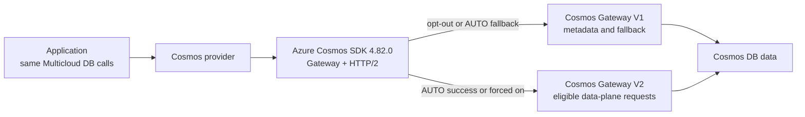
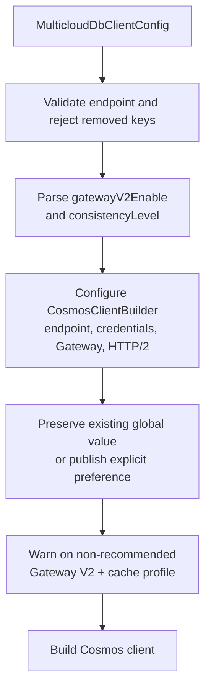
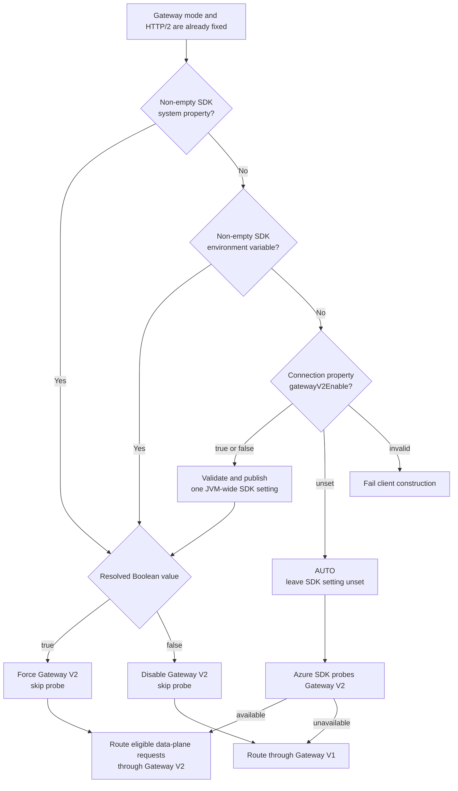

# Design: Cosmos Gateway Transport Defaults

**Status**: In review — implementation proposed in PR #101
**Date**: 2026-08-31
**Feature spec**: [spec.md](spec.md)
**Implementation plan**: [plan.md](plan.md)

## Context

The Cosmos adapter previously exposed `connectionMode`, allowing Gateway or
Direct/RNTBD operation. Gateway HTTP/2 and Gateway V2 routing were also easy to
treat as one setting even though they are separate layers:

1. **Gateway mode** selects the HTTP-based Cosmos connectivity path instead of
   Direct/RNTBD.
2. **Gateway HTTP/2** selects the wire protocol used by the Gateway client.
3. **Gateway V2** selects a lower-overhead data-plane proxy when the account and
   network path support it.

The product decision is to standardize the first two, make Gateway V2 safe by
default, and recommend the non-V2 opt-out for Dedicated Gateway with Integrated
Cache. Other combinations remain valid but produce an actionable warning.

## Change at a Glance



`gatewayV2Enable` controls only the final Gateway routing decision. It cannot
select Direct mode or disable HTTP/2; `false` also keeps a Dedicated Gateway
client on the non-V2 Integrated Cache path.

## Goals

- Construct every Cosmos client in Gateway mode.
- Explicitly enable HTTP/2 for every Gateway client.
- Make SDK 4.82.0's probe-gated Gateway V2 behavior the zero-configuration
  default.
- Preserve deterministic hard opt-out and hard opt-in controls.
- Document Dedicated Gateway with Integrated Cache as an explicit Cosmos-native
  profile that recommends disabling Gateway V2.
- Reject removed settings rather than silently changing their meaning.
- Keep the provider-neutral API and cross-provider data semantics unchanged.

## Non-goals

- Exposing Direct/RNTBD through the portable wrapper.
- Implementing a wrapper-owned Gateway V2 connectivity probe.
- Making the Azure SDK's global Gateway V2 flag truly per-client.
- Exposing the narrower Azure query-plan kill switch.
- Defining a portable read-through-cache capability or configurable cache
  staleness; those require a separate cross-provider design covering DynamoDB
  DAX and unsupported providers.
- Defining Gateway connection-pool sizes; those are performance-tuning work in
  dependent PR #98.

## Decision Summary

| Area | Decision |
|---|---|
| Native SDK | Upgrade Azure Cosmos Java SDK to 4.82.0 |
| Connection mode | Always Gateway; no supported switch |
| HTTP protocol | Always HTTP/2 via explicit builder configuration |
| Gateway V2 default | Leave the native SDK value unset for probe/fallback |
| User override | `gatewayV2Enable=false` disables; `true` forces |
| Dedicated Gateway cache | `sqlx` endpoint + `gatewayV2Enable=false` + `EVENTUAL` |
| Profile isolation | Clients needing different Gateway V2 values use separate JVM processes |
| Operator precedence | SDK system property, then SDK environment variable |
| Removed keys | Reject `connectionMode`, `gatewayHttp2Enabled`, and draft `thinClientEnabled` |
| Portable API | No change |

## Gateway V2 Terminology

Gateway V2 is the public feature name. Azure Cosmos SDK internals and native
settings also call this path the "thin client". It is **not** another client
library, application-side process, sidecar, or proxy that users install.
Application code, credentials, endpoints, and Multicloud DB operations remain
the same.



Both branches remain Gateway-mode traffic. The setting changes which Gateway
implementation the Azure SDK uses; it does not change the portable API or
document/query behavior. Gateway V2 handles eligible data-plane requests;
metadata requests remain on Gateway V1 under the native SDK.

## Dedicated Gateway with Integrated Cache

Integrated Cache is server-side memory attached to paid Dedicated Gateway
compute, not a client-local cache. Cosmos team guidance does not recommend
using Gateway V2 with Integrated Cache because the extra routing path does not
improve cache hits.

The recommended provider-native cache profile uses:

1. A provisioned Dedicated Gateway and its `sqlx.cosmos.azure.com` endpoint.
2. `gatewayV2Enable=false` so eligible requests stay off Gateway V2.
3. `EVENTUAL` consistency in Multicloud DB examples, matching the planned
   portable cache contract.

Cache-hit point reads and queries may return with 0 RU; writes, misses, and
Dedicated Gateway compute retain their normal cost. This feature does not add
a portable cache capability or expose `MaxIntegratedCacheStaleness`, so the
Dedicated Gateway service-side staleness default applies. A recognized `sqlx`
endpoint while Gateway V2 is enabled or eligible produces an actionable warning
that identifies `gatewayV2Enable=false` as the recommended configuration.

Because the Azure SDK reads its JVM-wide native setting lazily, clients that
need different Gateway V2 preferences must run in separate JVM processes.

## Construction Flow



Validation precedes native client construction so malformed or stale
configuration cannot trigger credential work or network I/O.

## Gateway V2 Selection



| Effective preference | V2 probe | Eligible data-plane routing |
|---|---|---|
| unset / `AUTO` | yes | Gateway V2 when available; otherwise Gateway V1 |
| `false` | no | Gateway V1; Gateway V2 is disabled |
| `true` | no | Gateway V2 is forced; native connectivity failures remain visible |

> **Default does not mean `true`.** Leaving the value unset activates SDK
> 4.82.0's safe AUTO behavior. Explicit `true` bypasses the probe and fallback.

### Default

When `gatewayV2Enable` is absent, the wrapper writes no SDK property. Azure
Cosmos SDK 4.82.0 uses a tri-state `null` value to represent this condition.
For Gateway HTTP/2 clients, the SDK probes Gateway V2 connectivity and routes
through Gateway V2 only on an affirmative verdict. A failed or unavailable
probe leaves routing on Gateway V1.

This is intentionally different from setting `true`: explicit `true` is a hard
opt-in and bypasses the probe.

### Explicit override

The wrapper accepts only `true` or `false`, case-insensitive:

- `true` writes `COSMOS.THINCLIENT_ENABLED=true`;
- `false` writes `COSMOS.THINCLIENT_ENABLED=false`;
- any other value fails construction.

### Global-state boundary

The Azure SDK exposes Gateway V2 selection through native properties named for
the thin client, not through `CosmosClientBuilder`. Therefore:

- a pre-existing non-empty SDK setting is never overwritten;
- the wrapper's check-and-set is synchronized;
- the SDK reads the value lazily for requests rather than snapshotting it per
  client;
- an unset client logs when a global value has already replaced AUTO behavior;
- all Cosmos clients in one JVM must use a consistent preference.

This global behavior is documented as a provider constraint. Process isolation
is required when clients need different Gateway V2 preferences.
All wrapper-owned values are validated before publication. If native
`buildClient()` later fails, the published property remains process-wide and
governs subsequent Cosmos clients.

The system property and environment variable are native Azure SDK controls and
are expected to contain `true` or `false`. The wrapper strictly validates only
its `gatewayV2Enable` connection property; native-setting parsing remains
owned by the SDK.

## Query-plan Routing

SDK 4.82.0 also has
`COSMOS.THINCLIENT_QUERY_PLAN_ENABLED`, a narrower kill switch. The query-plan
path first evaluates the main thin-client eligibility decision. Consequently,
the main `COSMOS.THINCLIENT_ENABLED=false` opt-out prevents both data-plane and
query-plan Gateway V2 routing. The wrapper does not duplicate the narrower
switch.

## Compatibility and Migration

This is a deliberate pre-release configuration and public-constant cleanup.

| Previous input | New result | Migration |
|---|---|---|
| no `connectionMode` | Fixed Gateway | none |
| `connectionMode=gateway` | construction failure | remove key |
| `connectionMode=direct` | construction failure | construct and use an Azure SDK client directly if Direct is essential |
| no HTTP/2 key | Fixed HTTP/2 | none |
| `gatewayHttp2Enabled=true/false` | construction failure | remove key |
| no Gateway V2 key | auto-probe/fallback | recommended default |
| `thinClientEnabled=<value>` | construction failure | rename key to `gatewayV2Enable` |
| `gatewayV2Enable=false` | hard opt-out | unchanged operational intent |
| Dedicated `sqlx` endpoint + `gatewayV2Enable=false` | Gateway V1 cache path | use `EVENTUAL`; separate process from V2 clients |

Failing even fixed-equivalent stale values ensures deployments do not retain
configuration that appears to control behavior but no longer does.

## Portability Analysis

The change is isolated to provider connection configuration. It does not alter
portable CRUD, query, paging, diagnostics, capability, or error contracts.
DynamoDB and Spanner have no corresponding provider setting to add.

The Dedicated Gateway profile is explicit Cosmos-native deployment guidance,
not a portable cache capability. A future portable cache feature must add
cross-provider capability gating and configurable staleness.

The default favors portability operationally: applications still switch
providers through configuration only, while the Cosmos adapter owns its safe
native transport policy. Users needing Direct/RNTBD must construct and use the
Azure SDK directly and accept provider-specific code.

## Failure Handling

| Failure | Surface | Network I/O |
|---|---|---:|
| missing/blank endpoint | `IllegalArgumentException` | no |
| removed or renamed transport key | `IllegalArgumentException` with migration guidance | no |
| malformed Gateway V2 value | `IllegalArgumentException` with valid values | no |
| Gateway V2 probe failure | automatic Gateway V1 fallback | probe only |
| explicit hard opt-in unsupported | native SDK connectivity failure | yes |
| Dedicated endpoint with V2 enabled or eligible | warning that the combination is not recommended | no |

The wrapper does not catch or success-shape native failures from an explicit
hard opt-in.

## Testing Strategy

- Construction test captures `GatewayConnectionConfig`, asserts HTTP/2 is
  enabled, and verifies Direct mode is never called.
- A 2x3 matrix covers standard and Dedicated endpoints with Gateway V2 unset,
  `true`, and `false`, including warning presence or absence.
- Precedence test verifies an operator SDK property is not overwritten.
- Validation tests cover malformed Boolean input, removed keys, and the renamed
  draft key.
- Environment-sensitive property-publication tests skip when the native
  environment override is present and lock JVM system properties.
- Pre-publication consistency validation has focused unit coverage.
- Existing builder mocks use the `gatewayMode(GatewayConnectionConfig)`
  overload.
- Cosmos emulator conformance confirms the fixed transport remains compatible
  with the emulator.

## Rollout and Rollback

Rollout is a normal provider-module release with Azure Cosmos SDK 4.82.0.
Release notes and configuration docs call out the removed/renamed keys,
combination warning, and JVM-wide override semantics.

Rollback requires reverting both the provider implementation and the Cosmos
SDK version. Operators can mitigate Gateway V2 independently by setting
`gatewayV2Enable=false`; Gateway mode and HTTP/2 are intentional fixed
policy and have no runtime rollback switch.

## Dependency with Performance PRs

PR #101 is the base:

```text
#101 Cosmos Gateway defaults
  -> #98 performance harness and pool tuning
      -> #99 performance tests
```

PR #98 may retain pool-size and write-response controls, but it must not
reintroduce connection-mode or HTTP/2 enablement switches.
