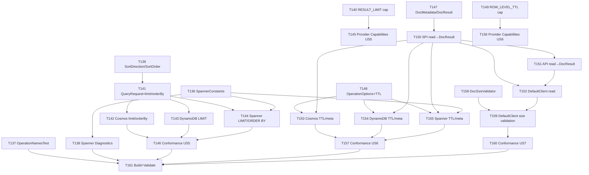

# Tasks: Result Set Control, TTL/Write Metadata, Uniform Document Size, and Provider Diagnostics

**Input**: Design documents from `specs/users/allekim/feature/issue_25/`  
**Prerequisites**: plan.md (required), spec.md (required), research.md, data-model.md, contracts/openapi.yaml, quickstart.md

**Tech stack (from plan.md)**: Java 17 (LTS), multi-module Maven, Jackson `JsonNode`, SLF4J, JUnit 5 + Mockito

**Prior work**: Phases 1–13 (T001–T135) are complete. This file covers T136+ for new spec requirements.

## Format: `- [ ] T### [P?] [US?] Description with file path`

- **[P]**: Can run in parallel (different files, no dependencies)
- **[US#]**: User story label (maps to spec.md stories: US5, US6, US7)

---

## Phase 14: Provider Constants Centralization — Completion (FR-049–051)

**Purpose**: Complete the constants/diagnostics work left unfinished after Phase 13. All three tasks touch different files and can be done in parallel.

- [ ] T136 [P] Create `SpannerConstants.java` centralizing all hard-coded string literals used by the Spanner provider — field names (`partitionKey`, `sortKey`, `data`, `lastModified`), config keys, query fragments (SELECT ALL, partition key WHERE clause, LIMIT/OFFSET skeleton), error messages, and default values. Mirror the structure of `CosmosConstants` and `DynamoConstants`. File: `hyperscaledb-provider-spanner/src/main/java/com/hyperscaledb/provider/spanner/SpannerConstants.java`

- [ ] T137 [P] Create `OperationNamesTest.java` that reflectively reads all `public static final String` fields declared in `OperationNames` using Java reflection, collects their runtime values into a list, and asserts (via JUnit 5 `assertThat`) that the list contains no duplicates — catching any future re-declaration that would cause log-correlation ambiguity (SC-017). File: `hyperscaledb-api/src/test/java/com/hyperscaledb/api/OperationNamesTest.java`

- [ ] T138 [P] Add `logItemDiagnostics` and `logQueryDiagnostics` private helper methods to `SpannerProviderClient` and call them on every successful data-plane operation (`create`, `read`, `update`, `upsert`, `delete`, `query`, `queryWithTranslation`). Log format: `spanner.diagnostics op={} db={} col={} itemCount={} hasMore={}` at `DEBUG` level via SLF4J. Use `SpannerConstants` for log prefix strings (FR-051). File: `hyperscaledb-provider-spanner/src/main/java/com/hyperscaledb/provider/spanner/SpannerProviderClient.java`

**Checkpoint**: `mvn test -pl hyperscaledb-api -Dtest=OperationNamesTest` passes. Spanner provider compiles with no magic strings. DEBUG log lines appear for Spanner operations.

---

## Phase 15: User Story 5 — Result Set Control: Top N and Ordering (Priority: P1)

**Goal**: `QueryRequest` supports an optional result limit (Top N) and optional ORDER BY, enabling efficient "top K results" queries. ORDER BY is capability-gated: only Cosmos DB and Spanner support it. All three providers support LIMIT N.

**Independent Test**: A query with `limit(5)` returns at most 5 items on all providers. A query with `orderBy("timestamp", SortDirection.DESC).limit(1)` returns the most recent item on Cosmos and Spanner. On DynamoDB, `orderBy(...)` throws `HyperscaleDbException` with category `UNSUPPORTED_CAPABILITY` at translation time.

### New Types for User Story 5

- [ ] T139 [P] [US5] Create `SortDirection` enum with values `ASC` and `DESC`. Create `SortOrder` final class (or record) with fields `String field` (validated non-null, non-empty) and `SortDirection direction` (non-null), a static factory `SortOrder.of(String field, SortDirection direction)`, and `field()` / `direction()` accessors. Files: `hyperscaledb-api/src/main/java/com/hyperscaledb/api/SortDirection.java`, `hyperscaledb-api/src/main/java/com/hyperscaledb/api/SortOrder.java`

- [ ] T140 [P] [US5] Add `RESULT_LIMIT = "result_limit"` constant to `Capability` alongside the existing query DSL constants. File: `hyperscaledb-api/src/main/java/com/hyperscaledb/api/Capability.java`

### QueryRequest Extension

- [ ] T141 [US5] Extend `QueryRequest` with two new optional fields: `Integer limit` (null = no limit, minimum 1) and `List<SortOrder> orderBy` (null/empty = no ordering). Add builder methods `limit(int n)` and `orderBy(String field, SortDirection direction)` (appends a `SortOrder` to the list). Add `limit()` and `orderBy()` getters. The constructor must validate `limit >= 1` when non-null and copy `orderBy` defensively. Depends on T139 (`SortOrder` type). File: `hyperscaledb-api/src/main/java/com/hyperscaledb/api/QueryRequest.java`

### Provider Implementations for User Story 5

- [ ] T142 [P] [US5] Update `CosmosProviderClient` to apply `limit` and `orderBy` from `QueryRequest` in both `query()` and `queryWithTranslation()`. For `query()`: when `limit` is set and `expression` is not a native expression, rewrite the SQL by replacing `SELECT VALUE c` with `SELECT TOP N VALUE c`; when `orderBy` is set, append `ORDER BY c.{field} {ASC|DESC}` to the SQL string. For `queryWithTranslation()`: append `TOP N` to the Cosmos SQL via `translated.queryString()` replacement and append ORDER BY clause. Check `ORDER_BY` capability before applying (throw `HyperscaleDbException(UNSUPPORTED_CAPABILITY)` if not supported — though Cosmos supports it). File: `hyperscaledb-provider-cosmos/src/main/java/com/hyperscaledb/provider/cosmos/CosmosProviderClient.java`

- [ ] T143 [P] [US5] Update `DynamoProviderClient` to apply `limit` from `QueryRequest` in `executePartiQL()`: append `LIMIT N` to the PartiQL statement string when `query.limit()` is non-null. For `executeScan()`/`executeScanWithFilter()`: pass limit as the DynamoDB scan `limit()` parameter. When `query.orderBy()` is non-empty, fail fast immediately by throwing `HyperscaleDbException(UNSUPPORTED_CAPABILITY, "ORDER_BY not supported by DynamoDB provider")` before any I/O. File: `hyperscaledb-provider-dynamo/src/main/java/com/hyperscaledb/provider/dynamo/DynamoProviderClient.java`

- [ ] T144 [P] [US5] Update `SpannerProviderClient` to apply `limit` and `orderBy` from `QueryRequest` in `executeStatement()` and `queryWithTranslation()`. When `limit` is set, append `LIMIT N` to the GoogleSQL statement (in addition to existing `OFFSET` pagination). When `orderBy` is non-empty, append `ORDER BY {field} {ASC|DESC}` (before LIMIT/OFFSET). Use `SpannerConstants` for the ORDER BY and LIMIT clause templates (depends on T136 and T141). File: `hyperscaledb-provider-spanner/src/main/java/com/hyperscaledb/provider/spanner/SpannerProviderClient.java`

- [ ] T145 [P] [US5] Update all three provider capabilities to add `RESULT_LIMIT` and `ORDER_BY` entries where not yet present. `CosmosCapabilities`: add `new Capability(Capability.RESULT_LIMIT, true, "TOP N supported in Cosmos SQL")`. `DynamoCapabilities`: add `new Capability(Capability.RESULT_LIMIT, true, "LIMIT N supported in PartiQL")` and update `ORDER_BY` entry to `false` with note `"ORDER BY not supported in DynamoDB PartiQL executeStatement"`. `SpannerCapabilities`: add `new Capability(Capability.RESULT_LIMIT, true, "LIMIT N supported in GoogleSQL")`. Files: `hyperscaledb-provider-cosmos/.../CosmosCapabilities.java`, `hyperscaledb-provider-dynamo/.../DynamoCapabilities.java`, `hyperscaledb-provider-spanner/.../SpannerCapabilities.java`

### Tests for User Story 5

- [ ] T146 [US5] Create `ResultSetControlConformanceTest.java` in the conformance module with the following JUnit 5 `@Test` methods (annotated `@Order` for readability, not strict dependency): `limitOnlyReturnsAtMostNItems` — seeds 10 items, queries with `limit(5)`, asserts page size ≤ 5; `limitWithExpressionFiltersFirst` — seeds mixed items, queries with filter + `limit(3)`, asserts ≤ 3 matching items returned; `limitWithPartitionKeyScopesCorrectly` — seeds items across two partitions, queries one partition with `limit(2)`, asserts ≤ 2 items all from correct partition; `orderByDescOnSupportedProvider` — seeds items with a numeric `priority` field, queries with `orderBy("priority", SortDirection.DESC).limit(1)`, asserts the highest-priority item is returned (Cosmos + Spanner only — skip if provider is DynamoDB); `orderByThrowsOnDynamoDB` — asserts that `orderBy(...)` on DynamoDB throws `HyperscaleDbException` with category `UNSUPPORTED_CAPABILITY`. File: `hyperscaledb-conformance/src/test/java/com/hyperscaledb/conformance/us5/ResultSetControlConformanceTest.java`

**Checkpoint**: `mvn test -pl hyperscaledb-conformance -Dtest=ResultSetControlConformanceTest` passes (skip provider-specific tests per available provider). `QueryRequest.builder().limit(5).build()` compiles and the limit field is readable.

---

## Phase 16: User Story 6 — Document TTL and Write Metadata (Priority: P2)

**Goal**: Applications can set a TTL on individual documents at write time (where supported) and retrieve document metadata (remaining TTL + write timestamp) on reads via an opt-in `OperationOptions` flag. `read()` returns `DocumentResult` wrapping the document and optional metadata.

**Independent Test**: A document created with `ttlSeconds(60)` on Cosmos or DynamoDB is automatically removed after ~60 seconds. Reading with `includeMetadata(true)` returns a `DocumentMetadata` containing `writeTimestamp` (Cosmos, Spanner) and `remainingTtlSeconds` (Cosmos, DynamoDB). Setting TTL on Spanner throws `HyperscaleDbException(UNSUPPORTED_CAPABILITY)`. Existing code calling `client.read(...)` migrates by calling `.document()` on the returned `DocumentResult`.

### New Types for User Story 6

- [ ] T147 [P] [US6] Create `DocumentMetadata` final class with `OptionalLong remainingTtlSeconds()` and `Optional<Instant> writeTimestamp()` accessors and a static builder/factory `DocumentMetadata.of(OptionalLong ttl, Optional<Instant> ts)`. Create `DocumentResult` final class with `ObjectNode document()` and `Optional<DocumentMetadata> metadata()` accessors and a static factory `DocumentResult.of(ObjectNode doc, DocumentMetadata meta)` plus `DocumentResult.of(ObjectNode doc)` (no metadata). Files: `hyperscaledb-api/src/main/java/com/hyperscaledb/api/DocumentMetadata.java`, `hyperscaledb-api/src/main/java/com/hyperscaledb/api/DocumentResult.java`

- [ ] T148 [P] [US6] Extend `OperationOptions` with two new optional fields: `Integer ttlSeconds` (null = no TTL; validated ≥ 1 when non-null) and `boolean includeMetadata` (default `false`). Refactor to a builder pattern (keeping the existing `defaults()` and `withTimeout(Duration)` factory methods as backward-compatible shortcuts that delegate to the new builder). Add `ttlSeconds()`, `includeMetadata()` getters, and a `Builder` inner class with `timeout(Duration)`, `ttlSeconds(int)`, `includeMetadata(boolean)`, and `build()` methods. File: `hyperscaledb-api/src/main/java/com/hyperscaledb/api/OperationOptions.java`

- [ ] T149 [P] [US6] Add `ROW_LEVEL_TTL = "row_level_ttl"` and `WRITE_TIMESTAMP = "write_timestamp"` string constants to `Capability`. File: `hyperscaledb-api/src/main/java/com/hyperscaledb/api/Capability.java`

### API Surface Change: read() → DocumentResult

- [ ] T150 [US6] Change the `read()` method return type in the SPI interface from `JsonNode` to `DocumentResult`. Update both the abstract method `DocumentResult read(ResourceAddress, Key, OperationOptions)` and the default convenience overload `default DocumentResult read(ResourceAddress, Key)`. Depends on T147. File: `hyperscaledb-api/src/main/java/com/hyperscaledb/spi/HyperscaleDbProviderClient.java`

- [ ] T151 [US6] Change the `read()` method return type in the public client interface from `JsonNode` to `DocumentResult` for both the primary method and default overload. Add `int getDocumentSizeLimit()` default method returning `DocumentSizeValidator.MAX_DOCUMENT_SIZE_BYTES` (anticipating T158). Depends on T150. File: `hyperscaledb-api/src/main/java/com/hyperscaledb/api/HyperscaleDbClient.java`

- [ ] T152 [US6] Update `DefaultHyperscaleDbClient.read()` to return `DocumentResult` — delegate to `providerClient.read(address, key, options)` and propagate the `DocumentResult` directly. Update the log line to log `found={result != null && result.document() != null}`. Depends on T150, T151. File: `hyperscaledb-api/src/main/java/com/hyperscaledb/api/internal/DefaultHyperscaleDbClient.java`

### Provider Implementations for User Story 6

- [ ] T153 [P] [US6] Update `CosmosProviderClient` for TTL and metadata: (1) In `create()` and `upsert()` — when `options.ttlSeconds()` is non-null, set `doc.put("_ttl", options.ttlSeconds())` on the `ObjectNode` before writing. (2) Change `read()` return type to `DocumentResult` — always return a `DocumentResult.of(doc)`. When `options.includeMetadata()` is true, extract `_ts` (epoch seconds, `Long`) from the returned `ObjectNode` for `writeTimestamp` via `Instant.ofEpochSecond(_ts)`, and compute `remainingTtlSeconds` from `_ttl - (Instant.now().getEpochSecond() - _ts)` if `_ttl` is present (clamp to 0 if negative). Return `DocumentResult.of(doc, DocumentMetadata.of(...))`. Depends on T147, T148, T150. File: `hyperscaledb-provider-cosmos/src/main/java/com/hyperscaledb/provider/cosmos/CosmosProviderClient.java`

- [ ] T154 [P] [US6] Update `DynamoProviderClient` for TTL and metadata: (1) In `create()` and `upsert()` — when `options.ttlSeconds()` is non-null, add a `ttlExpiry` `AttributeValue.fromN(...)` key to the item map set to `Instant.now().plusSeconds(options.ttlSeconds()).getEpochSecond()` as a string. Use `DynamoConstants.ATTR_TTL_EXPIRY` for the attribute name. (2) Change `read()` return type to `DocumentResult`. When `options.includeMetadata()` is true, extract `ttlExpiry` from the raw item attributes: if present and in the future, compute `remainingTtlSeconds = ttlExpiry - Instant.now().getEpochSecond()` (clamp to 0). DynamoDB has no native write timestamp; `writeTimestamp` is `Optional.empty()`. Depends on T147, T148, T150. File: `hyperscaledb-provider-dynamo/src/main/java/com/hyperscaledb/provider/dynamo/DynamoProviderClient.java`

- [ ] T155 [P] [US6] Update `SpannerProviderClient` for TTL (fail-fast) and write-timestamp metadata: (1) In `create()` and `upsert()` — if `options.ttlSeconds()` is non-null, throw `HyperscaleDbException` with category `UNSUPPORTED_CAPABILITY` and message `"ROW_LEVEL_TTL not supported by Spanner provider"` before any I/O. (2) Update `ensureContainer()` DDL to add a `lastModified TIMESTAMP OPTIONS (allow_commit_timestamp=true)` column: new DDL is `CREATE TABLE {table} (partitionKey STRING(MAX) NOT NULL, sortKey STRING(MAX) NOT NULL, data STRING(MAX), lastModified TIMESTAMP OPTIONS (allow_commit_timestamp=true)) PRIMARY KEY (partitionKey, sortKey)`. (3) In `create()` and `upsert()`: include `lastModified` set to `Value.COMMIT_TIMESTAMP` in the Mutation. (4) Change `read()` to return `DocumentResult`. When `options.includeMetadata()` is true, include the `lastModified` column in the `READ` call and extract it as `writeTimestamp`. Spanner TTL absent → `remainingTtlSeconds` is `OptionalLong.empty()`. Depends on T136 (SpannerConstants), T147, T148, T150. File: `hyperscaledb-provider-spanner/src/main/java/com/hyperscaledb/provider/spanner/SpannerProviderClient.java`

- [ ] T156 [P] [US6] Update all three provider capabilities files to add `ROW_LEVEL_TTL` and `WRITE_TIMESTAMP` entries: `CosmosCapabilities` — `ROW_LEVEL_TTL=true` (note: `"_ttl" field on document"`), `WRITE_TIMESTAMP=true` (note: `"_ts system property"`); `DynamoCapabilities` — `ROW_LEVEL_TTL=true` (note: `"ttlExpiry attribute, epoch seconds"`), `WRITE_TIMESTAMP=false`; `SpannerCapabilities` — `ROW_LEVEL_TTL=false` (note: `"Row-level TTL not supported; fail-fast on write"`), `WRITE_TIMESTAMP=true` (note: `"lastModified commit-timestamp column"`). Depends on T149. Files: `CosmosCapabilities.java`, `DynamoCapabilities.java`, `SpannerCapabilities.java`

### Tests for User Story 6

- [ ] T157 [US6] Create `TtlAndMetadataConformanceTest.java` with the following JUnit 5 tests: `ttlSetOnCosmosSucceeds` — creates document with `ttlSeconds(300)` on Cosmos, reads it back with `includeMetadata(true)`, asserts `remainingTtlSeconds` is present and ≤ 300; `ttlSetOnDynamoSucceeds` — same pattern for DynamoDB; `ttlOnSpannerThrowsUnsupportedCapability` — asserts `create(...)` with `ttlSeconds(60)` on Spanner throws `HyperscaleDbException(UNSUPPORTED_CAPABILITY)`; `writeTimestampPresentOnCosmos` — reads a just-written document with metadata, asserts `writeTimestamp` is within 5 seconds of `Instant.now()`; `writeTimestampPresentOnSpanner` — same for Spanner; `writeTimestampAbsentOnDynamo` — reads with metadata on DynamoDB, asserts `writeTimestamp` is `Optional.empty()`; `readWithoutMetadataHasNoMetadata` — reads with `OperationOptions.defaults()`, asserts `result.metadata()` is `Optional.empty()`. Depends on T153, T154, T155. File: `hyperscaledb-conformance/src/test/java/com/hyperscaledb/conformance/us6/TtlAndMetadataConformanceTest.java`

**Checkpoint**: `mvn test -pl hyperscaledb-conformance -Dtest=TtlAndMetadataConformanceTest` passes. `client.read(addr, key).document()` compiles everywhere. TTL capability matrix is reflected correctly in provider capabilities.

---

## Phase 17: User Story 7 — Uniform Document Size and Quota Limits (Priority: P2)

**Goal**: The SDK enforces a 400 KB maximum document size across all providers before sending any I/O. Oversized documents are rejected with `InvalidRequest`. The limit is accessible programmatically.

**Independent Test**: A document of 399 KB is accepted and persisted on any provider. A document of 401 KB is rejected with `HyperscaleDbException(INVALID_REQUEST)` before any provider call (verified by asserting no network call was made). `client.getDocumentSizeLimit()` returns `409600` (400 × 1024).

### Implementation for User Story 7

- [ ] T158 [P] [US7] Create `DocumentSizeValidator` utility class with `public static final int MAX_DOCUMENT_SIZE_BYTES = 400 * 1024` and a `public static void validate(JsonNode document)` method that serializes the document to UTF-8 bytes via `ObjectMapper.writeValueAsBytes()` and throws `HyperscaleDbException(HyperscaleDbErrorCategory.INVALID_REQUEST, "Document size exceeds 400 KB limit: " + actualSize + " bytes")` when the byte length exceeds `MAX_DOCUMENT_SIZE_BYTES`. File: `hyperscaledb-api/src/main/java/com/hyperscaledb/api/internal/DocumentSizeValidator.java`

- [ ] T159 [US7] Update `DefaultHyperscaleDbClient` to: (1) Call `DocumentSizeValidator.validate(document)` at the start of `create()` and `upsert()` before the provider delegation block. (2) Implement `getDocumentSizeLimit()` returning `DocumentSizeValidator.MAX_DOCUMENT_SIZE_BYTES`. The existing `OperationNames.CREATE` / `OperationNames.UPSERT` timing and error handling must still apply after validation passes. Depends on T158 and T152 (stable client state). File: `hyperscaledb-api/src/main/java/com/hyperscaledb/api/internal/DefaultHyperscaleDbClient.java`

### Tests for User Story 7

- [ ] T160 [US7] Create `DocumentSizeConformanceTest.java` with: `documentUnderLimitIsAccepted` — creates a 100 KB document (`"x".repeat(100 * 1024)`), asserts create and read succeed on each provider; `documentAtLimitIsAccepted` — creates a document just under 400 KB, asserts success; `documentOverLimitIsRejectedBeforeIO` — uses Mockito to spy on the `HyperscaleDbProviderClient` and verifies that `create()` is NEVER called when a 401 KB document is passed (the exception is thrown in `DefaultHyperscaleDbClient` before delegation); `documentSizeLimitIsExposed` — asserts `client.getDocumentSizeLimit() == 409600`; `errorCategoryIsInvalidRequest` — asserts the caught `HyperscaleDbException` from an oversized document has category `INVALID_REQUEST`. Depends on T158, T159. File: `hyperscaledb-conformance/src/test/java/com/hyperscaledb/conformance/us7/DocumentSizeConformanceTest.java`

**Checkpoint**: `mvn test -pl hyperscaledb-conformance -Dtest=DocumentSizeConformanceTest` passes. Existing conformance tests still pass (size validation does not affect test document sizes which are well under 400 KB).

---

## Phase 18: Build and Validate

- [ ] T161 Build and validate all modules compile and all existing + new tests pass: `mvn clean install -DskipTests` first to confirm zero compilation errors across all modules, then `mvn test` across `hyperscaledb-api`, `hyperscaledb-provider-cosmos`, `hyperscaledb-provider-dynamo`, `hyperscaledb-provider-spanner`, and `hyperscaledb-conformance`. Confirm no regression in previously passing tests (T001–T135 test suite). File path scope: all modules.

---

## Dependencies & Execution Order

### Phase Dependencies

- **Phase 14**: No dependencies on prior work; start immediately (all three tasks are parallel)
- **Phase 15 — New types (T139, T140)**: No dependencies; parallel with Phase 14
- **Phase 15 — QueryRequest (T141)**: Depends on T139 (SortOrder type)
- **Phase 15 — Provider impls (T142–T144)**: Depend on T141 (QueryRequest extended)
- **Phase 15 — Capabilities (T145)**: Depends on T140 (RESULT_LIMIT constant); parallel with T141
- **Phase 15 — Conformance (T146)**: Depends on T142, T143, T144
- **Phase 16 — New types (T147–T149)**: No dependencies; parallel with Phase 14 and 15
- **Phase 16 — SPI change (T150)**: Depends on T147 (DocumentResult)
- **Phase 16 — API change (T151)**: Depends on T150
- **Phase 16 — Default client (T152)**: Depends on T150, T151
- **Phase 16 — Provider impls (T153–T155)**: Depend on T147, T148, T150
- **Phase 16 — Capabilities (T156)**: Depends on T149; parallel with T153–T155
- **Phase 16 — Conformance (T157)**: Depends on T153, T154, T155
- **Phase 17 — Validator (T158)**: No dependencies; can start any time
- **Phase 17 — Default client (T159)**: Depends on T158, T152
- **Phase 17 — Conformance (T160)**: Depends on T159
- **Phase 18 (T161)**: Depends on T137, T138, T146, T157, T160

### Dependency Graph

### User Story Dependencies

- **Phase 14 (constants/diagnostics)**: Independent of all user stories
- **US5 (P1)**: Independent of US6 and US7
- **US6 (P2)**: Independent of US5; `OperationOptions` refactor (T148) must complete before provider TTL work
- **US7 (P2)**: Depends on Phase 16 completing `DefaultHyperscaleDbClient` (T152) to have stable client state; `DocumentSizeValidator` (T158) is independent

---

## Parallel Opportunities

### Phase 14 — All Three Tasks in Parallel

- T136: `SpannerConstants.java` (new file)
- T137: `OperationNamesTest.java` (new file)
- T138: `SpannerProviderClient.java` diagnostics helpers

### Phase 15 — New Types and Capability Constant in Parallel

- T139: `SortDirection.java`, `SortOrder.java`
- T140: `Capability.java` (add RESULT_LIMIT constant)

After T141 (QueryRequest) is done, provider implementations run in parallel:

- T142: `CosmosProviderClient.java`
- T143: `DynamoProviderClient.java`
- T144: `SpannerProviderClient.java`
- T145: `CosmosCapabilities.java`, `DynamoCapabilities.java`, `SpannerCapabilities.java`

### Phase 16 — New Types, OperationOptions, and Capability Constant in Parallel

- T147: `DocumentMetadata.java`, `DocumentResult.java`
- T148: `OperationOptions.java`
- T149: `Capability.java` (add ROW_LEVEL_TTL, WRITE_TIMESTAMP)

After T150 (SPI) + T148 (OperationOptions) are done, provider implementations run in parallel:

- T153: `CosmosProviderClient.java`
- T154: `DynamoProviderClient.java`
- T155: `SpannerProviderClient.java`
- T156: `CosmosCapabilities.java`, `DynamoCapabilities.java`, `SpannerCapabilities.java`

### Phase 17 — Validator Independent

- T158: `DocumentSizeValidator.java` (can start any time — no dependencies)

---

## Implementation Strategy

### MVP Scope (Phase 14 + US5 First)

1. Complete Phase 14 (constants/diagnostics — quick, independent)
2. Complete Phase 15 (US5 — P1 priority, no API breaking changes)
3. Validate with conformance tests for result set control

### Incremental Delivery

- Add US6 (TTL + metadata — P2; requires `read()` return type migration, biggest change)
- Add US7 (document size — P2; purely additive, lowest risk)
- Final Phase 18 build and validate across all modules
